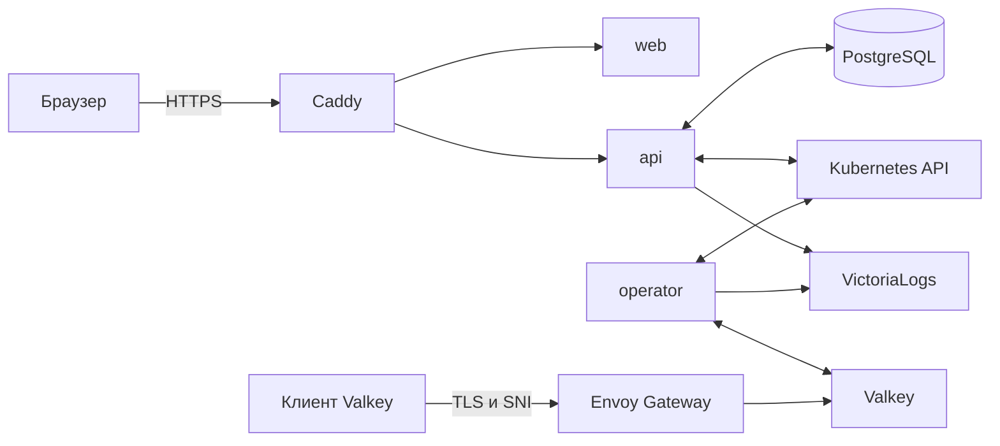
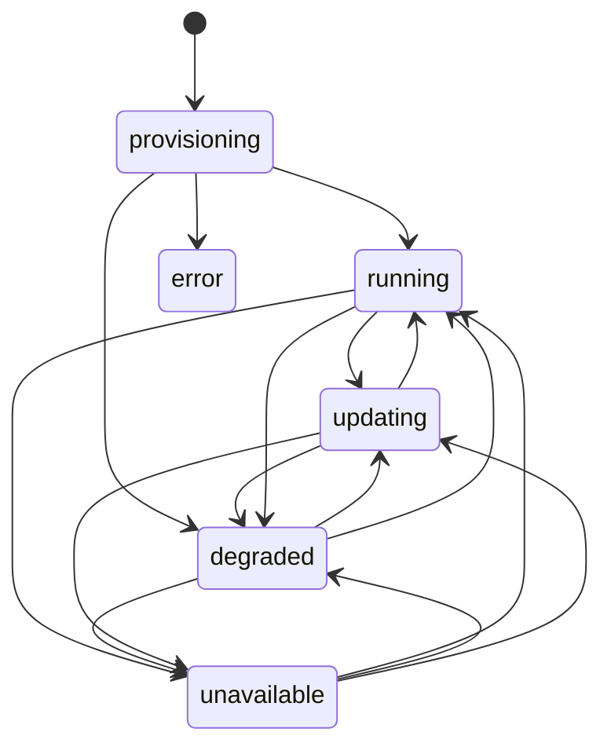

# Managed Valkey для h3llo cloud

Этот документ описывает работающую версию v1: что получает пользователь, из каких частей состоит сервис, как проходят основные операции и где находятся его границы.

Документ рассчитан на технического руководителя и разработчиков, которым нужно понять систему без чтения кода. Точные схемы PostgreSQL и Kubernetes, алгоритмы оператора, переменные окружения и тестовые сценарии вынесены в [SYSTEM-DETAIL.md](SYSTEM-DETAIL.md).

## Как устроен сервис

Managed Valkey выдаёт пользователю готовый Valkey для кэша приложения. Пользователь выбирает размер и режим работы, а сервис создаёт процессы Valkey, настраивает доступ и показывает адрес подключения.

В v1 данные хранятся только в оперативной памяти. Если все процессы инстанса перезапустятся, кэш будет потерян. Сервис подходит для данных, которые приложение может восстановить из другого источника.

Инстансом в этом документе называется отдельный Valkey одного пользователя. У каждого инстанса свои адреса, пароль и список разрешённых сетей.

## Оглавление

1. [Что получает пользователь](#1-что-получает-пользователь)
2. [Компоненты](#2-компоненты)
3. [Кто с кем разговаривает и где авторизация](#3-кто-с-кем-разговаривает-и-где-авторизация)
4. [Данные](#4-данные-postgresql-18-миграции-goose)
5. [API](#5-api)
6. [Оператор](#6-оператор)
7. [Сеть, домен, TLS и список разрешённых сетей](#7-сеть-домен-tls-и-список-разрешённых-сетей)
8. [Размеры, цены и квоты](#8-размеры-цены-и-квоты)
9. [Отказоустойчивость](#9-отказоустойчивость-и-цель-по-доступности)
10. [Аутентификация](#10-аутентификация)
11. [Логи](#11-логи)
12. [Веб-интерфейс](#12-веб-интерфейс)
13. [Окружения](#13-окружения)
14. [Тесты и CI](#14-тесты-justfile-ci)
15. [Проверки рабочего окружения](#15-проверки-рабочего-окружения)
16. [Структура репозитория](#16-структура-репозитория)

## 1. Что получает пользователь

| Возможность | Поведение |
| --- | --- |
| Создание | Пользователь задаёт имя, DNS-префикс, размер и режим `single` или `ha`. |
| Подключение | Сервис выдаёт адрес, порт, пользователя `app` и пароль. Соединение защищено TLS. |
| Два адреса | Основной адрес ведёт на `primary`. Адрес с суффиксом `-ro` ведёт на реплику в `ha` и на тот же `primary` в `single`. |
| Размер | Можно менять vCPU и RAM в обе стороны. Одновременно выполняется только одно изменение настроек. |
| Пароль Valkey | Новый пароль можно выпустить в интерфейсе. Полное значение показывается один раз. |
| Доступ по сети | Можно разрешить подключения только с выбранных IP-адресов и подсетей. |
| Наблюдение | Интерфейс показывает состояние, процессы, метрики и журнал действий. |
| Стоимость | Сервис показывает цену в час и условную цену за 30 суток. |
| Удаление | Пользователь подтверждает удаление вводом DNS-имени инстанса. |

Режим `single` запускает один процесс Valkey. Режим `ha` запускает один `primary` и две реплики. Репликация асинхронная, поэтому при переключении основного процесса возможна потеря последних записей.

### Ограничения v1

- Данные не сохраняются на диск, резервных копий Valkey нет.
- Шардирования и выбора версии Valkey нет.
- Параметры Valkey, кроме размера, пользователь не меняет.
- Счета, приём платежей и вывод фактического расхода за месяц не реализованы. Сервис показывает тариф и сохраняет периоды его действия.
- Нет восстановления и смены пароля аккаунта, подтверждения почты, организаций и команд.
- Окно обслуживания сохраняется и показывается, но не управляет запуском операций.
- Изменение размера нельзя отменить или автоматически откатить. Если операция остановилась, команда эксплуатации устраняет причину, после чего оператор продолжает её.
- Внешняя проверка доступности и отчёт по SLA не реализованы.
- PostgreSQL работает без резервных копий. Потеря базы может привести к потере данных управления и истории.
- Оператор запущен в одном экземпляре. При сетевом разделении или неподтверждённой остановке ноды для восстановления может понадобиться человек.
- Регистрация открыта. Несколько аккаунтов одного человека могут занять общую ёмкость кластера.

## 2. Компоненты

Система состоит из трёх приложений:

| Компонент | Назначение | Технологии | Где работает |
| --- | --- | --- | --- |
| `web` | Личный кабинет | React, TypeScript, Mantine | Статические файлы в образе Caddy |
| `api` | Аккаунты, управление инстансами, квоты, цены, аудит и обмен данными с Kubernetes | Go, Gin, GORM, client-go | Виртуальная машина, Docker Compose |
| `operator` | Запуск Valkey, изменение конфигурации, восстановление после сбоев и сбор метрик | Go, controller-runtime | Kubernetes |

В окружение также входят:

- PostgreSQL хранит аккаунты, настройки, состояние, метрики, тарифные периоды и аудит;
- Caddy принимает HTTPS-запросы к личному кабинету и API;
- Envoy Gateway принимает TLS-соединения клиентов Valkey;
- cert-manager выпускает общий сертификат для адресов Valkey;
- Metrics Server отдаёт загрузку CPU процессов;
- VictoriaLogs хранит логи `api` и оператора.



`api` принимает запрос и сохраняет выбранные настройки в PostgreSQL. Фоновый цикл передаёт их в Kubernetes через ресурс `ValkeyInstance`. Оператор читает этот ресурс, создаёт нужные объекты и записывает фактическое состояние обратно. Второй фоновый цикл `api` переносит состояние и метрики из Kubernetes в PostgreSQL.

Запросы пользователя не ждут завершения работы в Kubernetes. Например, создание отвечает HTTP `202`, а инстанс сначала получает состояние `provisioning`. Интерфейс опрашивает API и показывает результат операции позже.

Путь подключения приложения пользователя отделён от пути управления. Уже запущенный Valkey продолжает принимать соединения при отказе `api` или PostgreSQL. Новые операции управления в это время недоступны.

## 3. Кто с кем разговаривает и где авторизация

| Откуда | Куда | Доступ |
| --- | --- | --- |
| Браузер | Caddy и `api` | HTTPS и JWT |
| Клиент Valkey | Envoy Gateway | TLS, SNI, пользователь `app`, пароль и при необходимости список разрешённых сетей |
| `api` | PostgreSQL | Пользователь и пароль PostgreSQL |
| `api` | Kubernetes API | Отдельный `kubeconfig` и RBAC |
| Оператор | Kubernetes API | `ServiceAccount` и RBAC |
| Оператор | Процессы Valkey | Служебная учётная запись из `Secret` Kubernetes |
| `api` и оператор | VictoriaLogs | OTLP поверх HTTP или HTTPS |

`api` записывает выбранные настройки в `spec` ресурса `ValkeyInstance` и читает его `status`. Оператор меняет объекты Kubernetes и `status`, но не подключается к PostgreSQL и не вызывает HTTP API сервиса.

Для каждого инстанса создаётся отдельное пространство имён Kubernetes. Оно разделяет объекты разных пользователей, а ACL Valkey разделяет пользовательский и служебный доступ. При этом `api` и оператор остаются доверенными компонентами с правами на несколько пространств имён. Ошибка в них или компрометация их учётных записей может затронуть другие инстансы.

Пароли служебных пользователей `operator`, `replica` и `health` хранятся только в `Secret` Kubernetes. PostgreSQL хранит SHA-256 пароля `app` и первые четыре символа для маски. Исходный пароль `app` после ответа пользователю не хранится.

Подробный список прав и границы доступа приведены в [SYSTEM-DETAIL.md](SYSTEM-DETAIL.md#контракт-и-объекты-оператора).

## 4. Данные (PostgreSQL 18, миграции goose)

Личный кабинет и пользовательские запросы читают данные из PostgreSQL. Основные таблицы хранят:

- аккаунты и личные квоты;
- выбранные настройки инстанса;
- последнее состояние инстанса и его процессов;
- историю метрик и смены состояний;
- периоды с зафиксированной ценой;
- ключи безопасного повтора запросов;
- журнал действий.

Точный состав таблиц, колонок и индексов описан в [SYSTEM-DETAIL.md](SYSTEM-DETAIL.md#схема-postgresql).

### Выбранные настройки и фактическое состояние

В строке инстанса есть две группы полей:

- выбранные настройки записывают HTTP-обработчики `api`;
- фактическое состояние переносит фоновый цикл из `status` ресурса `ValkeyInstance`.

Эти группы обновляются отдельно. Старое наблюдение из Kubernetes не может затереть новый размер или запрос на удаление.

`desired_generation` означает версию настроек, принятую API. `observed_generation` означает версию, которую оператор полностью применил и проверил. Пока значения различаются, интерфейс показывает, что изменение продолжается, а API не принимает следующее изменение настроек.

Для пароля есть отдельные номера: `password_version` и `applied_password_version`. Они показывают, что новый пароль применён ко всем нужным процессам.

Поле `observed_at` содержит время последней проверки оператором. Если оно отсутствует или старше 60 секунд, API помечает данные как устаревшие. Это не меняет сохранённую фазу, но предупреждает, что ей нельзя полностью доверять.

### Фазы инстанса

| Фаза | Что видит пользователь |
| --- | --- |
| `provisioning` | Инстанс создаётся и ещё не прошёл все проверки. |
| `running` | Основной адрес работает. В `ha` готовы обе реплики. |
| `updating` | Основной адрес работает, но новое значение размера, пароля или списка сетей ещё применяется. |
| `degraded` | Основной адрес работает, но одна или обе реплики `ha` не готовы. Адрес `-ro` может быть недоступен. |
| `unavailable` | Публичное подключение не готово. Оператор восстанавливает сервис или ждёт безопасного подтверждения остановки старого процесса. |
| `error` | Первоначальное создание не завершилось вовремя. Инстанс можно удалить. |
| `deleting` | API принял запрос на удаление, ресурсы ещё очищаются. |
| `deleted` | Kubernetes подтвердил удаление. Обычные списки больше не показывают инстанс. |

Оператор считает инстанс готовым, только если Valkey отвечает, пароль и права актуальны, Kubernetes направляет трафик к правильному процессу, а шлюз применил маршрут, сетевые ограничения и сертификат. Эти проверки выполняются внутри кластера и не заменяют внешнюю проверку из интернета.



Причины фаз, условия ручного восстановления и правила записи истории приведены в [SYSTEM-DETAIL.md](SYSTEM-DETAIL.md#алгоритмы-оператора).

## 5. API

API использует JSON и префикс `/v1`. Защищённые маршруты принимают JWT в заголовке `Authorization: Bearer <jwt>`.

| Область | Маршруты |
| --- | --- |
| Аккаунт | `/v1/auth/check-email`, `/v1/auth/register`, `/v1/auth/login`, `/v1/me` |
| Каталог и ёмкость | `/v1/managed/valkey/sizes`, `/v1/managed/valkey/capacity` |
| Инстансы | `/v1/managed/valkey/instances` и `/v1/managed/valkey/instances/{id}` |
| Настройки | `resize`, `whitelist`, `credentials` и `credentials/rotate` внутри маршрута инстанса |
| Наблюдение | `metrics` и `audit` внутри маршрута инстанса |

Полный список методов, входных полей и ответов находится в [SYSTEM-DETAIL.md](SYSTEM-DETAIL.md#http-api).

Все маршруты с `{id}` ищут инстанс одновременно по идентификатору и владельцу из JWT. Для чужого и несуществующего идентификатора ответ одинаков: `404 NOT_FOUND`.

Регистрация, создание, изменение размера и смена пароля требуют заголовок `Idempotency-Key`. Если ответ потерялся после записи в базу, клиент может повторить тот же запрос с тем же ключом и получить сохранённый ответ без повторной операции. Другой запрос с тем же ключом отклоняется.

Ошибки имеют общий вид:

```json
{
  "error": {
    "code": "QUOTA_EXCEEDED",
    "message": "...",
    "details": {}
  }
}
```

Интерфейс принимает решения по полю `code`, а `message` показывает пользователю. Основные коды ошибок и точные ответы перечислены в [SYSTEM-DETAIL.md](SYSTEM-DETAIL.md#ошибки-api).

### Общая блокировка на изменения ресурсов

Операции, которые меняют инстанс или его резерв ресурсов, последовательно выполняют короткую транзакцию PostgreSQL. Для этого используется `pg_advisory_xact_lock(1)`.

Блокировка нужна, чтобы два одновременных запроса не заняли один и тот же остаток общей квоты. Она действует только во время записи в PostgreSQL. Запуск процессов и применение настроек происходят позже и её не удерживают.

Точный порядок проверок и записи данных приведён в [SYSTEM-DETAIL.md](SYSTEM-DETAIL.md#общая-блокировка-на-изменения-ресурсов).

### Создание

Интерфейс генерирует пароль и отправляет запрос с начальным размером, режимом и сетевыми ограничениями. API проверяет личную и общую квоту, затем одной транзакцией сохраняет инстанс, аудит, начальный тарифный период и ответ для безопасного повтора.

Ответ `202` означает, что запрос принят. Полный пароль остаётся только в памяти браузера и показывается один раз. Фоновый цикл создаёт ресурс `ValkeyInstance`, после чего оператор запускает Valkey.

Если Kubernetes временно недоступен, запрос остаётся в PostgreSQL и будет доставлен после восстановления связи.

### Изменение размера

Изменение разрешено в фазах `running` и `degraded`, когда предыдущее изменение уже завершено и наблюдение свежее.

- В `single` процесс перезапускается, поэтому возникает простой и кэш очищается.
- В `ha` уменьшение RAM очищает кэш всего инстанса.
- Остальные изменения `ha` выполняются по одному процессу. При плановом переключении `primary` возможна потеря последних записей.

Новая цена действует с момента принятия запроса, даже если применение размера задержалось. Отмены и автоматического отката нет.

### Список разрешённых сетей

API принимает IP-адреса и подсети в формате CIDR, приводит их к единому виду и удаляет повторы. При выключенном ограничении подключаться может любой адрес. При включённом ограничении с пустым списком запрещены все новые подключения.

Изменение действует после подтверждения шлюза. Уже открытые TCP-соединения могут сохраниться. Чтобы закрыть их, пользователь после применения сетевого правила меняет пароль Valkey.

### Одноразовый показ и смена пароля Valkey

Интерфейс генерирует пароль из 24 случайных байт через Web Crypto и отправляет его только по HTTPS. API вычисляет SHA-256 для ACL Valkey и маску вида `jz3f*****`. Исходное значение не записывается в PostgreSQL, логи или браузерные хранилища.

После создания или смены полный пароль показывается один раз. Перезагрузка или закрытие страницы удаляет его из памяти. Если ответ потерялся, интерфейс может повторить запрос только пока пароль и `Idempotency-Key` остаются в памяти.

Смена пароля закрывает старые соединения пользователя `app`. Операция завершается, когда новый пароль проверен на всех работающих процессах, а остановка недоступных старых процессов доказана. Поэтому смена пароля в `degraded` иногда требует вмешательства команды эксплуатации.

### Удаление

API сначала записывает запрос на удаление и прекращает тарификацию. Оператор останавливает процессы и удаляет объекты Kubernetes. После исчезновения пространства имён фоновый цикл заполняет `deleted_at`.

До этого момента инстанс имеет состояние `deleting` и занимает квоту. Строка инстанса, аудит и история тарифов остаются в PostgreSQL.

## 6. Оператор

Оператор получает выбранные настройки из ресурса `ValkeyInstance` и приводит Kubernetes к этому состоянию. Он создаёт процессы Valkey напрямую как `Pod` с `restartPolicy: Never`, а также создаёт конфигурацию, сервисы, сетевые правила и маршруты Envoy.

Оператор не считает простое наличие объектов признаком успеха. Он подключается к Valkey, проверяет роли и репликацию, сверяет адреса Kubernetes и фактическую конфигурацию Envoy. После этого записывает результат в `status`.

Один контроллер следит за жизненным циклом инстансов. Второй собирает метрики. Оба используют повторную постановку задачи в controller-runtime, поэтому для таймеров не нужен отдельный планировщик.

Точные объекты и поля `ValkeyInstance` перечислены в [SYSTEM-DETAIL.md](SYSTEM-DETAIL.md#контракт-и-объекты-оператора). Полные алгоритмы находятся в [разделе об операторе](SYSTEM-DETAIL.md#алгоритмы-оператора).

### Изоляция инстанса

Каждый инстанс получает отдельное пространство имён, `Secret`, `ConfigMap`, сервисы и `NetworkPolicy`. Пользователь `app` может выполнять обычные команды с данными, Lua, Functions и pub/sub, но не может менять служебную конфигурацию, управлять репликацией или завершать чужие соединения.

Лимит памяти контейнера больше `maxmemory`, потому что Valkey нужна память для служебных структур и синхронизации реплик. Конкретные значения ресурсов и ACL приведены в [SYSTEM-DETAIL.md](SYSTEM-DETAIL.md#конфигурация-valkey).

### Переключение основного процесса

В `ha` оператор выбирает готовую реплику и делает её новым `primary`. Перед переключением старый основной процесс должен перестать принимать записи или быть подтверждённо остановлен. Эта проверка называется изоляцией (`fencing`) и защищает от двух одновременно работающих `primary`.

Истечение таймера, состояние `NotReady` или потеря связи с нодой сами по себе не доказывают остановку процесса. Если нода исчезла после удаления через личный кабинет облака, оператор считает виртуальную машину уничтоженной и продолжает восстановление. При сетевом разделении он ждёт возврата ноды или ручного подтверждения её выключения.

При переключении возможна потеря последних записей из-за асинхронной репликации. Клиент должен переподключиться к прежнему адресу после разрыва соединения или ответа `READONLY`.

### Изменение размера и пароля

Оператор сохраняет стадию операции в `status`, поэтому после перезапуска продолжает с проверенного шага.

При обычном изменении размера `ha` оператор заменяет реплики по одной, переключает `primary` и заменяет прежний основной процесс. При уменьшении RAM он останавливает старые процессы и запускает пустой инстанс.

При смене пароля оператор обновляет ACL на работающих процессах и закрывает прежние соединения `app`. Перезапуск процессов для этого не нужен.

### Метрики

Каждые 10 секунд отдельный контроллер читает `INFO` Valkey и загрузку CPU из Metrics Server. Он записывает в `status` последний снимок каждого процесса. Фоновый цикл `api` переносит новые снимки в PostgreSQL.

Ошибка сбора метрик не останавливает восстановление инстанса и не делает его основное наблюдение устаревшим. Если CPU недоступен, остальные показатели всё равно сохраняются.

## 7. Сеть, домен, TLS и список разрешённых сетей

Публичные адреса имеют вид:

```text
<slug>.valkey.h3llo-demo.com:41379
<slug>-ro.valkey.h3llo-demo.com:41379
```

Масочная запись DNS направляет все адреса Valkey на один Envoy Gateway. Для каждого инстанса оператор создаёт два маршрута. В `ha` основной маршрут ведёт на `primary`, а `-ro` на готовую реплику. В `single` оба маршрута ведут на единственный процесс.

TLS завершается на Envoy. Один масочный сертификат `*.valkey.h3llo-demo.com` выпускает cert-manager через Cloudflare DNS-01. Между Envoy и процессом Valkey трафик внутри кластера не шифруется.

### SNI и нестандартный порт

Клиент обязан передать полное имя инстанса через SNI во время TLS-соединения. По этому имени шлюз выбирает маршрут. Подключение по IP без имени или без SNI не работает.

Пример подключения:

```sh
valkey-cli --tls --sni shop-a1b2c3.valkey.h3llo-demo.com -h shop-a1b2c3.valkey.h3llo-demo.com -p 41379 --user app --askpass
```

Порт 41379 уменьшает фоновый шум сканирования стандартного порта 6379, но не защищает сервис. Доступ защищают TLS, пароль и сетевые ограничения.

Адрес `-ro` выбирает реплику только при открытии соединения. Если эту реплику позже назначат `primary`, уже открытое соединение окажется на основном процессе. Отдельной учётной записи только для чтения нет, поэтому приложение должно использовать этот адрес только для операций чтения.

### Долгие соединения

Envoy закрывает TCP-соединение после часа без передачи данных. Активное соединение не ограничено одним часом.

Клиент должен уметь переподключаться с повторной проверкой TLS и авторизацией. Для pub/sub рекомендуется отправлять `PING` по соединению подписки каждые 30 секунд и восстанавливать подписки после разрыва. Сообщения, отправленные во время разрыва, не воспроизводятся.

### Список разрешённых сетей

Envoy применяет список CIDR к новым TCP-соединениям. Для правильной фильтрации шлюз должен видеть исходный IP клиента. В рабочем окружении это зависит от балансировщика и `externalTrafficPolicy: Local`, поэтому сохранение адреса проверяется отдельно.

`NetworkPolicy` ограничивает внутренний доступ к процессам Valkey, а список CIDR ограничивает внешний доступ через Envoy. Одна проверка не заменяет другую.

### Ограничения шлюза

Envoy работает в двух репликах. Правила распределения стараются разместить их на разных нодах, но не гарантируют это. В однонодовом кластере обе реплики находятся на одной ноде.

Один `Gateway` поддерживает не больше 64 точек приёма соединений. Два адреса на инстанс дают предел 32 инстанса.

Подробная конфигурация Caddy, Envoy, сертификатов и локальной сети находится в [SYSTEM-DETAIL.md](SYSTEM-DETAIL.md#конфигурация-сети).

## 8. Размеры, цены и квоты

Размер задаётся на один процесс Valkey. В `ha` выбранные vCPU и RAM выделяются каждому из трёх процессов.

| vCPU | RAM, GB |
| --- | --- |
| 1 | 1, 2 или 4 |
| 2 | 8 |
| 4 | 16 |

В API `ram_gb` соответствует 1 GiB, то есть 2³⁰ байт. В интерфейсе используется более привычная подпись GB.

### Цены

| Ресурс | В час | За 720 часов |
| --- | --- | --- |
| 1 vCPU | 1,25 ₽ | 900 ₽ |
| 1 GB RAM | 0,50 ₽ | 360 ₽ |

Цена `ha` в три раза выше цены `single` того же размера, потому что работают три процесса. Цена за 30 суток считается как цена за 720 часов и служит предварительной оценкой. API сохраняет периоды действия тарифов. Фактический расход за месяц он не рассчитывает и не возвращает.

При изменении размера новая ставка начинает действовать сразу после принятия запроса. При удалении тарификация прекращается сразу после принятия запроса, хотя очистка ресурсов заканчивается позже.

### Квоты

По умолчанию один аккаунт получает 4 vCPU и 12 GB RAM. Для всего кластера отдельно задаётся физическая ёмкость. API оставляет 15% CPU и 10% RAM для Kubernetes, Envoy и служебных компонентов.

При рабочей конфигурации 16 vCPU и 64 GiB пользовательский бюджет составляет 13 vCPU и 57 GiB после округления вниз. Это настроенная сумма, а не текущее свободное место на конкретных нодах.

Инстансы во всех фазах занимают квоту до подтверждённого удаления. При уменьшении размера квота освобождается только после запуска процессов нового размера. Поэтому API учитывает большее из выбранного и уже применённого значений.

Проверка общей суммы не гарантирует, что Kubernetes сможет разместить процессы на имеющихся нодах. На размещение также влияют форма нод, уже запущенные процессы и правила планировщика.

Точный расчёт квот и правила тарифных периодов описаны в [SYSTEM-DETAIL.md](SYSTEM-DETAIL.md#квота-кластера) и [разделе `billing_periods`](SYSTEM-DETAIL.md#billing_periods).

## 9. Отказоустойчивость и цель по доступности

Внутренняя цель доступности `ha` составляет 99,95% в месяц, около 22 минут простоя. Это ориентир для разработки, а не договорное обязательство. Сервис не измеряет цель автоматически, потому что для этого нужна внешняя проверка через DNS, балансировщик, TLS и Valkey.

Режим `single` не имеет цели высокой доступности. Перезапуск единственного процесса очищает кэш.

### Что происходит при отказах

| Отказ | Что продолжает работать | Что недоступно или ограничено |
| --- | --- | --- |
| `api` | Запущенные Valkey и работа оператора по уже доставленным настройкам | Вход, интерфейс, новые операции, импорт статусов и метрик |
| PostgreSQL | Запущенные Valkey и работа оператора | Все новые операции управления и обновление данных интерфейса |
| Оператор | Уже запущенный Valkey при живом `primary` | Восстановление процессов, переключение и применение настроек |
| Kubernetes API | Уже запущенные процессы и настроенный Envoy | Планирование, изменение маршрутов и безопасное продолжение операций |
| Одна реплика Envoy | Новые соединения через вторую реплику, если балансировщик работает | Соединения на упавшей реплике обрываются |
| Нода с репликой | `primary` продолжает обслуживать запросы | `ha` работает как `degraded`, пока оператор не восстановит реплику |
| Нода с `primary` | Реплики сохраняют копию данных | Оператор переключает роль после подтверждения остановки старого процесса |

Режим `ha` защищает от отказа процесса, но не гарантирует защиту от отказа физической ноды. Правила размещения мягкие: несколько процессов Valkey или обе реплики Envoy могут оказаться на одной ноде.

### Ошибки для эксплуатации

`api` и оператор записывают ошибки своих операций в VictoriaLogs. Отдельной фоновой проверки затянувшихся состояний и автоматических уведомлений нет. Команда эксплуатации сопоставляет логи с фазой, причиной фазы, свежестью наблюдения и признаком `is_recovery_required` в API.

## 10. Аутентификация

Экран `/auth` сначала проверяет email, затем показывает вход или регистрацию. Email приводится к нижнему регистру и очищается от пробелов по краям.

Пароль аккаунта содержит от 8 символов до 72 байт UTF-8 и хранится как bcrypt с `cost=12`. После входа или регистрации API выдаёт JWT HS256 сроком на 10 лет. JWT хранится в `localStorage`.

На каждом защищённом запросе API проверяет подпись, срок JWT и поле `users.is_blocked`. Блокировка аккаунта закрывает личный кабинет и API, но не отзывает отдельный пароль Valkey и уже открытые соединения.

Сервер не хранит сессии и не умеет отзывать отдельный JWT. Выход удаляет токен только из браузера. Восстановления и смены пароля аккаунта нет.

Все маршруты `/v1/auth/*`, включая проверку почты, ограничены десятью запросами в минуту с одного IP. `check-email` сообщает, существует ли аккаунт, поэтому наличие адреса можно определить перебором; ограничение только снижает его скорость.

## 11. Логи

`api` и оператор пишут структурированные логи через `slog` и отправляют их в VictoriaLogs по OTLP. Недоступность хранилища логов не останавливает API, работу оператора или сбор метрик.

Логи содержат имя сервиса и окружение. API добавляет `request_id` и `user_id`, оператор добавляет DNS-имя инстанса. `request_id` также сохраняется в аудите и помогает найти записи одного запроса.

В логи не попадают пароли, хеши ACL, содержимое `Secret`, заголовок `Authorization` и тела запросов регистрации, создания или смены пароля.

В рабочем окружении чтение VictoriaLogs и приём логов оператора доступны через `logs.h3llo-demo.com` без авторизации. TLS защищает соединение, но не ограничивает пользователя. Это известное ограничение v1.

Журнал действий пользователя хранится отдельно в PostgreSQL. Он доступен на вкладке аудита и не зависит от срока хранения технических логов.

## 12. Веб-интерфейс

Клиентское приложение написано на React, TypeScript и Mantine. Это SPA, которое Caddy отдаёт вместе с API на домене `app.h3llo-demo.com`. Отдельная настройка CORS не нужна.

Основные экраны:

| Экран | Содержимое |
| --- | --- |
| Вход и регистрация | Два шага по email, обработка ограничения запросов |
| Список инстансов | Инстансы, личная квота и занятые ресурсы |
| Создание | Имя, DNS-префикс, режим, размер, цена и предупреждения |
| Подключение | Адреса, порт, пользователь, маска пароля и пример команды с SNI |
| Список сетей | Включение ограничения и CIDR |
| Метрики | Графики по процессам за 5 минут, 1 час, 24 часа или 7 дней |
| Аудит | Действия по инстансу, новые записи сверху |
| Настройки | Имя, окно обслуживания, размер и цена |
| Удаление | Подтверждение по DNS-имени инстанса |

Интерфейс регулярно обновляет состояние открытого инстанса. Во время операции опрос идёт чаще. Кнопки учитывают фазу, свежесть данных и незавершённое изменение, но API повторяет все проверки независимо от интерфейса.

Пароль Valkey хранится только в состоянии страницы до закрытия одноразового окна. Полное значение не попадает в URL, историю переходов, `localStorage`, `sessionStorage` или IndexedDB.

## 13. Окружения

### Среда разработки

`docker-compose.dev.yml` создаёт изолированные окружения для разработки и тестов. Постоянное окружение разработки содержит PostgreSQL и трёхнодовый k3s. API, оператор и Vite запускаются на хосте.

Каждый тестовый запуск получает отдельные сеть, тома, `kubeconfig` и порты. Тестовые базы и кластеры не используют данные постоянного окружения разработки.

Корневая команда `just run` готовит базу и k3s, применяет миграции и запускает приложения. `just down` останавливает окружение без удаления данных.

### Рабочее окружение

На виртуальной машине работают Caddy, `api`, PostgreSQL и VictoriaLogs. В Managed Kubernetes работают оператор, Envoy Gateway, cert-manager, Metrics Server и пользовательские процессы Valkey.

Такое разделение сохраняет путь подключения к Valkey при отказе виртуальной машины. Сама виртуальная машина остаётся единственной точкой отказа для управления. PostgreSQL опубликован на порту 45432 с паролем, но без TLS. Приватной сети или VPN между виртуальной машиной и Kubernetes нет.

Образы и инструменты закреплены конкретными версиями. Тег `latest` не используется. Полный список версий, переменных и файлов развёртывания находится в [SYSTEM-DETAIL.md](SYSTEM-DETAIL.md#окружения).

## 14. Тесты, Justfile, CI

В проекте есть несколько уровней проверок:

| Набор | Что проверяет |
| --- | --- |
| Модульные тесты | Расчёты, переходы состояний и отдельные функции |
| HTTP-тесты API | Настоящий HTTP-сервер и отдельная PostgreSQL без Kubernetes |
| envtest оператора | Контракт CRD, конфликты обновления и работа с Kubernetes API |
| Полные тесты оператора | Valkey и Envoy в отдельных k3s на 1–4 рабочих узлах |
| Общая интеграция | Настоящие API и оператор в одном однонодовом k3s |
| Playwright | Пользовательские сценарии в браузере на трёхнодовом стенде |

Основные команды:

| Команда | Назначение |
| --- | --- |
| `just format` | Форматирует проект. Команда добавляет затронутые файлы в индекс Git. |
| `just lint` | Проверяет API, оператор и веб-интерфейс. |
| `just test` | Запускает быстрые наборы без k3s. |
| `just test-full` | Запускает полные наборы приложений и общую интеграцию, но не Playwright. |
| `just test-e2e` | Запускает Playwright без видимого браузера. |
| `just test-e2e-headed` | Запускает Playwright с видимым браузером. |
| `just test-e2e-prod` | Проверяет разрешённые сценарии в рабочем окружении. |

CI независимо запускает линтеры, быстрые тесты, общую интеграцию, три группы Playwright и сборки образов. Развёртывание начинается только после успеха всех обязательных заданий при отправке изменений в `main`.

Полная матрица и устройство тестовых окружений описаны в [SYSTEM-DETAIL.md](SYSTEM-DETAIL.md#тесты-justfile-ci).

## 15. Проверки рабочего окружения

Автоматический выпуск проверяет доступность Kubernetes API, связность Cilium, права `api` и оператора, готовность Metrics Server, сертификат и внешний адрес Envoy. После запуска он проверяет `/readyz` через публичный адрес.

Часть свойств требует отдельной проверки на инфраструктуре h3llo:

- балансировщик сохраняет настоящий IP клиента для списка разрешённых сетей;
- удаление ноды через личный кабинет сначала выключает виртуальную машину и только затем удаляет объект `Node`;
- рабочая версия Kubernetes сохраняет завершённый контейнер Valkey и не перезапускает его при `restartPolicy: Never`;
- клиентские библиотеки передают SNI и корректно переподключаются после переключения;
- полная синхронизация реплики при заполненном кэше не приводит к OOM.

Эти свойства нельзя считать доказанными только по состоянию `running` внутри Kubernetes. Команды и точные критерии находятся в тестовой матрице [SYSTEM-DETAIL.md](SYSTEM-DETAIL.md#матрица-обязательных-тестов).

## 16. Структура репозитория

```text
.github/workflows/   GitHub Actions
api/                 HTTP API и фоновые процессы
operator/            оператор и типы ValkeyInstance
web/                 клиентское приложение
internal/            общий код Go
migrations/          миграции PostgreSQL для goose
tests/integrations/  общие тесты API и оператора
tests/e2e/           Playwright
scripts/             разработка, тестовые стенды и выпуск
deploy/dev/          манифесты среды разработки
deploy/prod/         манифесты рабочего Kubernetes
caddy/               образ и конфигурация Caddy
```

API и оператор используют один модуль Go, но не импортируют внутренние пакеты друг друга. Исключение: `operator/api/v1alpha1` содержит общий контракт `ValkeyInstance`, который нужен обоим приложениям.

Подробное дерево каталогов и границы пакетов приведены в [SYSTEM-DETAIL.md](SYSTEM-DETAIL.md#структура-репозитория).
