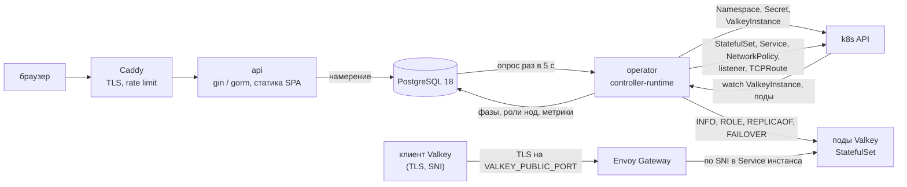
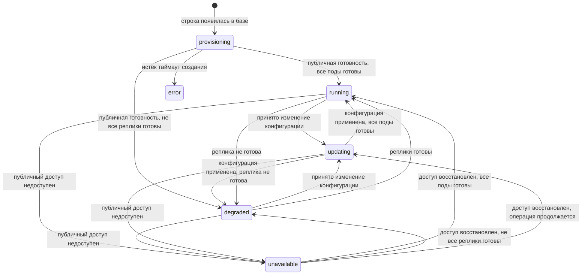

# Managed Valkey для h3llo cloud: план MVP

Это целевая архитектура MVP managed-сервиса Valkey для облака h3llo.
Документ задаёт контракты для реализации; наличие описанного поведения
не означает, что оно уже реализовано. Порядок работ, задачи и состояние
реализации ведём в `openspec/changes/`.

Первая часть описывает поведение сервиса, данные и алгоритмы. Вторая
объясняет выбор решений и их ограничения.

## Главная идея в четырёх абзацах

Клиент Valkey ходит через шлюз прямо в под. Уже запущенные процессы
обслуживают соединения без `api`, PostgreSQL и оператора. Восстановление
после отказа или перезапуска пода требует оператора, а доставка новых
настроек требует PostgreSQL. Эти границы разобраны в разделе 9.

PostgreSQL — единственный источник правды о том, что должно существовать.
`api` пишет туда намерение пользователя одной транзакцией и на этом
заканчивает: в k8s он не ходит и про него не знает. Оператор читает базу,
делает из строк объекты в k8s и пишет обратно то, что наблюдает. Колонки
намерения и колонки наблюдения не пересекаются, и между `api` и оператором
нет ни одного HTTP-вызова.

Инстансы изолированы друг от друга. У каждого свой namespace в k8s, своя
сетевая политика, свои учётные записи Valkey, и listener шлюза принимает
маршрут только из namespace своего инстанса. Клиент получает права на
чтение, запись и pub/sub, а не на администрирование сервера.

Всё, что стоит между клиентом и подом, мы берём готовым: Envoy Gateway
различает инстансы по SNI, cert-manager выдаёт сертификат, Caddy закрывает
`api`. Сами пишем только `api`, оператор и фронт.

## Оглавление

Часть 1. Спецификация MVP

1. [Что получает пользователь](#1-что-получает-пользователь)
2. [Компоненты](#2-компоненты)
3. [Кто с кем разговаривает и где авторизация](#3-кто-с-кем-разговаривает-и-где-авторизация)
4. [Данные](#4-данные-postgresql-18-миграции-goose)
5. [API](#5-api)
6. [Оператор](#6-оператор)
7. [Сеть, домен, TLS, whitelist](#7-сеть-домен-tls-whitelist)
8. [Размеры, цены и квоты](#8-размеры-цены-и-квоты)
9. [Отказоустойчивость и цель по доступности](#9-отказоустойчивость-и-цель-по-доступности)
10. [Аутентификация](#10-аутентификация)
11. [Логи](#11-логи)
12. [Frontend](#12-frontend)
13. [Окружения](#13-окружения)
14. [Тесты, Justfile, CI](#14-тесты-justfile-ci)
15. [Проверить в первый день](#15-проверить-в-первый-день)
16. [Структура репозитория](#16-структура-репозитория)

Часть 2. [Компромиссы и термины](#часть-2-компромиссы-и-термины)

---

# Часть 1. Спецификация MVP

## 1. Что получает пользователь

| Возможность | Как устроено |
|-------------|--------------|
| Создание инстанса | Название, DNS-префикс, размер (vCPU и RAM), режим `single` (одна нода) или `ha` (primary и две реплики). |
| Публичный адрес с TLS | `<slug>.<VALKEY_BASE_DOMAIN>:<VALKEY_PUBLIC_PORT>` для записи и чтения. В `ha` также `<slug>-ro.<VALKEY_BASE_DOMAIN>` для чтения с реплик; в `single` `host_ro=null`. Клиент обязан передавать SNI (раздел 7). |
| Учётная запись | Пользователь Valkey `app`. Полный пароль показывается один раз после принятия создания или смены пароля; затем только маска вида `jz3f*****`. Права: чтение, запись, очистка собственного кэша, pub/sub, Lua и Functions в пределах ACL (раздел 6). |
| Смена пароля Valkey | Доступна в `running` и `degraded`. UI генерирует новый пароль. После применения старый пароль перестаёт работать, прежние соединения `app` закрыты; приложения должны подключиться с новым паролем. Недоступный прежний процесс может задержать завершение. |
| Whitelist | По IP и подсетям. Включается и выключается отдельным флагом. |
| Ресайз | Изменение vCPU и RAM в обе стороны, по одной операции за раз. В `single` любой ресайз очищает кэш; в `ha` уменьшение RAM очищает кэш, остальные изменения идут по одному поду. UI предупреждает о простое и возможной потере записей. |
| Окно maintenance | Хранится и показывается. В MVP ни на что не влияет. |
| Метрики | По каждой ноде. Окна 5 минут, 1 час, 24 часа, 7 дней. Глубина хранения 7 дней. |
| Аудит | Журнал действий по инстансу: когда, кто и что сделал. |
| Цена | В час и в месяц, плюс расход за текущий месяц. |
| Удаление | С подтверждением по slug. |
| Аккаунт | Регистрация по почте и паролю, вход, JWT. |
| Квоты | На пользователя (по умолчанию 4 vCPU и 16 GB) и на весь кластер (через env). |

Чего в MVP нет, и это осознанное решение:

- persistence и бэкапов данных: при перезапуске всех нод инстанса данные
  теряются;
- сохранности данных при переключении primary и при ресайзе: часть записей
  может пропасть; уменьшение RAM в `ha` и любой ресайз `single` очищают кэш;
- приёма денег: цены считаем и показываем, платёжного шлюза и счетов нет;
- восстановления и смены пароля аккаунта, повторного показа пароля Valkey;
- организаций и команд;
- cluster mode, то есть шардирования;
- выбора версии Valkey;
- настройки параметров Valkey кроме размера;
- отмены и автоматического отката ресайза: при задержке эксплуатация
  устраняет причину, после чего оператор продолжает ту же операцию;
  пользователь может дождаться восстановления или удалить инстанс;
- внешней проверки доступности инстансов и отчёта по SLA;
- автоматического восстановления при частичном отказе Envoy и управления
  его выводом из балансировщика. В MVP сверяем конфигурации двух доступных
  реплик; неудачная проверка повторяется и при задержке требует
  эксплуатации. Обработка сложных случаев относится к v2 (раздел 6);
- бэкапов PostgreSQL и облачной базы;
- резервной реплики оператора и автоматического выключения недоступных
  worker-нод через API провайдера: без подтверждённого отключения старого
  primary failover может ждать человека;
- подтверждения почты, приглашений и защиты квот от регистрации нескольких
  аккаунтов. Регистрация открыта, квота 4 vCPU / 16 GB выдаётся сразу.
  При отсутствии оплаты несколько аккаунтов могут занять весь кластер;
  этот риск принимаем для MVP.

## 2. Компоненты

Мы пишем три компонента. Они лежат в одном репозитории, backend на Go.
Остальное берём готовым.

| Компонент | За что отвечает | Стек | Где работает |
|-----------|-----------------|------|--------------|
| `api` | Пользователи, квоты, намерение по инстансам, история для биллинга, уведомления эксплуатации, раздача статики фронта | Go, gin, gorm | Виртуалка, compose |
| `operator` | Приводит k8s к намерению, делает failover и перекатку, собирает метрики, пишет наблюдаемое в базу | Go, controller-runtime | Внутри k8s; на dev как сервис compose |
| `web` | Интерфейс пользователя | React, SPA | Собирается в CI и встраивается в образ `api` |

Готовые компоненты, которые ставим, но не пишем: Caddy (TLS, rate limit),
Envoy Gateway (вход для клиентов Valkey), cert-manager
(wildcard-сертификат), PostgreSQL 18, VictoriaLogs.



`api` отвечает на создание `202` со статусом `provisioning` и отдаёт
собранную статику SPA. `web` получает статусы и метрики через API из базы.
Оператор переносит намерение из PostgreSQL в CR `ValkeyInstance`,
управляет объектами k8s и пишет наблюдаемое обратно. Три цикла разобраны
в разделе 6.

## 3. Кто с кем разговаривает и где авторизация

`api` и оператор не ходят друг в друга. HTTP между ними нет вообще, общее у
них одно: PostgreSQL. `api` пишет туда намерение, оператор читает его и
пишет обратно наблюдаемое. В k8s ходит только оператор.

| Кто | Куда | Как | Чем авторизуется |
|-----|------|-----|------------------|
| браузер | Caddy, дальше `api` | HTTPS 443, интернет | JWT в заголовке `Authorization` |
| `api` | PostgreSQL | 5432, приватная сеть | свой пользователь БД, scram, TLS |
| `api` | SMTP-сервер эксплуатации | SMTP поверх TLS | Учётные данные из `SMTP_URL`, получатель из `OPS_ALERT_TO` |
| оператор | PostgreSQL | 5432, приватная сеть | отдельный пользователь БД, scram, TLS |
| оператор | k8s API | 6443, изнутри кластера | in-cluster ServiceAccount, права по RBAC |
| оператор | поды Valkey | 6379, сеть кластера | пользователь Valkey `operator` из Secret `<slug>-auth` |
| реплика | primary | 6379, сеть кластера | пользователь Valkey `replica` из того же Secret |
| клиент Valkey | Envoy Gateway, дальше под | `VALKEY_PUBLIC_PORT`, интернет | TLS, пользователь `app` с паролем, whitelist |

Наружу смотрят два порта: 443 у Caddy и `VALKEY_PUBLIC_PORT` у шлюза.
PostgreSQL и k8s API в интернет не публикуются. Оператор из кластера h3llo
дотягивается до PostgreSQL на виртуалке по приватной сети, а если её нет,
то по VPN между виртуалкой и кластером. Это единственная связь между
виртуалкой и кластером: без неё оператор не видит изменений.

У `api` нет ни kubeconfig, ни прав в k8s. Оператор создаёт namespace на
каждый инстанс, поэтому его права описаны ClusterRole, а не Role в одном
namespace:

| Ресурс | Действия | Зачем |
|--------|----------|-------|
| `namespaces` | create, get, list, watch, delete | Namespace `valkey-<slug>` на инстанс |
| `valkeyinstances`, `valkeyinstances/status` | все | CR и его статус |
| `secrets`, `configmaps`, `statefulsets`, `services`, `networkpolicies` | create, get, list, watch, update, patch, delete | Объекты инстанса |
| `poddisruptionbudgets` | create, get, list, watch, update, patch, delete | Ограничение добровольных выселений подов `ha` |
| `pods` | get, list, watch, patch, delete | Метки ролей, управляемая замена подов после подтверждения остановки |
| `endpointslices` | get, list, watch | Проверка маршрутизации к текущим подам |
| `certificates` в `valkey-system` | get, list, watch | Готовность wildcard-сертификата на проде |
| `nodes` | get, list, watch | Состояние worker-нод |
| `events` | create, patch | k8s Events на CR |
| `tcproutes`, `securitypolicies` | create, get, list, watch, update, patch, delete | Маршруты и whitelist |
| `gateways` в `valkey-system` | get, list, watch, update, patch | Listener на инстанс |
| `leases` в `valkey-system` | все | Leader election |
| `pods.metrics.k8s.io` | get, list | CPU подов |
| `pods/portforward` в namespace Envoy | create | Чтение локального admin API Envoy для подтверждения загруженной конфигурации |

Строки с указанным namespace выдаются через Role/RoleBinding в этом
namespace; ClusterRole не ограничивает доступ namespace по меткам.
Оператор является доверенным кластерным компонентом. Его общий доступ
к Secret позволяет прочитать и чужие служебные секреты, в том числе
токен Cloudflare cert-manager. Это граница доверия MVP: namespace и ACL
изолируют пользователей инстансов, но не защищают от компрометации
оператора. Право `pods/portforward` не является причиной доступа ко всем
Secret, и его удаление этот риск не устраняет.

Для `app` PostgreSQL хранит только SHA-256 пароля и первые четыре символа
для маски. Оператор переносит хеш в ACL в Secret `<slug>-auth`; исходный
пароль ему не нужен. `operator_password_enc` хранится в PostgreSQL под
AES-GCM с ключом `PASSWORD_ENC_KEY`. Пароли `replica` и `health` оператор
создаёт один раз в Secret и сохраняет при последующих обновлениях.
Служебные пароли и хеш `app` не входят в CR, ответы API и логи.
Ключ шифрования нужен обоим процессам только для пароля `operator`.
Все служебные пароли генерируются CSPRNG: 24 случайных байта, base64url
без padding; пароль каждой учётной записи генерируется независимо.

На проде оператор работает в StatefulSet внутри k8s h3llo: одна реплика,
`updateStrategy: OnDelete`, служебный headless Service и leader election.
К конкретной worker-ноде он не привязан. Штатная замена пода начинается
после завершения предыдущего; при недоступной ноде перенос может ждать
ручного подтверждения её отключения. Принудительное удаление пода
оператора и удаление объекта Node до такого подтверждения запрещены.
Обновление оператора также проходит с остановкой единственного пода.
Правила основаны на [ограничениях StatefulSet](https://kubernetes.io/docs/tasks/run-application/force-delete-stateful-set-pod/).

При потере Lease оператор прекращает изменяющие команды, закрывает свои
соединения и завершает процесс. Отмена вызова не отзывает уже отправленную
команду. [Leader election в client-go](https://pkg.go.dev/k8s.io/client-go/tools/leaderelection)
сам по себе не гарантирует единственного действующего лидера. Порядок
приёма управления новым процессом описан в разделе 6; один лишь истёкший
Lease не разрешает запуск второй копии поверх потенциально живой первой.
Замена оператора может занять минуты, мгновенного восстановления в MVP нет.
На dev оператор запускается одной копией как сервис compose и делит сеть
с контейнером k3s, чтобы видеть IP подов. При смене способа запуска сначала
останавливают прежнюю копию.

## 4. Данные (PostgreSQL 18, миграции goose)

### Общие правила

- Первичные ключи — `uuid` версии 7: в Go `uuid.NewV7()`, в базе
  `default uuidv7()`, функция в PostgreSQL 18 встроенная. Ключ растёт со
  временем, поэтому новые вставки группируются в индексе по времени. Для
  точного порядка событий используем явные временные колонки.
- Всё время в UTC, тип колонок `timestamptz`. Часовой пояс приложения не
  трогаем.
- Булевы колонки называются с `is_` или `has_`.
- Имена таблиц самого сервиса начинаются с `valkey_`, пути API с `/v1/managed/valkey`.
  Второй managed-сервис добавится рядом, а не переименованием
  существующего.
- Миграции только аддитивные: колонку можно добавить, но нельзя удалить
  или переименовать, пока её читает хотя бы одна работающая версия `api`
  или оператора. Порядок выкатки: миграции, оператор, `api`.

### Таблицы

| Таблица | Кто пишет | Зачем |
|---------|-----------|-------|
| `users` | `api` | Аккаунты |
| `user_quotas` | `api` при регистрации, дальше руками | Лимит vCPU и RAM на пользователя |
| `valkey_instances` | намерение пишет `api`, наблюдаемое оператор | Инстансы |
| `valkey_instance_nodes` | оператор | Роли и состояние подов |
| `valkey_node_metrics` | оператор | Метрики подов, 7 дней |
| `valkey_instance_phase_events` | оператор | История фаз для разбора инцидентов |
| `billing_periods` | `api` | Отрезки тарификации |
| `idempotency_keys` | `api` | Ответы на повторные запросы, 24 часа |
| `audit_logs` | `api` | Кто и что сделал |

#### `users`

`id`, `email` (unique), `password_hash` (bcrypt), `is_blocked` (default false),
`created_at`. Флаг `is_blocked` правится руками в базе и проверяется
middleware на каждом запросе: это единственный способ закрыть доступ
скомпрометированному аккаунту к API, потому что JWT отозвать нельзя (раздел 10).

#### `user_quotas`

`user_id` (pk), `max_vcpu` (default 4), `max_ram_gb` (default 16). Строка
создаётся при регистрации. Правится руками в базе, интерфейса для этого
нет.

#### `valkey_instances`

У каждой колонки ровно один писатель.

Намерение, пишет только `api`:

- `id`, `user_id`, `name` (отображаемое), `slug` (unique, DNS-имя),
  `mode` (`single`/`ha`), `vcpu`, `ram_gb`, `desired_generation` (default 1);
- `created_at`, `updated_at`: создание строки и последнее изменение
  намерения. Наблюдения оператора `updated_at` не меняют;
- `configuration_requested_at`: время создания или последнего роста
  `desired_generation`. Имя, maintenance, удаление и запрос без изменения
  это время не обновляют;
- `app_password_hash` (64 hex-символа SHA-256 в нижнем регистре),
  `password_prefix` (первые 4 символа), `password_version` (default 1);
- `operator_password_enc` (AES-GCM ключом из env);
- `host`, `host_ro`, `port`: `api` вычисляет их из slug и env при создании.
  В `single` `host_ro=null`; адрес `-ro` создаётся только для `ha`;
- `is_whitelist_enabled`, `whitelist_cidrs text[]`;
- `maintenance_dow smallint`, `maintenance_hour_utc smallint`,
  `maintenance_duration_min smallint`;
- `deletion_requested_at`: намерение удалить. Оператор эту колонку не
  трогает никогда.

Наблюдаемое, пишет только оператор:

- `phase`, `phase_reason`, `observed_generation` (default 0), `observed_at`;
- `is_recovery_required` (default false): проекция condition
  `RECOVERY_REQUIRED` для уведомлений эксплуатации; также входит в DTO;
- `network_verification_status` (`pending`/`verified`/`unknown`, default
  `pending`), `network_verified_at` (`null` до первой успешной сверки):
  состояние проверки загруженной конфигурации Envoy и время последней
  успешной сверки. Подробности и идентичности Envoy остаются в CR;
- `applied_password_version` (default 0);
- `applied_vcpu`, `applied_ram_gb`, `applied_mode`: размер, который
  фактически работает в кластере. Пока перекатка не закончена, он
  отличается от намерения, и квота считается по большему из двух. До
  первого применения значения равны 0, `applied_mode` равен `null`;
- `deleted_at`: оператор ставит, когда namespace инстанса исчез из k8s.

Общую gorm-модель инстанса нельзя записывать через `Save` или целиком
передавать в `Updates`. Каждый процесс обновляет явный список своих
колонок, через `Select` либо `Updates(map[string]any{...})`, включая
`false`, `0` и `null`. Оператор отключает для этих записей автоматическое
обновление `updated_at`. Это исключает перезапись намерения устаревшей
моделью и потерю нулевых значений. [Обновления GORM](https://gorm.io/docs/update.html).

Статус для интерфейса `api` вычисляет на чтение: `deleted_at` означает
`deleted`, затем проверяется `deletion_requested_at` для `deleting`, иначе
возвращается `phase`. `is_stale=true`, если `observed_at` отсутствует или
старше 60 секунд. Оператор обновляет это время по свежему наблюдению каждые
10 секунд, даже если состояние не меняется (раздел 6). Свежесть этого
наблюдения независима от доступности admin API Envoy. Неизвестный
результат сверки шлюза отражается в `network_verification_status`;
сам по себе он не делает инстанс `is_stale`.

`is_updating = desired_generation != observed_generation`. Поколение
растёт при изменении размера, whitelist или пароля; имя и maintenance его
не меняют. Оператор подтверждает поколение после применения всех
изменённых полей конфигурации, а не после записи CR. Подтверждённые
неизменившиеся поля повторно применять не нужно; правила повторного
подтверждения сети описаны в разделе 6. `applied_password_version` отдельно
показывает завершение смены пароля. DTO содержит маску
`password_hint = password_prefix + "*****"`, версии и признаки состояния;
хеш и служебные пароли сериализовать в DTO запрещено. DTO также содержит
`configuration_requested_at`, `network_verification_status` и
`network_verified_at`.

#### `valkey_instance_nodes`

`instance_id`, `ordinal`, `role` (`primary`/`replica`/`unknown`),
`pod_name`, `pod_uid`, `container_id`, `node_name` (worker-нода пода), `is_ready`,
`updated_at`. Пишет оператор.

#### `valkey_node_metrics`

`instance_id`, `ordinal`, `ts`, `role`, `run_id`, `used_memory_bytes`,
`maxmemory_bytes`, `connected_clients`, `ops_per_sec`, `keyspace_hits`,
`keyspace_misses`, `evicted_keys`, `cpu_millicores`. Индекс
`(instance_id, ts desc)`. `run_id` берётся из `INFO server`; он меняется
при перезапуске процесса Valkey, вместе с ним обнуляются счётчики.

Строки старше `METRICS_RETENTION` (7 дней) удаляет ежедневная задача в
`api`. Объём при сборе раз в 10 секунд:

| Нод | Строк в сутки | Строк за 7 дней |
|-----|---------------|-----------------|
| 1 | 8 640 | около 60 тысяч |
| 24 | около 207 тысяч | около 1,5 миллиона |

Партиционирование при таком объёме не нужно.

#### `valkey_instance_phase_events`

`id`, `instance_id`, `from_phase`, `to_phase`, `reason`, `created_at`.
Пишет оператор при каждой смене `phase`, а также при `deleted`. Таблица
нужна для разбора инцидентов. Для расчёта доступности она не годится:
оператор видит инстанс изнутри кластера, а не глазами клиента (раздел 9).

#### `billing_periods`

`id`, `user_id`, `service` (пока только `valkey`), `resource_id`,
`started_at`, `ended_at` (`null` у текущего периода), `mode`, `vcpu`,
`ram_gb`, `node_count`, `price_kopecks_per_hour`,
`started_reason` (`created`/`resized`),
`ended_reason` (`resized`/`deleted`/`null`). Частичный unique-индекс
`(service, resource_id) where ended_at is null` гарантирует, что открытый
период у ресурса только один.

Пишет `api` в той же транзакции, что и само изменение: при создании
открывает период с `started_reason=created`; при ресайзе закрывает текущий
с `ended_reason=resized` и открывает новый с `started_reason=resized`;
при удалении закрывает текущий с `ended_reason=deleted`. У открытого
периода `ended_at` и `ended_reason` равны `null`, у закрытого заполнены
оба поля. Новая ставка действует с момента принятия ресайза, а
не с момента, когда перекатка завершилась; это продуктовое решение, и оно
записано здесь явно. При удалении тарификация заканчивается в момент
запроса, хотя освобождение ресурсов может занять больше времени. Цена в копейках за час
фиксируется в строке, поэтому смена тарифа не переписывает прошлое. Расход
за период — сумма `длительность * price_kopecks_per_hour` по строкам.
Инстанс в `error` тарифицируется, пока пользователь его не удалит, и так
же занимает квоту. Смена пароля и whitelist не меняет биллинговые периоды.

Связь `ended_at` и `ended_reason` закрепляется CHECK-ограничением:
`(ended_at is null) = (ended_reason is null)`.

Таблица общая для будущих managed-сервисов, отсюда `service` и
`resource_id` вместо `instance_id`.

#### `idempotency_keys`

`user_id`, `key`, `request_hash`, `response_status`,
`response_body jsonb`, `created_at`. Unique `(user_id, key)`.
`request_hash` считается от метода, пути с id ресурса и тела, поэтому
одинаковое тело ресайза для двух разных инстансов с одним ключом не
вернёт чужой ответ. Тело запроса не сохраняется, `request_hash` представляет
собой SHA-256 канонического запроса. `response_body` содержит только
публичный DTO, без полного пароля, хеша ACL и служебных секретов.
Строки старше 24 часов чистятся.

#### `audit_logs`

`id`, `user_id`, `user_email`, `action`, `service` (пока только `valkey`),
`resource_id` (`null` у действий с аккаунтом), `request_id`, `created_at`.
Индексы `(resource_id, created_at desc, id desc)` и `(user_id, created_at desc)`.
Email копируется в строку на момент записи: журнал читается без join и не
меняется задним числом, если пользователь потом сменит почту.

`action` — короткая строка на английском из фиксированного списка,
константы лежат в `internal/audit`:

| `action` | Когда |
|----------|-------|
| `user.register` | Создан аккаунт |
| `user.login` | Успешный вход |
| `instance.create` | Принято создание инстанса |
| `instance.update` | Изменено имя или окно maintenance |
| `instance.resize` | Принят ресайз |
| `instance.whitelist.update` | Сохранён whitelist |
| `instance.password.rotate` | Принята смена пароля Valkey |
| `instance.delete` | Принято удаление |

Пишет `api` одной вставкой в той же транзакции, что и само изменение.
Поэтому в журнале нет действий, которые на самом деле не прошли:
отклонённый по квоте, фазе или конфликту запрос строки не оставляет.
Успешный повтор по `Idempotency-Key` тоже не пишет вторую строку, потому
что второго изменения не было. Вход и регистрация пишутся
отдельной вставкой после выдачи JWT.

Тело запроса, пароли, хеши и списки CIDR в журнал не попадают: строка
отвечает на вопрос «кто и что сделал», а подробности изменения видны по
`billing_periods` и `valkey_instance_phase_events`. `request_id` тот же,
что в логах раздела 11, и связывает строку с записями в VictoriaLogs.
Журнал не чистим: объём мал, а история нужна для разбора.

#### Квота кластера

В таблицах не хранится. Использование считается запросом по строкам с
`deleted_at is null`: сумма `nodes * greatest(vcpu, applied_vcpu)` и
`nodes * greatest(ram_gb, applied_ram_gb)`, где `nodes` равно 1 для
`single` и 3 для `ha`, плюс число самих строк против
`CLUSTER_MAX_INSTANCES`. Так квота не освобождается раньше, чем оператор
фактически уменьшил поды или удалил namespace. Инстанс в `error` квоту
занимает, пока его не удалят.

### Фазы инстанса

`phase` пишет оператор. Статусы `deleting` и `deleted` вычисляет `api`.
Под публичной готовностью ниже понимается проверка из раздела 6: корректный
primary и его ACL, endpoints, принятые маршруты и whitelist, действующий
TLS-сертификат. Это проверка конфигурации внутри кластера, не внешний SLA.



| Фаза | Что означает |
|------|--------------|
| `provisioning` | Оператор ещё не подтвердил первоначальную публичную готовность. Один ответ primary на `PING` её не завершает. |
| `running` | Публичная конфигурация готова, primary отвечает; в `ha` все реплики синхронизированы. Нет незавершённого изменения. |
| `updating` | Публичный доступ работает, идёт применение размера, пароля или whitelist. Имеет приоритет над `degraded`, пока операция не завершена. |
| `degraded` | Только `ha`: публичный доступ к primary работает, хотя бы одна реплика не готова, активной операции нет. Адрес `-ro` может быть недоступен, если не осталось готовых реплик. |
| `unavailable` | Ранее созданный инстанс потерял публичный доступ, в том числе из-за primary, маршрута или сертификата. Оператор восстанавливает его или ждёт подтверждения остановки старого процесса. |
| `error` | Только при первоначальном создании: публичная готовность не достигнута до таймаута. Объекты остаются для разбора, выход через удаление. |

Оператор фиксирует `initialized=true` в CR при первой публичной готовности;
после этого `provisioning` и `error` недостижимы. Каждая смена фазы попадает
в `valkey_instance_phase_events`. У `unavailable` и `degraded` нет общего
таймаута восстановления.

| Условие | `phase_reason` | Фаза |
|---------|----------------|------|
| Первоначальный primary в `Pending/Unschedulable` дольше `UNSCHEDULABLE_TIMEOUT` | `NOT_ENOUGH_RESOURCES` | `error` |
| Публичная конфигурация не готова за `PROVISION_TIMEOUT` от создания CR | `PROVISIONING_TIMEOUT` | `error` |
| Primary работающего инстанса, включая `single` при ресайзе, не планируется | `NOT_ENOUGH_RESOURCES` | `unavailable` |
| Реплика не планируется | `NOT_ENOUGH_RESOURCES` | `updating` при операции, иначе `degraded` после первоначальной публичной готовности |
| Worker-нода недоступна дольше `NODE_UNREACHABLE_TIMEOUT` | `NODE_LOST` | `unavailable`, если нет primary; иначе `updating` или `degraded` |
| Нет подтверждения изоляции старого primary | `FENCING_REQUIRED` | `unavailable` |
| Идёт подтверждённое переключение | `FAILOVER` | `unavailable` до готовности нового primary |
| Потеряна готовность маршрута, политики или TLS | `NETWORK_NOT_READY` | `unavailable`; сам по себе сбой шлюза не запускает failover |
| Primary отвечает `BUSY` и не обслуживает обычные команды | `SCRIPT_BUSY` | `unavailable`; оператор обрабатывает зависший скрипт, не считает ответ сетевым отказом |
| Primary загружает данные и отвечает `LOADING` | `DATA_LOADING` | `unavailable` у созданного инстанса; ожидание загрузки без продвижения по одному ответу |
| Служебная авторизация Valkey не проходит | `AUTH_FAILED` | `unavailable`, если нельзя подтвердить primary; диагностика Secret/ACL, а не сетевой failover |

При нескольких причинах выбирается причина, которая блокирует публичный
доступ; подробности остаются в conditions CR и Events. Отсчёт создания
начинается с `creationTimestamp` CR: строка в базе может ждать оператора.

Удаление не имеет таймаута. Если запрос старше 10 минут, а `deleted_at`
ещё нет, UI показывает «удаление затянулось, напишите в поддержку».
Намерение удалить сохраняется. В `error` UI также предлагает поддержку
и удаление; тарификация продолжается по правилам раздела 4.

## 5. API

Префикс `/v1`, формат JSON, авторизация `Authorization: Bearer <jwt>`.
Всё, что относится к Valkey, лежит под `/v1/managed/valkey`, потому что
следующий сервис встанет рядом под своим путём. Интерфейс и API живут на
одном домене `app.h3llo-demo.com`: `api` отдаёт статику SPA на любой путь
вне `/v1`, поэтому CORS не нужен.

| Метод | Путь | Вход | Ответ |
|-------|------|------|-------|
| `POST` | `/v1/auth/check-email` | `{email}` | `{exists}` |
| `POST` | `/v1/auth/register` | `{email, password}` | `{token}` |
| `POST` | `/v1/auth/login` | `{email, password}` | `{token}` |
| `GET` | `/v1/me` | | `{user, quota, usage}` |
| `GET` | `/v1/billing/usage` | `?month` | расход по ресурсам и итог |
| `GET` | `/v1/managed/valkey/sizes` | | сетка, пресеты, цены |
| `GET` | `/v1/managed/valkey/instances` | | список |
| `POST` | `/v1/managed/valkey/instances` | `{name, prefix, mode, vcpu, ram_gb, password}`, обязательный `Idempotency-Key` | `202` + instance без пароля |
| `GET` | `/v1/managed/valkey/instances/{id}` | | instance |
| `PATCH` | `/v1/managed/valkey/instances/{id}` | `{name?, maintenance?}` | instance |
| `POST` | `/v1/managed/valkey/instances/{id}/resize` | `{vcpu, ram_gb}`, обязательный `Idempotency-Key` | `202` + instance; `200` для текущего размера |
| `PUT` | `/v1/managed/valkey/instances/{id}/whitelist` | `{is_enabled, cidrs[]}` | instance |
| `GET` | `/v1/managed/valkey/instances/{id}/credentials` | | `{host, host_ro, port, username, password_hint, password_version, applied_password_version}` |
| `POST` | `/v1/managed/valkey/instances/{id}/credentials/rotate` | `{password, expected_password_version}`, обязательный `Idempotency-Key` | `202` + метаданные credentials без пароля |
| `GET` | `/v1/managed/valkey/instances/{id}/metrics` | `?range&from&to` | ряды по нодам |
| `GET` | `/v1/managed/valkey/instances/{id}/audit` | `?limit&before` | `{items, next_cursor}` |
| `DELETE` | `/v1/managed/valkey/instances/{id}` | | `202`, идемпотентно |

### Владелец инстанса

Все пути с `{id}` проходят через один middleware: он ищет инстанс по паре
`(id, user_id из JWT)` и на чужой или несуществующий инстанс отвечает
`404 NOT_FOUND`. Отдельной проверки в каждом обработчике нет, и обойти её
нельзя, потому что обработчик получает инстанс уже из middleware. Это
относится и к `credentials`, и к `metrics`.

`credentials` отдаёт `username: "app"` и маску. Полного пароля и хеша нет
ни в одном ответе API, включая создание и повтор по `Idempotency-Key`.

### Расход за месяц

`GET /v1/billing/usage?month=YYYY-MM` принимает календарный месяц UTC;
по умолчанию текущий. Неверный формат даёт `VALIDATION_FAILED`.
Для каждой строки берётся пересечение `[started_at, ended_at)` с
`[начало месяца, начало следующего месяца)` и временем до `now()`.
У открытого периода вместо `ended_at` берётся `now()`. Пустое пересечение
даёт ноль, поэтому будущий месяц пустой, а граница месяцев не оплачивается
дважды.

Длительность считается с точностью PostgreSQL до микросекунды, без
округления до минут или часов. Для ресурса складываются точные значения
`длительность_мкс * price_kopecks_per_hour / 3_600_000_000`, затем сумма
округляется до копейки по half-up. Итог равен сумме округлённых расходов
ресурсов. Расчёт использует целые числа и decimal/рациональную арифметику,
не `float64`.

### Метрики

`range` принимает `5m`, `1h`, `24h`, `7d`, по умолчанию `1h`. Для
произвольного окна есть `from` и `to`; окно не шире 7 дней, глубже 7 дней
данных нет, корзина берётся из таблицы по ближайшей ширине окна.
Агрегация считается на чтение, чтобы график не тащил десятки тысяч точек:

| range | корзина | точек |
|-------|---------|-------|
| 5m | 10 с, сырые строки | 30 |
| 1h | 1 мин | 60 |
| 24h | 5 мин | 288 |
| 7d | 30 мин | 336 |

Для `used_memory_bytes`, `connected_clients`, `ops_per_sec` и
`cpu_millicores` в корзине берётся среднее. Для счётчиков
(`keyspace_hits`, `keyspace_misses`, `evicted_keys`) отдаётся прирост за
корзину, иначе на графике получится растущая прямая. Прирост считается
внутри одного `run_id`: при перезапуске Valkey счётчики обнуляются, и
разность между соседними строками с разными `run_id` не считается, а
заменяется значением новой строки. Пропуски в данных остаются пропусками,
интерполяции нет. Ряд отдаётся по каждой ноде отдельно, с её ролью на
конец окна.

### Аудит

`GET /v1/managed/valkey/instances/{id}/audit` отдаёт строки `audit_logs`
этого инстанса, новые сверху: `id`, `action`, `user_email`, `created_at`.
Порядок: `created_at DESC, id DESC`. `limit` от 1 до 200, по умолчанию 50.
Ответ содержит `items` и `next_cursor`; когда следующей страницы нет,
`next_cursor=null`. Клиент передаёт полученный курсор в `before` без разбора.
Курсор кодирует JSON `{created_at, id}` в base64url без padding, сохраняя
микросекунды времени. Следующая страница выбирает строки с
`(created_at, id) < (время, id из курсора)`. Для определения продолжения
сервер читает `limit + 1` строк; курсор строит по последней возвращённой
строке. Неверный курсор даёт `400 VALIDATION_FAILED`. Одинаковое время
событий не приводит к пропускам или повторам. Владельца проверяет тот же
middleware, что и на остальных путях с `{id}`, поэтому чужой журнал даёт
`404 NOT_FOUND`.

Действия с аккаунтом (`user.register`, `user.login`) в таблицу пишутся, но
экрана для них в MVP нет: их читают запросом к базе.

### Идемпотентность

Заголовок `Idempotency-Key` — UUID на одну отправку формы. Сервер хранит
ключ, отпечаток запроса (метод, путь, тело) и ответ 24 часа. Повтор с тем
же ключом и отпечатком возвращает сохранённый ответ, ничего не создавая.
Тот же ключ с другим отпечатком получает `422 IDEMPOTENCY_MISMATCH`. Ключ
проверяется и записывается в одной транзакции с созданием, ресайзом или
сменой пароля. Авторизация и проверка владельца идут до поиска ответа;
найденный успешный повтор возвращается до проверки текущей фазы и занятой
операции. Иначе принятый ресайз сам заблокировал бы свой повтор.

Правила на клиенте: ключ генерируется, когда пользователь нажимает
«создать» или «изменить», и переиспользуется только для автоматических
повторов той же отправки. Если пользователь исправил форму и отправил
снова, это новый ключ. Повтор считается нормой, а не редким случаем:
пользователи в РФ ходят через VPN для обхода блокировок, и такое
соединение рвётся посреди запроса, отдавая клиенту таймаут после того, как
сервер уже всё выполнил (часть 2).

Остальные методы идемпотентны сами по себе: `PUT` и `PATCH` заменяют
значения, а `DELETE` на инстансе с `deletion_requested_at` отвечает `202`
без действий.

### Ошибки

Один формат для всех ответов с кодом 4xx и 5xx:

```json
{"error": {"code": "QUOTA_EXCEEDED", "message": "...", "details": {"max_vcpu": 4, "requested": 6}}}
```

| Код | HTTP | Когда |
|-----|------|-------|
| `VALIDATION_FAILED` | 400 | Тело или параметры не прошли проверку |
| `UNAUTHORIZED` | 401 | Нет или недействителен JWT, либо аккаунт заблокирован |
| `NOT_FOUND` | 404 | Ресурс не найден или принадлежит другому пользователю |
| `CONFLICT` | 409 | Конфликт состояния |
| `INSTANCE_NOT_READY` | 409 | Фаза не разрешает операцию, наблюдение устарело или начато удаление |
| `OPERATION_IN_PROGRESS` | 409 | Предыдущее изменение размера, whitelist или пароля ещё не подтверждено оператором |
| `IDEMPOTENCY_MISMATCH` | 422 | Тот же ключ с другим запросом |
| `QUOTA_EXCEEDED` | 422 | Превышена квота пользователя |
| `NOT_ENOUGH_RESOURCES` | 422 | Превышена квота кластера; тот же код стоит в причине фазы |
| `RATE_LIMITED` | 429 | Лимит auth-запросов в `api`; `details.retry_after` и заголовок `Retry-After` содержат секунды до повтора |
| `INTERNAL` | 500 | Внутренняя ошибка |

Реализация: пакет `internal/apierr`, тип
`Error{Code, HTTPStatus, Message, Details}`, коды константами. Доменный
код возвращает `apierr.Error`, один middleware превращает его в ответ.
Внутри кода проверка идёт через `errors.Is` и `errors.As`. На фронте те
же коды лежат в TypeScript-перечислении, рядом словарь текстов по коду.

Текст `NOT_ENOUGH_RESOURCES` зависит от источника: ошибка API означает
«Недостаточно свободной квоты кластера», а `phase_reason` с этим кодом
означает «Под ожидает размещения: проверьте ресурсы и ограничения нод».
UI не смешивает отказ принять запрос с задержкой уже принятой операции.

`api` возвращает `429 RATE_LIMITED` в общем формате. Caddy может
отклонить запрос раньше и вернуть `429` без этого тела. Клиент понимает
оба варианта: использует `retry_after`/`Retry-After`, а если их нет,
предлагает повторить через минуту.

### Общая блокировка на изменения ресурсов

Создание, ресайз, смена пароля, whitelist и удаление начинают транзакцию
с `SELECT pg_advisory_xact_lock(1)`. Под блокировкой `api` заново читает
строку инстанса: объект из middleware мог устареть. Для квот блокировка
общая на всех пользователей; для конфигурации она также исключает два
одновременно принятых изменения одного инстанса.

После получения блокировки API один раз читает `clock_timestamp()`
PostgreSQL для принятого изменения. Это время используется для
`updated_at`, начала/конца периода биллинга и соответствующего времени
операции. Время начала транзакции до ожидания блокировки здесь не подходит:
оно могло бы поставить конец периода раньше принятого предыдущего изменения.
[Временные функции PostgreSQL](https://www.postgresql.org/docs/18/functions-datetime.html#FUNCTIONS-DATETIME-CURRENT).

После обработки успешного идемпотентного повтора проверяются удаление,
затем `desired_generation != observed_generation`, затем фаза и свежесть
наблюдения. Занятая конфигурация даёт `OPERATION_IN_PROGRESS`; неподходящая
фаза, отсутствие свежего наблюдения и удаление дают `INSTANCE_NOT_READY`.
Удаление разрешено при любой фазе и незавершённой операции.

Поколения меняют только реальные изменения. После проверки удаления, но
до проверки занятой операции и фазы, распознаётся запрос без изменения. Запрос текущего размера или
тождественный `PUT whitelist` после нормализации CIDR возвращает `200`
с текущим DTO, без нового поколения и биллинга, в том числе во время
применения этого же значения. После начала удаления такие изменения
отклоняются. Имя и maintenance не меняют конфигурацию подов и доступны
до удаления независимо от активной операции.

При создании и каждом росте `desired_generation` API в той же транзакции
ставит `configuration_requested_at` по часам PostgreSQL. Запрос без
изменения, правка имени/maintenance и удаление это время не меняют.

### Создание инстанса по шагам

1. UI генерирует пароль `app` по правилам ниже. `api` проверяет имя,
   префикс (3–20 символов, `[a-z0-9-]`, начинается и заканчивается буквой
   или цифрой), размер из сетки, режим и формат пароля.
2. В транзакции под общей блокировкой проверить `Idempotency-Key`, квоты
   пользователя и кластера. Ошибки: `QUOTA_EXCEEDED` с предложением написать
   в поддержку или `NOT_ENOUGH_RESOURCES` для кластера.
3. Создать уникальный slug `<prefix>-<6 случайных символов [a-z0-9]>` с повтором
   при коллизии. Вычислить SHA-256 пароля и префикс, сгенерировать отдельный
   пароль `operator`, зашифровать его. Записать адреса, `password_version=1`,
   `desired_generation=1`; whitelist по умолчанию выключен с пустым списком.
   Открыть биллинговый период и сохранить ответ идемпотентности. Коммит.
4. Ответить `202` с instance без пароля. Фаза по умолчанию `provisioning`,
   наблюдаемые поколения равны 0. UI показывает сохранённый в памяти пароль
   один раз с подписью «Инстанс создаётся».

Оператор увидит строку на очередном успешном опросе с интервалом 5 секунд.
Если он недоступен, строка ждёт; таймаут создания начинается после CR.

### Ресайз

Новый ресайз разрешён только в `running` или `degraded`, со свежим
наблюдением и без незавершённой конфигурации. Повторный ресайз до
подтверждения предыдущего запрещён, включая состояние после уменьшения,
когда намерение уже меньше, а старые поды ещё занимают ресурсы.

Под общей блокировкой `api` проверяет квоты с учётом
`max(новый размер, applied_*)` для изменяемого инстанса и
`max(desired, applied)` для остальных, закрывает текущий биллинговый период
и открывает новый, меняет размер и увеличивает `desired_generation`.
Оператор фиксирует целевое поколение и размер в `status.rollout` до
изменения StatefulSet. `applied_*` меняется только после полной перекатки.
Следующий ресайз станет доступен после записи подтверждения в PostgreSQL.

В `single` любой ресайз означает простой и пустой кэш. В `ha` уменьшение
RAM также очищает весь кэш; остальные изменения перекатываются по одному
поду и могут потерять последние записи на переключении primary.
UI показывает соответствующее предупреждение перед подтверждением.

UI также предупреждает: у принятого ресайза нет отмены или автоматического
отката; новый тариф действует с принятия запроса, даже если перекатка
задержалась. После 10 минут ожидания карточка показывает причину и
предлагает обратиться в поддержку. Эксплуатация устраняет причину, оператор
продолжает тот же ресайз (раздел 6). Пользователь может ждать или удалить
инстанс; второй ресайз для выхода из зависшей операции недоступен в MVP.

### Whitelist

`PUT /v1/managed/valkey/instances/{id}/whitelist` разрешён в `running` и
`degraded`, со свежим наблюдением и без активной конфигурации. `api` нормализует и дедуплицирует
CIDR, сохраняет список и флаг одной транзакцией, увеличивает
`desired_generation`. Оператор подтверждает поколение после применения
или удаления политик на обоих маршрутах `ha` либо единственном маршруте
`single`. UI показывает «Применяется», пока поколения отличаются.

### Одноразовый показ и смена пароля Valkey

UI генерирует 24 случайных байта через Web Crypto `crypto.getRandomValues`
и кодирует base64url без padding: 32 символа `[A-Za-z0-9_-]`. API принимает
только этот формат; сторонний API-клиент обязан использовать CSPRNG с той
же энтропией. Задание собственного пароля в MVP не поддерживаем.

На проде пароль передаётся в JSON только по HTTPS; HTTP допустим только
на localhost локального dev-стенда. `api` использует его в памяти
для хеша и маски; исходный пароль не сохраняется ни открыто, ни обратимо
зашифрованным. Обычные DTO возвращают маску вроде `jz3f*****`. Хеш SHA-256
нужен Valkey ACL; bcrypt остаётся только для пароля аккаунта.

Создание и смена пароля показывают полный пароль только после `202`
(включая успешный повтор). Окно содержит кнопку копирования и предупреждение
о невозможности повторного просмотра. Закрытие окна, уход со страницы или
перезагрузка убирают пароль из состояния UI. Пароль не попадает в
localStorage, sessionStorage, IndexedDB, URL, историю роутера и аналитику.
Сгенерированное значение до ответа также хранится только в памяти.
UI очищает его также на `pagehide` и не восстанавливает при возвращении
из bfcache. Поздний повтор ответа не открывает уже закрытое окно заново.
Копирование в буфер обмена выполняется только по действию пользователя.

При сетевой ошибке UI повторяет тот же запрос с тем же паролем и ключом,
пока они есть в памяти. Потерянный после перезагрузки пароль получить
нельзя: UI предлагает дождаться завершения операции и сменить пароль.
Сервер не имеет отдельного endpoint для повторной выдачи.

Кнопка «Сменить пароль» доступна в `running` и `degraded`, при свежем наблюдении,
равных поколениях и отсутствии удаления. До отправки UI предупреждает:
«Все подключения Valkey будут закрыты. Обновите пароль в приложениях».
Он генерирует новое значение и вызывает
`POST /v1/managed/valkey/instances/{id}/credentials/rotate`
с `{password, expected_password_version}` и новым `Idempotency-Key`.

Под общей блокировкой `api` проверяет условия и ожидаемую версию. Если
`expected_password_version != password_version`, отвечает `409 CONFLICT`.
Повтор текущего пароля (совпадающий хеш) даёт `400 VALIDATION_FAILED`: UI
генерирует другое значение. Это проверка намеренного повторного использования
пароля API-клиентом, а не расчёт на случайную коллизию генератора.
При совпадении ожидаемой версии сохраняет
новый хеш и префикс, увеличивает обе колонки
`password_version` и `desired_generation`, возвращает `202` с метаданными.
Квоты и биллинг не меняются. UI однократно показывает пароль с подписью
«Применяется»; завершение определяет по
`applied_password_version == password_version`. Доставка в Secret и
применение ко всем подам описаны в разделе 6.

В `degraded` ещё ни разу не запущенная реплика не задерживает завершение.
Если прежний процесс реплики недоступен и его остановка не доказана,
операция ждёт: на нём мог остаться старый пароль. UI объясняет это до
подтверждения. Недоступность проверки Envoy сама по себе не запрещает
смену пароля при ранее подтверждённой неизменной сетевой конфигурации.
Активное изменение whitelist этого же инстанса по-прежнему занимает
общую очередь конфигурации и блокирует следующий запрос.

### Удаление

`api` ставит `deletion_requested_at` и закрывает биллинговый период в
одной транзакции под той же блокировкой. Больше он ничего не делает:
оператор завершает finalizer CR и удаляет namespace по порядку из
раздела 6, после чего ставит `deleted_at`. До этого момента инстанс занимает квоту и виден в списке со
статусом `deleting`. Оператор никогда не переписывает
`deletion_requested_at`, поэтому запоздалое обновление `phase` намерение
удалить не отменяет.

## 6. Оператор

Go, controller-runtime, gorm с теми же моделями из `internal/store`, что у
`api`. CRD `valkeyinstances.valkey.h3llo-demo.com`, версия `v1alpha1`.

### Namespace на инстанс

Служебный namespace `valkey-system` (env `VALKEY_SYSTEM_NAMESPACE`)
содержит оператор, общий `Gateway valkey` и Secret с wildcard-сертификатом
`valkey-wildcard-tls`. На каждый инстанс оператор создаёт namespace
`valkey-<slug>` с метками `valkey.h3llo-demo.com/instance=<slug>` и
`valkey.h3llo-demo.com/user-id=<uuid>`. Внутри лежат CR `ValkeyInstance`,
Secret, ConfigMap, StatefulSet, Service, TCPRoute, SecurityPolicy, PDB для `ha` и
NetworkPolicy. Созданные оператором дочерние объекты получают
ownerReference на CR после появления его UID; Pod принадлежит StatefulSet.

Изоляция держится на четырёх правилах:

- listener в общем `Gateway` принимает маршруты только из namespace с
  меткой своего инстанса (`allowedRoutes.namespaces.from: Selector`), так
  TCPRoute чужого namespace к нему не прикрепится;
- селекторы Service и `podAntiAffinity` включают
  `app.kubernetes.io/instance=<slug>`; Service дополнительно выбирает роль,
  а anti-affinity охватывает все роли инстанса;
- NetworkPolicy пускает на 6379 только поды Envoy Gateway, оператор и поды
  самого инстанса, а наружу разрешает только поды инстанса и DNS;
- пользователи Valkey у каждого инстанса свои, клиент получает `app` без
  административных команд.

При удалении оператор закрывает входные маршруты, останавливает поды и
удаляет namespace. Условия завершения задаёт finalizer CR, описанный ниже.

### Три цикла

При старте оператор сначала получает Lease. Для каждого доступного процесса
Valkey он открывает отдельное соединение, дожидается успешного AUTH под
`operator` и выполняет `CLIENT KILL USER operator SKIPME YES`. До завершения
этого шага не запускаются другие соединения оператора к этому процессу,
включая сбор метрик. Затем оператор заново читает роли, идентичности,
ACL и состояния незавершённых операций. Закрытие старых соединений не
отменяет уже запущенный асинхронный `FAILOVER`: его результат проверяется
отдельно. [CLIENT KILL](https://valkey.io/commands/client-kill/),
[FAILOVER](https://valkey.io/commands/failover/).

StatefulSet с одной репликой не допускает штатный запуск преемника до
остановки прежнего оператора. Очистка соединений убирает оставшиеся
аутентифицированные подключения, а не заменяет это ограничение.
AUTH никогда не отправляется одним pipeline с изменяющей командой;
автоматические повторы таких команд в клиенте отключены. Потеря Lease
отменяет рабочие контексты, закрывает соединения и завершает процесс.
После неопределённого результата сначала читается состояние, затем
выбирается следующий шаг. Сам Lease не ограждает Valkey от запоздалых команд.

При `BUSY` сначала допускается только восстановление занятого процесса
по правилам ниже. Включать `app` и менять primary нельзя до очистки
старых подключений или подтверждённой остановки этой инкарнации. Процесс,
который был недоступен при старте оператора, проходит такую же процедуру
при первом восстановленном подключении.

Все циклы запускаются только у лидера. Reconcile одного инстанса
сериализован; разные инстансы могут обрабатываться параллельно.

| Цикл | Читает | Пишет | Период |
|------|--------|-------|--------|
| База → CR | `valkey_instances` | Namespace, Secret `<slug>-auth`, `spec` CR; после удаления `deleted_at` и событие `deleted` в базе | `SYNC_INTERVAL`, 5 с |
| CR → объекты k8s | `spec`, Secret, поды, ноды и состояние шлюза | Объекты инстанса, `status` CR, Events; очистка предыдущего хеша в Secret | События и `RequeueAfter`; здоровье primary каждые 5 с |
| CR → база | `status` CR, `INFO` подов, `metrics.k8s.io` | Наблюдаемые колонки, ноды, события фаз, метрики | Изменение `status` и тик каждые 10 с |

Цикл **база → CR** читает строки с `deleted_at is null`. Для активной строки
создаёт namespace, Secret, затем CR с finalizer; при расхождении обновляет их.
Secret содержит хеши `appPasswordHashes` по номеру версии, `users.acl`
и служебные пароли. При обновлении сохраняются пароли `replica` и `health`.
Сначала добавляется хеш новой версии в Secret, затем обновляются
`spec.passwordVersion` и остальной `spec`. До подтверждения новой версии
Secret сохраняет и хеш предыдущей. Reconcile выбирает только хеш версии
из текущего `spec`; отсутствие этой версии блокирует применение.
Так незавершённая доставка Secret → CR не отбирает у failover хеш текущего
пароля, если PostgreSQL в этот момент недоступен. Файл стартового ACL
может уже содержать новый хеш, но `app` в нём всегда выключен. Обновления используют
`resourceVersion`, повтор после конфликта заново читает источник и
никогда не откатывает поколение или версию пароля. Доставка добавляет
только хеш текущего намерения из свежей строки базы и сохраняет прочие
поля Secret; reconcile может удалить только предыдущий хеш. Эти операции
не заменяют Secret целиком и повторяют конфликт с повторным чтением.

Потеря Secret у существующего CR требует восстановления служебных
секретов человеком; генерировать другие пароли поверх работающих подов
нельзя. Состояние `RECOVERY_REQUIRED` записывается в condition и Event,
операция остаётся незавершённой. Потеря CR с историей работающего инстанса
также требует ручного восстановления: алгоритм первоначального запуска
не является восстановлением после потери управляющих данных k8s.

Для `deletion_requested_at` цикл сначала запрашивает удаление CR, оставляя
namespace и Secret на месте. Finalizer CR удаляет listener и маршруты,
выключает `app` и закрывает его соединения на доступных подах, переводит
StatefulSet в 0 реплик и подтверждает остановку всех известных процессов.
Затем снимает finalizer, и k8s удаляет CR с дочерними объектами. Только
после исчезновения CR цикл удаляет namespace. Иначе namespace controller
мог бы удалить Secret до завершения остановки. Reconcile с
`deletionTimestamp` никогда не восстанавливает поды и маршруты.

После `NotFound` namespace цикл ставит `deleted_at` и пишет событие
`deleted` одной транзакцией. До этого квота занята. Недоступная worker-нода
может задержать удаление до ручного подтверждения её выключения. Ручное
снятие finalizer не является штатным способом завершить удаление.

Без явного `deletion_requested_at` удалять namespace запрещено. Отсутствие
строки в выборке, ошибка базы и несовпадающая схема не означают удаление.
Namespace без строки оператор отмечает в логах для ручного разбора.
При недоступной базе доставка новых изменений ждёт, имеющиеся CR работают.

Цикл **CR → объекты k8s** не читает PostgreSQL. Он хранит в `status` текущий
primary, UID подов, container ID, идентификаторы процессов Valkey и стадии
операций. До каждого побочного действия записывает намерение выполнить
стадию, после проверяет результат. После рестарта стадия означает
«проверить и продолжить», а не «команда точно завершилась». Неизвестный
результат команды требует повторного чтения фактического состояния.
Приоритет: удаление, безопасное восстановление primary, текущая операция.

Цикл **CR → база** переносит `phase`, reason, поколения, `applied_*`, ноды,
состояние проверки сети и `is_recovery_required` из condition `RECOVERY_REQUIRED`.
Reconcile раз в 10 секунд выполняет свежую проверку состояния и записывает
`status.observedAt`, даже если фаза прежняя. Копирующий цикл переносит
именно это время в `observed_at`. Он не ставит своё `now()` при повторном
чтении старого CR. Если k8s API недоступен или свежую проверку выполнить
нельзя, heartbeat не обновляется. Полученный таймаут отдельного пода при
доступном k8s считается свежим наблюдением его недоступности. Ошибка CPU
из metrics-server не останавливает heartbeat состояния. Ответы `BUSY`,
`LOADING` и ошибки AUTH тоже являются свежими наблюдениями. Проверка Envoy
работает с отдельным таймаутом и не задерживает этот цикл: ошибка его
admin API меняет только состояние проверки сети.

После восстановления PostgreSQL цикл переносит последнее состояние;
метрики и промежуточные фазы, которые не удалось сохранить, могут иметь
пропуски. Ретроспективно восстановить их из текущего CR нельзя. Наблюдение
применяется монотонно по времени и поколению, с защитой от повторной
записи одного события фазы; намерение пользователя не меняется.

### CR `ValkeyInstance`

```yaml
spec:
  slug: shop-a1b2c3
  mode: ha
  vcpu: 1
  ramGb: 4
  publicPort: 41379
  whitelist: {isEnabled: true, cidrs: ["203.0.113.0/24"]}
  passwordVersion: 2
  desiredGeneration: 3
status:
  initialized: true
  phase: running
  reason: ""
  observedAt: "2026-09-07T12:00:00Z"
  primaryOrdinal: 1
  primaryPodUID: "..."
  primaryContainerID: "containerd://..."
  observedGeneration: 3
  appliedPasswordVersion: 2
  applied: {mode: ha, vcpu: 1, ramGb: 4}
  network:
    verificationStatus: verified
    verifiedAt: "2026-09-07T12:00:00Z"
    desiredFingerprint: "..."
    verifiedFingerprint: "..."
    envoyProcesses:
      - {podUID: "envoy-pod-uid-1", containerID: "containerd://envoy-1"}
      - {podUID: "envoy-pod-uid-2", containerID: "containerd://envoy-2"}
  conditions: []
  failover: null
  rollout: null
  credentialRotation: null
  deletion: null
  nodes: []
```

`desiredGeneration` копирует колонку базы и отличается от
`metadata.generation`, которой управляет k8s. CR не содержит паролей и
хешей. `VALKEY_IMAGE` задаёт общий образ оператора для всех инстансов.

`status.nodes` хранит для каждой известной инкарнации пода ordinal,
Pod UID, container ID, `run_id`, роль, worker-ноду, readiness,
идентификаторы истории репликации, offset и время последней успешной
синхронизации, `busySince`, вид занятого скрипта при `BUSY` и
`busyRecoveryStage` (`waiting`/`killing`/`stopping`, иначе `null`).
`busySince` относится к конкретной инкарнации, сохраняется до восстановления
и не сбрасывается рестартом оператора. Сменившийся процесс получает новую запись; сведения об
исчезнувшем процессе сохраняются до подтверждения его остановки.
`failover` хранит источник и цель с этими идентичностями, стадию,
`startedAt` и доказательство fencing. `rollout` хранит поколение, целевой
размер/образ, стадию и текущий под. `credentialRotation` хранит версию,
стадию и подтверждения применения по Pod UID/container ID. `deletion`
хранит этап остановки и подтверждения завершения процессов.

`observedGeneration` подтверждается только после применения всех полей
соответствующего `spec`. Он не подменяет `appliedPasswordVersion` и размер
в `applied`, которые подтверждают свои завершённые операции отдельно.
`status.network` хранит желаемый и последний подтверждённый отпечатки
сетевых полей, состояние проверки, время успеха и идентичности Envoy.
Отпечаток включает hostname, backend Service/порт, whitelist и сертификат,
но не весь общий Gateway и не динамический список Pod IP. Секретного
ключа сертификата в CR нет. Для неизменённых полей можно использовать
предыдущее подтверждение по правилам публичной готовности ниже.

### Что создаёт reconcile на один инстанс

| Объект | Имя | Детали |
|--------|-----|--------|
| ConfigMap | `<slug>-config-<digest>` | Неизменяемый `valkey.conf` и скрипт readiness; digest содержимого входит в имя |
| StatefulSet | `<slug>` | replicas 1 или 3, `podManagementPolicy: Parallel`, `updateStrategy: OnDelete`, requests равны limits, readiness по скрипту ниже; для `ha` `podAntiAffinity: requiredDuringSchedulingIgnoredDuringExecution`, `topologyKey: kubernetes.io/hostname`, метка `app.kubernetes.io/instance=<slug>` |
| Service | `<slug>-hl` | headless, `publishNotReadyAddresses: true`, для адресов подов |
| Service | `<slug>-primary` | селектор `app.kubernetes.io/instance=<slug>, role=primary` |
| Service | `<slug>-replicas` | Только `ha`, селектор `app.kubernetes.io/instance=<slug>, role=replica` |
| NetworkPolicy | `<slug>` | ingress 6379 из namespace Envoy Gateway, из `valkey-system` и от подов инстанса; egress к подам инстанса и DNS |
| PodDisruptionBudget | `<slug>` | Только `ha`: `minAvailable: 2`, селектор `app.kubernetes.io/instance=<slug>` |
| Listener в общем `Gateway valkey` | `<slug>`, в `ha` также `<slug>-ro` | hostname `<slug>.<base>` и `<slug>-ro.<base>`, TLS Terminate, общий сертификат, `allowedRoutes` по метке namespace инстанса |
| TCPRoute | `<slug>`, в `ha` также `<slug>-ro` | `parentRefs` на `Gateway` в `valkey-system` с `sectionName` своего listener, backend — соответствующий Service |
| SecurityPolicy | `<slug>`, в `ha` также `<slug>-ro` | Только если whitelist включён: `defaultAction: Deny`, правило Allow с `clientCIDRs`. Если выключен, политики нет |

Дочерние объекты получают ownerReference на CR; Pod принадлежит
StatefulSet. Listener в общем Gateway убирает finalizer CR. Правка
общего `Gateway` идёт с проверкой `resourceVersion` и повтором, потому что
несколько инстансов могут менять его одновременно.

Anti-affinity одинаковый на dev и на проде. Нехватка хостов оставляет под
в `Pending`; фазы и причины заданы в разделе 4. `Parallel` позволяет
создать все поды до готовности пода 0, чтобы начальная синхронизация не
зависела от последовательного ожидания readiness контроллером StatefulSet.

PDB ограничивает добровольные выселения через Eviction API, например
`kubectl drain`. Он не защищает от аварии ноды и прямого удаления Pod,
поэтому порядок перекатки и проверки остановки остаются обязанностью
оператора. В `degraded` с двумя готовыми подами drain может ждать
восстановления третьего. [Disruptions и PDB](https://kubernetes.io/docs/concepts/workloads/pods/disruptions/).

Шаблон StatefulSet ссылается на ConfigMap своего размера и образа.
При ресайзе создаётся новая ConfigMap, существующая не переписывается:
перезапуск ещё не заменённого пода должен сохранить прежний `maxmemory`
в пределах прежнего лимита контейнера. Старую ConfigMap можно удалить,
когда на неё больше не ссылаются ни шаблон, ни существующие поды.

### Конфигурация Valkey

```text
port 6379
bind 0.0.0.0
protected-mode no
aclfile /etc/valkey/users.acl
primaryuser replica
primaryauth <пароль replica из Secret>
maxmemory <75% лимита RAM, в байтах>
maxmemory-policy allkeys-lru
lazyfree-lazy-user-flush yes
save ""
appendonly no
repl-diskless-sync yes
repl-diskless-load on-empty-db
repl-backlog-size <clamp(1% лимита RAM, 1 MiB, 64 MiB), целые байты>
replica-serve-stale-data yes
io-threads <1 при vcpu менее 4, иначе min(vcpu, 8)>
replicaof <slug>-primary.valkey-<slug>.svc 6379
```

Последняя строка нужна только в `ha`: каждый свежий процесс стартует
репликой. Только оператор назначает primary. Шаблон с секретными значениями
собирается при запуске во временный файл на `emptyDir.medium: Memory`; пароли не
попадают в ConfigMap, аргументы процесса и логи. `users.acl` монтируется
из Secret. Его начальное содержимое:

```text
user default off
user app off #<SHA-256 пароля app> ~* &* -@all +@read +@write +@pubsub +@transaction +@keyspace +@string +@list +@hash +@set +@sortedset +@stream +@bitmap +@hyperloglog +@geo +@blocking +@connection +@scripting -@dangerous +ping +echo +select +info +flushdb +flushall +sort +sort_ro
user operator on ><пароль operator> ~* &* +@all
user replica on ><пароль replica> -@all +psync +replconf +ping
user health on ><пароль health> -@all +ping +role +info
```

`app` стартует выключенным в каждом новом процессе, включая `single`.
Перед допуском процесса оператор записывает его идентичность в CR и
ставит на Pod finalizer `valkey.h3llo-demo.com/process-stopped`.
Перед `ACL SETUSER app on` оператор проверяет актуальный хеш, отсутствие
незавершённого fencing и назначенную этому процессу роль. Это защищает
от старого ACL в смонтированном Secret после рестарта. Изменения Secret
сами по себе не применяют ACL в работающем Valkey; их применяет оператор.
`ACL LOAD` и `ACL SAVE` для обычной смены пароля не используются.

ACL проверяется на зафиксированной версии Valkey. `app` разрешены
`EVAL`, `EVALSHA`, загрузка и вызов Functions в пределах разрешённых команд.
Запрещены `CONFIG`, `REPLICAOF`, `FAILOVER`, `ACL`, `DEBUG`, `SHUTDOWN`,
`MONITOR`, `KEYS`, а также `CLIENT KILL`, `CLIENT PAUSE`, `CLIENT LIST`.
`CLIENT SETNAME`, `CLIENT SETINFO`, `CLIENT ID` разрешены: ими пользуются
клиентские библиотеки при подключении. `health` имеет случайный пароль;
readiness читает его из Secret, наружу эта учётная запись не выдаётся.

После `-@dangerous` явно разрешены `FLUSHDB`, `FLUSHALL`, `SORT` и `SORT_RO`:
пользователь может очищать и обрабатывать данные своего инстанса.
`lazyfree-lazy-user-flush yes` делает очистку без явного `SYNC` асинхронной;
`FLUSHALL SYNC` всё ещё может блокировать процесс. Административные запреты
выше сохраняются. [FLUSHDB](https://valkey.io/commands/flushdb/),
[FLUSHALL](https://valkey.io/commands/flushall/),
[SORT](https://valkey.io/commands/sort/), [SORT_RO](https://valkey.io/commands/sort_ro/).

75% для `maxmemory` оставляет резерв на память процесса, фрагментацию,
буферы клиентов и репликации. Полная синхронизация даже в diskless-режиме
может делать fork; запись в это время увеличивает copy-on-write память.
Резерв 25% не гарантирует отсутствие OOM. Размер backlog задаётся от RAM,
но частичная синхронизация также зависит от истории репликации и объёма
записей за время разрыва. Full resync под записью входит в нагрузочную
проверку перед запуском. [Репликация Valkey](https://valkey.io/topics/replication/).

### Readiness и публичная готовность

При изменении конфигурации оператор различает работающую и желаемую
версии. Ожидание нового whitelist или свежих conditions после правки
общего Gateway само по себе не означает недоступность старого рабочего
маршрута: операция остаётся в `updating`. В `unavailable` инстанс попадает
при подтверждённой потере рабочего пути, primary или действующего TLS.
Новое поколение при этом ждёт полного подтверждения целевой конфигурации.

Скрипт readiness из ConfigMap использует `health`, `ROLE` и `INFO replication`:
готов процесс с `ROLE=master` либо с `ROLE=slave` и
`master_link_status:up`. Параметры probe: `periodSeconds: 5`,
`timeoutSeconds: 3`, `failureThreshold: 3`, `successThreshold: 1`.
Метки из downward API в этой проверке не участвуют.

Probe проверяет процесс, а оператор управляет допуском клиента. Он
сверяет реальные роли, хеш `app` и идентичность процесса до назначения
метки Service и включения `app`. Перезапущенный бывший primary в `ha`
стартует репликой своего Service без рабочего upstream: link down,
readiness не проходит, `app` выключен. Даже при задержке EndpointSlice
или обновления Secret новый процесс не принимает пользовательские команды.
Реплика с незавершённой синхронизацией не попадает в `-ro`.

Первоначальная публичная готовность требует одновременно:

- primary отвечает в роли master, `app` включён с текущим хешем, а
  `<slug>-primary` направляет трафик только к его текущему Pod UID/IP;
- нужные listeners приняты и запрограммированы Envoy Gateway, TCPRoute
  имеют актуальные `Accepted=True` и `ResolvedRefs=True`; проверяются
  conditions для текущей `metadata.generation` и нужного parent;
- включённые SecurityPolicy приняты и применены к своим маршрутам;
  выключенные удалены, и шлюз подтвердил актуальную конфигурацию.
  Пустой включённый whitelist с `defaultAction: Deny` является готовой
  конфигурацией и намеренно запрещает всех клиентов;
- Secret сертификата содержит действующий сертификат для доменов. На
  проде соответствующий `Certificate` имеет `Ready=True`; на dev
  проверяется сертификат mkcert. Envoy принял ссылку и TLS-конфигурацию.

Одних conditions недостаточно для подтверждения загрузки в процесс Envoy.
В MVP сверка покрывает happy path: две штатные реплики Envoy доступны,
оператор умеет прочитать формат закреплённой версии и сравнить нужные поля.
Универсальный разборщик конфигураций разных версий не нужен.

1. Прочитать актуальные conditions изменяемых объектов и состав Envoy Pod.
   Сохранить ожидаемый отпечаток только полей этого инстанса: hostname,
   backend Service/порт, нормализованные CIDR и сертификат.
2. Через k8s port-forward к локальному admin-порту 19000 обеих реплик
   выполнить GET `/config_dump` с фильтром ресурсов и `/certs`.
   Сопоставить активные filter chains по SNI, backend-кластеры, правила
   RBAC и загруженный сертификат. Warming-конфигурация не подтверждает
   применение. Снимок переиспользуется для всех инстансов в одном цикле;
   содержимое дампа не логируется и не сохраняется в CR или PostgreSQL.
3. Убедиться, что Pod UID/container ID, состав реплик и ожидаемый отпечаток
   не изменились за время проверки. Совпадение на обеих репликах даёт
   `verified`; сохранить отпечаток, идентичности процессов и время успеха.
   Изменение listener соседа не отменяет подтверждение неизменённых полей
   нашего инстанса только из-за нового поколения общего Gateway.

Чтение одной реплики ограничено `NETWORK_VERIFY_TIMEOUT=3s`, повтор
цикла идёт через `NETWORK_VERIFY_INTERVAL=10s`. Ожидание известной целевой
конфигурации даёт `pending`; таймаут, недоступный admin API, неизвестный
формат или неоднозначный состав обслуживающих процессов дают `unknown`.
Один успешный ответ из двух недостаточен. Последнее успешное подтверждение
сохраняется, `network_verified_at` при ошибке не обновляется. Эти состояния
попадают в DTO как `network_verification_status` и отдельное предупреждение;
они не мешают обновлять `observed_at` по свежим проверкам Valkey и k8s.

Первое создание и изменение собственных сетевых полей ждут `verified`
для целевого отпечатка. При смене только пароля или размера можно опереться
на ранее подтверждённые неизменные сетевые поля, даже если очередная
сверка стала `unknown`. Роль primary и актуальные EndpointSlice проверяются
отдельно; старый список Pod IP не используется как подтверждение после
переключения. Сбой проверки сам по себе не даёт `unavailable` и не запускает
failover. Подтверждённая поломка рабочего маршрута или истёкший TLS дают
`unavailable/NETWORK_NOT_READY` независимо от прежнего отпечатка.

Штатная замена Envoy требует проверки нового состава из двух реплик.
`NotReady` или исчезновение объекта не доказывают остановку старого
процесса: при неподтверждённой остановке и неоднозначном составе проверка
остаётся `unknown`. В MVP оператор ждёт, повторяет проверку и уведомляет
эксплуатацию после 10 минут. Дежурный проверяет остановку прежнего процесса
и обслуживаемые балансировщиком backend, затем восстанавливает штатный
состав. После подтверждённого выключения ноды удаление её зависших объектов
разрешено по обычному runbook; подмена результата проверки на `verified`
вручную не допускается. Автоматический разбор частичных отказов, обнаружение
оставшихся вне k8s процессов и вывод backend из балансировщика относятся
к v2. Локальный admin API не публикуется наружу.
[Доступ к admin API Envoy Gateway](https://gateway.envoyproxy.io/v1.8/troubleshooting/envoy-proxy-admin-interface/).

При первом запуске оператор сначала готовит маршруты, политику и TLS,
оставляя `app off`; после подтверждения шлюза включает проверенные
процессы и публикует метки Service. Так первоначальный whitelist не имеет
окна открытого доступа. В `ha` объекты маршрута `-ro` должны быть готовы,
но отсутствие готовой реплики допускает выход в `degraded`.
Первое подтверждение поколения допускается при таком `degraded`: целевой
шаблон StatefulSet создан, primary готов, а хеш подтверждён на каждом
работающем процессе; будущие процессы стартуют с `app off`. Начальные
`applied_*` фиксируют размер primary и шаблона, квота учитывает все 3 ноды.
Для последующего ресайза требуется полная перекатка по правилам ниже.
Проверка шлюза не гарантирует
доступность внешнего балансировщика и DNS. Невалидная конфигурация остаётся
в `provisioning` до таймаута; её поломка после создания даёт
`unavailable/NETWORK_NOT_READY`.

### Первый запуск

В `ha` все поды начинают репликами. Когда под 0 отвечает, оператор
фиксирует его Pod UID/container ID, выполняет `REPLICAOF NO ONE`, проверяет
`ROLE=master`, применяет актуальный хеш. После подтверждения конфигурации шлюза
включает `app` и ставит `role=primary`. Остальным задаёт `REPLICAOF <IP primary> 6379`; после
синхронизации и подтверждения шлюза проверяет ACL, включает `app` и ставит
`role=replica`. Для синхронизации `app` не нужен.
Первоначальный primary может быть пустым: истории данных ещё нет.
[REPLICAOF](https://valkey.io/commands/replicaof/),
[ROLE](https://valkey.io/commands/role/).

В `single` процесс сразу имеет роль master, но `app` также выключен до
проверки оператором. После публичной готовности инстанс становится
`running`; для `ha` отсутствие готовой реплики даёт `degraded`.

### Failover (`ha`)

Оператор проверяет primary каждые `HEALTH_CHECK_INTERVAL=5s` с отдельными
`VALKEY_DIAL_TIMEOUT=1s` и `VALKEY_COMMAND_TIMEOUT=3s`. Для сетевого сбоя
нужно минимум три подряд неуспешных проверки за не менее 10 секунд.
Успех сбрасывает счётчик. Смена container ID или неожиданная роль требуют
отдельной проверки истории процесса; ожидаемая смена роли при плановом
`FAILOVER` не запускает второй алгоритм.

Ответы Valkey не смешиваются с транспортными ошибками:

| Ответ проверки | Действие |
|----------------|----------|
| Успешный PING и ожидаемая роль | Сбросить счётчик сетевых ошибок и `busySince` |
| `BUSY` от Lua/Function | Процесс жив; сбросить сетевой счётчик, сохранить `busySince`, проверять занятый скрипт по алгоритму ниже |
| `LOADING` | Процесс отвечает, но загружает данные; сбросить сетевой счётчик, ждать окончания загрузки; недоступный primary получает `DATA_LOADING` |
| `NOAUTH`/`WRONGPASS` | Проверить служебный Secret и подключение; не считать сетевым отказом, записать `RECOVERY_REQUIRED`; если готовность primary не подтверждается, причина `AUTH_FAILED` |
| Таймаут, отказ подключения, EOF | Увеличить сетевой счётчик; решение о failover только вместе с проверкой k8s и fencing |

Краткий `BUSY` не требует переключения после восстановления ответа.
Пока primary не обслуживает команды, фаза `unavailable/SCRIPT_BUSY`
отражает недоступность; после восстановления она снимается. Порог
`SCRIPT_BUSY_TIMEOUT=30s` от первого `BUSY` задаёт начало вмешательства,
а не задержку отображения состояния. Оператор пытается завершить скрипт:
`SCRIPT KILL` для Lua или `FUNCTION KILL` для Function. Если тип неизвестен,
пробует команды по очереди; `NOTBUSY` требует повторного чтения состояния.
При успешной остановке повторно проверяет роль и ACL, затем возвращает
инстанс в работу без обязательного failover. `busySince` не является
измерением полной длительности скрипта: `BUSY` появляется после порога
Valkey. [Выполнение скриптов](https://valkey.io/topics/programmability/),
[SCRIPT KILL](https://valkey.io/commands/script-kill/),
[FUNCTION KILL](https://valkey.io/commands/function-kill/).

Если скрипт уже писал данные и получен `UNKILLABLE`, оператор сохраняет
стадию остановки и отправляет `SHUTDOWN NOSAVE`; при невозможности выполнить
команду запрашивает штатное удаление Pod без force. Разрыв соединения
не доказывает завершения команды: нужно подтверждение остановки конкретного
контейнера. Затем применяется обычный failover или восстановление `single`.
Это может потерять кэш; автоматического promote по одному `BUSY` нет.
Для занятой реплики применяется та же остановка без переключения primary.
В Valkey 8.1.9 `AUTH` разрешён при `BUSY`, поэтому оператор может открыть
новое соединение для команды завершения скрипта. `CLIENT KILL` в этой
версии не разрешён при `BUSY`: очистка старых подключений ждёт завершения
скрипта. Если подключиться к уже наблюдавшемуся занятому процессу не
удаётся, остаётся штатная остановка Pod после порога вмешательства,
с актуальной проверкой k8s. Одна ошибка служебного пароля без `BUSY`
этот путь не разрешает.
[AUTH в 8.1.9](https://github.com/valkey-io/valkey/blob/8.1.9/src/commands/auth.json),
[CLIENT KILL в 8.1.9](https://github.com/valkey-io/valkey/blob/8.1.9/src/commands/client-kill.json).
[SHUTDOWN](https://valkey.io/commands/shutdown/).

Одних неуспешных `PING` недостаточно для разрушительных действий.
Оператор сверяется со свежим состоянием k8s: `Ready=False`, изменившийся
container ID, завершение контейнера или `Node NotReady`. Если из сети
оператора одновременно пропали поды, которые kubelet считает Ready,
он прекращает переключения для них, пишет общий Event/лог о возможном
сбое наблюдения и продолжает проверки. При недоступном k8s API команды,
меняющие роли и поды, не выполняются. Под с `Ready=True` из-за одних
таймаутов оператора удалять нельзя.

После подтверждения сбоя стадии идут последовательно:

1. `fencing`: записать старую идентичность процесса и снять его метку
   Service. Если старый primary доступен, выполнить `ACL SETUSER app off`,
   затем `CLIENT KILL USER app` под `operator` и получить подтверждение
   обоих действий. `off` запрещает новую авторизацию, но сам не закрывает
   уже открытые соединения. Если процесс недоступен, ждать доказательства
   его остановки, описанного ниже. До этого нового primary не назначать.
2. `choosing`: выбрать доступную реплику с наибольшим offset из той же
   истории репликации, которую оператор ранее наблюдал синхронизированной
   в этой инкарнации процесса. Проверить `run_id`, replication ID и
   сохранённую идентичность. Новый пустой процесс или неизвестная история
   не являются копией данных. Если старый primary доступен, подождать
   до `FAILOVER_TIMEOUT=5s` выравнивания offset после fencing.
   Сравнивать offset разных историй без проверки replication ID нельзя.
   [История репликации](https://valkey.io/topics/replication/),
   [INFO replication](https://valkey.io/commands/info/).
3. `promoting`: ещё раз проверить актуальность fencing и идентичность
   кандидата, выполнить `REPLICAOF NO ONE`, подтвердить `ROLE=master`,
   применить актуальный хеш `app`. Включить `app`, назначить единственную
   метку `role=primary` и сохранить идентичность нового primary.
   [REPLICAOF](https://valkey.io/commands/replicaof/),
   [ROLE](https://valkey.io/commands/role/).
4. `reconfiguring`: доступные остальные процессы перевести на новый
   primary. Старому primary вернуть `app on` только после подтверждённой
   роли replica, синхронизации и актуального хеша. Восстановить метки
   реплик. После публичной готовности продолжить прерванную операцию либо
   перейти в `degraded`/`running` по состоянию реплик.

Свидетельство fencing связано с Pod UID и container ID. Перезапуск,
смена цели или неопределённый результат команды требуют проверки заново.
Уже подтверждённый `app off` не снимается общей синхронизацией ACL или
сменой пароля. `CLIENT PAUSE` с таймаутом не используется как fencing:
после таймаута запись возобновляется. Снятие метки закрывает путь только
новым соединениям и тоже не является fencing.
[ACL SETUSER](https://valkey.io/commands/acl-setuser/),
[CLIENT KILL](https://valkey.io/commands/client-kill/).

Если пригодных реплик нет, оператор ждёт в `unavailable`. Пустой primary
допустим, когда подтверждено завершение всех процессов с прежними данными,
либо прошло `EMPTY_PRIMARY_TIMEOUT=2m` и оператор подтвердил, что все
оставшиеся процессы пусты. В обоих случаях старый primary и любые
неизвестные потенциально работающие процессы должны быть изолированы или
подтверждённо остановлены. Таймаут никогда не заменяет fencing.
Событие потери кэша записывается в CR и лог.

Время недоступности включает обнаружение, fencing, promote, распространение
маршрутов и переподключение клиентов. Верхней границы в 15 секунд нет:
при сетевом разделении или отсутствии оператора ожидание может занять
минуты и потребовать человека. Старые соединения могут получить разрыв
   или `READONLY`; клиенту нужно переподключиться к прежнему hostname.

В `single` замена остановленного процесса теряет кэш. Оператор проверяет
новый процесс и пароль перед включением `app`; незавершённая остановка
старой инкарнации также блокирует допуск замены.

### Поды на недоступной ноде

`Node NotReady`, удалённый объект Pod и истёкший таймаут не доказывают,
что процесс Valkey остановился. Принудительное удаление объекта может
оставить старый процесс живым. [Правила удаления StatefulSet Pod](https://kubernetes.io/docs/tasks/run-application/force-delete-stateful-set-pod/).

Подтверждением остановки служит статус завершения конкретного контейнера
от доступного kubelet или ручное подтверждение физического выключения
worker-ноды через консоль провайдера. Finalizer Pod
`valkey.h3llo-demo.com/process-stopped` удерживает объект после запроса
удаления, пока оператор не сохранит терминальный статус контейнера в CR.
Он снимается только после этого подтверждения либо принятого ручного
fencing. При рестарте контейнера внутри того же Pod проверяется
`lastState.terminated` прежней инкарнации и идентичность новой.
`NotFound` без сохранённого доказательства недостаточен.
Если kubelet перестал отвечать, оператор ничего не удаляет принудительно
до ручного подтверждения.

После выключения ноды дежурный записывает на CR аннотацию
`valkey.h3llo-demo.com/fencing-confirmation` с JSON:
`{"nodeUID":"...","podUID":"...","containerID":"...","confirmedAt":"..."}`.
Для нескольких подов процедура повторяется отдельно после принятия
предыдущего подтверждения. Доступ к аннотации есть только у эксплуатации,
не у пользователя сервиса. Оператор принимает её только для текущего
ожидающего процесса, сохраняет доказательство и Event, убирает аннотацию.
Устаревшая или чужая идентичность игнорируется. Включать ноду обратно
можно после остановки её прежних контейнеров; подтверждение не означает
разрешение вернуть изолированный процесс к клиентскому трафику.

`NODE_UNREACHABLE_TIMEOUT=60s` задаёт задержку для причины `NODE_LOST`,
не разрешение на force delete. После доказанной остановки оператор может
убрать зависший объект Pod, чтобы StatefulSet создал замену. С тремя
worker-нодами anti-affinity оставит замену в `Pending` до возврата хоста;
четвёртая нода даёт место для восстановления третьего пода.

### Перекатка при ресайзе и обновлении образа

Перед изменением StatefulSet оператор сохраняет в `status.rollout`
неизменяемый снимок поколения, целевого размера и образа. `OnDelete`
оставляет порядок замены под контролем оператора. Каждую старую
инкарнацию нужно подтвердить остановленной до допуска замены.
Неизменяемый ConfigMap целевого размера создаётся до обновления шаблона.

- `single`: закрыть `app` и его соединения, установить StatefulSet в
  0 реплик, подтвердить остановку, обновить шаблон и вернуть 1 реплику.
  Дождаться нового процесса и публичной готовности. Кэш пуст, на время
  остановки фаза `unavailable`.
- `ha`, RAM не уменьшается: обновить шаблон, заменить реплики по одной,
  каждую дождаться до синхронизации с primary и актуального ACL. Затем
  выполнить плановое переключение, описанное ниже. После него заменить
  бывший primary только после переподключения остальных реплик к новому
  primary; замену дождаться до синхронизации как реплики.
- `ha`, RAM уменьшается: новая реплика может не вместить данные старого
  primary. Закрыть `app` и соединения на всех доступных подах, остановить
  все старые процессы через `replicas: 0`, подтвердить остановку каждого,
  обновить шаблон, вернуть `replicas: 3` и поднять пустой инстанс.
  Не назначать пустой primary, пока старый процесс может принимать запросы или участвовать в прежней репликации.

Плановое переключение начинается с сохранения источника и цели, включая
IP/порт цели из `INFO replication` самого primary. Адрес должен совпадать
с объявленным адресом реплики; DNS-имя `<pod>.<slug>-hl` здесь не подставляется.
Оператор отправляет старому primary:

```text
FAILOVER TO <IP из INFO replication> <port из INFO replication> TIMEOUT <FAILOVER_TIMEOUT в мс> FORCE
```

Команда асинхронная. Оператор опрашивает `master_failover_state` и `ROLE`
обоих процессов, подтверждает демоцию старого и роль master у нового,
затем переставляет метки. До завершения согласованной передачи роли
он не запускает параллельный `REPLICAOF NO ONE`. Потерянный ответ не
означает неуспех: сначала читается состояние, команда не повторяется
вслепую. Если состояние осталось неопределённым, операция ждёт безопасного
разрешения, а не запускает автоматический `FAILOVER ABORT`, который может
вернуть старому процессу роль master. `FORCE` допускает потерю последних
записей, если цель не догнала primary за таймаут.
[FAILOVER Valkey](https://valkey.io/commands/failover/).

После передачи роли оператор проходит стадию `reparenting`: каждой
остальной реплике явно задаёт `REPLICAOF <IP нового primary> 6379`.
`FAILOVER` сам их не переподключает; без этого они могут остаться
за прежним primary в цепочке репликации. Проверить на каждой прямой
upstream через `INFO replication`/`ROLE`, `master_link_status:up` и
окончание полной синхронизации (`master_sync_in_progress:0`). Только
после этого разрешено заменить бывший primary. Непрерывная запись не
требует вечного равенства offset: проверяется завершённая синхронизация
с нужным upstream и продвижение offset, если на primary есть записи.
Рестарт оператора на этой стадии требует повторного чтения upstream,
а не пропуска стадии по сохранённому ordinal.
[REPLICAOF](https://valkey.io/commands/replicaof/).

При аварии первична безопасность failover. Оператор сохраняет rollout,
но после восстановления заново проверяет роли, UID и стадию согласованной
передачи; сохранённый ordinal не считается по-прежнему репликой или primary.
Во время стадии остановки reconcile сохраняет 0 реплик, даже если
`spec.mode` по-прежнему `ha` или `single`. Перекатка завершена, когда
все поды имеют целевой размер/образ, правильные роли и ACL,
реплики синхронизированы, публичная конфигурация готова.
Тогда обновляются `applied_*`, а после всех полей spec и
`observedGeneration`. До этого новый ресайз запрещён.

Если поколение не применяется дольше 10 минут, API уведомляет эксплуатацию
по правилам раздела 9. Дежурный сверяет поколение и `status.rollout`,
идентичности процессов, Events планировщика, свободные ресурсы,
anti-affinity и состояние репликации. После устранения причины оператор
продолжает сохранённый снимок операции. Нельзя вручную выравнивать
`observedGeneration`, `applied_*` или менять цель CR ради разблокировки
кнопки: это скроет незавершённую перекатку и исказит квоту. При отсутствии
ресурсов остаются ожидание, добавление ёмкости эксплуатацией или удаление
инстанса пользователем. Автоматического отката и отмены в MVP нет.

### Применение нового пароля

Когда в Secret есть хеш `spec.passwordVersion`, оператор сохраняет
`status.credentialRotation` и обрабатывает реплики, затем primary.
На каждом процессе:

1. Убедиться в Pod UID/container ID и версии операции; выполнить
   `ACL SETUSER app resetpass #<новый SHA-256>` без флага `on`.
2. Через `ACL GETUSER app` проверить, что остался только новый хеш.
3. Выполнить `CLIENT KILL USER app` и получить ответ. Сохранить подтверждение
   версии и идентичности процесса в `status.credentialRotation`.

Команда меняет только пароли, сохраняет права и состояние on/off.
Старые авторизованные соединения продолжают работать после одного
`resetpass`, поэтому их закрытие обязательно. При падении оператора до
записи подтверждения стадия повторяется и может ещё раз закрыть соединения
этого пода. После подтверждения для неизменившегося процесса повторных
закрытий нет. Пользовательские соединения с новым паролем, открытые до
окончания операции, тоже могут быть закрыты; UI обещает готовность после
подтверждения версии, а не после первого успешного AUTH.
[ACL SETUSER](https://valkey.io/commands/acl-setuser/),
[ACL GETUSER](https://valkey.io/commands/acl-getuser/),
[CLIENT KILL](https://valkey.io/commands/client-kill/).

Завершение требует новой версии в Secret, подтверждения всех работающих
процессов и доказанной остановки недоступных прежних инкарнаций. Нельзя
подтвердить смену пароля только на primary, оставив старый пароль на
реплике. Новый или перезапущенный под начинает с `app off`; оператор
проверяет текущую версию и только после этого допускает его к клиентам.
Недоступность прежнего процесса оставляет операцию незавершённой до
восстановления или доказанной остановки. Реплика, которая ещё ни разу
не запускалась, и подтверждённо остановленная инкарнация не задерживают
завершение. Поэтому смена пароля может закончиться в `degraded`, без
ожидания трёх готовых подов. У будущей реплики допуск проверяется отдельно.

Failover имеет приоритет. Новый primary получает актуальный хеш до
включения `app` и публикации endpoint. Fenced-процесс остаётся с `app off`
при обновлении хеша; включение разрешено только алгоритмом восстановления.
После подтверждения процессов оператор удаляет предыдущий хеш из Secret,
сохраняя остальные поля через проверку `resourceVersion`; цикл доставки
не возвращает его из устаревшего снимка. Затем выставляет
`appliedPasswordVersion`, очищает `credentialRotation` и подтверждает
поколение конфигурации. Удаление предыдущего хеша помечается отдельной
стадией, чтобы пережить рестарт между очисткой Secret и записью статуса.
Перезапуска подов ради смены пароля нет.

### Метрики

Раз в 10 секунд для каждого пода: `INFO` через клиент `valkey-go`
(server, memory, clients, stats, replication) под пользователем
`operator` и CPU из `metrics.k8s.io`. Для CPU нужен metrics-server: в k3s
он есть, для кластера h3llo это проверка в разделе 15. Запись в
`valkey_node_metrics` идёт пакетом, одна вставка на инстанс. Интервал в
env `METRICS_INTERVAL`.

### Таймеры

Reconcile ставит `RequeueAfter`, чтобы проверять таймауты из раздела 4 без
отдельного планировщика. Часы спрятаны за интерфейсом `Clock`, в тестах
он подменяется.

## 7. Сеть, домен, TLS, whitelist

### Домен

Домен `h3llo-demo.com` куплен в Cloudflare, там же живёт DNS-зона. Записи
заводятся руками один раз:

| Запись | Тип | Куда |
|--------|-----|------|
| `app.h3llo-demo.com` | A | внешний IP виртуалки с Caddy |
| `*.valkey.h3llo-demo.com` | A | внешний IP шлюза Envoy |

Обе записи в режиме DNS only, серое облако: TLS терминируем сами, а для
голого TCP на нестандартном порту проксирование Cloudflare и не работает
(часть 2). Сертификаты выдаём сами: Caddy для `app`, cert-manager для
wildcard инстансов.

При создании инстанса DNS не трогаем: все `<slug>` резолвятся в один IP,
инстансы различает шлюз по SNI.

Env: `VALKEY_BASE_DOMAIN` (`valkey.h3llo-demo.com` на проде,
`valkey.localhost` на dev) и `VALKEY_PUBLIC_PORT`.

### Нестандартный порт

Инстансы слушают снаружи не 6379, а `VALKEY_PUBLIC_PORT`, по умолчанию
`41379`, чтобы не попадать в массовые сканы порта 6379. Защитой это не
считается, пароль, TLS и whitelist работают независимо от порта (часть 2).
Интерфейс показывает `rediss://app:<PASSWORD>@<host>:41379` с заполненными
host и port, но с placeholder вместо пароля. Внутри кластера порт 6379.

SNI обязателен: клиент передаёт полный hostname выбранного endpoint.
Подключение без SNI или с неизвестным hostname шлюз отклоняет. Один IP
вместо имени не задаёт нужный endpoint; SNI всё равно должен содержать hostname.
TLS сам по себе не означает, что библиотека отправляет SNI: для
`valkey-cli` нужен явный `--sni`, для hiredis настройка server name.
Пример во вкладке «Подключение» запрашивает пароль интерактивно:

```sh
valkey-cli --tls --sni shop-a1b2c3.valkey.h3llo-demo.com -h shop-a1b2c3.valkey.h3llo-demo.com -p 41379 --user app --askpass
```

На dev добавляется доверенный корень mkcert через `--cacert`.
UI объясняет, что `-ro` есть только в `ha`, чтение реплик может отставать,
а после failover возможны разрыв соединения и `READONLY`. Клиент должен
переподключиться к тому же hostname с повторной TLS-проверкой и AUTH.
Автоматический повтор записи после потерянного ответа может выполнить
её дважды; библиотеку настраивают с учётом семантики команд приложения.
[Valkey CLI](https://valkey.io/topics/cli/).

`-ro` выбирает реплику при установлении TCP-соединения, но не выдаёт
отдельную read-only учётную запись. Роль сервера в уже открытом соединении
может измениться: после promote оно может оказаться на primary. Клиент
сам использует этот адрес только для чтения; постоянная роль replica
на всё время соединения не гарантируется.
[Read-only реплики](https://valkey.io/topics/replication/).

### Шлюз

Gateway API, реализация Envoy Gateway. Один объект `Gateway valkey` в
namespace `valkey-system`, `GatewayClass envoy`. Один внешний IP и один
порт на все инстансы. Один listener для `single`, два для `ha`, каждый со
своим `hostname` и `allowedRoutes` по метке namespace инстанса. TLS
завершается на шлюзе, до подов трафик идёт внутри кластера без шифрования.

Прокси Envoy настраивается объектом `EnvoyProxy`: две реплики
(`spec.provider.kubernetes.envoyDeployment.replicas: 2`) с
`podAntiAffinity` по `kubernetes.io/hostname` через patch, чтобы отказ
одной worker-ноды не останавливал трафик всех инстансов. Service шлюза
типа `LoadBalancer` с `externalTrafficPolicy: Local`: это первый способ
сохранить IP клиента для whitelist, proxy protocol через
`ClientTrafficPolicy` остаётся запасным.

Инфраструктурные манифесты также создают PDB Envoy с `minAvailable: 1`
и селектором его двух прокси-подов. Он ограничивает добровольный drain,
но не заменяет настройки обновления Deployment Envoy или обработку аварий.

Лимит `Gateway` составляет 64 listener. `CLUSTER_MAX_INSTANCES=32`
консервативно резервирует по два на любой инстанс, даже `single`.
Превышать 32 на одном Gateway в MVP нельзя; рост потребует второго Gateway.
TLS Terminate с отдельным listener и TCPRoute описан в
[документации Envoy Gateway](https://gateway.envoyproxy.io/v1.8/tasks/security/tls-termination/).

### Caddy перед api

На виртуалке перед `api` стоит Caddy. Он получает и продлевает сертификат
Let's Encrypt для `app.h3llo-demo.com` и ограничивает частоту запросов.
Статику он не раздаёт: её отдаёт `api`.

```caddyfile
{
    order rate_limit before reverse_proxy
}

app.h3llo-demo.com {
    rate_limit {
        zone auth {
            match {
                path /v1/auth/*
            }
            key    {remote_host}
            events 10
            window 1m
        }
        zone api {
            match {
                path /v1/*
            }
            key    {remote_host}
            events 120
            window 1m
        }
    }
    reverse_proxy api:8080
}
```

Лимита два, потому что цена запроса разная. Регистрация и вход считают
bcrypt (cost 12, время зависит от CPU): десяти попыток в минуту с
адреса хватает живому человеку и не хватает перебору. Остальному API
хватает 120 в минуту: фронт опрашивает статус раз в 5 секунд, это 12
запросов в минуту на вкладку. Ключ лимита — IP клиента.
Пользователи с общим выходным IP делят лимит;
для небольшой нагрузки MVP это принято. Лимит auth в самом `api`
описан в разделе 10 и работает также без Caddy на dev.

`rate_limit` не входит в стандартный образ Caddy, это плагин
`mholt/caddy-ratelimit`. Мы собираем свой образ через `xcaddy`, версия
плагина зафиксирована в Dockerfile.

### Сертификат для инстансов

На проде сертификат выдаёт cert-manager с `ClusterIssuer` Let's Encrypt,
проверка DNS-01 через API Cloudflare (токен с правом править зону).
`Certificate` на `*.<VALKEY_BASE_DOMAIN>`, Secret `valkey-wildcard-tls` в
`valkey-system`, продление автоматическое.

На dev это самоподписанный wildcard через `mkcert`. Secret с тем же
именем создаёт скрипт bootstrap. Клиенты на dev подключаются с отключённой
проверкой сертификата или с корнем mkcert.

### Whitelist

`SecurityPolicy` на каждый `TCPRoute` с `clientCIDRs`; этот target и
IP-авторизация поддержаны в выбранной ветке
[Envoy Gateway 1.8](https://gateway.envoyproxy.io/v1.8/concepts/gateway_api_extensions/security-policy/). Семантика: при
`is_enabled=false` открыто всем, при `is_enabled=true` с пустым списком
закрыто всем. Работает только если шлюз видит настоящий IP клиента. На dev
он видит IP из compose-сети. На проде это обеспечивает
`externalTrafficPolicy: Local` либо proxy protocol от балансировщика h3llo
(раздел 15).

Whitelist закрывает доступ из интернета. Доступ к подам изнутри кластера
закрывает NetworkPolicy инстанса (раздел 6). Это две разные границы, и
одна другую не заменяет. Правило whitelist относится к новым TCP-соединениям;
немедленный разрыв уже открытых при смене CIDR не обещаем. UI предупреждает
об этом. Если нужно отозвать и существующие соединения, после применения
политики пользователь меняет пароль Valkey.

### Сеть на dev

Встроенные Traefik и servicelb в k3s выключены, поэтому Service шлюза типа
`LoadBalancer` внешнего адреса не получит. На dev `EnvoyProxy` задаёт
Service типа `NodePort` с фиксированным `nodePort` 31379 (диапазон
NodePort не включает 41379), а compose публикует порт контейнера
`k3s-server` как `41379:31379`. Снаружи адрес тот же, что на проде:
`<slug>.valkey.localhost:41379`. Имена `*.localhost` резолвятся в
127.0.0.1 через nss-myhostname на Linux; это проверка первого дня, запасной
вариант — dnsmasq или записи в `/etc/hosts` по slug.

## 8. Размеры, цены и квоты

### Сетка размеров

Значения на ноду, только из списка. В `ram_gb` одна единица означает
1 GiB (2³⁰ байт, в Kubernetes `1Gi`); в UI и тарифе используем подпись GB:

| vCPU | RAM, GB |
|------|---------|
| 1, 2, 4, 8, 16 | 1, 2, 4, 8, 16, 32, 64, 128 |

Правило: `ram_gb >= vcpu` и `ram_gb <= 16 * vcpu`. Пресеты в интерфейсе
на старте: 1/1, 1/2, 1/4. Верхняя граница на ноду режется env
`SIZE_MAX_VCPU` и `SIZE_MAX_RAM_GB`; `GET /v1/managed/valkey/sizes` отдаёт
уже урезанную сетку вместе с ценами.

### Цены

Считаются от двух ставок, без коэффициентов на режим и без скидок:

| Ресурс | В месяц | В час |
|--------|---------|-------|
| 1 vCPU | 900 ₽ | 1,25 ₽ |
| 2 GB RAM | 720 ₽ | 1 ₽ |

Месяц для расчёта — 720 часов (30 суток). Цена ноды в час в копейках:
`125 * vcpu + 50 * ram_gb`. Цена инстанса — цена ноды, умноженная на число
нод: 1 для `single`, 3 для `ha`. Ставки лежат в env
`PRICE_VCPU_KOPECKS_PER_HOUR` и `PRICE_RAM_GB_KOPECKS_PER_HOUR`, в коде
считает чистая функция, которую покрывают тесты.

Что получается на пресетах, рублей за 720 часов:

| Размер ноды | `single` | `ha` |
|-------------|----------|------|
| 1 vCPU / 1 GB | 1260 | 3780 |
| 1 vCPU / 2 GB | 1620 | 4860 |
| 1 vCPU / 4 GB | 2340 | 7020 |
| 2 vCPU / 4 GB | 3240 | 9720 |
| 2 vCPU / 8 GB | 4680 | 14040 |
| 4 vCPU / 16 GB | 9360 | 28080 |

Квота по умолчанию (4 vCPU, 16 GB) даёт потолок 9360 ₽ за 720 часов на
пользователя. Фактический расход за календарный месяц считается по длительности:
в месяце из 31 дня тот же инстанс стоит 9672 ₽.

Цену показываем при выборе размера, в карточке инстанса и в сумме за
текущий месяц на странице списка. Деньги не принимаем: биллинг в MVP — это
история в `billing_periods` и расчёт по ней. Платёжного шлюза, счетов и
НДС нет. Новая ставка при ресайзе начинает действовать с момента принятия
запроса (раздел 4).

### Квоты

| Квота | Где хранится | По умолчанию |
|-------|--------------|--------------|
| Пользователя | `user_quotas` | 4 vCPU и 16 GB |
| Кластера | env `CLUSTER_MAX_INSTANCES`, `CLUSTER_MAX_VCPU`, `CLUSTER_MAX_RAM_GB` | 32 инстанса по пределу listener |

Использование считается как сумма `nodes * vcpu` и `nodes * ram_gb` по
строкам с `deleted_at is null`, где для каждой строки берётся большее из
намерения и `applied_*` (раздел 4). Обе квоты и число инстансов
проверяются при создании и ресайзе внутри одной транзакции под общей
блокировкой `pg_advisory_xact_lock(1)` (раздел 5).

Резерв памяти, backlog и риск OOM при полной синхронизации описаны в разделе 6.

При пустой квоте пользователя 4 vCPU / 16 GB для `ha` подходят только
1 vCPU и 1, 2 или 4 GB на ноду: всего 3 vCPU и 3, 6 или 12 GB.
Даже 2 vCPU на ноду требуют 6 vCPU и недоступны без повышения квоты.
Мастер показывает ресурсы на ноду и суммарно на три ноды. Неподходящие
пресеты остаются видны, но недоступны для выбора с объяснением квоты;
при уже занятых ресурсах список сужается по оставшейся квоте.

## 9. Отказоустойчивость и цель по доступности

### SLO

99.95% доступности `ha` в месяц, около 22 минут простоя, остаётся внутренней
целью. В MVP нет внешнего измерения и подтверждения её выполнения; это
не договорное обещание. `single` цель не покрывает. История фаз показывает
состояние из кластера и не заменяет проверку TLS, подключения и записи
через публичный балансировщик.

Рядом с ней держим ещё три цели. Числа взяты как ориентир для разработки,
снаружи мы их никому не обещаем.

| Показатель | Цель | Что считаем |
|------------|------|-------------|
| Создание инстанса | p95 не больше 3 минут для `single` и 6 минут для `ha` | Время от ответа `202` на создание до `phase=running` |
| Успешность создания | не меньше 99% за месяц | Доля созданных инстансов, дошедших до `running` без `error` |
| Применение изменения | p95 не больше 10 минут | Время от роста `desired_generation` до момента, когда `observed_generation` его догнал, при ресайзе, whitelist и смене пароля |
| Доступность `ha` | 99.95% за месяц | Подключение и запись через публичный адрес снаружи кластера |

Ни один из четырёх SLO в MVP автоматически не считается: отчётов и
оповещений по расходованию бюджета доступности нет. `created_at` и история
фаз пригодятся для расчёта создания, но для исторического p95 применения
потребуются события начала и завершения каждого поколения. Текущие
поколения и `configuration_requested_at` описывают только последнюю
операцию и такой истории не заменяют. Доступность требует внешней пробы
через DNS, балансировщик, шлюз и TLS. Отчёты и внешняя проба идут после MVP;
операционные уведомления ниже нужны уже в MVP.

### Уведомления эксплуатации

Фоновая задача в `api` раз в 60 секунд читает активные строки PostgreSQL
и отправляет письма эксплуатации через SMTP. Это не пользовательская
почта и не отдельный сервис. API не читает k8s: `RECOVERY_REQUIRED`
оператор проецирует в `is_recovery_required`. Если потерян сам CR,
этот признак ставит цикл доставки по обнаруженному отсутствию истории.
Снимается признак только после подтверждённого восстановления причины.

| Условие | Когда отправить |
|---------|-----------------|
| `phase_reason=FENCING_REQUIRED` или `is_recovery_required=true` | На ближайшем проходе, без дополнительной задержки |
| `phase=unavailable` у инстанса без запроса удаления | Состояние непрерывно наблюдается API более 2 минут |
| `observed_at` не обновлялся больше 2 минут; если его ещё нет, `created_at` старше 2 минут | На ближайшем проходе |
| `deletion_requested_at` старше 10 минут, `deleted_at is null` | На ближайшем проходе |
| `desired_generation != observed_generation`, `configuration_requested_at` старше 10 минут, удаления нет | На ближайшем проходе |
| `network_verification_status=unknown` без удаления | API наблюдает это состояние непрерывно более 10 минут |

Ключ уведомления: ID инстанса и тип условия. Дедупликация, время первого
наблюдения для `unavailable`/`unknown` и время последней отправки хранятся
в памяти API. При сохранении условия письмо повторяется не чаще раза
в 30 минут; после снятия условия отправляется одно сообщение о
восстановлении. Перезапуск API сбрасывает эти данные: повторное письмо
и новый отсчёт для двух условий допустимы. Сохранённые в базе времена
операций, удаления и heartbeat при этом не обнуляются. Устаревшая запись
или ошибка чтения базы не считаются восстановлением.

Письмо содержит slug, причину, возраст ожидания и ссылку на карточку;
паролей, хешей и дампов конфигурации в нём нет. Настройки `SMTP_URL`,
`SMTP_FROM`, `OPS_ALERT_TO` обязательны на проде. `SMTP_URL` задаёт адрес
и учётные данные: `smtps://` для TLS с подключения либо `smtp://` с
обязательным STARTTLS и проверкой сертификата. Значение URL не логируется.
На dev отправитель можно отключить; тесты используют заглушку.
Ошибка SMTP пишется в лог и повторяется на следующем проходе, не блокируя
API-запросы. Нет работающего API или доступа к PostgreSQL, нет этих
уведомлений. Независимый мониторинг самого контура управления остаётся
за рамками MVP; это ограничение доводится до эксплуатации.

### Что переживает отказ компонента

| Что упало | Что продолжает работать | Что останавливается или требует восстановления |
|-----------|-------------------------|------------------------------------------------|
| `api` | Запущенные Valkey, failover оператора | Управление, вход, просмотр метрик и статусов, уведомления эксплуатации |
| PostgreSQL | Запущенные Valkey; failover и принятые операции по CR | Новые изменения; запись статусов и метрик, затем `is_stale`; уведомления по состоянию инстансов |
| Оператор | Запущенные процессы при живом primary | Failover, допуск перезапущенных подов с `app off`, операции и свежие наблюдения |
| Control plane k8s | Уже запущенные процессы и настроенный Envoy | Планирование, смена маршрутов, безопасное продолжение операций оператора |
| Одна реплика Envoy | Новые подключения через вторую при исправном балансировщике | Соединения на упавшей реплике обрываются, клиент переподключается |
| Worker-нода с репликой Valkey | Primary продолжает обслуживать запросы | Инстанс `degraded`, замена пода ждёт подтверждения остановки и свободного хоста |
| Worker-нода с primary Valkey | Доступные реплики сохраняют свою копию данных | Запись ждёт fencing и нового primary; при сетевом разделении может потребоваться человек |

Жёсткий anti-affinity ограничивает потерю одной worker-ноды одним подом
каждого `ha` и одной репликой Envoy. Он не доказывает, что потерянная нода
выключена. Нельзя ограничить простой одним таймаутом обнаружения.
Оператор в MVP имеет одну реплику; её перенос и получение Lease могут
занять минуты и ждут доказанной остановки прежнего процесса на потерянной
ноде. StatefulSet не удаляется принудительно ради ускорения переноса.
Резервная реплика оператора и автоматическое выключение
нод через API h3llo остаются за рамками MVP.

Асинхронная репликация допускает потерю последних записей при переключении.
Перезапуск всех процессов очищает кэш. Эти ограничения сообщаются при
создании и ресайзе. Внешний DNS, балансировщик и сеть h3llo требуют
отдельной проверки; неисправность на этом пути влияет на клиента даже
при `running` внутри кластера.

PostgreSQL работает в compose без бэкапов до переезда на облачную базу.
`PASSWORD_ENC_KEY` нужно хранить отдельно от будущего дампа для
восстановления служебного пароля `operator`. Хеш `app` позволяет
восстановить его ACL, но не показать пароль пользователю.

## 10. Аутентификация

На `/auth` два шага: email, затем пароль для существующего аккаунта или
пароль с повтором для нового. `POST /v1/auth/check-email` принимает
`{email}` и отвечает `{exists}`. UI сохраняет email при возвращении на
первый шаг. Все auth-методы одинаково нормализуют email: пробелы по краям
убираются, регистр приводится к нижнему перед поиском и unique-проверкой.

`POST /v1/auth/register` принимает email и пароль аккаунта не короче
8 символов и не длиннее 72 байт UTF-8 для bcrypt, хеширует с cost 12.
В одной транзакции создаёт пользователя с `is_blocked=false` и квоту
4 vCPU / 16 GB. Занятый email даёт `409 CONFLICT`; гонка с `check-email`
обрабатывается этой же ошибкой. Регистрация сразу выдаёт JWT. Почту не
подтверждаем; риск нескольких аккаунтов записан в границах MVP (раздел 1).

`POST /v1/auth/login` проверяет пароль и выдаёт JWT HS256 на 7 дней,
`JWT_SECRET` из env, claims `sub` и `exp`. Неверные данные дают
`401 UNAUTHORIZED`. Middleware проверяет подпись, срок и `users.is_blocked`
на каждом защищённом запросе. Заблокированному аккаунту недоступны также
вход и регистрация с тем же email; `check-email` по-прежнему отвечает
`exists=true`. Флаг меняет эксплуатация вручную. Он блокирует консоль/API,
но не отзывает отдельный пароль Valkey и уже установленные соединения.

Выход удаляет JWT из localStorage. Отзыва JWT и таблицы сессий нет;
смена и восстановление пароля аккаунта вне MVP. Смена пароля Valkey
относится к инстансу и описана отдельно в разделе 5.

В `api` один общий лимит на `check-email`, `register`, `login`:
10 запросов за скользящее окно 60 секунд на IP, с учётом успешных запросов.
Превышение даёт `429 RATE_LIMITED`, `details.retry_after` и `Retry-After`
с целым числом секунд вверх до освобождения окна. При одной реплике `api`
счётчики хранятся в памяти; перезапуск сбрасывает их. API доверяет
forwarded-заголовкам только от явно настроенного адреса/подсети Caddy;
на dev без прокси берёт адрес соединения. Порт `api` на проде доступен
только из сети compose. Caddy дополнительно ограничивает поток до API
(раздел 7). Метод `check-email` раскрывает наличие аккаунта; лимит
снижает скорость перебора, но не скрывает эту информацию.

## 11. Логи

`slog` в `api` и `operator`, handler из `otelslog`, экспорт OTLP/HTTP в
VictoriaLogs по `VL_OTLP_URL` (`/insert/opentelemetry/v1/logs`).

| Атрибут | Где |
|---------|-----|
| `service.name`, `env` | везде |
| `request_id` | `api`; ставит middleware, отдаётся в заголовке ответа |
| `user_id` | `api` |
| `instance_slug` | оператор |

Пароли, SHA-256 из ACL, тела auth/create/rotate, заголовки Authorization
и содержимое Secret не логируются. HTTP middleware пишет метаданные
запроса, но не его тело; ошибки клиента Valkey фильтруют аргументы AUTH
и ACL SETUSER. В Events смены пароля остаются только ID инстанса, версия
и стадия. То же правило действует на трассировки, отчёты об ошибках и
аналитику UI.

Журнал действий пользователя живёт не здесь, а в таблице `audit_logs`
(раздел 4): его читают из интерфейса и он не должен зависеть от срока
хранения в VictoriaLogs. Общий `request_id` связывает строку журнала с
логами того же запроса.

Локально параллельно работает текстовый handler в stdout, уровень задаёт
`LOG_LEVEL`. Логи смотрим через vmui, встроенный интерфейс VictoriaLogs
(раздел 13).

## 12. Frontend

Vite, React 19, TypeScript, Mantine 9, Tailwind 4 без импорта слоя
`preflight` (стили сброса конфликтуют с Mantine), react-router,
Feature-Sliced Design с проверкой через `steiger`. Графики через Mantine Charts. Пакеты ставит pnpm, линт
`oxlint`, форматирование `oxfmt`, всё вместе `pnpm check`.

Это SPA. `pnpm build` собирает статику в `web/dist`, CI встраивает её в
образ `api` (Go `embed`), и `api` отдаёт файлы по их путям, а на любой
неизвестный путь вне `/v1` возвращает `index.html`, дальше маршрут
разбирает react-router. Домен один, поэтому CORS не настраивается. На dev
статику отдаёт Vite, а запросы на `/v1` он проксирует в `api` своим
`server.proxy` (уже есть в `web/vite.config.ts`).

Запросы идут через тонкий клиент поверх `fetch` в `web/src`: базовый URL
из env, JWT из `localStorage`, разбор `{error: {code}}` в исключение с
кодом. Состояние экрана держат `useState` и `useEffect`, опрос идёт через
`setInterval` с отменой в cleanup через `AbortController`, а ответы на
запросы, отменённые или пришедшие после смены экрана, отбрасываются по
номеру запроса. TanStack Query не берём (часть 2).

| Страница | Что на ней |
|----------|------------|
| `/auth` | Email → пароль или пароль с повтором; `check-email`, обработка `RATE_LIMITED`, возврат к email |
| Список инстансов | Использование квоты, сумма за месяц |
| Мастер создания | Имя, префикс, режим, размер с пресетами и ценой, предупреждение про отсутствие persistence |
| Карточка инстанса, вкладка «Подключение» | Адреса, порт, `app`, маска пароля и кнопка «Сменить пароль». Полный пароль только в одноразовом окне после создания/смены. Пример подключения с SNI, placeholder пароля, правила переподключения после failover |
| Карточка инстанса, вкладка «Whitelist» | Флаг, CIDR, признак применения конфигурации |
| Карточка инстанса, вкладка «Метрики» | Переключатель окна: 5 минут, 1 час, 24 часа, 7 дней |
| Карточка инстанса, вкладка «Аудит» | Журнал действий по этому инстансу: время, действие, почта пользователя. Новые сверху, кнопка «показать ещё» |
| Карточка инстанса, вкладка «Настройки» | Ресайз с новой ценой и предупреждением (при уменьшении RAM про очистку кэша), окно maintenance, имя |
| Удаление | Подтверждение по slug |

Страница инстанса опрашивает `api` раз в 5 секунд, пока статус не
`running` или `is_updating=true`, дальше раз в 30 секунд, пока страница
открыта. Кнопки конфигурации учитывают фазу, свежесть и поколения по
правилам раздела 5; сервер повторяет проверки независимо от UI.
Признак `is_stale` показывается плашкой «данные о состоянии устарели». Тексты ошибок берутся по коду из `apierr`.

`network_verification_status=unknown` показывает отдельное предупреждение
«Не удалось проверить конфигурацию шлюза» со временем `network_verified_at`,
если оно есть. Оно не заменяет фазу и не выключает все кнопки. `pending`
при изменении whitelist означает «Ожидается подтверждение шлюза».
Смена пароля разрешена в `running`/`degraded` по разделу 5. Для затянувшегося
ресайза UI использует `configuration_requested_at`, показывает причину,
действующий тариф и отсутствие отмены. В аудите кнопка «показать ещё»
передаёт `next_cursor` без разбора его содержимого.

## 13. Окружения

Два файла compose в корне репозитория, оба запускаются руками:

```
docker compose -f docker-compose.dev.yml up -d
docker compose -f docker-compose.prod.yml up -d
```

### docker-compose.dev.yml

| Сервис | Что делает |
|--------|------------|
| `postgres` (18), `victorialogs` | База и логи. Пароль базы в `.env`. vmui у VictoriaLogs открыт без авторизации на `http://localhost:9428/select/vmui`, порт проброшен на хост: в логи ходить надо часто, а логин на локальной машине только мешает. |
| `k3s-server`, два `k3s-agent` | Кластер из трёх нод внутри compose. Три ноды нужны, чтобы жёсткий anti-affinity для `ha` вообще мог разложить поды. Встроенные Traefik и servicelb выключены, kubeconfig пишется в общий volume. Порт `41379` хоста проброшен на `31379` контейнера `k3s-server` (NodePort шлюза). Контроллер NetworkPolicy в k3s включён по умолчанию. |
| `k3s-bootstrap` | Одноразовый контейнер с `kubectl` и `helm`. Ставит CRD Gateway API, Envoy Gateway, `EnvoyProxy` с NodePort, наш CRD, namespace `valkey-system`, объект `Gateway valkey`, Secret с сертификатом mkcert. Идемпотентен, можно перезапускать. |
| `api` | Зависит только от `postgres` и `victorialogs`, про k3s не знает. |
| `operator` | kubeconfig из volume, адрес k8s `https://k3s-server:6443`, `network_mode: "service:k3s-server"`. Делит сеть с нодой k3s для доступа к Pod IP; compose DNS, маршруты и NetworkPolicy проверяются на стенде. Для `ipBlock` сначала определяют фактический исходный адрес на стороне пода: это может быть адрес CNI/ноды, а не подсеть compose. Нельзя заранее разрешать всю подсеть подов. Если узкое правило не работает, оператор на dev запускается внутри k3s. |

`api` и `operator` собираются с горячей перезагрузкой (`air`). Фронт на
dev запускается на хосте командой `pnpm dev`, в compose его нет. Caddy на
dev нет: сертификаты не нужны.

### docker-compose.prod.yml

На виртуалке работают `caddy`, `api`, `postgres` и `victorialogs`.
PostgreSQL живёт в compose с паролем в `.env`; облачная база и бэкапы
запланированы после MVP (раздел 9). Фронт отдельным сервисом не крутится:
статика внутри образа `api`. vmui в проде слушает на `127.0.0.1:9428`,
снаружи закрыт, ходим через SSH-туннель.

В managed k8s h3llo стоят CRD, namespace `valkey-system` с оператором
(StatefulSet, 1 реплика, `OnDelete`, headless Service и leader election), Envoy Gateway с `EnvoyProxy` на
две реплики и Service типа LoadBalancer, cert-manager. Манифесты лежат в
`deploy/prod` (kustomize). Оператор ходит в PostgreSQL на виртуалке по
приватной сети, `DATABASE_URL` и `PASSWORD_ENC_KEY` лежат в Secret
кластера. `api` в k8s не ходит, kubeconfig на виртуалке нет.

Виртуалка отделяет API и PostgreSQL от control plane Kubernetes: вход,
чтение последнего состояния и запись намерения удаления не требуют
доступного kube-apiserver. Это выбор для MVP, а не дополнительная
отказоустойчивость базы: у VM и compose остаётся собственная точка отказа.
Цена решения: обслуживание VM и отдельный сетевой путь до оператора.
При потере приватной сети/VPN доставка и наблюдения остановятся, после
чего конфигурационные изменения блокируются по `is_stale`; запущенные
Valkey и failover по существующим CR от этой связи не зависят.

### Версии инфраструктуры

Начальная зафиксированная комбинация для dev, e2e и prod:

| Компонент | Версия / требование |
|-----------|---------------------|
| Valkey | `valkey/valkey:8.1.9` |
| PostgreSQL | 18; patch и digest фиксируются в compose при сборке окружения |
| Envoy Gateway | Helm chart `v1.8.4`, с соответствующим образом Envoy из chart |
| Gateway API CRD | `v1.5.1`, experimental bundle с `TCPRoute`; один владелец установки CRD, без параллельной установки другой версии chart |
| cert-manager | [`v1.21.1`](https://cert-manager.io/docs/installation/kubectl/) |
| k3s | [`v1.35.7+k3s1`](https://docs.k3s.io/release-notes/v1.35.X) |
| Managed Kubernetes h3llo | `1.35.x`, доступную patch-версию проверяем у провайдера до развёртывания |

Это поддерживаемая комбинация MVP, более старые версии не предполагаются.
Совместимость Envoy Gateway с Gateway API и Kubernetes берётся из
[матрицы релизов](https://gateway.envoyproxy.io/news/releases/matrix/).
Остальные образы и инструменты также закрепляются конкретным тегом/digest
или ревизией в манифестах и CI; `latest` не используется. Обновление
комбинации проходит интеграционную проверку перед развёртыванием.

Документация на valkey.io может описывать и более новые команды. При
реализации используем только возможности 8.1.9; ответы ROLE/INFO и ACL
фиксируются в тестовых данных после проверки 10 раздела 15.

### Env

| Переменная | Кто | Назначение |
|------------|-----|------------|
| `DATABASE_URL` | оба | Подключение к PostgreSQL |
| `PASSWORD_ENC_KEY` | оба | Ключ AES-GCM только для служебного пароля `operator` |
| `VL_OTLP_URL` | оба | Адрес VictoriaLogs |
| `LOG_LEVEL` | оба | Уровень логов |
| `VALKEY_BASE_DOMAIN` | оба | Базовый домен инстансов |
| `VALKEY_PUBLIC_PORT` | оба | Внешний порт, по умолчанию `41379` |
| `JWT_SECRET` | `api` | Секрет подписи JWT |
| `TRUSTED_PROXY_CIDRS` | `api` | Только адрес/подсеть Caddy для определения IP; пусто на dev без прокси |
| `SMTP_URL`, `SMTP_FROM`, `OPS_ALERT_TO` | `api` | SMTP с TLS, отправитель и адрес эксплуатации; обязательны на проде, правила уведомлений в разделе 9 |
| `SIZE_MAX_VCPU`, `SIZE_MAX_RAM_GB` | `api` | Верхняя граница размера ноды |
| `PRICE_VCPU_KOPECKS_PER_HOUR` | `api` | Ставка за vCPU, по умолчанию `125` |
| `PRICE_RAM_GB_KOPECKS_PER_HOUR` | `api` | Ставка за GB RAM, по умолчанию `50` |
| `CLUSTER_MAX_INSTANCES`, `CLUSTER_MAX_VCPU`, `CLUSTER_MAX_RAM_GB` | `api` | Инстансов по умолчанию `32`, максимум `32`; CPU и RAM задаются явно по ёмкости кластера |
| `METRICS_RETENTION` | `api` | Хранение метрик, по умолчанию `168h` |
| `KUBECONFIG` | оператор | Только на dev; в кластере берётся in-cluster |
| `VALKEY_SYSTEM_NAMESPACE` | оператор | По умолчанию `valkey-system` |
| `VALKEY_IMAGE` | оператор | Образ Valkey, по умолчанию `valkey/valkey:8.1.9`; общий образ для всех инстансов |
| `SYNC_INTERVAL` | оператор | Период цикла «база → CR», по умолчанию `5s` |
| `METRICS_INTERVAL` | оператор | Период метрик и heartbeat состояния, по умолчанию `10s` |
| `HEALTH_CHECK_INTERVAL` | оператор | Опрос primary, по умолчанию `5s` |
| `VALKEY_DIAL_TIMEOUT`, `VALKEY_COMMAND_TIMEOUT` | оператор | Подключение `1s`, одна команда `3s` по умолчанию |
| `PRIMARY_FAILURE_THRESHOLD`, `PRIMARY_FAILURE_MIN_DURATION` | оператор | Минимум 3 транспортные ошибки подряд за не менее `10s`; BUSY/LOADING/AUTH не входят в счётчик; проверка k8s и fencing обязательны |
| `SCRIPT_BUSY_TIMEOUT` | оператор | Начало вмешательства при непрерывном BUSY, по умолчанию `30s` |
| `NETWORK_VERIFY_INTERVAL`, `NETWORK_VERIFY_TIMEOUT` | оператор | Сверка Envoy каждые `10s`, чтение одной реплики не дольше `3s` |
| `PROVISION_TIMEOUT` | оператор | От создания CR до `error`, по умолчанию `10m` |
| `UNSCHEDULABLE_TIMEOUT` | оператор | По умолчанию `30s` |
| `NODE_UNREACHABLE_TIMEOUT` | оператор | Нода в `NotReady` до причины `NODE_LOST`, по умолчанию `60s`; не разрешает удаление |
| `EMPTY_PRIMARY_TIMEOUT` | оператор | Минимальное ожидание пустого primary, `2m`; проверка отсутствия данных и fencing обязательны |
| `FAILOVER_TIMEOUT` | оператор | Таймаут `FAILOVER` и ожидания offset, по умолчанию `5s` |

## 14. Тесты, Justfile, CI

Юнит-тесты проверяют расчёты и переходы без инфраструктуры. Быстрые
интеграционные тесты используют настоящую PostgreSQL из compose: goose
применяет миграции к `managed_valkey_test`, каждый тест чистит свои данные.
`fake`-клиент controller-runtime допустим для проекции строки в объекты;
он не заменяет envtest для CRD, `resourceVersion` и конфликтов.
Envtest запускает настоящий kube-apiserver без worker-нод отдельным набором
с тегом `envtest`. Полные сценарии с подами и Envoy идут на k3s с тегом
`e2e`. Временные зависимости изолируются интерфейсом `Clock`.

Обязательные сценарии для реализации:

| Область | Что должно пройти |
|---------|-------------------|
| Конкурентные изменения | Два пользователя претендуют на последнюю квоту; два ресайза одного инстанса; ресайз одновременно с паролем/whitelist; уменьшение не освобождает квоту до `applied_*`; второй запрос получает ожидаемую ошибку |
| Идемпотентность | Потеря ответа после коммита; повтор возвращает тот же результат даже во время операции; другой запрос с тем же ключом получает mismatch; чужой владелец получает 404 |
| Пароль и UI | Один показ после принятия; закрытие/перезагрузка не восстанавливают пароль; повтор в памяти сохраняет значение; API, база, логи и браузерные хранилища не содержат полный пароль `app`; DTO и идемпотентный ответ не содержат хеш ACL |
| Применение пароля | Старый AUTH не проходит на всех подах после завершения, новый проходит; старые обычные и pub/sub-соединения закрыты; рестарт оператора между командой и подтверждением; рестарт пода со старой проекцией Secret; недоступная прежняя реплика с недоказанной остановкой не даёт подтвердить операцию; failover не включает fenced-пользователя; сбой между Secret и CR сохраняет доступ к хешу текущей версии без PostgreSQL |
| Пароль в degraded | API и UI разрешают запрос при свежем наблюдении и свободной очереди; никогда не запущенная реплика и подтверждённо остановленный процесс не мешают завершению; возвращённая реплика получает только новый хеш; повтор текущего пароля отклоняется, успешный идемпотентный повтор не отклоняется |
| ACL | Разрешены Lua/Functions, SET/GET, pub/sub, FLUSHDB/FLUSHALL, SORT/SORT_RO и служебные CLIENT-команды библиотек; проверены асинхронная очистка по умолчанию и явный SYNC; запрещены административные команды и CLIENT KILL/PAUSE/LIST; скрипт не обходит ACL |
| Fencing | Один таймаут и потеря связи только у оператора не удаляют здоровые поды; `NotReady`, `NotFound` и два прошедших таймаута не разрешают promote; подтверждения привязаны к идентичностям; после fencing старый primary не принимает запись даже по существовавшему соединению |
| Восстановление | Рестарт оператора на каждой стадии; новая инкарнация не наследует доказательство остановки прежней; согласованный `FAILOVER` с потерянным ответом не запускается повторно вслепую; нет автоматического ABORT в неопределённой стадии; рестарт старого пода при ресайзе сохраняет ConfigMap и maxmemory его размера |
| Плановый failover | На трёх подах обе реплики после переключения подключены прямо к новому primary; третья нода не остаётся в цепочке за бывшим primary; его замена ждёт переподключения и синхронизации; рестарт в `reparenting` продолжает стадию |
| Единственный оператор | StatefulSet не создаёт преемника до остановки прежнего; нет force-delete при изоляции ноды; потеря Lease останавливает мутации; задержанная команда старого соединения не меняет состояние после приёма управления новым оператором; AUTH завершается до отправки мутации; очистка соединений не убивает новые пулы и не отменяет проверку асинхронного FAILOVER |
| Занятый процесс | Короткий Lua не вызывает обязательный failover; длительный read-only Lua/Function завершается KILL и процесс восстанавливается; пишущий скрипт даёт UNKILLABLE, остановка подтверждается до promote; BUSY/LOADING/AUTH не растят сетевой счётчик; рестарт оператора не обнуляет busySince; новое AUTH при BUSY работает, CLIENT KILL ждёт завершения скрипта; при недоступном занятом процессе проверяется штатная остановка Pod, одна ошибка пароля её не запускает |
| Фазы и свежесть | Здоровый инстанс не становится stale; потеря k8s не освежает старое наблюдение; `single` выходит из unavailable; Pending при ресайзе single означает unavailable; сломанный TLS/маршрут не даёт первоначальный running |
| Whitelist и маршруты | Включение, изменение и выключение подтверждаются поколением; пустой список deny-all; одновременная правка Gateway не теряет listener соседнего инстанса; single не создаёт `-ro` |
| Сверка Envoy | Целевой отпечаток подтверждён на двух процессах; один ответ, warming и неизвестный формат не дают успеха; замена Envoy требует новой проверки; unknown не обновляет network_verified_at и не мешает heartbeat Valkey; изменение соседнего listener не сбрасывает своё подтверждение; смена пароля/размера с неизменной подтверждённой сетью завершается при недоступном admin API, но собственный незавершённый whitelist сохраняет блокировку очереди |
| Общий listener и подключения | Создание и удаление соседнего инстанса при открытых долгих TCP/pub/sub-соединениях не обрывают их; после promote прежнее соединение `-ro` может оказаться на primary, клиентский контракт этого не скрывает |
| Зависший ресайз | Нехватка ресурсов после принятия, предупреждение и уведомление через 10 минут; продолжение той же операции после добавления ёмкости; нет ручного выравнивания поколений, освобождения квоты или скрытого отката; новый тариф сохраняется до следующего принятого события биллинга |
| Писатели базы | Конкурентные записи API и оператора сохраняют размер, пароль и whitelist; false/0/null записываются явно; updated_at меняет только API; configuration_requested_at меняется только с поколением; наблюдения монотонны |
| Биллинг | Пересечение месяца, открытые периоды, секунды и микросекунды, half-up после суммы по ресурсу, сумма строк равна итогу; пароль и whitelist не создают периодов; started_reason/ended_reason соответствуют созданию, ресайзу и удалению, обе колонки завершения одновременно null или заполнены |
| Пагинация аудита | Больше limit строк с одинаковым created_at читаются без пропусков и повторов; используется пара created_at/id и микросекунды; повреждённый cursor даёт 400, последняя страница next_cursor=null; курсор не обходит проверку владельца |
| Уведомления | Порог каждого условия, ближайший проход для FENCING_REQUIRED/RECOVERY_REQUIRED, повтор через 30 минут и одно восстановление; сбой SMTP не блокирует API, перезапуск сбрасывает только память; stale/ошибка PostgreSQL не дают ложное восстановление |
| PDB и drain | Eviction API оставляет минимум два готовых Valkey в ha и один Envoy; drain ждёт при недостатке готовых подов; прямое удаление не выдаётся за защиту PDB и проходит проверки самого оператора |
| Auth | Два шага check-email/register/login; нормализация и конкурентная регистрация; 429 в JSON и ответ Caddy без тела; запрет подмены IP forwarded-заголовком; blocked и истёкший JWT |
| Удаление | Удаление во время операции; недоступный под не освобождает квоту; finalizer убирает общий listener; Secret сохраняется до остановки процессов; namespace удаляется последним |

### Justfile

`backend/Justfile` обслуживает Go. Docker запускается через compose,
фронт через pnpm.

```text
just build          # go build обоих бинарников
just migrate        # goose up
just lint           # golangci-lint
just test-fast      # юнит + быстрые интеграционные (postgres)
just test-envtest   # CRD и reconcile на kube-apiserver
just test-e2e       # полный сценарий на k3s из compose
just test-all       # test-fast + test-envtest + test-e2e
```

Для фронта: `pnpm install`, `pnpm dev`, `pnpm build`, `pnpm check`.
Окружение: `docker compose -f docker-compose.dev.yml up -d`.

### CI

На каждый push GitHub Actions запускает `just lint`, `just test-fast`
с PostgreSQL и миграциями, `just test-envtest`, `pnpm check`. Полный
трёхнодовый k3s с Envoy запускается по ночному расписанию и вручную;
перед развёртыванием обязателен успешный e2e именно разворачиваемой
ревизии.

CodeQL проверяет Go и TypeScript стандартными запросами и
`security-extended`. Trivy сканирует зависимости репозитория и образы
`api`, `operator`, `caddy`: исправимые HIGH/CRITICAL блокируют сборку,
для проверки уязвимостей используется `--ignore-unfixed`. Полный отчёт
с неисправленными уязвимостями сохраняется для разбора. Сканирование
секретов идёт отдельно и блокирует сборку при находке; `ignore-unfixed`
не используется как исключение для секретов.

Образы собираются в CI. Для `api` сначала собирается фронт, затем Go
с встраиванием статики. Логи тестов не печатают сгенерированные пароли.

## 15. Проверить в первый день

Эти проверки выполняются на закреплённых версиях до основной работы над
оператором. Непройденная проверка инфраструктуры блокирует развёртывание
зависимой возможности, пока не выбран и не проверен рабочий вариант.

| # | Проверка | Критерий / действие при неуспехе |
|---|----------|---------------------------------|
| 1 | TLS Terminate, несколько SNI-listener на одном порту, TCPRoute, `allowedRoutes`, SecurityPolicy в Envoy Gateway 1.8.4 | Каждый hostname ведёт только к своему инстансу; чужой namespace и неверный SNI не проходят. При несовместимости проверить вариант с портом на инстанс и пересмотреть адресный контракт до реализации |
| 2 | Оператор в compose с общей сетью k3s-server и NetworkPolicy `ipBlock` | Измерить исходный IP на стороне Valkey Pod; узкое правило разрешает оператору доступ, но не открывает все поды кластера. Если это недостижимо, оператор на dev разворачивается внутри k3s |
| 3 | Балансировщик h3llo, `externalTrafficPolicy: Local`, две реплики Envoy, внешний порт 41379 | Настоящий IP виден шлюзу, разрешённый/запрещённый CIDR ведут себя правильно; при необходимости проверить proxy protocol. Без рабочего варианта whitelist запуск не проходит |
| 4 | Версия Kubernetes, три worker-ноды, размещение оператора/Envoy и потеря хоста | `ha` размещается на разных нодах; четвёртая нужна для полной замены потерянной. С тремя принимается degraded до возвращения хоста |
| 5 | PostgreSQL с паролем и TLS из k8s h3llo | Работает приватная сеть либо проверенный VPN |
| 6 | Caddy с закреплённой ревизией `caddy-ratelimit`; rate limit API | 429 до API и JSON 429 самого API правильно обрабатываются UI |
| 7 | metrics-server h3llo | Есть CPU по подам; иначе установить metrics-server. Остальные метрики и heartbeat работают независимо |
| 8 | Разрыв только сети оператора, затем изоляция worker-ноды; открытое соединение к старому primary | Нет необоснованного удаления и двух принимающих запись primary; Envoy не обязан закрывать старое соединение, fencing закрывает его явно. Проверить ручное выключение ноды и идентичности подтверждения |
| 9 | `*.valkey.localhost`, NodePort через k3s-server | Имена и проброс работают; иначе dnsmasq или записи в `/etc/hosts` по slug |
| 10 | Readiness, ROLE и INFO на Valkey 8.1.9 при promote и рестарте бывшего primary | Зафиксировать реальные ответы ROLE и поля `master_link_status`, `master_failover_state`, `master_sync_in_progress`, replication ID/offset и адреса реплик; нет ожидания downward API; новый процесс с устаревшим ACL не принимает app-запросы до проверки; Pod finalizer сохраняет доказательство остановки |
| 11 | valkey-cli, go-redis, redis-py, Lettuce и hiredis | Зафиксировать рабочие примеры TLS/SNI/AUTH для primary и `-ro`, нужные CLIENT-команды и переподключение после READONLY/разрыва. Несовместимый клиент не включается в список поддерживаемых |
| 12 | Full resync при заполнении до maxmemory и параллельной записи на малом размере | Измерить пиковую RAM/COW и отсутствие OOM; при нехватке уменьшить maxmemory/скорректировать резерв до запуска |
| 13 | Готовность и смена whitelist/TLS | На двух доступных репликах проверить точные поля `/config_dump` и `/certs` для закреплённого Envoy; нет первоначального доступа без заданного whitelist/TLS. Отключение admin API даёт unknown, не stale Valkey и не ложный успех применения |
| 14 | Смена пароля с открытыми соединениями, рестартом и потерянным ответом | Новый пароль применяется везде, старый не возвращается после рестарта; одноразовый UI и подтверждённая версия соответствуют API-контракту; в degraded проверить незапущенную, остановленную и недоступную прежнюю реплику |
| 15 | Создание и удаление инстанса рядом с работающим | Держать TCP и pub/sub к соседям на обоих Envoy во время правки listener; недопустим необъяснённый разрыв соседних соединений. При проблеме исправить настройки обновления listener и повторить проверку до запуска |
| 16 | Плановый FAILOVER на трёх подах | После передачи роли третья нода переподключена к новому primary до удаления прежнего; потеря ответа и рестарт на стадии reparenting не оставляют разорванную цепочку |
| 17 | Lua/Functions и ACL на Valkey 8.1.9 | Короткий BUSY восстанавливается без failover; долгий read-only скрипт завершается KILL; пишущий требует остановки процесса. Проверить разрешённые FLUSHDB/FLUSHALL/SORT/SORT_RO и служебные команды клиента |
| 18 | Перезапуск и обновление единственного оператора | Проверить StatefulSet OnDelete, отказ без force-delete и приём управления с очисткой старых соединений; задержанная мутация прежнего оператора не выполняется после завершения этой процедуры |
| 19 | Добровольный drain с PDB | При исправных подах остаются два Valkey в каждом ha и один Envoy; в degraded drain корректно ждёт, а не обходит бюджет |
| 20 | Уведомления и продолжение ресайза | Проверить доставку SMTP, ручной fencing и задержку перекатки; после устранения причины оператор продолжает сохранённый снимок, UI и тариф соответствуют контракту |

Результаты и рабочие примеры фиксируются в соответствующем OpenSpec change.
Документ задаёт критерии, но не утверждает, что стенд h3llo уже их прошёл.

## 16. Структура репозитория

```
backend/
  cmd/api, cmd/operator
  internal/apierr        типизированные ошибки
  internal/auth          bcrypt, JWT, middleware, проверка is_blocked
  internal/domain        сетка размеров, цены, квоты, валидация
  internal/store         gorm-модели и репозитории
  internal/api           gin-handlers, middleware владельца, идемпотентность
  internal/web           embed статики фронта и отдача index.html
  internal/billing       периоды и расчёт расхода
  internal/audit         константы действий и запись в audit_logs
  internal/opsalerts     проверка зависших состояний и отправка SMTP из api
  internal/operator/sync цикл «база → CR»: строки в Namespace, Secret и ValkeyInstance
  internal/operator      reconcile, failover, перекатка, status → база, метрики
  internal/valkey        обёртка над valkey-go: INFO, ROLE, REPLICAOF, FAILOVER
  internal/logging       slog + otel
  api/v1alpha1           типы CRD
  migrations/            goose sql
  Justfile
web/                     frontend, pnpm; dist попадает в образ api
deploy/dev               манифесты для k3s-bootstrap: EnvoyProxy с NodePort, NetworkPolicy с ipBlock
deploy/prod              kustomize для h3llo k8s: valkey-system, EnvoyProxy на две реплики
caddy/                   Caddyfile и Dockerfile с xcaddy
docker-compose.dev.yml, docker-compose.prod.yml, .env.example
```

---

# Часть 2. Компромиссы и термины

### Свой оператор

Controller-runtime даёт reconcile: прочитать желаемое и наблюдаемое
состояние, устранить разницу, повторить после сбоя. Свой оператор позволяет
связать эту работу с квотами, биллингом и нашим режимом без persistence.
Вариант с готовым оператором и Sentinel потребовал бы интеграции чужой
модели primary с нашим API и алгоритмом изоляции. Цена выбора: failover,
перекатку и восстановление после прерванной команды проверяем сами.

### Кэш без persistence

Без дисков, AOF и периодических RDB не нужно управлять томами и бэкапами
данных инстанса. Перезапуск всех процессов теряет кэш. Асинхронная
репликация оставляет риск потери последних записей при переключении даже
при трёх живых нодах. Ограничение `min-replicas-to-write` не используем:
оно остановило бы запись при отставании реплик. Это продукт для кэша и
pub/sub, а не источник единственной копии данных.

### Primary, fencing и роль Service

Service сохраняет адрес, выбирая под по метке роли; сам он не выбирает
primary и не закрывает прежние TCP-соединения. Leader election выбирает
оператора, но не отбирает права у Valkey. Поэтому переключение требует
подтверждённого запрета доступа к старому primary или остановки процесса.

При недоступной ноде невозможно отличить выключенный сервер от сетевого
разделения одним таймаутом. В MVP выбираем ожидание подтверждения, даже
если простой затянется. Автоматическое выключение через API провайдера
и резервный оператор требуют отдельной реализации после MVP.

Поды `ha` стартуют репликами, а `app` выключен при каждом старте любого
пода. Эти правила не дают пустому перезапущенному primary затереть реплики
или принять запросы со старым паролем до проверки оператором.

Одна реплика оператора в StatefulSet упрощает владение, но увеличивает
время восстановления при потере его ноды. Истёкший Lease сам по себе
не разрешает второму процессу вмешиваться. При штатной смене оператор
закрывает старые административные соединения и читает реальные роли;
этот порядок описан в разделе 6. Автоматический активный резерв в MVP
не реализуем.

### Изоляция инстансов и ACL

Namespace ограничивает область селекторов Service, NetworkPolicy
ограничивает доступ из кластера, `allowedRoutes` привязывает listener
к namespace инстанса. Whitelist проверяет другую границу: IP клиента
перед шлюзом. Для этого балансировщик должен сохранять исходный IP или
передавать его через доверенный proxy protocol.

`requirepass` задавал бы пароль пользователю `default` с полными правами.
ACL разделяет клиента `app`, администратора `operator`, репликацию и
readiness. Служебные учётные записи не выдаются пользователю. Скрипты
доступны, но не позволяют обойти ACL. Цена: отдельные секреты и
проверка разрешённых команд при обновлении Valkey.

Очистка собственного кэша разрешена явно после `-@dangerous`. Длительный
пользовательский скрипт может остановить обслуживание своего инстанса:
оператор пытается завершить его, а после записи данных может потребоваться
остановка процесса с потерей кэша. Ответ `BUSY` при этом не считается
доказательством сетевого отказа.

### PostgreSQL и CR

PostgreSQL хранит намерение и историю тарификации. API пишет одну
транзакцию. Двойная запись в базу и k8s потребовала бы восстановления
частично выполненных изменений прямо в API. Вместо этого оператор
постоянно сверяет строку с CR и повторяет неудачные записи в k8s.

CR хранит рабочее состояние восстановления: идентичности процессов,
стадии failover и применения конфигурации. Поэтому принятая операция
продолжается без PostgreSQL. Если бы reconcile читал только базу,
отказ базы остановил бы и failover. Цена проекции: общий контракт схемы,
аддитивные миграции и проверки совместимости версий API и оператора.

Намерение и наблюдение имеют разных писателей. Статус `deleting`
вычисляется из `deletion_requested_at`, поэтому запоздалый `running`
не отменит удаление. Поколения отмечают принятие и применение
конфигурации, heartbeat отмечает свежесть наблюдения. Это разные признаки:
долго работающая операция может иметь свежее наблюдение.

Свежесть Valkey и результат сверки Envoy также разделены. Недоступный
admin API не делает наблюдения ролей и подов устаревшими. Сетевое изменение
ждёт своей проверки, а пароль с неизменной подтверждённой сетью может
примениться независимо от неё. Явные списки колонок при записи нужны,
чтобы общая gorm-модель не нарушила разделение писателей.

`error` означает неудачное первоначальное создание и требует удаления.
Работающий инстанс остаётся восстанавливаемым в `unavailable` или
`degraded`, без общего таймаута. Даже в `error` квота и тарификация
сохраняются до удаления по контракту MVP.

Второй кластер потребует `cluster_id` и разграничения операторов.
Сейчас каждый оператор видит всю таблицу, поэтому несколько независимых
кластеров за рамками MVP.

### Пароль: один показ, хеш и маска

Valkey принимает SHA-256 в ACL, поэтому оператору не нужен исходный пароль
`app`. Генерация в браузере позволяет показать пароль после принятия
запроса, сохранив на сервере только хеш и префикс. За это платим
невозможностью повторного показа: если ответ или состояние страницы
потеряны, пользователь меняет пароль после завершения операции.

Смена требует обновить каждый процесс и закрыть прежние соединения,
а не только заменить Secret. Перекрытие старого и нового пароля после
подтверждённого завершения не допускается. Служебный `operator` остаётся
зашифрованным в базе: ему нужен пароль для подключения, а не только
для проверки чужой авторизации.

Смена пароля в `degraded` не требует дождаться незапущенной реплики.
Нужно обновить живые процессы и доказать остановку недоступных прежних:
иначе нельзя обещать отзыв старого пароля. Поэтому такая операция
разрешена, но может потребовать участия эксплуатации.

### Публичные адреса и TLS

У TCP нет пути URL, поэтому инстансы различаются hostname из SNI.
Wildcard DNS направляет все имена на один IP; listener шлюза выбирает
нужный TCPRoute. TLS и явная передача SNI обязательны. Для `ha` два
адреса разделяют запись/чтение и чтение с реплик. В `single` реплик нет,
поэтому дополнительный адрес не создаётся.

Суффикс `-ro` описывает выбор backend при подключении, а не отдельный
ACL или неизменную роль процесса. Сохранившееся соединение к реплике
после её продвижения может оказаться на primary.

Прокси, разбирающий команды Valkey, мог бы сам распределять чтение и
запись, но ему пришлось бы учитывать состояние соединения, транзакции,
скрипты и pub/sub. Обычный TCP-прокси оставляет этот выбор клиенту.

Gateway API задаёт маршруты декларативно, Envoy Gateway реализует их
и IP-авторизацию через SecurityPolicy для TCPRoute. Для выбранной схемы
каждому backend нужен listener. Это ограничивает один Gateway 64
listener и определяет консервативную квоту 32 инстанса.

Сверка конфигураций в MVP сравнивает поля маршрута на двух доступных
Envoy фиксированной версии. Она не пытается автоматически починить
частично обновлённый шлюз или вывести неизвестный процесс из балансировщика.
При таких сбоях проверка остаётся незавершённой, оператор повторяет её,
эксплуатация получает уведомление. Автоматическое восстановление этих
случаев и поддержка разных форматов дампа относятся к v2.

Wildcard-сертификат выдаёт cert-manager через DNS-01 Cloudflare;
TLS завершает Envoy, внутри кластера трафик идёт открыто. Cloudflare
работает в режиме DNS only. Caddy отдельно выдаёт сертификат веб-домену.
Продление выполняют готовые компоненты. Порт 41379 уменьшает обычный шум
сканов 6379, но не заменяет TLS, пароль и сетевые ограничения.

### Размеры, квоты и история расхода

Сетка степеней двойки упрощает выбор и проверку размера. Границы из env
позволяют открыть лишь часть сетки на первом кластере. Valkey расходует
память сверх пользовательских данных, поэтому лимит `maxmemory` меньше
лимита контейнера. Начальный резерв описан в разделе 6 и проверяется под
нагрузкой, в том числе при fork для полной синхронизации.

Общая блокировка транзакций защищает суммарную квоту кластера. Блокировки
по пользователям её не защищали бы: два аккаунта могли бы одновременно
занять последнее место. При уменьшении берётся максимум намерения и
применённого размера, поэтому ещё работающие большие поды занимают квоту.
Открытая регистрация не защищена от нескольких аккаунтов; эта граница
MVP записана отдельно от технического контроля сумм ресурсов.

История `billing_periods` сохраняет цену каждого интервала. Расчёт по
текущему размеру переписал бы прошлое после ресайза. Новая ставка действует
с принятия изменения, удаление останавливает тарификацию сразу. Точность,
границы календарного месяца и округление описаны в разделе 5; отображаемая
цена «в месяц» использует условные 720 часов.

### Повторы и последовательные изменения

Ответ может потеряться после успешного коммита, в том числе при работе
через VPN. `Idempotency-Key` связывает повтор с одной отправкой формы,
а отпечаток метода, пути и тела исключает повторное использование ключа
для другого действия. Сохранённый ответ не содержит пароля.

Незавершённый ресайз нельзя заменить следующим. Это позволяет фиксировать
цель перекатки и правильно удерживать квоту при уменьшении. Пароль и
whitelist используют ту же очередь конфигурации. Удаление остаётся
доступно и прекращает продолжение предыдущей операции.

Зависший ресайз требует устранить причину и продолжить исходную цель;
отмены и автоматического отката нет. Новый тариф продолжает действовать
с момента принятия. Это ограничение MVP показывается до подтверждения
запроса, а не только после возникновения проблемы.

### Перезапуск при ресайзе

Ресайз меняет ресурсы контейнера, `maxmemory` и `io-threads`. Управляемый
перезапуск даёт один механизм для размеров и будущего обновления образа.
В `ha` реплики заменяются по одной; при уменьшении RAM выбираем полную
очистку, потому что копия старого primary может не поместиться в новую
реплику. Отдельный алгоритм предварительного вытеснения не входит в MVP.
Maintenance хранится для будущих обновлений, но не задерживает ресайз.

### Доступность и наблюдаемость

Отделение пути клиента от API и PostgreSQL сохраняет работающие процессы
при отказе управления. Оно не устраняет зависимость восстановления от
оператора. Жёсткий anti-affinity и две реплики Envoy уменьшают последствия
потери хоста, но не дают измеренного SLA. Внешнюю проверку доступности
через шлюз добавляем после MVP.

Операционные письма не требуют расчёта SLO: API замечает состояния,
в которых нужен дежурный, по данным PostgreSQL. При отказе самого API
или базы этот канал тоже перестаёт работать. Исторический p95 применения
конфигурации потребует отдельной истории поколений, которой пока нет.

Метрики хранит PostgreSQL, потому что текущий объём не требует отдельной
системы временных рядов. При росте решение меняется по измеренной нагрузке.
Пишет оператор, который имеет доступ к Pod IP и `INFO`; API читает готовые
ряды. Недоступность базы оставляет пропуски, что также исключает расчёт
SLA по этой истории.

### Аудит в базе, а не в логах

Журнал действий нужен и для разбора инцидентов, и для экрана пользователя.
Из логов его читать неудобно: там он живёт ровно столько, сколько его
хранит VictoriaLogs, а запрос к ней из `api` ради вкладки в интерфейсе
добавил бы ещё одну зависимость на пути запроса. Одна таблица в PostgreSQL решает обе
задачи и пишется той же транзакцией, что и изменение, поэтому не расходится
с фактом.

Плата за это: журнал говорит, какое действие принято, но не показывает
старое и новое значения. Для размера и цены их видно в `billing_periods`,
для остального в MVP их нет. Колонку со старым и новым значением в jsonb
можно добавить позже, не ломая таблицу.

### UUIDv7

Ключ можно создать в Go или встроенной функцией PostgreSQL 18. В отличие
от полностью случайного UUIDv4 он группирует новые вставки по времени,
что уменьшает разброс по страницам индекса. Временные ряды всё равно
используют явный `ts`, а не извлекают время из ID.

### Frontend и сессия

UI использует fetch, React state и явный опрос: число экранов пока невелико.
Цена отказа от TanStack Query состоит в собственной отмене запросов и
защите от запоздалых ответов. При усложнении общего кэша решение можно
пересмотреть. Статика встроена в API, поэтому нет отдельного origin,
но правка фронта требует пересобрать образ API.

JWT хранится на клиенте, серверной таблицы сессий нет. Проверка
`is_blocked` закрывает аккаунту API на следующем запросе. Это простой
административный запрет; пароль Valkey управляется отдельно. Двухшаговый
вход упрощает выбор формы, раскрывая существование email через check-email.
Лимит запросов ограничивает скорость этой проверки.

### Окружения и проверки

PostgreSQL в compose оставляет обслуживание и риск потери базы у нас;
облачная база с бэкапами запланирована после MVP. Секрет шифрования
служебного пароля хранится отдельно от будущих резервных копий.

API и база на отдельной VM доступны независимо от kube-apiserver.
За это приходится обслуживать compose, VM и приватную сеть/VPN.
Размещение API в том же Kubernetes сократило бы число окружений,
но связало бы восстановление управления с тем же control plane;
в MVP сохраняем отдельную виртуалку.

k3s в compose даёт многонодовый стенд с тем же anti-affinity, что в prod.
Оператор на dev делит сеть k3s-server, чтобы видеть поды; если это не
работает с NetworkPolicy, он запускается внутри k3s. Полный стенд дороже
быстрых тестов, поэтому CI на каждый push использует PostgreSQL и envtest,
а k3s запускается отдельно перед развёртыванием и по расписанию.

Настоящие PostgreSQL и kube-apiserver проверяют поведение транзакций,
миграций и конфликтов. Fake-клиент нужен лишь там, где проверяется
сопоставление данных с объектами; часы подменяются для проверки таймаутов.
Go-команды живут в `backend/Justfile`, frontend в pnpm, окружение в compose.
CodeQL и Trivy подключаются в GitHub Actions.
