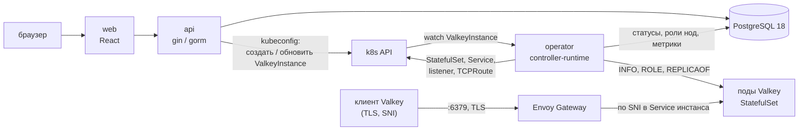
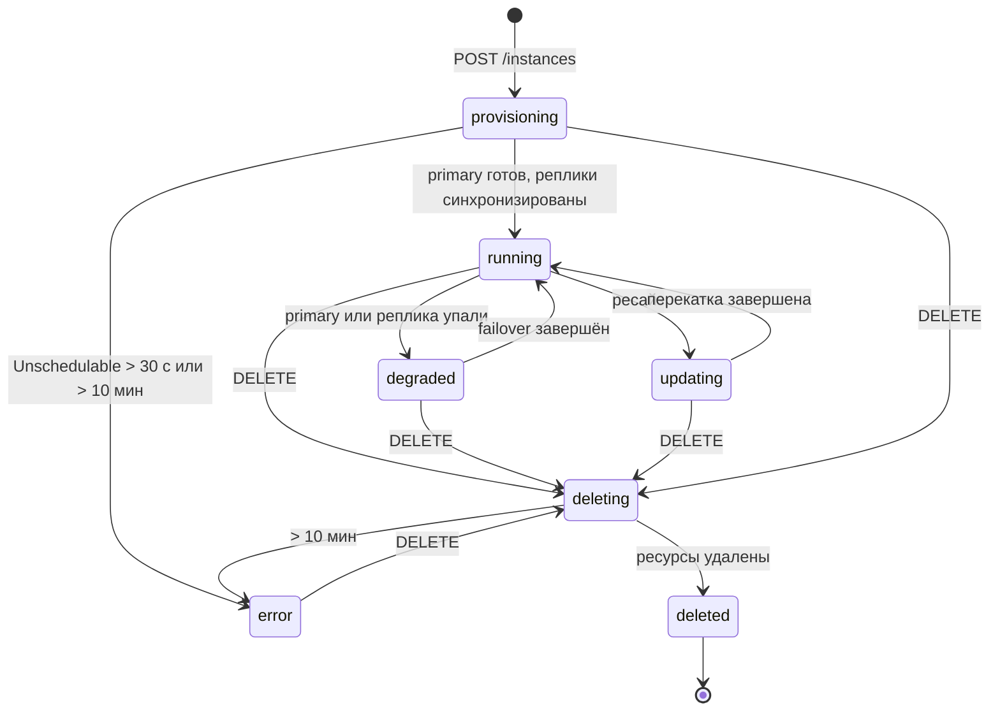

# Managed Valkey для h3llo cloud. План MVP

Документ фиксирует, что мы строим, из каких частей и по каким правилам.
Основная часть описывает систему как есть. В конце раздел «Компромиссы и
термины»: там объяснено, что означает каждое решение, какие были
альтернативы и почему выбрали именно так.

## 1. Что даём пользователю

- Создать инстанс Valkey: название, DNS-префикс, размер (vCPU и RAM),
  режим `single` (одна нода) или `ha` (primary и две реплики).
- Публичный адрес с TLS: `<slug>.<VALKEY_BASE_DOMAIN>:<VALKEY_PUBLIC_PORT>`
  для записи и чтения, `<slug>-ro.<VALKEY_BASE_DOMAIN>` для чтения с реплик.
- Пароль, показывается в интерфейсе.
- Whitelist по IP и подсетям, включается и выключается отдельным флагом.
- Изменение vCPU и RAM после создания. Применяется сразу, с предупреждением
  о перезапуске.
- Окно maintenance: хранится и показывается, в MVP ни на что не влияет.
- Метрики по каждой ноде за последние 7 дней.
- Удаление.
- Регистрация по почте и паролю, вход, JWT.
- Квоты: на пользователя (по умолчанию 4 vCPU и 16 GB) и на весь кластер
  (через env).

Чего не даём, осознанно: persistence и бэкапы (при перезапуске всех нод
данные теряются), восстановление пароля, организации и команды, cluster
mode (шардирование), выбор версии Valkey, настройка параметров Valkey
кроме размера.

## 2. Компоненты

Три компонента в одном репозитории, один язык для backend (Go).



`api` владеет пользователями, квотами, желаемым состоянием инстансов.
Пишет желаемое состояние в объект `ValkeyInstance` в k8s. Никогда не ждёт
k8s синхронно: создание отвечает `202` и статусом `provisioning`.

`operator` живёт рядом с k8s, читает `ValkeyInstance`, создаёт и чинит
StatefulSet, Service, маршруты шлюза. Делает failover, перекатку при
ресайзе, собирает метрики. Наблюдаемое состояние (статус, роли нод,
метрики) пишет в PostgreSQL напрямую.

`web` ходит только в `api`. Статусы и метрики берёт из PostgreSQL через
`api`, k8s для фронта не существует.

Envoy Gateway и cert-manager это готовые компоненты, мы их ставим, но не
пишем.

## 3. Данные (PostgreSQL 18, миграции goose)

`users`: `id uuid`, `email` (unique), `password_hash` (bcrypt), `created_at`.

`user_quotas`: `user_id` (pk), `max_vcpu` (default 4), `max_ram_gb`
(default 16). Строка создаётся при регистрации. Правится руками в базе,
UI нет.

`instances`:
- `id uuid`, `user_id`, `name` (отображаемое), `slug` (unique, DNS-имя),
  `mode` (`single`/`ha`), `vcpu`, `ram_gb`, `valkey_version`.
- `status`, `status_reason`, `provisioning_started_at`, `deleting_started_at`.
- `password_enc` (AES-GCM ключом из env), `port`, `host`, `host_ro`.
- `whitelist_enabled bool`, `whitelist_cidrs text[]`.
- `maintenance_dow smallint`, `maintenance_hour_utc smallint`,
  `maintenance_duration_min smallint`.
- `desired_generation`, `observed_generation`: счётчик изменений спецификации
  и последний обработанный оператором.
- `created_at`, `updated_at`, `deleted_at`.

Колонки делятся на две группы. Желаемое (`vcpu`, `ram_gb`, whitelist,
`desired_generation`) пишет только `api`. Наблюдаемое (`status`,
`status_reason`, `observed_generation`, `host`) пишет только `operator`.
Так два процесса не затирают друг друга.

`instance_nodes`: `instance_id`, `ordinal`, `role` (`primary`/`replica`/
`unknown`), `pod_name`, `ready bool`, `updated_at`. Пишет оператор.

`node_metrics`: `instance_id`, `ordinal`, `ts`, `role`,
`used_memory_bytes`, `maxmemory_bytes`, `connected_clients`, `ops_per_sec`,
`keyspace_hits`, `keyspace_misses`, `evicted_keys`, `cpu_millicores`.
Индекс `(instance_id, ts desc)`. Строки старше 7 дней удаляет ежедневная
задача в `api`. При 30-секундном интервале и 24 нодах это около 70 тысяч
строк в день, партиционирование не нужно.

`idempotency_keys`: `user_id`, `key`, `request_hash`, `response_status`,
`response_body jsonb`, `created_at`. Unique `(user_id, key)`. Чистятся
старше 24 часов.

Квота кластера в таблицах не хранится. Использование считается запросом:
сумма `nodes * vcpu` и `nodes * ram_gb` по инстансам со статусом не
`deleted`, где `nodes` это 1 для `single` и 3 для `ha`. Инстанс в `error`
квоту занимает, пока его не удалят.

### Статусы инстанса



- `provisioning`: создан, оператор поднимает поды.
- `running`: primary готов, в `ha` все реплики синхронизированы.
- `updating`: идёт перекатка после ресайза.
- `degraded`: `ha`, primary есть, но реплика не готова или идёт failover.
- `error`: с причиной в `status_reason`. Ресурсы в k8s не удаляются, чтобы
  можно было посмотреть. Выход только через удаление.
- `deleting`, `deleted`: `deleted` скрыт из списка, строка остаётся.

Переводы в `error` по таймеру делает оператор:
- под в `Pending` с причиной `Unschedulable` дольше 30 секунд:
  `NOT_ENOUGH_RESOURCES`;
- `provisioning` дольше 10 минут: `PROVISIONING_TIMEOUT`;
- `deleting` дольше 10 минут: `DELETE_TIMEOUT`.

В интерфейсе для всех трёх текст «напишите в поддержку».

## 4. API

Префикс `/v1`. JSON. Авторизация `Authorization: Bearer <jwt>`.

```
POST   /auth/register            {email, password}            → {token}
POST   /auth/login               {email, password}            → {token}
GET    /me                                                    → {user, quota, usage}
GET    /sizes                                                 → сетка и пресеты
GET    /instances
POST   /instances                Idempotency-Key обязателен   → 202 + instance
GET    /instances/{id}
PATCH  /instances/{id}           {name?, maintenance?}
POST   /instances/{id}/resize    {vcpu, ram_gb}, Idempotency-Key → 202
PUT    /instances/{id}/whitelist {enabled, cidrs[]}
GET    /instances/{id}/credentials                            → {host, host_ro, port, password}
GET    /instances/{id}/metrics   ?from&to&step                → ряды по нодам
DELETE /instances/{id}                                        → 202, идемпотентно
```

### Идемпотентность

Заголовок `Idempotency-Key` (UUID, генерирует фронт при открытии формы).
Сервер хранит ключ, хеш тела и ответ 24 часа. Повтор с тем же ключом и
телом возвращает сохранённый ответ, не создавая ничего. Тот же ключ с
другим телом отвечает `422 IDEMPOTENCY_MISMATCH`. Ключ проверяется и
пишется в одной транзакции с созданием, иначе два запроса, пришедшие
одновременно, создадут два инстанса.

Остальные методы идемпотентны сами по себе: `PUT` и `PATCH` заменяют
значения, `DELETE` на инстансе в `deleting` или `deleted` отвечает `202`
без действий.

### Ошибки

Один формат для всех ответов с кодом 4xx и 5xx:

```json
{"error": {"code": "QUOTA_EXCEEDED", "message": "...", "details": {"max_vcpu": 4, "requested": 6}}}
```

Пакет `internal/apierr`, тип `Error{Code, HTTPStatus, Message, Details}`.
Коды константами: `VALIDATION_FAILED` (400), `UNAUTHORIZED` (401),
`NOT_FOUND` (404), `CONFLICT` (409), `IDEMPOTENCY_MISMATCH` (422),
`QUOTA_EXCEEDED` (422), `NOT_ENOUGH_RESOURCES` (422, только в статусе
инстанса), `INSTANCE_NOT_READY` (409), `INTERNAL` (500). Доменный код
возвращает `apierr.Error`, один middleware превращает его в ответ. Проверка
внутри кода через `errors.Is` и `errors.As`. На фронте те же коды в
TypeScript-перечислении и словарь текстов по коду.

### Создание инстанса, порядок шагов

1. Проверить тело: имя, префикс (3-20 символов, `[a-z0-9-]`), пара
   `vcpu`/`ram_gb` из сетки, режим.
2. В транзакции: проверить и записать `Idempotency-Key`, взять строку
   `user_quotas` с `FOR UPDATE`, посчитать использование пользователя и
   кластера, сравнить с лимитами. Нарушение квоты пользователя:
   `QUOTA_EXCEEDED` с текстом «для повышения квоты напишите в поддержку».
   Нарушение квоты кластера: `NOT_ENOUGH_RESOURCES`.
3. Сгенерировать `slug` = `<prefix>-<6 случайных символов>`, пароль (32
   символа), записать инстанс в `provisioning`.
4. Создать `ValkeyInstance` в k8s. Если k8s недоступен, инстанс остаётся в
   `provisioning`, фоновая задача `api` раз в 10 секунд досоздаёт объекты
   для инстансов без `observed_generation`. Таймаут 10 минут всё равно
   сработает.
5. Ответить `202`.

Ресайз идёт так же: квоты в транзакции, `desired_generation + 1`, обновить
`ValkeyInstance`, статус `updating` выставит оператор.

## 5. Оператор

Go, controller-runtime. CRD `valkeyinstances.valkey.h3llo.cloud`, версия
`v1alpha1`, namespace `valkey` для всех инстансов.

```yaml
spec:
  slug: shop-a1b2c3
  mode: ha                 # single | ha
  vcpu: 1
  ramGb: 4
  port: 6379
  valkeyVersion: "8.1"
  whitelist: {enabled: true, cidrs: ["203.0.113.0/24"]}
  generation: 3
status:
  phase: running
  reason: ""
  primaryOrdinal: 1
  primaryContainerID: docker://...
  observedGeneration: 3
  nodes: [{ordinal: 0, role: replica, ready: true}, ...]
```

Пароль оператор не видит в CR, `api` кладёт его в Secret
`<slug>-auth` до создания CR.

### Что создаёт reconcile на один инстанс

- ConfigMap `<slug>-config` с `valkey.conf`.
- StatefulSet `<slug>`, replicas 1 или 3, `updateStrategy: OnDelete`,
  requests равны limits, `podAntiAffinity` по нодам (`required` на проде,
  `preferred` на dev через env оператора), readiness probe `valkey-cli ping`.
- Service `<slug>-hl` (headless, для адресов подов), `<slug>-primary`
  (селектор `role=primary`), `<slug>-replicas` (селектор `role=replica`).
- Два listener в общем `Gateway valkey`: `<slug>` и `<slug>-ro`, hostname
  `<slug>.<base>` и `<slug>-ro.<base>`, TLS Terminate, общий сертификат.
- `TCPRoute <slug>` и `<slug>-ro` с `sectionName` на свои listener,
  backend соответствующий Service.
- `SecurityPolicy <slug>` и `<slug>-ro`, если whitelist включён:
  `defaultAction: Deny`, правило Allow с `clientCIDRs`. Если выключен,
  политики нет.

Всё, кроме listener в общем `Gateway`, получает ownerReference на CR и
удаляется каскадом. Listener удаляет finalizer на CR. Правка общего
`Gateway` идёт с проверкой `resourceVersion` и повтором, потому что
несколько инстансов могут менять его одновременно.

### Конфигурация Valkey

```
port 6379
bind 0.0.0.0
protected-mode no
requirepass <из Secret через env>
masterauth  <тот же>
maxmemory <75% лимита RAM>
maxmemory-policy allkeys-lru
save ""
appendonly no
repl-diskless-sync yes
repl-diskless-load on-empty-db
replica-serve-stale-data yes
io-threads <1 при vcpu<4, иначе min(vcpu, 8)>
replicaof <slug>-primary.valkey.svc 6379   # только для ha
```

`replicaof` на Service primary означает: любой свежий или перезапущенный
под стартует как реплика и сам primary не становится никогда. Primary из
него делает только оператор.

### Первый запуск `ha`

Все три пода стартуют репликами Service `<slug>-primary`, у которого пока
нет подов. Когда под 0 готов, оператор отправляет ему `REPLICAOF NO ONE`,
ставит метку `role=primary`, запоминает `primaryOrdinal` и
`primaryContainerID`. Остальным отправляет `REPLICAOF <pod-0>.<slug>-hl
6379` и метку `role=replica`. Статус `running`, когда у всех реплик
`master_link_status:up`.

`single`: без `replicaof`, единственный под получает `role=primary` сразу.

### Failover (`ha`)

Оператор раз в 5 секунд проверяет primary: под готов, `ROLE` отвечает
`master`, container ID совпадает с записанным. Если хоть что-то не так:

1. Статус `degraded`.
2. Среди готовых реплик выбрать ту, у кого больше `master_repl_offset` из
   `INFO replication`.
3. Ей `REPLICAOF NO ONE` и метку `role=primary`. Service `<slug>-primary`
   переключается сам, адрес снаружи не меняется.
4. Остальным `REPLICAOF <новый primary>` и метку `role=replica`. Старый
   primary, когда поднимется, входит репликой и синхронизируется с нуля.
5. Записать новый `primaryOrdinal` и `primaryContainerID`, статус `running`.

Если готовых реплик нет (упали все поды сразу), данные потеряны в любом
случае. Оператор ждёт первый готовый под, делает его primary пустым и
продолжает как при первом запуске. В `error` инстанс не уходит: для кэша
пустая живая база лучше мёртвой.

Кто становится primary, решает только оператор, он один (leader election
в controller-runtime), поэтому двух primary одновременно не бывает. Если
оператор сам упал, failover ждёт его возвращения.

`single`: при перезапуске пода данные потеряны, оператор просто
подтверждает метку и статус.

### Перекатка при ресайзе (и будущих обновлениях версии)

Изменение vCPU, RAM или образа это перезапуск подов. Один механизм:

1. Обновить шаблон StatefulSet. `OnDelete` не даёт k8s перезапускать поды
   самому.
2. `single`: удалить под, дождаться готовности. Данные потеряны, о чём
   пользователя предупредили при нажатии кнопки.
3. `ha`: удалить реплики по одной, каждую дождаться до `master_link_status:up`.
   Затем плановый failover на обновлённую реплику (тот же алгоритм, что
   выше). Затем удалить старый primary, дождаться, он вернётся репликой.
   Данные не теряются, запись недоступна несколько секунд на failover.
4. `observedGeneration = generation`, статус `running`.

### Метрики

Раз в 30 секунд для каждого пода: `INFO` через клиент `valkey-go`
(memory, clients, stats, replication) и CPU из `metrics.k8s.io`. Запись в
`node_metrics` пакетом, одна вставка на инстанс.

### Таймеры

Reconcile ставит `RequeueAfter`, чтобы проверять таймауты из раздела 3 без
отдельного планировщика. Часы за интерфейсом `Clock`, в тестах
подменяются.

## 6. Сеть, домен, TLS, whitelist

### Домен

Домен покупается в reg.ru, DNS-зона хостится в Cloudflare. Одна запись
`*.<VALKEY_BASE_DOMAIN>` типа A на внешний IP шлюза, в режиме DNS only
(серое облако, без проксирования Cloudflare). Запись создаётся руками
один раз. При создании инстанса DNS не трогаем: все `<slug>` резолвятся в
один IP, инстансы различает шлюз по SNI.

Env: `VALKEY_BASE_DOMAIN` (`valkey.h3llo.cloud` на проде, `valkey.local`
на dev), `VALKEY_PUBLIC_PORT` (по умолчанию `6379`).

### Шлюз

Gateway API, реализация Envoy Gateway. Один объект `Gateway valkey` в
namespace `valkey`, `GatewayClass envoy`. Один внешний IP и один порт на
все инстансы. Listener на инстанс (см. раздел 5), TLS завершается на
шлюзе, до подов трафик идёт без шифрования внутри кластера.

Ограничение спецификации: 64 listener на `Gateway`, то есть 32 инстанса.
Для MVP хватает. При росте добавим второй `Gateway`.

### Сертификат

Прод: cert-manager с `ClusterIssuer` Let's Encrypt, проверка DNS-01 через
API Cloudflare (токен с правом править зону). `Certificate` на
`*.<VALKEY_BASE_DOMAIN>`, Secret `valkey-wildcard-tls`, продление
автоматическое. Dev: самоподписанный wildcard через `mkcert`, Secret с
тем же именем создаёт скрипт bootstrap. Клиенты на dev подключаются с
отключённой проверкой сертификата или с корнем mkcert.

### Whitelist

`SecurityPolicy` на каждый `TCPRoute` с `clientCIDRs`. Семантика:
`enabled=false` открыто всем, `enabled=true` с пустым списком закрыто
всем. Работает только если шлюз видит настоящий IP клиента. На dev видит
IP из compose-сети. На проде балансировщик h3llo должен либо сохранять IP
клиента, либо отдавать proxy protocol (включается через
`ClientTrafficPolicy`). Это вопрос к h3llo, см. раздел 13.

## 7. Размеры и квоты

Сетка на ноду, значения только из списка:

| vCPU | RAM, GB |
|------|---------|
| 1, 2, 4, 8, 16 | 1, 2, 4, 8, 16, 32, 64, 128 |

Правило: `ram_gb >= vcpu` и `ram_gb <= 16 * vcpu`. Пресеты в интерфейсе на
старте: 1/1, 1/2, 1/4. Верхняя граница на ноду режется env
`SIZE_MAX_VCPU` и `SIZE_MAX_RAM_GB`, `GET /sizes` отдаёт уже урезанную
сетку.

Квота пользователя: `user_quotas`, по умолчанию 4 vCPU и 16 GB, считается
как сумма `nodes * vcpu` и `nodes * ram_gb` по живым инстансам. Квота
кластера: `CLUSTER_MAX_NODES`, `CLUSTER_MAX_VCPU`, `CLUSTER_MAX_RAM_GB`.
Проверяются при создании и ресайзе внутри одной транзакции с блокировкой
строки квоты.

`maxmemory` = 75% от лимита RAM. Остаток на буферы репликации, буферы
клиентов и фрагментацию памяти.

## 8. Аутентификация

`POST /auth/register`: email, пароль не короче 8 символов, bcrypt cost 12,
строка `user_quotas` в той же транзакции. `POST /auth/login` отдаёт JWT
HS256, срок 7 дней, секрет `JWT_SECRET` из env, claims `sub` и `exp`.
Токен нельзя отозвать, выход это удаление токена на клиенте. Таблиц
сессий нет.

## 9. Логи

`slog` в `api` и `operator`, handler из `otelslog`, экспорт OTLP/HTTP в
VictoriaLogs по `VL_OTLP_URL` (`/insert/opentelemetry/v1/logs`). Атрибуты
`service.name`, `env`, в `api` дополнительно `request_id` (middleware,
отдаётся в заголовке ответа) и `user_id`, в операторе `instance_slug`.
Локально параллельно текстовый handler в stdout, уровень через `LOG_LEVEL`.

## 10. Frontend

Vite, React, TypeScript, Mantine, Tailwind с `preflight: false` (иначе
ломает стили Mantine), TanStack Query для запросов, react-router.
Графики через Mantine Charts.

Страницы: вход и регистрация; список инстансов с использованием квоты;
мастер создания (имя, префикс, режим, размер с пресетами, предупреждение
про отсутствие persistence); карточка инстанса с вкладками: подключение
(адреса, порт, пароль по кнопке, пример строки подключения `rediss://`),
whitelist, метрики, настройки (ресайз с предупреждением, окно maintenance,
имя), удаление с подтверждением по slug.

Страница инстанса опрашивает `api` раз в 5 секунд, пока статус не
`running`, дальше раз в 30 секунд. Тексты ошибок по коду из `apierr`.

## 11. Окружения

### Dev: одна команда `just dev`

docker-compose.yml:
- `postgres` (18), `victorialogs`.
- `k3s-server` и два `k3s-agent`: кластер из трёх нод внутри compose.
  Встроенные Traefik и servicelb выключены, kubeconfig пишется в общий
  volume. Порт 6379 контейнера `k3s-server` проброшен на хост.
- `k3s-bootstrap`: одноразовый контейнер с `kubectl` и `helm`. Ставит CRD
  Gateway API, Envoy Gateway, наш CRD, объект `Gateway valkey`, Secret с
  сертификатом mkcert. Идемпотентен, можно перезапускать.
- `api`: kubeconfig из volume, адрес k8s `https://k3s-server:6443`.
- `operator`: `network_mode: "service:k3s-server"`. Делит сеть с нодой k3s
  и потому видит IP подов напрямую, при этом compose-имена вроде
  `postgres` продолжают резолвиться. Это проверяем в первый день; если не
  работает, оператор деплоится внутрь k3s скриптом.
- `web`: Vite dev server.

`api` и `operator` собираются с горячей перезагрузкой (`air`).

### Prod

Compose на виртуальной машине: `api`, `web`, `postgres`, `victorialogs`.
В managed k8s h3llo: CRD, оператор (Deployment, 1 реплика, leader election),
Envoy Gateway с Service типа LoadBalancer, cert-manager. Манифесты в
`deploy/prod` (kustomize). Оператор ходит в PostgreSQL на виртуалке по
приватной сети, `api` ходит в k8s по kubeconfig с ограниченным
ServiceAccount (права только на `valkeyinstances` и Secret в namespace
`valkey`).

### Env

```
DATABASE_URL, JWT_SECRET, PASSWORD_ENC_KEY, VL_OTLP_URL, LOG_LEVEL
KUBECONFIG, VALKEY_NAMESPACE=valkey
VALKEY_BASE_DOMAIN, VALKEY_PUBLIC_PORT=6379, VALKEY_IMAGE=valkey/valkey:8.1
SIZE_MAX_VCPU, SIZE_MAX_RAM_GB
CLUSTER_MAX_NODES, CLUSTER_MAX_VCPU, CLUSTER_MAX_RAM_GB
OPERATOR_ANTI_AFFINITY=required|preferred
PROVISION_TIMEOUT=10m, UNSCHEDULABLE_TIMEOUT=30s, METRICS_INTERVAL=30s, METRICS_RETENTION=168h
```

## 12. Тесты и Justfile

Три слоя, упор на интеграционные. Все тесты с базой идут против настоящей
PostgreSQL из compose, перед запуском `goose up` на базу
`managed_valkey_test`. Каждый тест чистит свои таблицы.

- Юнит, без базы: сетка размеров, расчёт квот, `maxmemory` и `io-threads`,
  валидация имён и CIDR, выбор реплики по offset.
- Интеграционные быстрые: `api` против PostgreSQL, вместо k8s клиент
  `fake` из controller-runtime (хранит объекты в памяти, тот же
  интерфейс). Тут идемпотентность, гонки квот (два параллельных запроса),
  статусы, JWT, ошибки.
- Интеграционные медленные, build-тег `e2e`: оператор против envtest
  (настоящий kube-apiserver в процессе, поды не запускаются) для
  reconcile и таймаутов; полный сценарий против k3s из compose: создать,
  дождаться `running`, подключиться через шлюз по TLS, записать, убить
  primary, проверить failover, включить whitelist и получить отказ,
  ресайз, удалить.

Моки только там, где без них никак: часы для таймаутов. Клиент k8s не
мокается, берётся `fake` или envtest.

Justfile (в `just` двоеточие в имени нельзя):

```
just dev            # весь стек в compose
just dev-operator   # пересобрать и перезапустить оператор
just migrate        # goose up
just lint           # golangci-lint, eslint, tsc
just test-fast      # юнит + быстрые интеграционные (нужен postgres)
just test-all       # test-fast + envtest + e2e на k3s
```

## 13. Проверить в первый день

Это риски, которые могут поменять план. Проверяются до основной работы.

1. Envoy Gateway различает по SNI несколько TLS-listener на одном порту с
   `TCPRoute`. Спецификация требует, Envoy умеет, документацию на этот
   случай не нашли. Запасной вариант: порт на инстанс, адрес
   `<slug>.<base>:<порт>`, всё остальное без изменений.
2. Оператор в compose с `network_mode: "service:k3s-server"` видит IP
   подов. Запасной вариант: деплой оператора внутрь k3s.
3. Балансировщик h3llo перед шлюзом сохраняет IP клиента или отдаёт proxy
   protocol. Без этого whitelist на проде не работает.
4. У managed k8s h3llo хотя бы три ноды, иначе `required` anti-affinity
   для `ha` не даст запуститься.
5. Доступ из k8s h3llo к PostgreSQL на виртуалке по приватной сети.

## 14. Этапы

1. Каркас: репозиторий, compose с postgres, victorialogs, k3s, bootstrap;
   миграции; Justfile; логи; `apierr`; CI на `test-fast`.
2. `api` без k8s: регистрация, вход, квоты, CRUD инстансов, идемпотентность.
   Инстансы остаются в `provisioning`. Быстрые тесты.
3. Оператор, режим `single`: StatefulSet, Service, listener и `TCPRoute`,
   статус `running`, подключение с хоста через шлюз по TLS. Первые e2e.
4. Режим `ha`: первый запуск, failover, перекатка при ресайзе.
5. Whitelist, метрики, таймауты и переводы в `error`.
6. Frontend целиком.
7. Прод: cert-manager с Cloudflare, манифесты `deploy/prod`, проверки из
   раздела 13 на реальном h3llo.

## 15. Структура репозитория

```
cmd/api, cmd/operator
internal/apierr        типизированные ошибки
internal/auth          bcrypt, JWT, middleware
internal/domain        сетка размеров, квоты, валидация, чистые функции
internal/store         gorm-модели и репозитории
internal/api           gin-handlers, middleware, идемпотентность
internal/k8s           клиент, сборка объектов ValkeyInstance
internal/operator      reconcile, failover, перекатка, метрики
internal/valkey        обёртка над valkey-go: INFO, ROLE, REPLICAOF
internal/logging       slog + otel
api/v1alpha1           типы CRD
migrations/            goose sql
web/                   frontend
deploy/dev             манифесты для k3s-bootstrap
deploy/prod            kustomize для h3llo k8s
docker-compose.yml, Justfile, .env.example
```

---

# Компромиссы и термины

Каждый пункт: что это, какие были варианты, что взяли и что при этом
теряем.

### Оператор: свой, а не готовый

Оператор в k8s это программа в бесконечном цикле: прочитать «как должно
быть» (наш объект `ValkeyInstance`), прочитать «как есть» (какие поды и
сервисы живут), устранить разницу. Kubebuilder и controller-runtime дают
каркас для такого цикла.

Официальный valkey-io/valkey-operator в статусе «не для production» и
умеет только cluster mode (шардирование данных по многим primary).
Схема «один primary и реплики» у него только в черновике дизайна от мая
2026, без кода. Сообщество (OT-CONTAINER-KIT, chideat) строит HA на
Sentinel, а Sentinel наружу отдавать нельзя, клиент должен уметь с ним
говорить, и нам всё равно пришлось бы писать компонент, который следит за
его решениями. Без persistence и без шардирования свой оператор получается
тонким: StatefulSet, три Service, маршруты шлюза и failover. Платим тем,
что failover отлаживаем сами и учим controller-runtime.

### Без persistence и бэкапов

Valkey используется как кэш и pub/sub. Диск не подключаем, `save ""` и
`appendonly no`. Одновременный перезапуск всех нод инстанса означает
пустую базу. Это принято сознательно: перезапуски проще, подов меньше,
дисков нет. Пользователю об этом говорим в мастере создания.

### HA через реплики и переключение метки, без Sentinel

Репликация в Valkey асинхронная и односторонняя: один primary принимает
запись, реплики копируют его и отвечают только на чтение. Стабильный адрес
для записи даёт k8s Service: это виртуальный IP с правилом «пересылай на
поды с меткой `role=primary`». Failover это перестановка метки, адрес не
меняется. Так же устроен primary endpoint в AWS ElastiCache, только там
переключается DNS-запись, а у нас Service, без задержки на кэш DNS.

Sentinel это отдельные процессы, которые голосуют за primary. Yandex и
Selectel опираются на него, потому что он встроен в Redis. Мы не берём:
плюс три пода на инстанс, а стабильный адрес всё равно пришлось бы делать
самим.

Теряем: записи за последние миллисекунды до падения (асинхронность),
около 10 секунд недоступности записи на failover, и зависимость от
оператора (упал он, failover ждёт).

Ловушка, ради которой все поды стартуют репликами: упавший primary k8s
поднимает за секунду пустым. Если он снова станет primary, реплики затрут
данные его пустотой. Поэтому primary назначает только оператор, и он
смотрит на container ID: новый контейнер значит новый failover на реплику
с данными.

### Два адреса вместо умного прокси

Умный прокси (Redis Cloud, Upstash, Envoy с модулем redis) разбирает
каждую команду и сам шлёт запись на primary, чтение на реплики. Клиент
видит один адрес. Но pub/sub, транзакции и скрипты привязаны к соединению
и через такой прокси проходят плохо, плюс задержка и ещё один компонент.
Даём два адреса: `<slug>` для записи и чтения, `<slug>-ro` для чтения с
реплик. Кому реплики на чтение не нужны, использует первый и ничего не
теряет.

### Поддомен, wildcard DNS и SNI

Адрес вида `domain/<slug>` невозможен: путь существует только в HTTP, а
Valkey это голый TCP, где есть лишь IP и порт. Значит, инстансы
различаются именами хостов. При этом интеграция с DNS-провайдером не
нужна: одна wildcard-запись `*.valkey.h3llo.cloud → IP шлюза`, и все имена
ведут на один IP.

Как шлюз узнаёт, к какому инстансу пришли, если в TCP имени нет? Через
SNI (Server Name Indication). Первое сообщение TLS-рукопожатия клиент
шлёт открытым текстом, и в нём есть имя сервера. Аналогия: конверт с
адресом снаружи, письмо внутри запечатано. Шлюз читает адрес с конверта
и передаёт письмо нужному инстансу. Без TLS конверта нет, поэтому TLS у
нас обязателен, а не опция.

### Gateway API и Envoy Gateway

Ingress в k8s это старый способ описать входной прокси, только для HTTP.
Gateway API его замена: объекты `Gateway` (где слушать, каким сертификатом
закрывать), маршруты (`HTTPRoute`, `TLSRoute`, `TCPRoute`) и `GatewayClass`
(кто реализует). Сам стандарт ничего не делает, нужна реализация. Envoy
Gateway эталонная, с самой полной поддержкой TCP. Альтернативы: Traefik
(свои CRD, встроенный Let's Encrypt, но whitelist через свои объекты, не
через стандарт), nginx (не умеет TCP по SNI), HAProxy (конфиг шаблонами).

Внутри стандарта выбрали не `TLSRoute` с `hostnames`, а listener на
инстанс с полем `hostname` плюс `TCPRoute`. Причина одна: whitelist по IP
у Envoy Gateway (`SecurityPolicy`) навешивается на `TCPRoute`, но не на
`TLSRoute`. Цена: `Gateway` растёт на два listener с каждым инстансом,
предел 64.

TLS завершается на шлюзе, поды Valkey работают без шифрования. Так
сертификат один на всех, и при его замене поды не перезапускаются. Трафик
внутри кластера открытый, для нашей сети это принято.

### Сертификат через cert-manager и Cloudflare

Let's Encrypt выдаёт сертификат тому, кто докажет владение доменом: файлом
на 80-м порту (HTTP-01) или TXT-записью в DNS (DNS-01). Wildcard только
через DNS-01, значит, нужен API DNS-провайдера. У cert-manager Cloudflare
поддержан из коробки, reg.ru нет. Поэтому домен покупается в reg.ru, а
зона переезжает в Cloudflare (бесплатно, меняются только NS-серверы).
Cloudflare при этом только DNS: проксирование (оранжевое облако)
выключено, оно работает для HTTP и не пропустит наш TCP.

Свой ACME-клиент писать не стали: продление раз в 60 дней, хранение,
повторы при ошибках и лимиты (50 сертификатов на домен в неделю) это
готовая работа cert-manager. Envoy Gateway, в отличие от Traefik и Caddy,
сам сертификаты не получает, отсюда cert-manager как отдельный компонент.

### Whitelist на шлюзе и настоящий IP клиента

Whitelist можно проверять только там, где виден IP клиента. Поды видят
IP шлюза, а не клиента, поэтому сетевые политики k8s на подах бесполезны.
Проверка на шлюзе через `SecurityPolicy`. Шлюз, в свою очередь, должен
видеть IP клиента сквозь балансировщик h3llo: либо балансировщик его
сохраняет, либо передаёт через proxy protocol (небольшой заголовок в
начале соединения с исходным IP). Без этого whitelist пропустит всех или
никого.

### Сетка размеров и `maxmemory` 75%

Valkey исполняет команды в одном потоке, дополнительные ядра помогают
только вводу-выводу, поэтому память важнее CPU. Степени двойки и правило
«от 1 до 16 GB на vCPU» стандарт у managed-предложений. Сетка широкая,
чтобы не переделывать, а границы на ноду и старт с 1 vCPU режутся env.

`maxmemory` не равен лимиту контейнера: Valkey тратит память сверх данных
на буферы репликации, буферы ответов клиентам и фрагментацию. 75% та же
цифра, что резерв по умолчанию в AWS ElastiCache. При превышении Valkey
выселяет ключи по `allkeys-lru`, а не падает по OOM.

### Квоты в двух местах

Квота пользователя в базе, потому что её надо править по одному
пользователю без перезапуска. Квота кластера в env, потому что она одна и
меняется вместе с железом. Проверка в транзакции с `FOR UPDATE` на строке
квоты: без блокировки два одновременных запроса оба увидят свободное
место и оба пройдут.

Два кода ошибки, потому что действия пользователя разные: при
`QUOTA_EXCEEDED` он пишет в поддержку за повышением, при
`NOT_ENOUGH_RESOURCES` ждёт или тоже пишет, но повышать ему нечего.

### `Idempotency-Key`

API ходит через VPN с потерями, клиент может повторить запрос, не получив
ответа. Для создания повтор означал бы два инстанса и двойной расход
квоты. Ключ от клиента и сохранённый ответ решают это без изменений в
логике создания. Ключ и создание в одной транзакции, иначе гонка между
двумя одновременными повторами.

### Ресайз сразу, перекатка с failover, окно maintenance только хранится

Изменение размера пода это его перезапуск, k8s не умеет менять лимиты на
лету. Простой вариант «выключить всё и включить» теряет данные, за
сохранность которых пользователь платил тремя нодами. Перекатка по
одной с плановым failover стоит около сотни строк поверх обычного
failover и сохраняет данные. Тот же код пойдёт на обновление версии
Valkey, когда оно появится, и тогда окно maintenance начнёт что-то
значить. В MVP окно только хранится и показывается.

### Таймауты 10 минут и 30 секунд

Квоты в базе не гарантируют, что в кластере физически есть машина со
свободными 4 vCPU. Тогда под висит в `Pending` с причиной `Unschedulable`,
оператор это видит и через 30 секунд переводит инстанс в `error`, не
заставляя ждать. 10 минут это страховка на всё остальное: битый образ,
сломанный шлюз, зависшее удаление. Ресурсы в k8s при ошибке не удаляются,
чтобы поддержка могла посмотреть; квота при этом занята до удаления
инстанса пользователем.

### Метрики в PostgreSQL, пишет оператор

Отдельная система метрик (Prometheus, VictoriaMetrics) это ещё один
компонент и ещё один API для фронта. Объём у нас крошечный, обычная
таблица с индексом по времени и чисткой старше 7 дней справляется.

Пишет оператор, а не `api`, потому что только он сетево достаёт до подов
для команды `INFO`. Из compose на dev до подов не дотянуться. Цена: у
оператора есть доступ к базе, два процесса пишут в одну схему.
Разграничение по колонкам (желаемое пишет `api`, наблюдаемое оператор)
удерживает это в порядке.

### JWT без отзыва

Серверная сессия это таблица со случайными токенами, JWT это подписанный
токен без таблицы: сервер проверяет подпись секретом из env. Выбран JWT
на 7 дней. Единственный минус: отозвать его нельзя, выход это удаление на
клиенте. Восстановление пароля и смена пароля в MVP не заложены, поэтому
отзыв не нужен.

### k3s в compose вместо minikube

Minikube внутри контейнера это Docker в Docker и работает через раз. k3s
это полный k8s в одном контейнере, официально поддерживаемый в compose, с
режимом «сервер плюс агенты» для многонодового кластера. Три ноды дают
проверить anti-affinity и failover через `docker kill`. Встроенные
Traefik и servicelb отключаем, потому что шлюз у нас Envoy Gateway.

Оператор на dev не деплоится внутрь k3s, а работает как compose-сервис с
общей сетью с контейнером k3s: так он видит IP подов и перезагружается
как обычный сервис. На проде он обычный Deployment в k8s. Разница только
в способе запуска, код один.

### Тесты: интеграционные против настоящей базы, моки по минимуму

Моки базы и k8s проверяют то, что мы сами придумали про их поведение.
Настоящая PostgreSQL из compose с миграциями goose и `fake`-клиент
controller-runtime (хранит объекты в памяти, но с настоящими правилами
API) дают проверку реального поведения при скорости юнит-тестов. Медленные
тесты на envtest и k3s вынесены под build-тег `e2e`, чтобы `test-fast`
шёл секунды. Единственный мок это часы для проверки таймаутов.

### Пароль в базе, зашифрованный

Пароль инстанса нужен и оператору (в Secret k8s), и пользователю (показать
в интерфейсе). Хранить хеш нельзя, показать нечего. Хранится в
PostgreSQL зашифрованным AES-GCM ключом из env, чтобы дамп базы не
раскрывал пароли. Ротации пароля в MVP нет.

### CR как контракт, PostgreSQL как источник правды для фронта

Можно было обойтись без CRD: оператор читал бы желаемое состояние прямо
из PostgreSQL. Меньше кода, но оператор привязывается к схеме базы, и
теряется `kubectl get valkeyinstances` для отладки. CR как контракт между
`api` и оператором держит их независимыми: `api` пишет объект и забывает,
оператор реагирует на изменения через watch. Фронт при этом читает только
PostgreSQL, куда оператор складывает наблюдаемое состояние, и не зависит
от доступности k8s.
