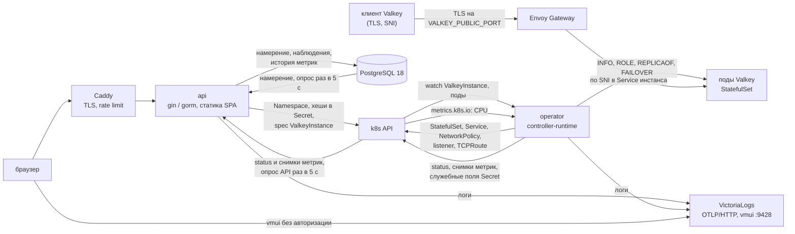
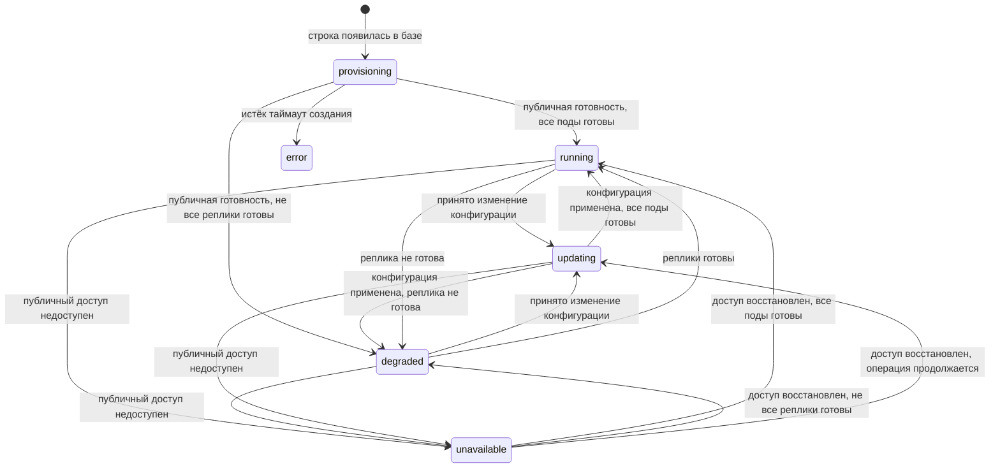

# Managed Valkey для h3llo cloud: план v1

Документ описывает целевую архитектуру и задаёт требования к v1 managed-сервиса Valkey для облака h3llo. Порядок работ, задачи и актуальное состояние реализации ведём в `openspec/changes/`.

Первая часть описывает поведение сервиса, данные и архитектуру. Вторая объясняет выбор решений и их ограничения. Алгоритмы фоновой синхронизации API и оператора, включая переключение primary и проверку шлюза, вынесены в [SYSTEM-DETAIL.md](SYSTEM-DETAIL.md). Оба документа составляют ТЗ на v1.

## Как устроен сервис

Мы создаём сервис в облаке h3llo, в котором пользователь сможет получить готовый Valkey для своего приложения. Valkey хранит данные в оперативной памяти и используется как кэш. Пользователь выбирает объём ресурсов в веб-интерфейсе и получает адрес подключения и пароль. Запуск и настройку берёт на себя сервис. В первой версии данные не сохраняются на диск: при перезапуске всех узлов выделенного Valkey содержимое кэша теряется.

За создание и изменение настроек отвечают две наши подсистемы. `api` принимает запросы из веб-интерфейса и сохраняет выбранные пользователем настройки в PostgreSQL. Фоновые циклы внутри `api` доставляют их через Kubernetes API в ресурс `ValkeyInstance` и переносят его состояние и метрики обратно в базу. Оператор читает этот ресурс, управляет Valkey и записывает результат в его `status`. Доступа к PostgreSQL и API нашего сервиса у оператора нет.

Приложение пользователя подключается к Valkey по выданному адресу. Соединение проходит через шлюз Envoy Gateway: он направляет его к нужному экземпляру Valkey. Уже работающий Valkey может обслуживать запросы при недоступности `api`, PostgreSQL или оператора. Для принятия и доставки новых настроек нужны `api` и PostgreSQL. Уже доставленные настройки применяет оператор через Kubernetes; он же отвечает за восстановление после сбоя. Поэтому доступность работающего кэша и возможность управлять им рассматриваем отдельно.

Каждому пользователю сервис выделяет изолированный экземпляр Valkey со своими учётными данными и ограничениями сетевого доступа. Пользователь может работать с данными, а служебное управление сервером остаётся у сервиса. Для приёма соединений и выпуска сертификатов, необходимых для защищённого подключения, используем готовые компоненты. Сами разрабатываем веб-интерфейс, `api` и оператор.

## Оглавление

Часть 1. Спецификация v1

1. [Что получает пользователь](#1-что-получает-пользователь)
2. [Компоненты](#2-компоненты)
3. [Кто с кем разговаривает и где авторизация](#3-кто-с-кем-разговаривает-и-где-авторизация)
4. [Данные](#4-данные-postgresql-18-миграции-goose)
5. [API](#5-api)
6. [Оператор](#6-оператор)
7. [Сеть, домен, TLS, whitelist](#7-сеть-домен-tls-whitelist)
8. [Размеры, цены и квоты](#8-размеры-цены-и-квоты)
9. [Отказоустойчивость и цель по доступности](#9-отказоустойчивость-и-цель-по-доступности)
10. [Аутентификация](#10-аутентификация)
11. [Логи](#11-логи)
12. [Frontend](#12-frontend)
13. [Окружения](#13-окружения)
14. [Тесты, Justfile, CI](#14-тесты-justfile-ci)
15. [Проверить в первый день](#15-проверить-в-первый-день)
16. [Структура репозитория](#16-структура-репозитория)

Часть 2. [Компромиссы и термины](#часть-2-компромиссы-и-термины)

---

# Часть 1. Спецификация v1

## 1. Что получает пользователь


| Возможность           | Как устроено                                                                                                                                                                                                                                                |
| --------------------- | ----------------------------------------------------------------------------------------------------------------------------------------------------------------------------------------------------------------------------------------------------------- |
| Создание инстанса     | Название, DNS-префикс, размер (vCPU и RAM), режим `single` (одна нода) или `ha` (primary и две реплики).                                                                                                                                                    |
| Публичный адрес с TLS | `<slug>.<VALKEY_BASE_DOMAIN>:<VALKEY_PUBLIC_PORT>` для записи и чтения. В `ha` также `<slug>-ro.<VALKEY_BASE_DOMAIN>` для чтения с реплик; в `single` `host_ro=null`. Клиент обязан передавать SNI (раздел 7).                                              |
| Учётная запись        | Пользователь Valkey `app`. Полный пароль показывается один раз после принятия создания или смены пароля; затем только маска вида `jz3f*****`. Права: чтение, запись, очистка собственного кэша, pub/sub, Lua и Functions в пределах ACL (раздел 6).         |
| Смена пароля Valkey   | Доступна в `running` и `degraded`. UI генерирует новый пароль. После применения старый пароль перестаёт работать, прежние соединения `app` закрыты; приложения должны подключиться с новым паролем. Недоступный прежний процесс может задержать завершение. |
| Whitelist             | По IP и подсетям. Включается и выключается отдельным флагом.                                                                                                                                                                                                |
| Ресайз                | Изменение vCPU и RAM в обе стороны, по одной операции за раз. В `single` любой ресайз очищает кэш; в `ha` уменьшение RAM очищает кэш, остальные изменения идут по одному поду. UI предупреждает о простое и возможной потере записей.                       |
| Окно maintenance      | Хранится и показывается. В v1 ни на что не влияет.                                                                                                                                                                                                          |
| Метрики               | По каждой ноде. Окна 5 минут, 1 час, 24 часа, 7 дней. Глубина хранения 7 дней.                                                                                                                                                                              |
| Аудит                 | Журнал действий по инстансу: когда, кто и что сделал.                                                                                                                                                                                                       |
| Цена                  | В час и в месяц, плюс расход за текущий месяц.                                                                                                                                                                                                              |
| Удаление              | С подтверждением по slug.                                                                                                                                                                                                                                   |
| Аккаунт               | Регистрация по почте и паролю, вход, JWT.                                                                                                                                                                                                                   |
| Квоты                 | На пользователя (по умолчанию 4 vCPU и 16 GB) и на весь кластер (через env).                                                                                                                                                                                |


В v1 нет:

- persistence и бэкапов данных: при перезапуске всех нод инстанса данные теряются;
- сохранности данных при переключении primary и при ресайзе: часть записей может пропасть; уменьшение RAM в `ha` и любой ресайз `single` очищают кэш;
- приёма денег: цены считаем и показываем, платёжного шлюза и счетов нет;
- восстановления и смены пароля аккаунта, повторного показа пароля Valkey;
- организаций и команд;
- cluster mode, то есть шардирования;
- выбора версии Valkey;
- обновления образа Valkey у существующих инстансов: переносим в v2, включая запуск обновления через общую очередь конфигурации и maintenance;
- настройки параметров Valkey кроме размера;
- отмены и автоматического отката ресайза: при задержке команда эксплуатации устраняет причину, после чего оператор продолжает ту же операцию; пользователь может дождаться восстановления или удалить инстанс;
- внешней проверки доступности инстансов и отчёта по SLA;
- автоматического восстановления при частичном отказе Envoy и управления его выводом из балансировщика. В v1 сверяем конфигурации двух доступных реплик; неудачная проверка повторяется и при задержке требует вмешательства команды эксплуатации. Обработка сложных случаев относится к v2 (раздел 6);
- бэкапов PostgreSQL и облачной базы;
- резервной реплики оператора и автоматического выключения недоступных worker-нод через API провайдера: без подтверждённого отключения старого primary failover может ждать человека;
- подтверждения почты, приглашений и защиты квот от регистрации нескольких аккаунтов. Регистрация открыта, квота 4 vCPU / 16 GB выдаётся сразу. При отсутствии оплаты несколько аккаунтов могут занять весь кластер.

## 2. Компоненты

Мы пишем три компонента в одном репозитории: `web/`, `api/` и `operator/`.
API и оператор написаны на Go и используют один модуль с `go.mod` в корне.
Каждый собирается в отдельный бинарник и образ. Остальное берём готовым.


| Компонент  | За что отвечает                                                                                                                      | Стек                   | Где работает                                 |
| ---------- | ------------------------------------------------------------------------------------------------------------------------------------ | ---------------------- | -------------------------------------------- |
| `api` | Пользователи, квоты, биллинг, доставка намерения в CR, сохранение статусов и истории метрик в PostgreSQL, диагностика, статика SPA | Go, gin, gorm, client-go | Виртуалка, compose |
| `operator` | Приводит состояние k8s к заданному в CR, выполняет failover и перекатку, записывает состояние и последние метрики в `status` | Go, controller-runtime | Внутри k8s; на dev как сервис compose |
| `web`      | Интерфейс пользователя                                                                                                               | React, SPA             | Собирается в CI и встраивается в образ `api` |


Готовые компоненты, которые ставим, а не пишем: Caddy (TLS, rate limit), Envoy Gateway (вход для клиентов Valkey), cert-manager (wildcard-сертификат), PostgreSQL 18, VictoriaLogs.



`api` отвечает на создание `202` со статусом `provisioning` и отдаёт собранную статику SPA. `web` получает статусы и историю метрик через API из PostgreSQL. Фоновая синхронизация API переносит намерение в CR `ValkeyInstance`, а наблюдения оператора из `status` в базу. Оператор управляет объектами k8s по CR. Три цикла описаны в разделе 6.

## 3. Кто с кем разговаривает и где авторизация

`api` и оператор обмениваются состоянием через Kubernetes API. API записывает `spec` CR и читает его `status`; PostgreSQL доступна только API. Оператор обращается к Kubernetes и Valkey. Экспорт логов в VictoriaLogs выполняется обоими процессами отдельно от обмена состоянием.


| Кто                  | Куда                      | Как                                    | Чем авторизуется                                           |
| -------------------- | ------------------------- | -------------------------------------- | ---------------------------------------------------------- |
| браузер              | Caddy, дальше `api`       | HTTPS 443, интернет                    | JWT в заголовке `Authorization`                            |
| браузер эксплуатации | VictoriaLogs vmui на VM   | HTTP 9428, прямой публичный адрес      | Без авторизации в v1                                       |
| `api` | PostgreSQL | 45432, сеть compose | свой пользователь БД, scram, без TLS |
| `api`                | VictoriaLogs              | OTLP/HTTP 9428, сеть compose           | Без авторизации в v1                                       |
| `api` | k8s API | HTTPS, публичный endpoint Managed Kubernetes; на dev `k3s-server:6443` | отдельная учётная запись через kubeconfig, проверка CA и права RBAC |
| оператор | VictoriaLogs на VM | OTLP/HTTP 9428, публичный адрес VM | Без авторизации в v1 |
| оператор             | k8s API                   | 6443, изнутри кластера                 | in-cluster ServiceAccount, права по RBAC                   |
| оператор             | поды Valkey               | 6379, сеть кластера                    | пользователь Valkey `operator` из Secret `<slug>-auth`     |
| реплика              | primary                   | 6379, сеть кластера                    | пользователь Valkey `replica` из того же Secret            |
| клиент Valkey        | Envoy Gateway, дальше под | `VALKEY_PUBLIC_PORT`, интернет         | TLS, пользователь `app` с паролем, whitelist               |


Из интернета доступны порты 443 у Caddy, `VALKEY_PUBLIC_PORT` у шлюза, 45432 у PostgreSQL и 9428 у VictoriaLogs. В v1 Docker Compose публикует PostgreSQL и vmui в интернет для отладки. Подключение к PostgreSQL требует пароля, TLS в v1 отключён; vmui доступен без авторизации. API использует PostgreSQL по внутреннему адресу compose на 45432; публичное подключение к базе для его работы не нужно. На VM монтируется kubeconfig отдельной учётной записи для публичного endpoint Managed Kubernetes. Его адрес, порт, доверенный CA и доступ с VM проверяются на стенде. Приватной сети и VPN между VM и кластером нет. Оператор отправляет логи на публичный адрес VictoriaLogs; недоступность VictoriaLogs останавливает только экспорт логов.

У `api` есть kubeconfig на dev и проде. HTTP-обработчики не вызывают Kubernetes: фоновая синхронизация использует отдельный клиент и повторяет неудачные операции. API получает следующие права:

| Ресурс | Действия | Зачем |
| ------ | -------- | ----- |
| `namespaces` | create, get, list, watch, patch, delete | Создание и маркировка namespace инстанса, удаление после завершения finalizer CR |
| `valkeyinstances` | create, get, list, watch, update, patch, delete | Доставка `spec`, чтение `status` вместе с CR, запрос удаления; finalizer добавляется при создании CR |
| `secrets` | create, get, update, patch | Доставка версионированных хешей `app` с сохранением остальных полей Secret |

API не получает права на изменение `valkeyinstances/status`, управление подами или `services/proxy`. Права на `valkeyinstances` технически позволяют менять metadata; код доставки сохраняет finalizers и служебные аннотации оператора и не снимает их. Для работы в динамически создаваемых namespace используется ClusterRole/ClusterRoleBinding. Такой доступ не ограничивается префиксом имени или метками namespace: API проверяет принадлежность объектов инстансу перед изменениями, но его учётная запись остаётся доверенной кластерной учётной записью. Чтение Secret технически открывает API доступ к служебным паролям; он не сохраняет их в PostgreSQL и не отдаёт клиентам.

Оператор использует in-cluster ServiceAccount на проде и отдельный kubeconfig на dev. Его права:


| Ресурс                                                                 | Действия                                        | Зачем                                                                        |
| ---------------------------------------------------------------------- | ----------------------------------------------- | ---------------------------------------------------------------------------- |
| `namespaces` | get, list, watch | Наблюдение namespace инстансов; создаёт и удаляет их API |
| `valkeyinstances` | get, list, watch, update, patch | Чтение CR, finalizers и служебные аннотации; оператор не меняет `spec` |
| `valkeyinstances/status` | get, update, patch | Наблюдения, стадии операций и последние метрики |
| `secrets`, `configmaps`, `statefulsets`, `services`, `networkpolicies` | create, get, list, watch, update, patch, delete | Объекты инстанса                                                             |
| `poddisruptionbudgets`                                                 | create, get, list, watch, update, patch, delete | Ограничение добровольных выселений подов `ha`                                |
| `pods`                                                                 | get, list, watch, patch, delete                 | Метки ролей, управляемая замена подов после подтверждения остановки          |
| `endpointslices`                                                       | get, list, watch                                | Проверка маршрутизации к текущим подам                                       |
| `certificates` в `valkey-system`                                       | get, list, watch                                | Готовность wildcard-сертификата на проде                                     |
| `nodes`                                                                | get, list, watch                                | Состояние worker-нод                                                         |
| `events`                                                               | create, patch                                   | k8s Events на CR                                                             |
| `tcproutes`, `securitypolicies`                                        | create, get, list, watch, update, patch, delete | Маршруты и whitelist                                                         |
| `gateways` в `valkey-system`                                           | get, list, watch, update, patch                 | Listener на инстанс                                                          |
| `clienttrafficpolicies` в `valkey-system`                              | get, list, watch                                | Проверка общей политики TCP-соединений                                       |
| `leases` в `valkey-system`                                             | все                                             | Leader election                                                              |
| `pods.metrics.k8s.io`                                                  | get, list                                       | CPU подов                                                                    |
| `pods/portforward` в namespace Envoy                                   | create                                          | Чтение локального admin API Envoy для подтверждения загруженной конфигурации |


Строки с указанным namespace выдаются через Role/RoleBinding в этом namespace; ClusterRole не ограничивает доступ namespace по меткам. Оператор — доверенный кластерный компонент. Его общий доступ к Secret позволяет прочитать и чужие служебные секреты, в том числе токен Cloudflare cert-manager. Namespace и ACL изолируют пользователей инстансов, но не защищают от компрометации оператора. Доступ ко всем Secret не зависит от права `pods/portforward` и сохраняется при его удалении.

Для `app` PostgreSQL хранит только SHA-256 пароля и первые четыре символа для маски. API доставляет хеши по версиям в Secret `<slug>-auth`. Оператор при первоначальном запуске создаёт в этом Secret пароли `operator`, `replica` и `health`, затем формирует `users.acl`. При дальнейших обновлениях служебные пароли сохраняются. API меняет только доставляемые хеши, оператор управляет служебными полями и очисткой предыдущего хеша по правилам раздела 6. Служебные пароли существуют только в Kubernetes Secret; общего с API ключа шифрования нет. Пароли и хеши не входят в CR, ответы API и логи. Все служебные пароли генерируются CSPRNG: 24 случайных байта, base64url без padding; пароль каждой учётной записи генерируется независимо.

На проде оператор работает в StatefulSet внутри k8s h3llo: одна реплика, `updateStrategy: OnDelete`, служебный headless Service и leader election. К конкретной worker-ноде он не привязан. Штатная замена пода начинается после завершения предыдущего; при недоступной ноде перенос может ждать ручного подтверждения её отключения. Принудительное удаление пода оператора и удаление объекта Node до такого подтверждения запрещены. Обновление оператора также проходит с остановкой единственного пода. Правила основаны на [ограничениях StatefulSet](https://kubernetes.io/docs/tasks/run-application/force-delete-stateful-set-pod/).

При потере Lease оператор прекращает изменяющие команды, закрывает свои соединения и завершает процесс. Отмена вызова не отзывает уже отправленную команду. [Leader election в client-go](https://pkg.go.dev/k8s.io/client-go/tools/leaderelection) сам по себе не гарантирует единственного действующего лидера. Порядок приёма управления новым процессом описан в [алгоритмах оператора](SYSTEM-DETAIL.md#три-цикла); один лишь истёкший Lease не разрешает запуск второй копии, пока первая может быть жива. Замена оператора может занять минуты, мгновенного восстановления в v1 нет. На dev оператор запускается одной копией как сервис compose и делит сеть с контейнером k3s, чтобы видеть IP подов. При смене способа запуска сначала останавливают прежнюю копию.

## 4. Данные (PostgreSQL 18, миграции goose)

### Общие правила

- Первичные ключи — `uuid` версии 7: в Go `uuid.NewV7()`, в базе `default uuidv7()`, функция в PostgreSQL 18 встроенная. Ключ растёт со временем, поэтому новые вставки группируются в индексе по времени. Для точного порядка событий используем явные временные колонки.
- Всё время в UTC, тип колонок `timestamptz`. Часовой пояс приложения не меняем.
- Булевы колонки называются с `is_` или `has_`.
- Имена таблиц самого сервиса начинаются с `valkey_`, пути API с `/v1/managed/valkey`. Для второго managed-сервиса будут свои имена таблиц и пути; переименовывать существующие не потребуется.
- Миграции PostgreSQL только аддитивные: колонку нельзя удалить или переименовать, пока её читает работающая версия `api`. Оператор от схемы БД не зависит. Схема CRD должна быть совместима с API и оператором; новые поля добавляются до выкладки использующего их кода. Порядок выкатки: миграции PostgreSQL и CRD, оператор, `api`.

### Таблицы


| Таблица                        | Кто пишет                                                   | Зачем                                |
| ------------------------------ | ----------------------------------------------------------- | ------------------------------------ |
| `users`                        | `api`                                                       | Аккаунты                             |
| `user_quotas`                  | `api` при регистрации, затем меняется вручную               | Лимит vCPU и RAM на пользователя     |
| `valkey_instances` | `api`: обработчики записывают намерение, фоновая синхронизация записывает наблюдения | Инстансы |
| `valkey_instance_nodes` | фоновая синхронизация `api` | Роли и состояние подов |
| `valkey_node_metrics` | фоновая синхронизация `api` | Метрики подов, 7 дней |
| `valkey_instance_phase_events` | фоновая синхронизация `api` | История фаз для разбора инцидентов |
| `billing_periods`              | `api`                                                       | Отрезки тарификации                  |
| `idempotency_keys`             | `api`                                                       | Ответы на повторные запросы, 24 часа |
| `audit_logs`                   | `api`                                                       | Кто и что сделал                     |


#### `users`

`id`, `email` (unique), `password_hash` (bcrypt), `is_blocked` (default false), `created_at`. Флаг `is_blocked` меняется вручную в базе и проверяется middleware на каждом запросе: это единственный способ закрыть доступ скомпрометированному аккаунту к API, потому что JWT отозвать нельзя (раздел 10).

#### `user_quotas`

`user_id` (pk), `max_vcpu` (default 4), `max_ram_gb` (default 16). Строка создаётся при регистрации. Меняется вручную в базе, интерфейса для этого нет.

#### `valkey_instances`

Каждая колонка принадлежит либо обработчикам запросов, либо фоновой синхронизации внутри API.

Намерение, записывают HTTP-обработчики `api`:

- `id`, `user_id`, `name` (отображаемое), `slug` (unique, DNS-имя), `mode` (`single`/`ha`), `vcpu`, `ram_gb`, `desired_generation` (default 1);
- `created_at`, `updated_at`: создание строки и последнее изменение намерения. Импорт наблюдений оператора `updated_at` не меняет;
- `configuration_requested_at`: время создания или последнего роста `desired_generation`. Имя, maintenance, удаление и запрос без изменения это время не обновляют;
- `app_password_hash` (64 hex-символа SHA-256 в нижнем регистре), `password_prefix` (первые 4 символа), `password_version` (default 1);
- `host`, `host_ro`, `port`: `api` вычисляет их из slug и env при создании. В `single` `host_ro=null`; адрес `-ro` создаётся только для `ha`;
- `is_whitelist_enabled`, `whitelist_cidrs text[]`;
- `maintenance_dow smallint`, `maintenance_hour_utc smallint`, `maintenance_duration_min smallint`;
- `deletion_requested_at`: намерение удалить, записывается HTTP-обработчиком. Фоновые циклы эту колонку не меняют.

Наблюдаемое состояние, записывает фоновая синхронизация `api` по данным CR:

- `phase`, `phase_reason`, `observed_generation` (default 0), `observed_at`;
- `is_recovery_required` (default false): проекция condition `RECOVERY_REQUIRED` для диагностики и записи ошибок в логи; также входит в DTO;
- `network_verification_status` (`pending`/`verified`/`unknown`, default `pending`), `network_verified_at` (`null` до первой успешной сверки): состояние проверки загруженной конфигурации Envoy и время последней успешной сверки. Подробности и идентичности Envoy остаются в CR;
- `applied_password_version` (default 0);
- `applied_vcpu`, `applied_ram_gb`, `applied_mode`: размер, который фактически работает в кластере. Пока перекатка не закончена, он отличается от намерения, и квота считается по большему из двух. До первого применения значения равны 0, `applied_mode` равен `null`;
- `deleted_at`: API ставит после подтверждённого удаления namespace инстанса из k8s.

Общую gorm-модель инстанса нельзя записывать через `Save` или целиком передавать в `Updates`. HTTP-обработчики и фоновые циклы API обновляют явный список своих колонок через `Select` либо `Updates(map[string]any{...})`, включая `false`, `0` и `null`. Фоновые записи наблюдений отключают автоматическое обновление `updated_at`. Это исключает перезапись намерения устаревшей моделью и потерю нулевых значений. [Обновления GORM](https://gorm.io/docs/update.html).

Статус для интерфейса `api` вычисляет при чтении: `deleted_at` означает `deleted`, затем проверяется `deletion_requested_at` для `deleting`, иначе возвращается `phase`. `is_stale=true`, если `observed_at` отсутствует или старше 60 секунд. Оператор обновляет `status.observedAt` по свежему наблюдению каждые 10 секунд, даже если состояние не меняется; API переносит именно это время в `observed_at` (раздел 6). Свежесть этого наблюдения независима от доступности admin API Envoy. Неизвестный результат сверки шлюза отражается в `network_verification_status`; сам по себе он не делает инстанс `is_stale`.

`is_updating = desired_generation != observed_generation`. Поколение растёт при изменении размера, whitelist или пароля; имя и maintenance его не меняют. Оператор подтверждает поколение после применения всех изменённых полей конфигурации, а не после записи CR. Подтверждённые неизменившиеся поля повторно применять не нужно; правила повторного подтверждения сети описаны в [алгоритме проверки шлюза](SYSTEM-DETAIL.md#readiness-и-публичная-готовность). `applied_password_version` отдельно показывает завершение смены пароля. DTO содержит маску `password_hint = password_prefix + "*****"`, версии и признаки состояния; хеш и служебные пароли сериализовать в DTO запрещено. DTO также содержит `configuration_requested_at`, `network_verification_status` и `network_verified_at`.

#### `valkey_instance_nodes`

`instance_id`, `ordinal`, `role` (`primary`/`replica`/`unknown`), `pod_name`, `pod_uid`, `container_id`, `node_name` (worker-нода пода), `is_ready`, `updated_at`. Пишет фоновая синхронизация API по `status.nodes`.

#### `valkey_node_metrics`

`instance_id`, `ordinal`, `ts`, `role`, `run_id`, `used_memory_bytes`, `maxmemory_bytes`, `connected_clients`, `ops_per_sec`, `keyspace_hits`, `keyspace_misses`, `evicted_keys`, `cpu_millicores`. Индекс `(instance_id, ts desc)` и unique `(instance_id, ordinal, ts)` для защиты от повторного импорта. `ts` приходит из времени сбора снимка в CR, а не из времени записи в БД; точность при переносе сохраняется до микросекунд. `run_id` берётся из `INFO server`; он меняется при перезапуске процесса Valkey, вместе с ним обнуляются счётчики. `cpu_millicores` допускает `null`, если свежего измерения CPU нет. Снимок без успешного сбора `INFO` не создаёт строку метрик. Пишет фоновая синхронизация API по `status.metrics`, повторная вставка использует `ON CONFLICT DO NOTHING`.

Строки старше `METRICS_RETENTION` (7 дней) удаляет ежедневная задача в `api`. Верхняя оценка объёма при сохранении каждого снимка раз в 10 секунд; при пропущенных снимках строк меньше:


| Нод | Строк в сутки   | Строк за 7 дней    |
| --- | --------------- | ------------------ |
| 1   | 8 640           | около 60 тысяч     |
| 24  | около 207 тысяч | около 1,5 миллиона |


Партиционирование при таком объёме не нужно.

#### `valkey_instance_phase_events`

`id`, `instance_id`, `from_phase`, `to_phase`, `reason`, `created_at`. Пишет фоновая синхронизация API при обнаруженном изменении `phase` в CR, а также после подтверждённого удаления namespace (`deleted`). Обновление наблюдаемого состояния и событие фазы выполняются одной транзакцией под блокировкой строки инстанса: повторный импорт того же состояния не создаёт событие. Для наблюдения `created_at` берётся из `status.observedAt`, для `deleted` из времени подтверждения удаления API. Промежуточные переходы между опросами могут быть пропущены. Таблица нужна для разбора инцидентов; рассчитать по ней доступность для клиента нельзя: оператор проверяет инстанс только изнутри кластера (раздел 9).

#### `billing_periods`

`id`, `user_id`, `service` (пока только `valkey`), `resource_id`, `started_at`, `ended_at` (`null` у текущего периода), `mode`, `vcpu`, `ram_gb`, `node_count`, `price_kopecks_per_hour`, `started_reason` (`created`/`resized`), `ended_reason` (`resized`/`deleted`/`null`). Частичный unique-индекс `(service, resource_id) where ended_at is null` гарантирует, что открытый период у ресурса только один.

Пишет `api` в той же транзакции, что и само изменение: при создании открывает период с `started_reason=created`; при ресайзе закрывает текущий с `ended_reason=resized` и открывает новый с `started_reason=resized`; при удалении закрывает текущий с `ended_reason=deleted`. У открытого периода `ended_at` и `ended_reason` равны `null`, у закрытого заполнены оба поля. Новая ставка действует с момента принятия ресайза, включая время перекатки. При удалении тарификация заканчивается в момент запроса, хотя освобождение ресурсов может занять больше времени. Цена в копейках за час фиксируется в строке, поэтому смена тарифа не меняет стоимость прошлых периодов. Расход за период — сумма `длительность * price_kopecks_per_hour` по строкам. Инстанс в `error` тарифицируется, пока пользователь его не удалит, и так же занимает квоту. Смена пароля и whitelist не меняет биллинговые периоды.

Связь `ended_at` и `ended_reason` закрепляется CHECK-ограничением: `(ended_at is null) = (ended_reason is null)`.

Таблица общая для будущих managed-сервисов, отсюда `service` и `resource_id` вместо `instance_id`.

#### `idempotency_keys`

`user_id`, `key`, `request_hash`, `response_status`, `response_body jsonb`, `created_at`. Unique `(user_id, key)`. `request_hash` считается от метода, пути с id ресурса и тела, поэтому одинаковое тело ресайза для двух разных инстансов с одним ключом не вернёт ответ для другого инстанса. Тело запроса не сохраняется; `request_hash` — SHA-256 канонического запроса. `response_body` содержит только публичный DTO, без полного пароля, хеша ACL и служебных секретов. Строки старше 24 часов чистятся.

#### `audit_logs`

`id`, `user_id`, `user_email`, `action`, `service` (пока только `valkey`), `resource_id` (`null` у действий с аккаунтом), `request_id`, `created_at`. Индексы `(resource_id, created_at desc, id desc)` и `(user_id, created_at desc)`. Email копируется в строку на момент записи: журнал читается без join и не меняется задним числом, если пользователь потом сменит почту.

`action` — короткая строка на английском из фиксированного списка, константы лежат в `api/internal/audit`:


| `action`                    | Когда                             |
| --------------------------- | --------------------------------- |
| `user.register`             | Создан аккаунт                    |
| `user.login`                | Успешный вход                     |
| `instance.create`           | Принято создание инстанса         |
| `instance.update`           | Изменено имя или окно maintenance |
| `instance.resize`           | Принят ресайз                     |
| `instance.whitelist.update` | Сохранён whitelist                |
| `instance.password.rotate`  | Принята смена пароля Valkey       |
| `instance.delete`           | Принято удаление                  |


Пишет `api` одной вставкой в той же транзакции, что и само изменение. Отклонённый по квоте, фазе или конфликту запрос не оставляет строки в журнале. Успешный повтор по `Idempotency-Key` тоже не пишет вторую строку, потому что повтор не меняет данные. Вход и регистрация записываются отдельной вставкой после выдачи JWT.

Тело запроса, пароли, хеши и списки CIDR в журнал не попадают. Строка содержит автора и действие; подробности изменения видны по `billing_periods` и `valkey_instance_phase_events`. `request_id` тот же, что в логах раздела 11, и связывает строку с записями в VictoriaLogs. Журнал не чистим: объём мал, а история нужна для разбора.

#### Квота кластера

В таблицах не хранится. Использование считается запросом по строкам с `deleted_at is null`: сумма `nodes * greatest(vcpu, applied_vcpu)` и `nodes * greatest(ram_gb, applied_ram_gb)`, где `nodes` равно 1 для `single` и 3 для `ha`, плюс число самих строк против `CLUSTER_MAX_INSTANCES`. Так квота не освобождается раньше, чем оператор фактически уменьшил поды или удалил namespace. Инстанс в `error` квоту занимает, пока его не удалят.

### Фазы инстанса

`status.phase` в CR пишет оператор; в колонку `phase` PostgreSQL его переносит фоновый цикл API. Статусы `deleting` и `deleted` вычисляет `api`. Под публичной готовностью ниже понимается проверка из раздела 6: корректный primary и его ACL, endpoints, принятые маршруты и whitelist, действующий TLS-сертификат. Такая проверка выполняется внутри кластера и не измеряет доступность извне для расчёта SLA.




| Фаза           | Что означает                                                                                                                                                                           |
| -------------- | -------------------------------------------------------------------------------------------------------------------------------------------------------------------------------------- |
| `provisioning` | Оператор ещё не подтвердил первоначальную публичную готовность. Одного ответа primary на `PING` для этого недостаточно.                                                                |
| `running`      | Публичная конфигурация готова, primary отвечает; в `ha` все реплики синхронизированы. Нет незавершённого изменения.                                                                    |
| `updating`     | Публичный доступ работает, идёт применение размера, пароля или whitelist. Имеет приоритет над `degraded`, пока операция не завершена.                                                  |
| `degraded`     | Только `ha`: публичный доступ к primary работает, хотя бы одна реплика не готова, активной операции нет. Адрес `-ro` может быть недоступен, если не осталось готовых реплик.           |
| `unavailable`  | Ранее созданный инстанс потерял публичный доступ, в том числе из-за primary, маршрута или сертификата. Оператор восстанавливает его или ждёт подтверждения остановки старого процесса. |
| `error`        | Только при первоначальном создании: публичная готовность не достигнута до таймаута. Объекты остаются для разбора; инстанс можно только удалить.                                        |


Оператор фиксирует `initialized=true` в CR при первой публичной готовности; после этого `provisioning` и `error` недостижимы. Каждая смена фазы попадает в `valkey_instance_phase_events`. У `unavailable` и `degraded` нет общего таймаута восстановления.


| Условие                                                                                      | `phase_reason`         | Фаза                                                                                                                                  |
| -------------------------------------------------------------------------------------------- | ---------------------- | ------------------------------------------------------------------------------------------------------------------------------------- |
| Первоначальный primary в `Pending/Unschedulable` дольше `UNSCHEDULABLE_TIMEOUT`              | `NOT_ENOUGH_RESOURCES` | `error`                                                                                                                               |
| Публичная конфигурация не готова за `PROVISION_TIMEOUT` от создания CR                       | `PROVISIONING_TIMEOUT` | `error`                                                                                                                               |
| Primary работающего инстанса, включая `single` при ресайзе, не планируется                   | `NOT_ENOUGH_RESOURCES` | `unavailable`                                                                                                                         |
| Реплика не планируется                                                                       | `NOT_ENOUGH_RESOURCES` | `updating` при операции, иначе `degraded` после первоначальной публичной готовности                                                   |
| Worker-нода недоступна дольше `NODE_UNREACHABLE_TIMEOUT`                                     | `NODE_LOST`            | `unavailable`, если нет primary; иначе `updating` или `degraded`                                                                      |
| Нет подтверждения изоляции старого primary                                                   | `FENCING_REQUIRED`     | `unavailable`                                                                                                                         |
| Идёт подтверждённое переключение                                                             | `FAILOVER`             | `unavailable` до готовности нового primary                                                                                            |
| Потеряна готовность маршрута, политики или TLS                                               | `NETWORK_NOT_READY`    | `unavailable`; сам по себе сбой шлюза не запускает failover                                                                           |
| Primary отвечает `BUSY` и не обслуживает обычные команды                                     | `SCRIPT_BUSY`          | `unavailable`; оператор обрабатывает зависший скрипт, не считает ответ сетевым отказом                                                |
| Процесс уже созданного инстанса не отвечает, его контейнер не готов на доступной worker-ноде | `PROCESS_UNRESPONSIVE` | `unavailable` для primary; для реплики `updating` при операции, иначе `degraded`. После порога оператор запрашивает штатную остановку |
| Primary загружает данные и отвечает `LOADING`                                                | `DATA_LOADING`         | `unavailable` у созданного инстанса; оператор ждёт загрузки. Один ответ не разрешает продвижение реплики                              |
| Служебная авторизация Valkey не проходит                                                     | `AUTH_FAILED`          | `unavailable`, если нельзя подтвердить primary; требуется диагностика Secret/ACL. Ошибка авторизации не запускает сетевой failover    |


При нескольких причинах выбирается причина, которая блокирует публичный доступ; подробности остаются в conditions CR и Events. Отсчёт создания начинается с `creationTimestamp` CR: строка в базе может ждать оператора.

Удаление не имеет таймаута. Если запрос старше 10 минут, а `deleted_at` ещё нет, UI показывает «удаление затянулось, напишите в поддержку». Намерение удалить сохраняется. В `error` UI также предлагает поддержку и удаление; тарификация продолжается по правилам раздела 4.

## 5. API

Префикс `/v1`, формат JSON, авторизация `Authorization: Bearer <jwt>`. Всё, что относится к Valkey, лежит под `/v1/managed/valkey`, потому что у следующего сервиса будет собственный путь. Интерфейс и API доступны на одном домене `app.h3llo-demo.com`: `api` отдаёт статику SPA на любой путь вне `/v1`, поэтому CORS не нужен.


| Метод    | Путь                                                   | Вход                                                                           | Ответ                                                                                        |
| -------- | ------------------------------------------------------ | ------------------------------------------------------------------------------ | -------------------------------------------------------------------------------------------- |
| `POST`   | `/v1/auth/check-email`                                 | `{email}`                                                                      | `{exists}`                                                                                   |
| `POST`   | `/v1/auth/register`                                    | `{email, password}`                                                            | `{token}`                                                                                    |
| `POST`   | `/v1/auth/login`                                       | `{email, password}`                                                            | `{token}`                                                                                    |
| `GET`    | `/v1/me`                                               |                                                                                | `{user, quota, usage}`                                                                       |
| `GET`    | `/v1/billing/usage`                                    | `?month`                                                                       | расход по ресурсам и итог                                                                    |
| `GET`    | `/v1/managed/valkey/sizes`                             |                                                                                | сетка, пресеты, цены                                                                         |
| `GET`    | `/v1/managed/valkey/instances`                         |                                                                                | список                                                                                       |
| `POST`   | `/v1/managed/valkey/instances`                         | `{name, prefix, mode, vcpu, ram_gb, password}`, обязательный `Idempotency-Key` | `202` + instance без пароля                                                                  |
| `GET`    | `/v1/managed/valkey/instances/{id}`                    |                                                                                | instance                                                                                     |
| `PATCH`  | `/v1/managed/valkey/instances/{id}`                    | `{name?, maintenance?}`                                                        | instance                                                                                     |
| `POST`   | `/v1/managed/valkey/instances/{id}/resize`             | `{vcpu, ram_gb}`, обязательный `Idempotency-Key`                               | `202` + instance; `200` для текущего размера                                                 |
| `PUT`    | `/v1/managed/valkey/instances/{id}/whitelist`          | `{is_enabled, cidrs[]}`                                                        | instance                                                                                     |
| `GET`    | `/v1/managed/valkey/instances/{id}/credentials`        |                                                                                | `{host, host_ro, port, username, password_hint, password_version, applied_password_version}` |
| `POST`   | `/v1/managed/valkey/instances/{id}/credentials/rotate` | `{password, expected_password_version}`, обязательный `Idempotency-Key`        | `202` + метаданные credentials без пароля                                                    |
| `GET`    | `/v1/managed/valkey/instances/{id}/metrics`            | `?range&from&to`                                                               | ряды по нодам                                                                                |
| `GET`    | `/v1/managed/valkey/instances/{id}/audit`              | `?limit&before`                                                                | `{items, next_cursor}`                                                                       |
| `DELETE` | `/v1/managed/valkey/instances/{id}`                    |                                                                                | `202`, идемпотентно                                                                          |


### Владелец инстанса

Все пути с `{id}` проходят через один middleware: он ищет инстанс по паре `(id, user_id из JWT)` и на чужой или несуществующий инстанс отвечает `404 NOT_FOUND`. Обработчики получают проверенный инстанс из middleware и не повторяют проверку владельца. Это относится в том числе к `credentials` и `metrics`.

`credentials` отдаёт `username: "app"` и маску. Полного пароля и хеша нет ни в одном ответе API, включая создание и повтор по `Idempotency-Key`.

### Расход за месяц

`GET /v1/billing/usage?month=YYYY-MM` принимает календарный месяц UTC; по умолчанию текущий. Неверный формат даёт `VALIDATION_FAILED`. Для каждой строки берётся пересечение `[started_at, ended_at)` с `[начало месяца, начало следующего месяца)` и временем до `now()`. У открытого периода вместо `ended_at` берётся `now()`. Пустое пересечение даёт ноль, поэтому будущий месяц пустой, а граница месяцев не оплачивается дважды.

Длительность считается с точностью PostgreSQL до микросекунды, без округления до минут или часов. Для ресурса складываются точные значения `длительность_мкс * price_kopecks_per_hour / 3_600_000_000`, затем сумма округляется до копейки по half-up. Итог равен сумме округлённых расходов ресурсов. Расчёт использует целые числа и decimal/рациональную арифметику, не `float64`.

### Метрики

`range` принимает `5m`, `1h`, `24h`, `7d`, по умолчанию `1h`. Для произвольного окна есть `from` и `to`; окно не шире 7 дней, глубже 7 дней данных нет. Интервал агрегации (корзина) выбирается из таблицы по ближайшей ширине окна. API агрегирует данные при чтении, чтобы сократить число точек на графике:


| range | корзина            | точек |
| ----- | ------------------ | ----- |
| 5m    | 10 с, сырые строки | 30    |
| 1h    | 1 мин              | 60    |
| 24h   | 5 мин              | 288   |
| 7d    | 30 мин             | 336   |


Для `used_memory_bytes`, `connected_clients`, `ops_per_sec` и `cpu_millicores` в корзине берётся среднее. Для счётчиков (`keyspace_hits`, `keyspace_misses`, `evicted_keys`) отдаётся прирост за корзину, чтобы график показывал изменение за интервал. Прирост считается внутри одного `run_id`: при перезапуске Valkey счётчики обнуляются, и разность между соседними строками с разными `run_id` не считается, а заменяется значением новой строки. Пропуски в данных остаются пропусками, интерполяции и заполнения нулями нет. Среднее считает только доступные значения; корзина без измерений или без значений конкретной метрики возвращает `null` для неё, и график показывает разрыв. Ряд отдаётся по каждой ноде отдельно, с её ролью на конец окна. Запрос `GET /v1/managed/valkey/instances/{id}/metrics` читает PostgreSQL после проверки владельца инстанса; чужой ID даёт `404 NOT_FOUND`.

### Аудит

`GET /v1/managed/valkey/instances/{id}/audit` отдаёт строки `audit_logs` этого инстанса, новые сверху: `id`, `action`, `user_email`, `created_at`. Порядок: `created_at DESC, id DESC`. `limit` от 1 до 200, по умолчанию 50. Ответ содержит `items` и `next_cursor`; когда следующей страницы нет, `next_cursor=null`. Клиент передаёт полученный курсор в `before` без разбора. Курсор кодирует JSON `{created_at, id}` в base64url без padding, сохраняя микросекунды времени. Следующая страница выбирает строки с `(created_at, id) < (время, id из курсора)`. Для определения продолжения сервер читает `limit + 1` строк; курсор строит по последней возвращённой строке. Неверный курсор даёт `400 VALIDATION_FAILED`. Одинаковое время событий не приводит к пропускам или повторам. Владельца проверяет тот же middleware, что и на остальных путях с `{id}`, поэтому чужой журнал даёт `404 NOT_FOUND`.

Действия с аккаунтом (`user.register`, `user.login`) в таблицу пишутся, но экрана для них в v1 нет: их читают запросом к базе.

### Идемпотентность

Заголовок `Idempotency-Key` — UUID на одну отправку формы. Сервер хранит ключ, отпечаток запроса (метод, путь, тело) и ответ 24 часа. Повтор с тем же ключом и отпечатком возвращает сохранённый ответ, ничего не создавая. Тот же ключ с другим отпечатком получает `422 IDEMPOTENCY_MISMATCH`. Ключ проверяется и записывается в одной транзакции с созданием, ресайзом или сменой пароля. Авторизация и проверка владельца идут до поиска ответа; найденный успешный повтор возвращается до проверки текущей фазы и занятой операции. Иначе принятый ресайз сам заблокировал бы свой повтор.

Правила на клиенте: ключ генерируется, когда пользователь нажимает «создать» или «изменить», и переиспользуется только для автоматических повторов той же отправки. Если пользователь исправил форму и отправил снова, нужен новый ключ. Соединение может оборваться после того, как сервер выполнил запрос: клиент получит таймаут и повторит отправку. Это возможно и при доступе через VPN, который пользователи в РФ используют для обхода блокировок (часть 2).

Остальные методы идемпотентны сами по себе: `PUT` и `PATCH` заменяют значения, а `DELETE` на инстансе с `deletion_requested_at` отвечает `202` без действий.

### Ошибки

Один формат для всех ответов с кодом 4xx и 5xx:

```json
{"error": {"code": "QUOTA_EXCEEDED", "message": "...", "details": {"max_vcpu": 4, "requested": 6}}}
```


| Код                     | HTTP | Когда                                                                                                    |
| ----------------------- | ---- | -------------------------------------------------------------------------------------------------------- |
| `VALIDATION_FAILED`     | 400  | Тело или параметры не прошли проверку                                                                    |
| `UNAUTHORIZED`          | 401  | Нет или недействителен JWT, либо аккаунт заблокирован                                                    |
| `NOT_FOUND`             | 404  | Ресурс не найден или принадлежит другому пользователю                                                    |
| `CONFLICT`              | 409  | Конфликт состояния                                                                                       |
| `INSTANCE_NOT_READY`    | 409  | Фаза не разрешает операцию, наблюдение устарело или начато удаление                                      |
| `OPERATION_IN_PROGRESS` | 409  | Предыдущее изменение размера, whitelist или пароля ещё не подтверждено оператором                        |
| `IDEMPOTENCY_MISMATCH`  | 422  | Тот же ключ с другим запросом                                                                            |
| `QUOTA_EXCEEDED`        | 422  | Превышена квота пользователя                                                                             |
| `NOT_ENOUGH_RESOURCES`  | 422  | Превышена квота кластера; тот же код стоит в причине фазы                                                |
| `RATE_LIMITED`          | 429  | Лимит auth-запросов в `api`; `details.retry_after` и заголовок `Retry-After` содержат секунды до повтора |
| `INTERNAL`              | 500  | Внутренняя ошибка                                                                                        |


Реализация: пакет `api/internal/apierr`, тип `Error{Code, HTTPStatus, Message, Details}`, коды константами. Доменный код возвращает `apierr.Error`, один middleware превращает его в ответ. Внутри кода проверка идёт через `errors.Is` и `errors.As`. На фронте те же коды объявлены в TypeScript-перечислении, рядом словарь текстов по коду.

Текст `NOT_ENOUGH_RESOURCES` зависит от источника: ошибка API означает «Недостаточно свободной квоты кластера», а `phase_reason` с этим кодом означает «Под ожидает размещения: проверьте ресурсы и ограничения нод». UI не смешивает отказ принять запрос с задержкой уже принятой операции.

`api` возвращает `429 RATE_LIMITED` в общем формате. Caddy может отклонить запрос раньше и вернуть `429` без этого тела. Клиент понимает оба варианта: использует `retry_after`/`Retry-After`, а если их нет, предлагает повторить через минуту.

### Общая блокировка на изменения ресурсов

Создание, ресайз, смена пароля, whitelist и удаление начинают транзакцию с `SELECT pg_advisory_xact_lock(1)`. Под блокировкой `api` заново читает строку инстанса: объект из middleware мог устареть. Для квот блокировка общая на всех пользователей; для конфигурации она также исключает два одновременно принятых изменения одного инстанса.

После получения блокировки API один раз читает `clock_timestamp()` PostgreSQL для принятого изменения. Это время используется для `updated_at`, начала/конца периода биллинга и соответствующего времени операции. Время начала транзакции до ожидания блокировки здесь не подходит: оно могло бы поставить конец периода раньше принятого предыдущего изменения. [Временные функции PostgreSQL](https://www.postgresql.org/docs/18/functions-datetime.html#FUNCTIONS-DATETIME-CURRENT).

После обработки успешного идемпотентного повтора проверяются удаление, затем `desired_generation != observed_generation`, затем фаза и свежесть наблюдения. Незавершённое изменение конфигурации даёт `OPERATION_IN_PROGRESS`; неподходящая фаза, отсутствие свежего наблюдения и удаление дают `INSTANCE_NOT_READY`. Удаление разрешено при любой фазе и незавершённой операции.

Поколение увеличивается только при изменении значений. После проверки удаления, но до проверки незавершённой операции и фазы API распознаёт запрос без изменения. Запрос текущего размера или тождественный `PUT whitelist` после нормализации CIDR возвращает `200` с текущим DTO, без нового поколения и биллинга, в том числе во время применения этого же значения. После начала удаления такие изменения отклоняются. Имя и maintenance не меняют конфигурацию подов и доступны до удаления независимо от активной операции.

При создании и каждом росте `desired_generation` API в той же транзакции ставит `configuration_requested_at` по часам PostgreSQL. Запрос без изменения, правка имени/maintenance и удаление это время не меняют.

### Создание инстанса по шагам

1. UI генерирует пароль `app` по правилам ниже. `api` проверяет имя, префикс (3–20 символов, `[a-z0-9-]`, начинается и заканчивается буквой или цифрой), размер из сетки, режим и формат пароля.
2. В транзакции под общей блокировкой проверить `Idempotency-Key`, квоты пользователя и кластера. Ошибки: `QUOTA_EXCEEDED` с предложением написать в поддержку или `NOT_ENOUGH_RESOURCES` для кластера.
3. Создать уникальный slug `<prefix>-<6 случайных символов [a-z0-9]>` с повтором при коллизии. Вычислить SHA-256 пароля и префикс. Служебные пароли позднее создаст оператор в Kubernetes Secret. Записать адреса, `password_version=1`, `desired_generation=1`; whitelist по умолчанию выключен с пустым списком. Открыть биллинговый период и сохранить ответ идемпотентности. Коммит.
4. Ответить `202` с instance без пароля. Фаза по умолчанию `provisioning`, наблюдаемые поколения равны 0. UI показывает сохранённый в памяти пароль один раз с подписью «Инстанс создаётся».

Фоновая синхронизация API увидит строку на очередном успешном опросе с интервалом 5 секунд и доставит её в Kubernetes. Оператор увидит CR через watch. Если Kubernetes или синхронизация недоступны, намерение остаётся в базе и будет доставлено после восстановления; таймаут создания начинается с создания CR.

### Ресайз

Новый ресайз разрешён только в `running` или `degraded`, со свежим наблюдением и без незавершённого изменения конфигурации. Повторный ресайз до подтверждения предыдущего запрещён, включая состояние после уменьшения, когда запрошенный размер уже меньше, а старые поды ещё занимают ресурсы.

Под общей блокировкой `api` проверяет квоты с учётом `max(новый размер, applied_*)` для изменяемого инстанса и `max(desired, applied)` для остальных, закрывает текущий биллинговый период и открывает новый, меняет размер и увеличивает `desired_generation`. Оператор фиксирует целевое поколение и размер в `status.rollout` до изменения StatefulSet. `applied_*` меняется только после полной перекатки. Следующий ресайз станет доступен после записи подтверждения в PostgreSQL.

В `single` любой ресайз означает простой и пустой кэш. В `ha` уменьшение RAM также очищает весь кэш; остальные изменения перекатываются по одному поду. При переключении primary возможна потеря последних записей. UI показывает соответствующее предупреждение перед подтверждением.

UI также предупреждает: у принятого ресайза нет отмены или автоматического отката; новый тариф действует с принятия запроса, даже если перекатка задержалась. После 10 минут ожидания карточка показывает причину и предлагает обратиться в поддержку. Команда эксплуатации устраняет причину, оператор продолжает тот же ресайз (раздел 6). Пользователь может ждать или удалить инстанс; второй ресайз для выхода из зависшей операции недоступен в v1.

### Whitelist

`PUT /v1/managed/valkey/instances/{id}/whitelist` разрешён в `running` и `degraded`, со свежим наблюдением и без незавершённого изменения конфигурации. `api` нормализует CIDR и удаляет дубликаты, сохраняет список и флаг одной транзакцией, увеличивает `desired_generation`. Оператор подтверждает поколение после применения или удаления политик на обоих маршрутах `ha` либо единственном маршруте `single`. UI показывает «Применяется», пока поколения отличаются.

### Одноразовый показ и смена пароля Valkey

UI генерирует 24 случайных байта через Web Crypto `crypto.getRandomValues` и кодирует base64url без padding: 32 символа `[A-Za-z0-9_-]`. API принимает только этот формат; сторонний API-клиент обязан использовать CSPRNG с той же энтропией. Задание собственного пароля в v1 не поддерживаем.

На проде пароль передаётся в JSON только по HTTPS; HTTP допустим только на localhost локального dev-стенда. `api` использует его в памяти для хеша и маски; исходный пароль не сохраняется ни открыто, ни обратимо зашифрованным. Обычные DTO возвращают маску вроде `jz3f*****`. Хеш SHA-256 нужен Valkey ACL; bcrypt остаётся только для пароля аккаунта.

Создание и смена пароля показывают полный пароль только после `202` (включая успешный повтор). Окно содержит кнопку копирования и предупреждение о невозможности повторного просмотра. Закрытие окна, уход со страницы или перезагрузка убирают пароль из состояния UI. Пароль не попадает в localStorage, sessionStorage, IndexedDB, URL, историю роутера и аналитику. Сгенерированное значение до ответа также хранится только в памяти. UI очищает его также на `pagehide` и не восстанавливает при возвращении из bfcache. Поздний повтор ответа не открывает уже закрытое окно заново. Копирование в буфер обмена выполняется только по действию пользователя.

При сетевой ошибке UI повторяет тот же запрос с тем же паролем и ключом, пока они есть в памяти. Потерянный после перезагрузки пароль получить нельзя: UI предлагает дождаться завершения операции и сменить пароль. Сервер не имеет отдельного endpoint для повторной выдачи.

Кнопка «Сменить пароль» доступна в `running` и `degraded`, при свежем наблюдении, равных поколениях и отсутствии удаления. До отправки UI предупреждает: «Все подключения Valkey будут закрыты. Обновите пароль в приложениях». Он генерирует новое значение и вызывает `POST /v1/managed/valkey/instances/{id}/credentials/rotate` с `{password, expected_password_version}` и новым `Idempotency-Key`.

Под общей блокировкой `api` проверяет условия и ожидаемую версию. Если `expected_password_version != password_version`, отвечает `409 CONFLICT`. Повтор текущего пароля (совпадающий хеш) даёт `400 VALIDATION_FAILED`: UI генерирует другое значение. Проверка запрещает API-клиенту намеренно использовать прежний пароль повторно. При совпадении ожидаемой версии `api` сохраняет новый хеш и префикс, увеличивает обе колонки `password_version` и `desired_generation`, возвращает `202` с метаданными. Квоты и биллинг не меняются. UI однократно показывает пароль с подписью «Применяется»; завершение определяет по `applied_password_version == password_version`. Доставка в Secret и применение ко всем подам описаны в [алгоритмах смены пароля](SYSTEM-DETAIL.md#применение-нового-пароля).

В `degraded` ещё ни разу не запущенная реплика не задерживает завершение. Если прежний процесс реплики недоступен и его остановка не доказана, операция ждёт: на нём мог остаться старый пароль. UI объясняет это до подтверждения. Недоступность проверки Envoy сама по себе не запрещает смену пароля при ранее подтверждённой неизменной сетевой конфигурации. Активное изменение whitelist этого же инстанса по-прежнему занимает общую очередь конфигурации и блокирует следующий запрос.

### Удаление

HTTP-обработчик `api` ставит `deletion_requested_at` и закрывает биллинговый период в одной транзакции под той же блокировкой. Фоновый цикл API запрашивает удаление CR; оператор завершает его finalizer по [порядку удаления](SYSTEM-DETAIL.md#три-цикла). После исчезновения CR API удаляет namespace, дожидается `NotFound` и ставит `deleted_at`. До этого момента инстанс занимает квоту и виден в списке со статусом `deleting`. Импорт наблюдений не меняет `deletion_requested_at`, поэтому запоздалое обновление `phase` намерение удалить не отменяет.

## 6. Оператор

Оператор написан на Go с controller-runtime; его код находится в `operator/internal/`.
CRD `valkeyinstances.valkey.h3llo-demo.com` имеет версию `v1alpha1`, Go-типы
лежат в `operator/api/v1alpha1/`. Фоновая синхронизация API импортирует этот
пакет, чтобы записывать `spec` и читать `status`.

### Namespace на инстанс

Служебный namespace `valkey-system` (env `VALKEY_SYSTEM_NAMESPACE`) содержит оператор, общий `Gateway valkey` и Secret с wildcard-сертификатом `valkey-wildcard-tls`. На каждый инстанс фоновая синхронизация API создаёт namespace `valkey-<slug>` с метками `valkey.h3llo-demo.com/instance=<slug>` и `valkey.h3llo-demo.com/user-id=<uuid>`. Внутри лежат CR `ValkeyInstance`, Secret, ConfigMap, StatefulSet, Service, TCPRoute, SecurityPolicy, PDB для `ha` и NetworkPolicy. Созданные оператором дочерние объекты получают ownerReference на CR; оператор также назначает ownerReference доставленному API Secret после появления UID CR. Pod принадлежит StatefulSet.

Инстансы изолированы следующими средствами:

- listener в общем `Gateway` принимает маршруты только из namespace с меткой своего инстанса (`allowedRoutes.namespaces.from: Selector`), так TCPRoute чужого namespace к нему не прикрепится;
- селекторы Service и `podAntiAffinity` включают `app.kubernetes.io/instance=<slug>`; Service дополнительно выбирает роль, а anti-affinity охватывает все роли инстанса;
- NetworkPolicy пускает на 6379 только поды Envoy Gateway, оператор и поды самого инстанса, а наружу разрешает только поды инстанса и DNS;
- пользователи Valkey у каждого инстанса свои, клиент получает `app` без административных команд.

При удалении оператор закрывает входные маршруты и останавливает поды через finalizer CR. После исчезновения CR API удаляет namespace. Порядок работы finalizer CR описан в [алгоритме удаления](SYSTEM-DETAIL.md#три-цикла).

### Три цикла

В API работают два независимых фоновых цикла с `SYNC_INTERVAL=5s`: доставка намерения и импорт наблюдений. В v1 API запускается одной репликой; проходы одного цикла не перекрываются. Ошибка одного инстанса не останавливает обработку остальных. После перезапуска циклы продолжают работу по данным PostgreSQL и Kubernetes, отдельной очереди в памяти не требуется. Оператор запускает reconcile и сбор метрик только у лидера. Reconcile одного инстанса сериализован; разные инстансы могут обрабатываться параллельно.

| Цикл | Где | Читает | Пишет | Период |
| ---- | --- | ------ | ----- | ------ |
| База → CR | `api` | `valkey_instances`, текущие CR и Secret | Namespace, хеши в Secret, `spec` CR; после удаления `deleted_at` и событие `deleted` в базе | `SYNC_INTERVAL`, 5 с |
| CR → объекты k8s | оператор | `spec`, Secret, поды, ноды, шлюз; `INFO` и `metrics.k8s.io` для метрик | Объекты инстанса, служебные поля Secret, `status` CR и Events | События и `RequeueAfter`; здоровье каждые 5 с, снимки метрик и heartbeat каждые 10 с |
| CR → база | `api` | `status` CR, включая `nodes` и `metrics` | Наблюдаемые колонки, ноды, события обнаруженных фаз, история метрик | `SYNC_INTERVAL`, 5 с |

Цикл доставки API переносит намерение из PostgreSQL в CR и Secret. При недоступной базе или Kubernetes новые изменения ждут восстановления связи. Доставка не откатывает поколение и версию пароля, не меняет `status` и не восстанавливает CR, который уже удаляется. Хеш текущей версии остаётся доступен для failover, даже если доставка новой версии прервалась между обновлением Secret и CR. Потеря служебного Secret или CR с историей работающего инстанса требует ручного восстановления.

Reconcile работает по CR без обращения к PostgreSQL или API нашего сервиса. В CR сохраняются стадии операций и сведения о процессах, необходимые для продолжения после рестарта. Приоритет действий: удаление, безопасное восстановление primary, текущее изменение конфигурации. Неизвестный результат команды требует проверки фактического состояния перед следующим действием.

Передача управления новому оператору требует остановки прежнего процесса и очистки оставшихся административных соединений. Одного Lease недостаточно для защиты от запоздалых команд. При потере Lease оператор прекращает изменения, закрывает соединения и завершает процесс. Работа фоновых циклов API от Lease оператора не зависит.

Цикл импорта API переносит фактическое состояние и время свежего наблюдения. Повторное чтение старого CR не обновляет heartbeat и не создаёт новые точки метрик. Проверка Envoy и сбор CPU не должны задерживать наблюдение состояния Valkey. После восстановления связи API сохраняет доступные в CR последние наблюдения и снимки; промежуточные фазы и измерения задним числом не восстанавливаются.

Удаление начинается только по явному запросу в базе: API запрашивает удаление CR. Оператор через finalizer закрывает маршруты и клиентский доступ, подтверждает остановку всех известных процессов и завершает удаление CR с дочерними объектами. Затем API удаляет namespace. Secret сохраняется до остановки процессов. API освобождает квоту после подтверждённого исчезновения namespace; недоступная worker-нода может задержать завершение.

[Передача управления, доставка конфигурации, удаление и запись наблюдений](SYSTEM-DETAIL.md#три-цикла).

### CR `ValkeyInstance`

```yaml
spec:
  instanceId: "01991ad0-1234-7000-8000-000000000001"
  slug: shop-a1b2c3
  mode: ha
  vcpu: 1
  ramGb: 4
  publicPort: 41379
  whitelist: {isEnabled: true, cidrs: ["203.0.113.0/24"]}
  passwordVersion: 2
  desiredGeneration: 3
status:
  initialized: true
  phase: running
  reason: ""
  observedAt: "2026-09-07T12:00:00Z"
  primaryOrdinal: 1
  primaryPodUID: "..."
  primaryContainerID: "containerd://..."
  observedGeneration: 3
  appliedPasswordVersion: 2
  applied: {mode: ha, vcpu: 1, ramGb: 4}
  network:
    verificationStatus: verified
    verifiedAt: "2026-09-07T12:00:00Z"
    desiredFingerprint: "..."
    verifiedFingerprint: "..."
    envoyProcesses:
      - {podUID: "envoy-pod-uid-1", containerID: "containerd://envoy-1"}
      - {podUID: "envoy-pod-uid-2", containerID: "containerd://envoy-2"}
  conditions: []
  failover: null
  rollout: null
  credentialRotation: null
  deletion: null
  nodes:
    - {ordinal: 0, podUID: "pod-uid-0", containerID: "containerd://valkey-0", runId: "run-id-0", role: replica, readiness: true}
    - {ordinal: 1, podUID: "...", containerID: "containerd://...", runId: "valkey-process-run-id", role: primary, readiness: true}
    - {ordinal: 2, podUID: "pod-uid-2", containerID: "containerd://valkey-2", runId: "run-id-2", role: replica, readiness: true}
  metrics:
    - ordinal: 1
      podUID: "..."
      containerID: "containerd://..."
      runId: "valkey-process-run-id"
      collectedAt: "2026-09-07T12:00:00.123456Z"
      role: primary
      usedMemoryBytes: 1048576
      maxmemoryBytes: 3221225472
      connectedClients: 2
      opsPerSec: 12
      keyspaceHits: 100
      keyspaceMisses: 4
      evictedKeys: 0
      cpuMillicores: null
```

`spec.instanceId` равен `valkey_instances.id`; CRD запрещает его изменение после создания. Имя CR равно slug, namespace равен `valkey-<slug>`. API сверяет все три значения с записью БД перед доставкой или импортом. Несовпадение блокирует работу с этим объектом и записывается в ERROR для ручного разбора. Пользователь не управляет этими идентификаторами через публичный API.

`desiredGeneration` копирует колонку базы и отличается от `metadata.generation`, которой управляет k8s. CR не содержит паролей и хешей. `VALKEY_IMAGE` задаёт закреплённый образ Valkey для всех инстансов. В v1 его нельзя менять, пока существуют активные инстансы. При расхождении с образом существующего StatefulSet оператор записывает `RECOVERY_REQUIRED` и не меняет его шаблон или образ подов. Наблюдения и безопасное восстановление с прежним шаблоном продолжаются; команда эксплуатации возвращает прежнее значение env. Обновление существующих инстансов относится к v2. Оно потребует целевого образа в намерении и запуска через ту же очередь с увеличением `desired_generation`; смена env сама по себе такой операцией не является.

`status.initialized` отмечает завершённую инициализацию служебных паролей: оператор сохраняет их в Secret, затем ставит этот флаг до создания первого StatefulSet. Флаг не сбрасывается при перезапуске подов; отсутствие служебных полей после инициализации требует ручного восстановления.

`status.nodes` хранит для каждой известной инкарнации пода ordinal, Pod UID, container ID, `runId` (поле `run_id` из `INFO server`), роль, worker-ноду, readiness, идентификаторы истории репликации, offset и время последней успешной синхронизации, `busySince`, вид занятого скрипта при `BUSY` и `busyRecoveryStage` (`waiting`/`killing`/`stopping`, иначе `null`), `unresponsiveSince` и `unresponsiveRecoveryStage` (`waiting`/`stopping`, иначе `null`) для процесса без ответов. `busySince` относится к конкретной инкарнации, сохраняется до восстановления и не сбрасывается рестартом оператора. Сменившийся процесс получает новую запись; сведения об исчезнувшем процессе сохраняются до подтверждения его остановки. `unresponsiveSince` и стадия также привязаны к инкарнации и сохраняются при рестарте оператора; порядок повторных проверок задан в [алгоритме восстановления процесса](SYSTEM-DETAIL.md#зависший-процесс-на-доступной-ноде). `failover` хранит источник и цель с этими идентичностями, стадию, `startedAt` и доказательство fencing. `rollout` хранит поколение, целевой размер/образ, стадию и текущий под. `credentialRotation` хранит версию, стадию и подтверждения применения по Pod UID/container ID. `deletion` хранит этап остановки и подтверждения завершения процессов.

`observedGeneration` подтверждается только после применения всех полей соответствующего `spec`. Он не подменяет `appliedPasswordVersion` и размер в `applied`, которые подтверждают свои завершённые операции отдельно. `status.network` хранит желаемый и последний подтверждённый отпечатки сетевых полей, состояние проверки, время успеха и идентичности Envoy. Отпечаток включает hostname, backend Service/порт, whitelist, сертификат и TCP idle timeout из общей ClientTrafficPolicy, но не весь общий Gateway и не динамический список Pod IP. Секретного ключа сертификата в CR нет. Для неизменённых полей можно использовать предыдущее подтверждение по [правилам публичной готовности](SYSTEM-DETAIL.md#readiness-и-публичная-готовность).

### Что создаёт reconcile на один инстанс


| Объект                            | Имя                                | Детали                                                                                                                                                                                                                                                                                                                                                                                       |
| --------------------------------- | ---------------------------------- | -------------------------------------------------------------------------------------------------------------------------------------------------------------------------------------------------------------------------------------------------------------------------------------------------------------------------------------------------------------------------------------------- |
| ConfigMap                         | `<slug>-config-<digest>`           | Неизменяемый `valkey.conf` и скрипт readiness; digest содержимого входит в имя                                                                                                                                                                                                                                                                                                               |
| StatefulSet                       | `<slug>`                           | replicas 1 или 3, `podManagementPolicy: Parallel`, `updateStrategy: OnDelete`, requests равны limits, readiness по [правилам проверки](SYSTEM-DETAIL.md#readiness-и-публичная-готовность), `terminationGracePeriodSeconds: 30`; для `ha` `podAntiAffinity: requiredDuringSchedulingIgnoredDuringExecution`, `topologyKey: kubernetes.io/hostname`, метка `app.kubernetes.io/instance=<slug>` |
| Service                           | `<slug>-hl`                        | headless, `publishNotReadyAddresses: true`, для адресов подов                                                                                                                                                                                                                                                                                                                                |
| Service                           | `<slug>-primary`                   | селектор `app.kubernetes.io/instance=<slug>, role=primary`                                                                                                                                                                                                                                                                                                                                   |
| Service                           | `<slug>-replicas`                  | Только `ha`, селектор `app.kubernetes.io/instance=<slug>, role=replica`                                                                                                                                                                                                                                                                                                                      |
| NetworkPolicy                     | `<slug>`                           | ingress 6379 из namespace Envoy Gateway, из `valkey-system` и от подов инстанса; egress к подам инстанса и DNS                                                                                                                                                                                                                                                                               |
| PodDisruptionBudget               | `<slug>`                           | Только `ha`: `minAvailable: 2`, селектор `app.kubernetes.io/instance=<slug>`                                                                                                                                                                                                                                                                                                                 |
| Listener в общем `Gateway valkey` | `<slug>`, в `ha` также `<slug>-ro` | hostname `<slug>.<base>` и `<slug>-ro.<base>`, TLS Terminate, общий сертификат, `allowedRoutes` по метке namespace инстанса                                                                                                                                                                                                                                                                  |
| TCPRoute                          | `<slug>`, в `ha` также `<slug>-ro` | `parentRefs` на `Gateway` в `valkey-system` с `sectionName` своего listener, backend — соответствующий Service                                                                                                                                                                                                                                                                               |
| SecurityPolicy                    | `<slug>`, в `ha` также `<slug>-ro` | Только если whitelist включён: `defaultAction: Deny`, правило Allow с `clientCIDRs`. Если выключен, политики нет                                                                                                                                                                                                                                                                             |


Дочерние объекты получают ownerReference на CR; Pod принадлежит StatefulSet. Listener в общем Gateway убирает finalizer CR. Правка общего `Gateway` идёт с проверкой `resourceVersion` и повтором, потому что несколько инстансов могут менять его одновременно.

Anti-affinity одинаковый на dev и на проде. Нехватка хостов оставляет под в `Pending`; фазы и причины заданы в разделе 4. `Parallel` позволяет создать все поды до готовности пода 0, чтобы начальная синхронизация не зависела от последовательного ожидания readiness контроллером StatefulSet.

PDB ограничивает добровольные выселения через Eviction API, например `kubectl drain`. Он не защищает от аварии ноды и прямого удаления Pod, поэтому порядок перекатки и проверки остановки остаются обязанностью оператора. В `degraded` с двумя готовыми подами drain может ждать восстановления третьего. [Disruptions и PDB](https://kubernetes.io/docs/concepts/workloads/pods/disruptions/).

Шаблон StatefulSet ссылается на ConfigMap своего размера и образа. При ресайзе создаётся новая ConfigMap, существующая не переписывается: перезапуск ещё не заменённого пода должен сохранить прежний `maxmemory` в пределах прежнего лимита контейнера. Старую ConfigMap можно удалить, когда на неё больше не ссылаются ни шаблон, ни существующие поды.

### Конфигурация Valkey

```text
port 6379
bind 0.0.0.0
protected-mode no
aclfile /etc/valkey/users.acl
primaryuser replica
primaryauth <пароль replica из Secret>
maxmemory <75% лимита RAM, в байтах>
maxmemory-policy allkeys-lru
lazyfree-lazy-user-flush yes
save ""
appendonly no
repl-diskless-sync yes
repl-diskless-load on-empty-db
repl-backlog-size <clamp(1% лимита RAM, 1 MiB, 64 MiB), целые байты>
replica-serve-stale-data yes
io-threads <1 при vcpu менее 4, иначе min(vcpu, 8)>
replicaof <slug>-primary.valkey-<slug>.svc 6379
```

Последняя строка нужна только в `ha`: каждый свежий процесс стартует репликой. Только оператор назначает primary. Шаблон с секретными значениями собирается при запуске во временный файл на `emptyDir.medium: Memory`; пароли не попадают в ConfigMap, аргументы процесса и логи. `users.acl` монтируется из Secret. Его начальное содержимое:

```text
user default off
user app off #<SHA-256 пароля app> ~* &* -@all +@read +@write +@pubsub +@transaction +@keyspace +@string +@list +@hash +@set +@sortedset +@stream +@bitmap +@hyperloglog +@geo +@blocking +@connection +@scripting -@dangerous +ping +echo +select +info +flushdb +flushall +sort +sort_ro
user operator on ><пароль operator> ~* &* +@all
user replica on ><пароль replica> -@all +psync +replconf +ping
user health on ><пароль health> -@all +ping +role +info
```

`app` стартует выключенным в каждом новом процессе, включая `single`. Перед допуском процесса оператор записывает его идентичность в CR и ставит на Pod finalizer `valkey.h3llo-demo.com/process-stopped`. Перед `ACL SETUSER app on` оператор проверяет актуальный хеш, отсутствие незавершённого fencing и назначенную этому процессу роль. Это защищает от старого ACL в смонтированном Secret после рестарта. Изменения Secret сами по себе не применяют ACL в работающем Valkey; их применяет оператор. `ACL LOAD` и `ACL SAVE` для обычной смены пароля не используются.

ACL проверяется на зафиксированной версии Valkey. `app` разрешены `EVAL`, `EVALSHA`, загрузка и вызов Functions в пределах разрешённых команд. Запрещены `CONFIG`, `REPLICAOF`, `FAILOVER`, `ACL`, `DEBUG`, `SHUTDOWN`, `MONITOR`, `KEYS`, а также `CLIENT KILL`, `CLIENT PAUSE`, `CLIENT LIST`. `CLIENT SETNAME`, `CLIENT SETINFO`, `CLIENT ID` разрешены: ими пользуются клиентские библиотеки при подключении. `health` имеет случайный пароль; readiness читает его из Secret, наружу эта учётная запись не выдаётся.

После `-@dangerous` явно разрешены `FLUSHDB`, `FLUSHALL`, `SORT` и `SORT_RO`: пользователь может очищать и обрабатывать данные своего инстанса. `lazyfree-lazy-user-flush yes` делает очистку без явного `SYNC` асинхронной; `FLUSHALL SYNC` всё ещё может блокировать процесс. Административные запреты выше сохраняются. [FLUSHDB](https://valkey.io/commands/flushdb/), [FLUSHALL](https://valkey.io/commands/flushall/), [SORT](https://valkey.io/commands/sort/), [SORT_RO](https://valkey.io/commands/sort_ro/).

Лимит `maxmemory` в 75% оставляет резерв на память процесса, фрагментацию, буферы клиентов и репликации. Полная синхронизация даже в diskless-режиме может делать fork; запись в это время увеличивает copy-on-write память. Резерв 25% не гарантирует отсутствие OOM. Размер backlog задаётся от RAM, но частичная синхронизация также зависит от истории репликации и объёма записей за время разрыва. Полная повторная синхронизация при параллельной записи входит в нагрузочную проверку перед запуском. [Репликация Valkey](https://valkey.io/topics/replication/).

### Readiness и публичная готовность

Readiness определяет включение пода в endpoints. Под готов, если он работает как primary либо как реплика с работающей связью с primary. Допуск клиентских команд контролирует оператор: перед включением `app` он проверяет роль процесса, его идентичность и актуальный хеш пароля. При каждом старте `app` выключен. Отдельной liveness-пробы в v1 нет; зависшие процессы останавливает оператор.

Публичная готовность требует исправного primary с актуальным ACL, маршрутизации к нему, применённого whitelist и действующего TLS. Общая политика TCP idle timeout тоже должна быть применена. Сетевую конфигурацию нужно подтвердить на обеих штатных репликах Envoy; одних conditions объектов Kubernetes недостаточно. Включённый пустой whitelist считается готовой конфигурацией, запрещающей всех клиентов.

При создании клиентский доступ закрыт до подтверждения шлюза. В `ha` маршрут `-ro` должен быть настроен, но отсутствие готовой реплики допускает первое подтверждение поколения и переход в `degraded`. Начальные `applied_*` отражают размер primary и шаблона; квота учитывает все 3 ноды. При последующем ресайзе требуется полная перекатка.

Создание и изменение сетевых полей ждут подтверждения целевой конфигурации. Для смены только пароля или размера можно использовать прежнее подтверждение неизменных сетевых полей; роль primary и актуальные EndpointSlice проверяются отдельно. Изменение соседнего инстанса не отменяет это подтверждение. Замена Envoy требует проверки нового состава процессов.

Ожидание новой конфигурации при работающем прежнем маршруте оставляет инстанс в `updating`. Неудачная сверка Envoy сама по себе не делает его `unavailable` и не запускает failover; она отражается отдельно в состоянии проверки сети. Подтверждённая потеря рабочего маршрута, primary или TLS означает недоступность. При неоднозначном составе Envoy проверка ждёт ручного восстановления. Доступность внешних DNS и балансировщика эта проверка не гарантирует.

[Readiness, сверка Envoy и условия подтверждения конфигурации](SYSTEM-DETAIL.md#readiness-и-публичная-готовность).

### Первый запуск

В `ha` все процессы стартуют репликами. Оператор назначает под 0 первоначальным primary, остальные подключает к нему для синхронизации. Первоначальный primary может быть пустым: истории данных ещё нет. В `single` процесс сразу стартует в роли primary.

В обоих режимах клиентский доступ открывается после проверки процесса, ACL и конфигурации шлюза. После публичной готовности инстанс переходит в `running`; отсутствие готовой реплики в `ha` допускает `degraded`.

[Последовательность первоначального запуска](SYSTEM-DETAIL.md#первый-запуск).

### Failover (`ha`)

При отказе primary оператор выбирает пригодную реплику и назначает её основной. До переключения прежний primary должен быть изолирован от клиентских запросов или подтверждённо остановлен. Это требование называется fencing. Снятие метки Service, истёкший таймаут и потеря связи сами по себе его не выполняют: старые соединения могут продолжать работать.

Кандидатом может стать реплика с подтверждённой историей синхронизации; из пригодных реплик выбирается наиболее актуальная по offset. Новый пустой процесс не считается копией данных. После переключения остальные процессы подключаются к новому primary; прежний получает клиентский доступ только после проверки роли реплики, синхронизации и актуального пароля.

Ответы `BUSY`, `LOADING` и ошибки авторизации обрабатываются отдельно от транспортных сбоев. Оператор сверяет состояние Valkey с Kubernetes. Недоступность k8s API запрещает команды, меняющие роли и поды; потеря связи только у оператора не разрешает удалять здоровые поды.

Если пригодных реплик нет, инстанс остаётся в `unavailable`. Запуск пустого primary допустим только после подтверждённой остановки всех процессов с прежними данными либо после установленного ожидания и проверки, что оставшиеся процессы пусты. Во всех случаях fencing обязателен, в том числе для неизвестных потенциально работающих процессов. Потеря кэша фиксируется.

При переключении возможна потеря последних записей. Время восстановления включает обнаружение сбоя, fencing, назначение primary, обновление маршрутов и переподключение клиентов; ожидание может потребовать дежурного. Клиент переподключается к прежнему hostname после разрыва или `READONLY`.

В `single` замена остановленного процесса очищает кэш. Новый процесс допускается к клиентам после подтверждения остановки старого и проверки актуального пароля.

[Обнаружение сбоя, выбор реплики и переключение](SYSTEM-DETAIL.md#failover-ha).

### Зависший процесс на доступной ноде

Оператор восстанавливает зависшие процессы primary, реплик и `single`, включая случаи во время ресайза или смены пароля. Процесс без ответов можно штатно остановить после заданного порога, если нода доступна, контейнер не готов и повторные проверки подтверждают сбой. Готовый контейнер нельзя удалить только из-за таймаутов оператора.

Занятые скрипты обрабатываются отдельно. Оператор сначала пытается завершить скрипт; если скрипт уже менял данные, может потребоваться остановка процесса с потерей кэша. Ответы `LOADING` и ошибки авторизации не разрешают остановку по алгоритму отсутствия ответов.

Новый primary или заменяющий процесс допускается только после доказанной остановки прежнего. Перезапуск оператора не отменяет незавершённую остановку.

[Обработка занятого скрипта](SYSTEM-DETAIL.md#failover-ha) и [остановка процесса без ответов](SYSTEM-DETAIL.md#зависший-процесс-на-доступной-ноде).

### Поды на недоступной ноде

Недоступность ноды, исчезновение объекта Pod и истечение таймаута не доказывают остановку процесса. До подтверждения запрещено принудительно удалять объекты ради запуска замены. Подтверждением служит статус завершения конкретного контейнера от kubelet либо ручное подтверждение физического выключения worker-ноды через консоль провайдера.

Ручное подтверждение доступно только команде эксплуатации и относится к конкретному процессу. Возврат ноды не должен возвращать прежние процессы к клиентскому трафику. С тремя worker-нодами anti-affinity оставит замену в `Pending` до возвращения хоста; четвёртая нода даёт место для восстановления.

[Проверка остановки и ручное подтверждение fencing](SYSTEM-DETAIL.md#поды-на-недоступной-ноде).

### Перекатка при ресайзе

Оператор сохраняет в CR целевое поколение, размер и образ до изменения StatefulSet. Ресайз сохраняет прежний образ Valkey; обновление образа существующих инстансов относится к v2. Стадии операции сохраняются для продолжения после рестарта.

- В `single` любой ресайз останавливает инстанс и очищает кэш.
- В `ha` при уменьшении RAM останавливаются все прежние процессы, затем запускается пустой инстанс.
- В `ha` без уменьшения RAM реплики заменяются по одной с ожиданием синхронизации и актуального ACL. После планового переключения primary остальные реплики должны подключиться к нему напрямую; только затем заменяется бывший primary. При переключении возможна потеря последних записей.

Каждый прежний процесс должен быть подтверждённо остановлен до допуска замены. При аварии failover имеет приоритет; затем оператор продолжает перекатку с проверкой фактических ролей и состояния процессов.

Ресайз завершён, когда все поды имеют целевой размер и образ, правильные роли и ACL, реплики синхронизированы, а публичная конфигурация готова. Тогда обновляются `applied_*`; поколение подтверждается после применения всех полей конфигурации. До подтверждения следующий ресайз запрещён.

При задержке команда эксплуатации устраняет причину, после чего продолжается та же операция. Отмены и автоматического отката нет. Вручную выравнивать поколения или менять цель для разблокировки операции нельзя: это исказит учёт ресурсов. Новый тариф действует с принятия запроса по разделу 5.

[Перекатка, плановое переключение и восстановление прерванной операции](SYSTEM-DETAIL.md#перекатка-при-ресайзе).

### Применение нового пароля

Оператор применяет новый хеш пароля на репликах, затем на primary, сохраняя права и состояние включения пользователя. На каждом процессе нужно заменить пароль и закрыть прежние клиентские соединения. Изолированный при fencing процесс остаётся с выключенным `app`.

Завершение требует новой версии в Secret, подтверждения всех работающих процессов и доказанной остановки недоступных прежних. Незапущенная реплика и подтверждённо остановленный процесс не задерживают операцию, поэтому она может завершиться в `degraded`. Каждый будущий процесс проходит проверку актуального пароля перед допуском клиентов.

Failover имеет приоритет; новый primary получает актуальный хеш пароля до открытия доступа. Подтверждения применения сохраняются в CR для продолжения после рестарта. Пока операция не завершена, соединения с новым паролем тоже могут закрываться повторно. UI показывает готовность после подтверждения версии. При смене пароля поды не перезапускаются.

[Команды ACL, закрытие соединений и подтверждение версии](SYSTEM-DETAIL.md#применение-нового-пароля).

### Метрики

Раз в `METRICS_INTERVAL=10s` оператор собирает данные каждого пода: `INFO` через клиент `valkey-go` (server, memory, clients, stats, replication) под пользователем `operator` и CPU из `metrics.k8s.io`. Для CPU нужен metrics-server: в k3s он есть, для кластера h3llo это проверка в разделе 15. Оператор сохраняет результат в `status.metrics` CR своего инстанса. API не подключается к Pod IP и не вызывает `INFO`.

`status.metrics` содержит только последний успешный снимок каждого текущего ordinal: максимум один для `single` и три для `ha`, без истории. CRD ограничивает список тремя элементами с уникальным ordinal. Каждый снимок содержит Pod UID, container ID, `runId`, `collectedAt` в UTC с точностью до микросекунд, роль процесса и поля метрик из примера CR. `collectedAt` фиксируется при сборе, после успешного `INFO`; повторная запись или чтение CR его не меняет. Оператор проверяет идентичность процесса до и после сбора. Снимок сменившегося процесса отбрасывается; до успешного сбора новой инкарнации метрик для неё нет.

При таймауте или ошибке `INFO` новый снимок не создаётся. Последний успешный снимок того же процесса можно оставить с прежним временем. Отсутствие свежего CPU даёт `cpuMillicores=null` и не мешает сохранить остальные показатели; измерение CPU должно относиться к текущему поду и контейнеру Valkey. Ошибки метрик не останавливают heartbeat состояния, failover или применение настроек. Обновления `status` сериализованы с reconcile либо используют проверку `resourceVersion` и повтор с сохранением остальных полей.

Фоновый цикл API раз в 5 секунд читает CR и переносит снимки в `valkey_node_metrics` пакетом на инстанс. `spec.instanceId` задаёт `instance_id`, `collectedAt` задаёт `ts`; `runId` и остальные показатели переносятся в соответствующие колонки. API проверяет связь CR с инстансом и идентичность снимка по `status.nodes`; неизвестный ordinal или чужой процесс не импортируются. Снимки старше `METRICS_RETENTION` пропускаются. Unique `(instance_id, ordinal, ts)` и `ON CONFLICT DO NOTHING` делают повторный импорт безопасным, включая рестарт API после коммита.

Историю за 7 дней хранит PostgreSQL. Если API не успел прочитать снимок до следующего обновления CR, измерение теряется. Длительная недоступность API, PostgreSQL или Kubernetes может оставить пропуски; сохранённый CR переживает рестарт оператора, но не содержит пропущенной истории. Даже при штатном опросе интервал сохранённых точек не гарантирован строго равным 10 секундам. Страница мониторинга получает доступную историю через существующий API метрик, отдельно по нодам выбранного инстанса.

### Таймеры

Reconcile ставит `RequeueAfter`, чтобы проверять таймауты из раздела 4 без отдельного планировщика. Доступ к часам идёт через интерфейс `Clock`, в тестах он подменяется.

## 7. Сеть, домен, TLS, whitelist

### Домен

Домен `h3llo-demo.com` куплен в Cloudflare, там же размещена DNS-зона. Записи создаются вручную один раз:


| Запись                    | Тип | Куда                         |
| ------------------------- | --- | ---------------------------- |
| `app.h3llo-demo.com`      | A   | внешний IP виртуалки с Caddy |
| `*.valkey.h3llo-demo.com` | A   | внешний IP шлюза Envoy       |


Обе записи в режиме DNS only (серое облако в Cloudflare). TLS завершается на нашей стороне; обычное проксирование Cloudflare не поддерживает TCP на нестандартном порту (часть 2). Сертификат для `app` получает Caddy, wildcard-сертификат для инстансов — cert-manager.

При создании инстанса DNS не меняется: все `<slug>` резолвятся в один IP, инстансы различает шлюз по SNI.

Env: `VALKEY_BASE_DOMAIN` (`valkey.h3llo-demo.com` на проде, `valkey.localhost` на dev) и `VALKEY_PUBLIC_PORT`.

### Нестандартный порт

Внешний порт инстансов задаёт `VALKEY_PUBLIC_PORT`, по умолчанию `41379`. Он уменьшает число обращений от массовых сканов порта 6379, но не защищает инстансы. Пароль, TLS и whitelist работают независимо от порта (часть 2). Интерфейс показывает `rediss://app:<PASSWORD>@<host>:41379` с заполненными host и port, но с заглушкой вместо пароля. Внутри кластера порт 6379.

SNI обязателен: клиент передаёт полный hostname выбранного endpoint. Подключение без SNI или с неизвестным hostname шлюз отклоняет. Один IP вместо имени не задаёт нужный endpoint; SNI всё равно должен содержать hostname. TLS сам по себе не означает, что библиотека отправляет SNI: для `valkey-cli` нужен явный `--sni`, для hiredis настройка server name. Пример во вкладке «Подключение» запрашивает пароль интерактивно:

```sh
valkey-cli --tls --sni shop-a1b2c3.valkey.h3llo-demo.com -h shop-a1b2c3.valkey.h3llo-demo.com -p 41379 --user app --askpass
```

На dev добавляется доверенный корень mkcert через `--cacert`. UI объясняет, что `-ro` есть только в `ha`, чтение реплик может отставать, а после failover возможны разрыв соединения и `READONLY`. Клиент должен переподключиться к тому же hostname с повторной TLS-проверкой и AUTH. Автоматический повтор записи после потерянного ответа может выполнить её дважды; библиотеку настраивают с учётом семантики команд приложения. [Valkey CLI](https://valkey.io/topics/cli/).

`-ro` выбирает реплику при установлении TCP-соединения, но не выдаёт отдельную read-only учётную запись. Роль сервера в уже открытом соединении может измениться: после promote оно может оказаться на primary. Клиент сам использует этот адрес только для чтения; постоянная роль replica на всё время соединения не гарантируется. [Read-only реплики](https://valkey.io/topics/replication/).

### Долгие соединения

В v1 TCP idle timeout шлюза равен одному часу: соединение закрывается, если в течение 3600 секунд через него не передавались данные ни в одну сторону. Активное соединение не ограничено одним часом жизни. Клиент переподключается после разрыва с теми же hostname, TLS/SNI и AUTH.

В примерах клиентов pub/sub отправляет `PING` каждые 30 секунд именно по соединению подписки и восстанавливает подписки после переподключения. Сообщения за время разрыва pub/sub не воспроизводит. Для `BLPOP`, `BRPOP` и `XREAD BLOCK` примеры задают конечное ожидание 30 секунд и повторяют чтение после пустого ответа. Уже выполненная запись при этом не повторяется. Обычный пул соединений должен уметь заменить закрытое простаивающее соединение. TCP keepalive не заменяет `PING`: таймаут Envoy учитывает данные соединения. [Таймаут TCP в Envoy Gateway](https://gateway.envoyproxy.io/v1.8/api/extension_types/#tcpclienttimeout).

### Шлюз

Gateway API, реализация Envoy Gateway. Один объект `Gateway valkey` в namespace `valkey-system`, `GatewayClass envoy`. Один внешний IP и один порт на все инстансы. Один listener для `single`, два для `ha`, каждый со своим `hostname` и `allowedRoutes` по метке namespace инстанса. TLS завершается на шлюзе, до подов трафик идёт внутри кластера без шифрования.

Прокси Envoy настраивается объектом `EnvoyProxy`: две реплики (`spec.provider.kubernetes.envoyDeployment.replicas: 2`) с `podAntiAffinity` по `kubernetes.io/hostname` через patch, чтобы отказ одной worker-ноды не останавливал трафик всех инстансов. Service шлюза типа `LoadBalancer` с `externalTrafficPolicy: Local`: это первый способ сохранить IP клиента для whitelist, proxy protocol через `ClientTrafficPolicy` остаётся запасным.

Инфраструктурные манифесты dev и prod создают одну общую `ClientTrafficPolicy valkey-connections` в `valkey-system`:

```yaml
apiVersion: gateway.envoyproxy.io/v1alpha1
kind: ClientTrafficPolicy
metadata:
  name: valkey-connections
  namespace: valkey-system
spec:
  targetRefs:
    - group: gateway.networking.k8s.io
      kind: Gateway
      name: valkey
  timeout:
    tcp:
      idleTimeout: 3600s
```

Политика действует на все TLS-listener общего Gateway, включая `-ro`. Если балансировщику нужен proxy protocol, его настройки добавляются в этот же объект. Оператор читает политику и проверяет её применение; ожидаемый idle timeout он берёт из `spec.timeout.tcp.idleTimeout`, чтобы e2e мог использовать короткий таймаут. Создание и удаление инстансов эту политику не меняют.

Инфраструктурные манифесты также создают PDB Envoy с `minAvailable: 1` и селектором его двух прокси-подов. Он ограничивает добровольный drain, но не заменяет настройки обновления Deployment Envoy или обработку аварий.

Лимит `Gateway` составляет 64 listener. `CLUSTER_MAX_INSTANCES=32` резервирует по два на любой инстанс, включая `single`. Превышать 32 на одном Gateway в v1 нельзя; рост потребует второго Gateway. TLS Terminate с отдельным listener и TCPRoute описан в [документации Envoy Gateway](https://gateway.envoyproxy.io/v1.8/tasks/security/tls-termination/).

### Caddy перед api

На виртуалке перед `api` стоит Caddy. Он получает и продлевает сертификат Let's Encrypt для `app.h3llo-demo.com` и ограничивает частоту запросов. Статику он не раздаёт: её отдаёт `api`.

```caddyfile
{
    order rate_limit before reverse_proxy
}

app.h3llo-demo.com {
    rate_limit {
        zone auth {
            match {
                path /v1/auth/*
            }
            key    {remote_host}
            events 10
            window 1m
        }
        zone api {
            match {
                path /v1/*
            }
            key    {remote_host}
            events 120
            window 1m
        }
    }
    reverse_proxy api:8080
}
```

Для auth-запросов и остального API заданы разные лимиты. Регистрация и вход вычисляют bcrypt (cost 12, время зависит от CPU), поэтому для них разрешено десять попыток в минуту с одного адреса. Этот лимит ограничивает перебор паролей. Для остального API лимит составляет 120 запросов в минуту; опрос статуса раз в 5 секунд занимает 12 запросов в минуту на вкладку. Ключ лимита — IP клиента. Пользователи с общим выходным IP делят лимит. Лимит auth в самом `api` описан в разделе 10 и работает также без Caddy на dev.

`rate_limit` не входит в стандартный образ Caddy, это плагин `mholt/caddy-ratelimit`. Мы собираем свой образ через `xcaddy`, версия плагина зафиксирована в Dockerfile.

### Сертификат для инстансов

Для адресов Valkey сертификат получает и продлевает cert-manager внутри Kubernetes. Его выдаёт Let's Encrypt; Caddy отдельно обслуживает сертификат админки `app.h3llo-demo.com`.

При настройке продакшена устанавливаем cert-manager, сохраняем токен API Cloudflare в Secret и создаём `ClusterIssuer` Let's Encrypt с проверкой DNS-01. Токену нужен доступ к DNS-зоне `h3llo-demo.com`. В namespace `valkey-system` создаём `Certificate` на `*.<VALKEY_BASE_DOMAIN>` (на проде `*.valkey.h3llo-demo.com`).

Для подтверждения владения доменом cert-manager через API Cloudflare создаёт временную TXT-запись `_acme-challenge.valkey.h3llo-demo.com`. Let's Encrypt проверяет её и выдаёт сертификат. Для этой проверки не нужно открывать HTTP-порт на шлюзе.

cert-manager сохраняет сертификат и закрытый ключ в Secret `valkey-wildcard-tls` в `valkey-system`. TLS-listener общего `Gateway valkey` ссылаются на этот Secret. Один wildcard покрывает и `<slug>.valkey.h3llo-demo.com`, и `<slug>-ro.valkey.h3llo-demo.com`: при создании инстанса отдельный сертификат не нужен. cert-manager автоматически продлевает сертификат и обновляет Secret, Envoy Gateway передаёт обновление прокси Envoy. TLS завершается на шлюзе; подам Valkey сертификаты не нужны.

На dev это самоподписанный wildcard через `mkcert`. Secret с тем же именем создаёт скрипт bootstrap. Клиенты на dev подключаются с отключённой проверкой сертификата или с корнем mkcert.

### Whitelist

`SecurityPolicy` на каждый `TCPRoute` с `clientCIDRs`; этот target и IP-авторизация поддержаны в выбранной ветке [Envoy Gateway 1.8](https://gateway.envoyproxy.io/v1.8/concepts/gateway_api_extensions/security-policy/). Семантика: при `is_enabled=false` открыто всем, при `is_enabled=true` с пустым списком закрыто всем. Работает только если шлюз видит настоящий IP клиента. На dev он видит IP из compose-сети. На проде это обеспечивает `externalTrafficPolicy: Local` либо proxy protocol от балансировщика h3llo (раздел 15).

Whitelist ограничивает доступ из интернета. Доступ к подам изнутри кластера ограничивает NetworkPolicy инстанса (раздел 6); нужны обе проверки. Правило whitelist относится к новым TCP-соединениям. Смена CIDR не гарантирует немедленного разрыва уже открытых соединений. UI предупреждает об этом. Если нужно отозвать и существующие соединения, после применения политики пользователь меняет пароль Valkey.

### Сеть на dev

Встроенные Traefik и servicelb в k3s выключены, поэтому Service шлюза типа `LoadBalancer` внешнего адреса не получит. На dev `EnvoyProxy` задаёт Service типа `NodePort` с фиксированным `nodePort` 31379 (диапазон NodePort не включает 41379), а compose публикует порт контейнера `k3s-server` как `41379:31379`. Снаружи адрес тот же, что на проде: `<slug>.valkey.localhost:41379`. Имена `*.localhost` резолвятся в 127.0.0.1 через nss-myhostname на Linux; это проверка первого дня, запасной вариант — dnsmasq или записи в `/etc/hosts` по slug.

## 8. Размеры, цены и квоты

### Сетка размеров

Значения на ноду, только из списка. В `ram_gb` одна единица означает 1 GiB (2³⁰ байт, в Kubernetes `1Gi`); в UI и тарифе используем подпись GB:


| vCPU           | RAM, GB                     |
| -------------- | --------------------------- |
| 1, 2, 4, 8, 16 | 1, 2, 4, 8, 16, 32, 64, 128 |


Правило: `ram_gb >= vcpu` и `ram_gb <= 16 * vcpu`. Пресеты в интерфейсе на старте: 1/1, 1/2, 1/4. Верхнюю границу на ноду задают env `SIZE_MAX_VCPU` и `SIZE_MAX_RAM_GB`; `GET /v1/managed/valkey/sizes` отдаёт сетку в этих пределах вместе с ценами.

### Цены

Считаются от двух ставок, без коэффициентов на режим и без скидок:


| Ресурс   | В месяц | В час  |
| -------- | ------- | ------ |
| 1 vCPU   | 900 ₽   | 1,25 ₽ |
| 2 GB RAM | 720 ₽   | 1 ₽    |


Месяц для расчёта — 720 часов (30 суток). Цена ноды в час в копейках: `125 * vcpu + 50 * ram_gb`. Цена инстанса — цена ноды, умноженная на число нод: 1 для `single`, 3 для `ha`. Ставки лежат в env `PRICE_VCPU_KOPECKS_PER_HOUR` и `PRICE_RAM_GB_KOPECKS_PER_HOUR`, в коде расчёт выполняет чистая функция, покрытая тестами.

Стоимость пресетов в рублях за 720 часов:


| Размер ноды    | `single` | `ha`  |
| -------------- | -------- | ----- |
| 1 vCPU / 1 GB  | 1260     | 3780  |
| 1 vCPU / 2 GB  | 1620     | 4860  |
| 1 vCPU / 4 GB  | 2340     | 7020  |
| 2 vCPU / 4 GB  | 3240     | 9720  |
| 2 vCPU / 8 GB  | 4680     | 14040 |
| 4 vCPU / 16 GB | 9360     | 28080 |


Квота по умолчанию (4 vCPU, 16 GB) ограничивает расход суммой 9360 ₽ за 720 часов на пользователя. Фактический расход за календарный месяц считается по длительности: в месяце из 31 дня тот же инстанс стоит 9672 ₽.

Цену показываем при выборе размера, в карточке инстанса и в сумме за текущий месяц на странице списка. Деньги не принимаем: биллинг в v1 — это история в `billing_periods` и расчёт по ней. Платёжного шлюза, счетов и НДС нет. Новая ставка при ресайзе начинает действовать с момента принятия запроса (раздел 4).

### Квоты


| Квота        | Где хранится                                                          | По умолчанию                    |
| ------------ | --------------------------------------------------------------------- | ------------------------------- |
| Пользователя | `user_quotas`                                                         | 4 vCPU и 16 GB                  |
| Кластера     | env `CLUSTER_MAX_INSTANCES`, `CLUSTER_MAX_VCPU`, `CLUSTER_MAX_RAM_GB` | 32 инстанса по пределу listener |


Использование считается как сумма `nodes * vcpu` и `nodes * ram_gb` по строкам с `deleted_at is null`, где для каждой строки берётся большее из намерения и `applied_*` (раздел 4). Обе квоты и число инстансов проверяются при создании и ресайзе внутри одной транзакции под общей блокировкой `pg_advisory_xact_lock(1)` (раздел 5).

Резерв памяти, backlog и риск OOM при полной синхронизации описаны в разделе 6.

При полностью свободной квоте пользователя 4 vCPU / 16 GB для `ha` подходят только 1 vCPU и 1, 2 или 4 GB на ноду: всего 3 vCPU и 3, 6 или 12 GB. Даже 2 vCPU на ноду требуют 6 vCPU и недоступны без повышения квоты. Мастер показывает ресурсы на ноду и суммарно на три ноды. Неподходящие пресеты остаются видны, но недоступны для выбора с объяснением квоты; при уже занятых ресурсах список сужается по оставшейся квоте.

## 9. Отказоустойчивость и цель по доступности

### SLO

Внутренняя цель доступности `ha` — 99.95% в месяц, около 22 минут простоя. В v1 нет внешнего измерения и подтверждения её выполнения; в договорные обязательства она не входит. На `single` цель не распространяется. История фаз показывает состояние из кластера и не заменяет проверку TLS, подключения и записи через публичный балансировщик.

Для разработки также заданы цели по созданию инстансов и применению изменений. Эти показатели не гарантируются пользователям.


| Показатель           | Цель                                                  | Что считаем                                                                                                                   |
| -------------------- | ----------------------------------------------------- | ----------------------------------------------------------------------------------------------------------------------------- |
| Создание инстанса    | p95 не больше 3 минут для `single` и 6 минут для `ha` | Время от ответа `202` на создание до `phase=running`                                                                          |
| Успешность создания  | не меньше 99% за месяц                                | Доля созданных инстансов, дошедших до `running` без `error`                                                                   |
| Применение изменения | p95 не больше 10 минут                                | Время от роста `desired_generation` до момента, когда `observed_generation` его догнал, при ресайзе, whitelist и смене пароля |
| Доступность `ha`     | 99.95% за месяц                                       | Подключение и запись через публичный адрес снаружи кластера                                                                   |


Ни один из четырёх SLO в v1 автоматически не считается: отчётов и оповещений по расходованию бюджета доступности нет. `created_at` и история фаз пригодятся для расчёта создания, но для исторического p95 применения потребуются события начала и завершения каждого поколения. Текущие поколения и `configuration_requested_at` описывают только последнюю операцию и такой истории не заменяют. Доступность требует внешней пробы через DNS, балансировщик, шлюз и TLS. Отчёты и внешняя проба идут после v1; в v1 команда эксплуатации вручную просматривает записи уровня `ERROR` в VictoriaLogs.

### Ошибки для эксплуатации

В v1 команда эксплуатации отслеживает проблемы по записям уровня `ERROR` в VictoriaLogs. Автоматические уведомления и отправка почты остаются за рамками v1. Фоновая задача в `api` раз в 60 секунд читает активные строки PostgreSQL и записывает обнаруженные ниже условия в лог с уровнем `ERROR`. API не читает k8s: `RECOVERY_REQUIRED` оператор проецирует в `is_recovery_required`. Если потерян сам CR, этот признак ставит цикл доставки по обнаруженному отсутствию истории. Признак снимается только после подтверждения, что причина сбоя устранена.


| Условие                                                                                                 | Когда записать `ERROR`                                       |
| ------------------------------------------------------------------------------------------------------- | ----------------------------------------------------- |
| `phase_reason=FENCING_REQUIRED` или `is_recovery_required=true`                                         | На ближайшем проходе, без дополнительной задержки     |
| `phase=unavailable` у инстанса без запроса удаления                                                     | Состояние непрерывно наблюдается API более 2 минут    |
| `observed_at` не обновлялся больше 2 минут; если его ещё нет, `created_at` старше 2 минут               | На ближайшем проходе                                  |
| `deletion_requested_at` старше 10 минут, `deleted_at is null`                                           | На ближайшем проходе                                  |
| `desired_generation != observed_generation`, `configuration_requested_at` старше 10 минут, удаления нет | На ближайшем проходе                                  |
| `network_verification_status=unknown` без удаления                                                      | API наблюдает это состояние непрерывно более 10 минут |


Ключ для подавления повторов: ID инстанса и тип условия. Время первого наблюдения для `unavailable`/`unknown` и время последней записи хранятся в памяти API. При сохранении условия запись `ERROR` повторяется не чаще раза в 30 минут; после снятия условия API один раз пишет о восстановлении с уровнем `INFO`. Перезапуск API сбрасывает эти данные: повторная запись и новый отсчёт для двух условий допустимы. Сохранённые в базе времена операций, удаления и heartbeat при этом не обнуляются. Устаревшая запись или ошибка чтения базы не считаются восстановлением; ошибку чтения API пишет с уровнем `ERROR`.

Запись содержит `instance_slug`, тип условия, причину и длительность ожидания; паролей, хешей и дампов конфигурации в ней нет. Логи поступают в VictoriaLogs по правилам раздела 11. Без работающего API или доступа к PostgreSQL проверка условий не выполняется. Независимый мониторинг самой системы управления остаётся за рамками v1.

### Что переживает отказ компонента


| Что упало                     | Что продолжает работать                                     | Что останавливается или требует восстановления                                                  |
| ----------------------------- | ----------------------------------------------------------- | ----------------------------------------------------------------------------------------------- |
| `api` | Запущенные Valkey, failover и применение уже доставленных CR | Управление, вход, просмотр метрик и статусов, доставка новых намерений, импорт наблюдений и метрик, диагностика зависших состояний |
| PostgreSQL | Запущенные Valkey; failover, принятые операции и снимки в CR | Новые изменения; доставка намерений, запись статусов и истории метрик, затем `is_stale`; диагностика зависших состояний |
| Оператор                      | Запущенные процессы при живом primary                       | Failover, допуск перезапущенных подов с `app off`, операции и свежие наблюдения                 |
| Control plane k8s             | Уже запущенные процессы и настроенный Envoy                 | Планирование, смена маршрутов, безопасное продолжение операций оператора                        |
| Одна реплика Envoy            | Новые подключения через вторую при исправном балансировщике | Соединения на упавшей реплике обрываются, клиент переподключается                               |
| Worker-нода с репликой Valkey | Primary продолжает обслуживать запросы                      | Инстанс `degraded`, замена пода ждёт подтверждения остановки и свободного хоста                 |
| Worker-нода с primary Valkey  | Доступные реплики сохраняют свою копию данных               | Запись ждёт fencing и нового primary; при сетевом разделении может потребоваться человек        |


Жёсткий anti-affinity ограничивает потерю одной worker-ноды одним подом каждого `ha` и одной репликой Envoy. Он не доказывает, что потерянная нода выключена. Простой включает и время восстановления после обнаружения сбоя. Оператор в v1 имеет одну реплику; её перенос и получение Lease могут занять минуты и ждут доказанной остановки прежнего процесса на потерянной ноде. StatefulSet не удаляется принудительно ради ускорения переноса. Резервная реплика оператора и автоматическое выключение нод через API h3llo остаются за рамками v1.

Асинхронная репликация допускает потерю последних записей при переключении. Перезапуск всех процессов очищает кэш. Эти ограничения сообщаются при создании и ресайзе. Внешний DNS, балансировщик и сеть h3llo требуют отдельной проверки; неисправность на этом пути влияет на клиента даже при `running` внутри кластера.

PostgreSQL работает в compose без бэкапов до переезда на облачную базу. Служебные пароли хранятся только в Kubernetes Secret; дамп PostgreSQL их не восстанавливает. Потеря Secret работающего инстанса требует ручного восстановления по правилам раздела 6. Хеш `app` в PostgreSQL позволяет восстановить его ACL, но не показать пароль пользователю.

## 10. Аутентификация

На `/auth` два шага: email, затем пароль для существующего аккаунта или пароль с повтором для нового. `POST /v1/auth/check-email` принимает `{email}` и отвечает `{exists}`. UI сохраняет email при возвращении на первый шаг. Все auth-методы одинаково нормализуют email: пробелы по краям убираются, регистр приводится к нижнему перед поиском и unique-проверкой.

`POST /v1/auth/register` принимает email и пароль аккаунта не короче 8 символов и не длиннее 72 байт UTF-8 для bcrypt, хеширует с cost 12. В одной транзакции создаёт пользователя с `is_blocked=false` и квоту 4 vCPU / 16 GB. Занятый email даёт `409 CONFLICT`; гонка с `check-email` обрабатывается этой же ошибкой. Регистрация сразу выдаёт JWT. Почту не подтверждаем; риск нескольких аккаунтов записан в границах v1 (раздел 1).

`POST /v1/auth/login` проверяет пароль и выдаёт JWT HS256 на 7 дней, `JWT_SECRET` из env, claims `sub` и `exp`. Неверные данные дают `401 UNAUTHORIZED`. Middleware проверяет подпись, срок и `users.is_blocked` на каждом защищённом запросе. Заблокированному аккаунту недоступны также вход и регистрация с тем же email; `check-email` по-прежнему отвечает `exists=true`. Флаг меняет команда эксплуатации вручную. Он блокирует консоль/API, но не отзывает отдельный пароль Valkey и уже установленные соединения.

Выход удаляет JWT из localStorage. Отзыва JWT и таблицы сессий нет; смена и восстановление пароля аккаунта вне v1. Смена пароля Valkey относится к инстансу и описана отдельно в разделе 5.

В `api` один общий лимит на `check-email`, `register`, `login`: 10 запросов за скользящее окно 60 секунд на IP, с учётом успешных запросов. Превышение даёт `429 RATE_LIMITED`, `details.retry_after` и `Retry-After` с целым числом секунд вверх до освобождения окна. При одной реплике `api` счётчики хранятся в памяти; перезапуск сбрасывает их. API доверяет forwarded-заголовкам только от явно настроенного адреса/подсети Caddy; на dev без прокси берёт адрес соединения. Порт `api` на проде доступен только из сети compose. Caddy дополнительно ограничивает поток до API (раздел 7). Метод `check-email` раскрывает наличие аккаунта; лимит снижает скорость перебора, но не скрывает эту информацию.

## 11. Логи

`slog` в `api` и `operator`, handler из `otelslog`, экспорт OTLP/HTTP в VictoriaLogs по `VL_OTLP_URL` (`/insert/opentelemetry/v1/logs`).

В v1 просмотр и приём логов доступны по прямому HTTP-адресу VictoriaLogs без авторизации. API использует `http://victorialogs:9428/insert/opentelemetry/v1/logs` внутри compose, оператор на проде использует `http://<VM_PUBLIC_IP>:9428/insert/opentelemetry/v1/logs` через интернет. Экспорт выполняется напрямую из каждого процесса в VictoriaLogs и не проходит через API сервиса. Нужен публичный адрес VM, доступный из Kubernetes; `localhost` и имя сервиса compose для этого не подходят. На dev оба процесса compose используют `victorialogs:9428`; если оператор перенесён внутрь k3s, `VL_OTLP_URL` указывает на доступный оттуда адрес хоста с опубликованным портом 9428. [Приём OTLP в VictoriaLogs](https://docs.victoriametrics.com/victorialogs/data-ingestion/opentelemetry/).


| Атрибут               | Где                                                   |
| --------------------- | ----------------------------------------------------- |
| `service.name`, `env` | везде                                                 |
| `request_id`          | `api`; ставит middleware, отдаётся в заголовке ответа |
| `user_id`             | `api`                                                 |
| `instance_slug`       | оператор                                              |


Пароли, SHA-256 из ACL, тела auth/create/rotate, заголовки Authorization и содержимое Secret не логируются. HTTP middleware пишет метаданные запроса, но не его тело; ошибки клиента Valkey фильтруют аргументы AUTH и ACL SETUSER. В Events смены пароля остаются только ID инстанса, версия и стадия. То же правило действует на трассировки, отчёты об ошибках и аналитику UI.

Журнал действий пользователя хранится в таблице `audit_logs` (раздел 4): его читают из интерфейса, и он не должен зависеть от срока хранения в VictoriaLogs. Общий `request_id` связывает строку журнала с логами того же запроса.

Локально параллельно работает текстовый handler в stdout, уровень задаёт `LOG_LEVEL`. Логи смотрим через vmui, встроенный интерфейс VictoriaLogs (раздел 13).

## 12. Frontend

Vite, React 19, TypeScript, Mantine 9, Tailwind 4 без импорта слоя `preflight` (стили сброса конфликтуют с Mantine), react-router, Feature-Sliced Design с проверкой через `steiger`. Графики через Mantine Charts. Пакеты ставит pnpm, линт `oxlint`, форматирование `oxfmt`, всё вместе `pnpm check`.

Это SPA. `pnpm build` из `web/` собирает статику в `web/dist`. Перед
компиляцией API сборка копирует её в `api/internal/web/dist`, откуда
Go `embed` встраивает файлы в бинарник. `api` отдаёт файлы по их путям,
а на любой неизвестный путь вне `/v1` возвращает `index.html`, дальше
маршрут разбирает react-router. Домен один, поэтому CORS не настраивается.
На dev статику отдаёт Vite, а запросы на `/v1` он проксирует в `api` своим
`server.proxy` (уже есть в `web/vite.config.ts`).

Запросы идут через обёртку над `fetch` в `web/src`: базовый URL из env, JWT из `localStorage`, разбор `{error: {code}}` в исключение с кодом. Состояние экрана держат `useState` и `useEffect`, опрос идёт через `setInterval` с отменой в cleanup через `AbortController`, а ответы на запросы, отменённые или пришедшие после смены экрана, отбрасываются по номеру запроса. TanStack Query не берём (часть 2).


| Страница                                 | Что на ней                                                                                                                                                                                                                                                                      |
| ---------------------------------------- | ------------------------------------------------------------------------------------------------------------------------------------------------------------------------------------------------------------------------------------------------------------------------------- |
| `/auth`                                  | Email → пароль или пароль с повтором; `check-email`, обработка `RATE_LIMITED`, возврат к email                                                                                                                                                                                  |
| Список инстансов                         | Использование квоты, сумма за месяц                                                                                                                                                                                                                                             |
| Мастер создания                          | Имя, префикс, режим, размер с пресетами и ценой, предупреждение про отсутствие persistence                                                                                                                                                                                      |
| Карточка инстанса, вкладка «Подключение» | Адреса, порт, `app`, маска пароля и кнопка «Сменить пароль». Полный пароль только в одноразовом окне после создания/смены. Пример подключения с SNI и заглушкой вместо пароля, переподключение после failover и простоя, idle timeout 1 час и PING для pub/sub каждые 30 секунд |
| Карточка инстанса, вкладка «Whitelist»   | Флаг, CIDR, признак применения конфигурации                                                                                                                                                                                                                                     |
| Карточка инстанса, вкладка «Метрики» | Графики по нодам выбранного инстанса из PostgreSQL через API; окна 5 минут, 1 час, 24 часа, 7 дней. Отсутствующие измерения и null CPU отображаются разрывами без подстановки нулей |
| Карточка инстанса, вкладка «Аудит»       | Журнал действий по этому инстансу: время, действие, почта пользователя. Новые сверху, кнопка «показать ещё»                                                                                                                                                                     |
| Карточка инстанса, вкладка «Настройки»   | Ресайз с новой ценой и предупреждением (при уменьшении RAM про очистку кэша), окно maintenance, имя                                                                                                                                                                             |
| Удаление                                 | Подтверждение по slug                                                                                                                                                                                                                                                           |


Страница инстанса опрашивает `api` раз в 5 секунд, пока статус не `running` или `is_updating=true`, дальше раз в 30 секунд, пока страница открыта. Кнопки конфигурации учитывают фазу, свежесть и поколения по правилам раздела 5; сервер повторяет проверки независимо от UI. Признак `is_stale` показывается плашкой «данные о состоянии устарели». Тексты ошибок берутся по коду из `apierr`.

`network_verification_status=unknown` показывает отдельное предупреждение «Не удалось проверить конфигурацию шлюза» со временем `network_verified_at`, если оно есть. Оно не заменяет фазу и не выключает все кнопки. `pending` при изменении whitelist означает «Ожидается подтверждение шлюза». Смена пароля разрешена в `running`/`degraded` по разделу 5. Для затянувшегося ресайза UI использует `configuration_requested_at`, показывает причину, действующий тариф и отсутствие отмены. В аудите кнопка «показать ещё» передаёт `next_cursor` без разбора его содержимого.

## 13. Окружения

Два файла compose в корне репозитория, оба запускаются вручную:

```
docker compose -f docker-compose.dev.yml up -d
docker compose -f docker-compose.prod.yml up -d
```

### docker-compose.dev.yml


| Сервис                          | Что делает                                                                                                                                                                                                                                                                                                                                                                                                                                                       |
| ------------------------------- | ---------------------------------------------------------------------------------------------------------------------------------------------------------------------------------------------------------------------------------------------------------------------------------------------------------------------------------------------------------------------------------------------------------------------------------------------------------------- |
| `postgres` (18), `victorialogs` | База и логи. Пароль базы в `.env`. vmui у VictoriaLogs открыт без авторизации на `http://localhost:9428/select/vmui`, порт проброшен на хост для доступа к логам.                                                                                                                                                                                                                                                                                                |
| `k3s-server`, два `k3s-agent`   | Кластер из трёх нод внутри compose. Три ноды нужны для размещения подов `ha` с жёстким anti-affinity. Встроенные Traefik и servicelb выключены, kubeconfig пишется в общий volume. Порт `41379` хоста проброшен на `31379` контейнера `k3s-server` (NodePort шлюза). Контроллер NetworkPolicy в k3s включён по умолчанию.                                                                                                                                        |
| `k3s-bootstrap`                 | Одноразовый контейнер с `kubectl` и `helm`. Ставит CRD Gateway API, Envoy Gateway, `EnvoyProxy` с NodePort, наш CRD, отдельные учётные записи и RBAC API/оператора, namespace `valkey-system`, `Gateway valkey`, `ClientTrafficPolicy valkey-connections`, Secret с сертификатом mkcert. Идемпотентен, можно перезапускать.                                                                                                                                                                                     |
| `api` | PostgreSQL и VictoriaLogs по адресам compose; отдельный kubeconfig из volume для `https://k3s-server:6443`, смонтированный только для чтения. HTTP работает при недоступном k3s, фоновые циклы повторяют доставку и импорт после его восстановления. Прямой доступ к Pod IP API не нужен. |
| `operator`                      | kubeconfig из volume, адрес k8s `https://k3s-server:6443`, `network_mode: "service:k3s-server"`. Делит сеть с нодой k3s для доступа к Pod IP; compose DNS, маршруты и NetworkPolicy проверяются на стенде. Для `ipBlock` сначала определяют фактический исходный адрес на стороне пода: это может быть адрес CNI/ноды, а не подсеть compose. Нельзя заранее разрешать всю подсеть подов. Если узкое правило не работает, оператор на dev запускается внутри k3s. |


Bootstrap формирует отдельные kubeconfig для API и оператора с соответствующими правами; bootstrap-конфигурация администратора приложениям не передаётся.

Контекст Docker-сборки `api` и `operator` находится в корне репозитория.
Dockerfile каждого приложения лежит в его каталоге. Корневой контекст даёт
сборке доступ к общему Go-модулю; сборке API также нужен каталог `web/`.

`api` и `operator` собираются с горячей перезагрузкой (`air`). Фронт на dev
запускается на хосте командой `pnpm dev` из `web/`, в compose его нет.
Caddy на dev нет: сертификаты не нужны.

### docker-compose.prod.yml

На виртуалке работают `caddy`, `api`, `postgres` и `victorialogs`. PostgreSQL работает в compose с паролем в `.env` и слушает порт 45432. В v1 для отладки Docker Compose публикует PostgreSQL в интернет через `0.0.0.0:45432:45432`; подключение доступно по `<VM_PUBLIC_IP>:45432` с паролем, без TLS. Облачная база и бэкапы запланированы после v1 (раздел 9). Фронт не запускается отдельным сервисом: статика внутри образа `api`. VictoriaLogs слушает `:9428`, compose публикует `0.0.0.0:9428:9428`. Правила сети VM разрешают входящие подключения из интернета на TCP 45432 и 9428 для отладки в v1; порт 9428 также принимает логи из Kubernetes. В v1 vmui открыт по `http://<VM_PUBLIC_IP>:9428/select/vmui` без авторизации; SSH-туннель и Caddy для этого доступа не нужны. Полный адрес со значением IP записывается при развёртывании. API приёма и чтения логов на этом же порту также работает без авторизации.

В managed k8s h3llo стоят CRD, namespace `valkey-system` с оператором (StatefulSet, 1 реплика, `OnDelete`, headless Service и leader election), Envoy Gateway с `EnvoyProxy` на две реплики и Service типа LoadBalancer, общая `ClientTrafficPolicy valkey-connections`, cert-manager. Манифесты лежат в `deploy/prod` (kustomize). API на виртуалке использует отдельный kubeconfig с правами из раздела 3; файл монтируется в контейнер только для чтения. Endpoint Managed Kubernetes доступен с VM по HTTPS с проверкой CA. PostgreSQL использует только API по сети compose; у оператора нет конфигурации БД и адреса API сервиса. Оператор получает права Kubernetes через in-cluster ServiceAccount и отправляет логи напрямую на публичный адрес VictoriaLogs.

Виртуалка отделяет API и PostgreSQL от control plane Kubernetes: вход, чтение последнего состояния и запись намерения удаления не требуют доступного kube-apiserver. VM и compose остаются собственной точкой отказа. Нужно обслуживать VM и доступ API к публичному endpoint Kubernetes. При потере этой связи доставка и импорт остановятся, после чего конфигурационные изменения блокируются по `is_stale`; запущенные Valkey и failover по существующим CR от связи с VM не зависят. Восстановление доступа запускает повторную сверку, но не возвращает пропущенную историю метрик.

### Версии инфраструктуры

Начальная зафиксированная комбинация для dev, e2e и prod:


| Компонент                | Версия / требование                                                                                                     |
| ------------------------ | ----------------------------------------------------------------------------------------------------------------------- |
| Valkey                   | `valkey/valkey:8.1.9`                                                                                                   |
| PostgreSQL               | 18; patch и digest фиксируются в compose при сборке окружения                                                           |
| Envoy Gateway            | Helm chart `v1.8.4`, с соответствующим образом Envoy из chart                                                           |
| Gateway API CRD          | `v1.5.1`, experimental bundle с `TCPRoute`; один владелец установки CRD, без параллельной установки другой версии chart |
| cert-manager             | [`v1.21.1`](https://cert-manager.io/docs/installation/kubectl/)                                                         |
| k3s                      | [`v1.35.7+k3s1`](https://docs.k3s.io/release-notes/v1.35.X)                                                             |
| Managed Kubernetes h3llo | `1.35.x`, доступную patch-версию проверяем у провайдера до развёртывания                                                |


v1 поддерживает эту комбинацию; более старые версии не поддерживаются. Совместимость Envoy Gateway с Gateway API и Kubernetes берётся из [матрицы релизов](https://gateway.envoyproxy.io/news/releases/matrix/). Остальные образы и инструменты также закрепляются конкретным тегом/digest или ревизией в манифестах и CI; `latest` не используется. Обновление комбинации проходит интеграционную проверку перед развёртыванием.

Документация на valkey.io может описывать и более новые команды. При реализации используем только возможности 8.1.9; ответы ROLE/INFO и ACL фиксируются в тестовых данных после проверки 10 раздела 15.

### Env


| Переменная                                                        | Кто      | Назначение                                                                                                                                                                                          |
| ----------------------------------------------------------------- | -------- | --------------------------------------------------------------------------------------------------------------------------------------------------------------------------------------------------- |
| `DATABASE_URL` | `api` | Подключение к PostgreSQL по сети compose; оператор эту переменную не использует |
| `VL_OTLP_URL` | оба | Полный HTTP URL `/insert/opentelemetry/v1/logs` без авторизации; API использует адрес compose, оператор на проде публичный адрес VM. Экспорт логов независим от синхронизации через CR |
| `LOG_LEVEL`                                                       | оба      | Уровень логов                                                                                                                                                                                       |
| `VALKEY_BASE_DOMAIN`                                              | оба      | Базовый домен инстансов                                                                                                                                                                             |
| `VALKEY_PUBLIC_PORT`                                              | оба      | Внешний порт, по умолчанию `41379`                                                                                                                                                                  |
| `JWT_SECRET`                                                      | `api`    | Секрет подписи JWT                                                                                                                                                                                  |
| `TRUSTED_PROXY_CIDRS`                                             | `api`    | Только адрес/подсеть Caddy для определения IP; пусто на dev без прокси                                                                                                                              |
| `SIZE_MAX_VCPU`, `SIZE_MAX_RAM_GB`                                | `api`    | Верхняя граница размера ноды                                                                                                                                                                        |
| `PRICE_VCPU_KOPECKS_PER_HOUR`                                     | `api`    | Ставка за vCPU, по умолчанию `125`                                                                                                                                                                  |
| `PRICE_RAM_GB_KOPECKS_PER_HOUR`                                   | `api`    | Ставка за GB RAM, по умолчанию `50`                                                                                                                                                                 |
| `CLUSTER_MAX_INSTANCES`, `CLUSTER_MAX_VCPU`, `CLUSTER_MAX_RAM_GB` | `api`    | Инстансов по умолчанию `32`, максимум `32`; CPU и RAM задаются явно по ёмкости кластера                                                                                                             |
| `METRICS_RETENTION`                                               | `api`    | Хранение метрик, по умолчанию `168h`                                                                                                                                                                |
| `KUBECONFIG` | `api`; оператор на dev | API на dev и проде использует отдельный kubeconfig. Оператор на dev использует свой kubeconfig, на проде in-cluster ServiceAccount |
| `VALKEY_SYSTEM_NAMESPACE`                                         | оператор | По умолчанию `valkey-system`                                                                                                                                                                        |
| `VALKEY_IMAGE`                                                    | оператор | Закреплённый образ Valkey, по умолчанию `valkey/valkey:8.1.9`; в v1 не меняется при активных инстансах, обновления относятся к v2                                                                   |
| `SYNC_INTERVAL` | `api` | Период фоновых циклов «база → CR» и «CR → база», по умолчанию `5s`; включает импорт последних снимков метрик |
| `METRICS_INTERVAL` | оператор | Период сбора снимков в `status.metrics` и heartbeat состояния, по умолчанию `10s`; ошибка сбора не задерживает heartbeat |
| `HEALTH_CHECK_INTERVAL`                                           | оператор | Опрос каждого процесса Valkey, по умолчанию `5s`                                                                                                                                                    |
| `VALKEY_DIAL_TIMEOUT`, `VALKEY_COMMAND_TIMEOUT`                   | оператор | Подключение `1s`, одна команда `3s` по умолчанию                                                                                                                                                    |
| `PRIMARY_FAILURE_THRESHOLD`, `PRIMARY_FAILURE_MIN_DURATION`       | оператор | Минимум 3 транспортные ошибки подряд за не менее `10s`; BUSY/LOADING/AUTH не входят в счётчик; проверка k8s и fencing обязательны                                                                   |
| `SCRIPT_BUSY_TIMEOUT`                                             | оператор | Начало вмешательства при непрерывном BUSY, по умолчанию `30s`                                                                                                                                       |
| `PROCESS_UNRESPONSIVE_TIMEOUT`                                    | оператор | Начало штатной остановки процесса без ответов на доступной ноде, по умолчанию `60s`; нужны неготовый контейнер и [проверки состояния процесса](SYSTEM-DETAIL.md#зависший-процесс-на-доступной-ноде) |
| `NETWORK_VERIFY_INTERVAL`, `NETWORK_VERIFY_TIMEOUT`               | оператор | Сверка Envoy каждые `10s`, чтение одной реплики не дольше `3s`                                                                                                                                      |
| `PROVISION_TIMEOUT`                                               | оператор | От создания CR до `error`, по умолчанию `10m`                                                                                                                                                       |
| `UNSCHEDULABLE_TIMEOUT`                                           | оператор | По умолчанию `30s`                                                                                                                                                                                  |
| `NODE_UNREACHABLE_TIMEOUT`                                        | оператор | Нода в `NotReady` до причины `NODE_LOST`, по умолчанию `60s`; не разрешает удаление                                                                                                                 |
| `EMPTY_PRIMARY_TIMEOUT`                                           | оператор | Минимальное ожидание пустого primary, `2m`; проверка отсутствия данных и fencing обязательны                                                                                                        |
| `FAILOVER_TIMEOUT`                                                | оператор | Таймаут `FAILOVER` и ожидания offset, по умолчанию `5s`                                                                                                                                             |


## 14. Тесты, Justfile, CI

Юнит-тесты проверяют расчёты и переходы без инфраструктуры. Быстрые интеграционные тесты используют настоящую PostgreSQL из compose: goose применяет миграции к `managed_valkey_test`, каждый тест чистит свои данные. `fake`-клиент controller-runtime допустим для проекции строки в объекты; он не заменяет envtest для CRD, `resourceVersion` и конфликтов. Envtest запускает настоящий kube-apiserver без worker-нод отдельным набором с тегом `envtest`. Полные сценарии с подами и Envoy идут на k3s с тегом `e2e`. Временные зависимости изолируются интерфейсом `Clock`.

Обязательные сценарии для реализации:


| Область                      | Что должно пройти                                                                                                                                                                                                                                                                                                                                                                                                                                                      |
| ---------------------------- | ---------------------------------------------------------------------------------------------------------------------------------------------------------------------------------------------------------------------------------------------------------------------------------------------------------------------------------------------------------------------------------------------------------------------------------------------------------------------- |
| Конкурентные изменения       | Два пользователя претендуют на последнюю квоту; два ресайза одного инстанса; ресайз одновременно с паролем/whitelist; уменьшение не освобождает квоту до `applied_*`; второй запрос получает ожидаемую ошибку                                                                                                                                                                                                                                                          |
| Идемпотентность              | Потеря ответа после коммита; повтор возвращает тот же результат даже во время операции; другой запрос с тем же ключом получает mismatch; чужой владелец получает 404                                                                                                                                                                                                                                                                                                   |
| Пароль и UI                  | Один показ после принятия; закрытие/перезагрузка не восстанавливают пароль; повтор запроса использует сохранённое в памяти значение; API, база, логи и браузерные хранилища не содержат полный пароль `app`; DTO и идемпотентный ответ не содержат хеш ACL                                                                                                                                                                                                             |
| Применение пароля            | После завершения AUTH со старым паролем не проходит ни на одном поде, с новым проходит на всех; старые обычные и pub/sub-соединения закрыты; рестарт оператора между командой и подтверждением; рестарт пода со старой проекцией Secret; недоступная прежняя реплика с недоказанной остановкой не даёт подтвердить операцию; failover не включает пользователя, выключенного при fencing; сбой между Secret и CR сохраняет доступ к хешу текущей версии без PostgreSQL |
| Пароль в degraded            | API и UI разрешают запрос при свежем наблюдении и свободной очереди; никогда не запущенная реплика и подтверждённо остановленный процесс не мешают завершению; возвращённая реплика получает только новый хеш; повтор текущего пароля отклоняется, успешный идемпотентный повтор не отклоняется                                                                                                                                                                        |
| ACL                          | Разрешены Lua/Functions, SET/GET, pub/sub, FLUSHDB/FLUSHALL, SORT/SORT_RO и служебные CLIENT-команды библиотек; проверены асинхронная очистка по умолчанию и явный SYNC; запрещены административные команды и CLIENT KILL/PAUSE/LIST; скрипт не обходит ACL                                                                                                                                                                                                            |
| Fencing                      | Один таймаут и потеря связи только у оператора не удаляют здоровые поды; `NotReady`, `NotFound` и два прошедших таймаута не разрешают promote; подтверждения привязаны к идентичностям; после fencing старый primary не принимает запись даже по существовавшему соединению                                                                                                                                                                                            |
| Восстановление               | Рестарт оператора на каждой стадии; новая инкарнация не наследует доказательство остановки прежней; согласованный `FAILOVER` с потерянным ответом не запускается повторно вслепую; нет автоматического ABORT в неопределённой стадии; рестарт старого пода при ресайзе сохраняет ConfigMap и maxmemory его размера                                                                                                                                                     |
| Зависший процесс без BUSY    | SIGSTOP primary на доступной ноде приводит к штатному DELETE после 60 секунд и провала readiness; promote ждёт доказательства остановки. Проверить single и реплику, восстановление ответа до DELETE, рестарт оператора в waiting/stopping, смену container ID, потерянный ответ DELETE и потерю ноды во время остановки. Один сетевой сбой оператора при готовом контейнере, BUSY/LOADING/AUTH и недоступный k8s не разрешают этот DELETE                             |
| Образ Valkey в v1            | Ресайз и восстановление сохраняют образ StatefulSet; смена VALKEY_IMAGE при существующем инстансе даёт RECOVERY_REQUIRED без изменения шаблона или запуска обновления. Возврат прежнего значения позволяет продолжить операцию                                                                                                                                                                                                                                         |
| Плановый failover            | На трёх подах обе реплики после переключения подключены прямо к новому primary; третья нода не остаётся в цепочке за бывшим primary; его замена ждёт переподключения и синхронизации; рестарт в `reparenting` продолжает стадию                                                                                                                                                                                                                                        |
| Единственный оператор        | StatefulSet не создаёт преемника до остановки прежнего; нет force-delete при изоляции ноды; потеря Lease останавливает изменения; задержанная команда старого соединения не меняет состояние после приёма управления новым оператором; AUTH завершается до отправки изменяющей команды; очистка соединений не закрывает подключения новых пулов и не отменяет проверку асинхронного FAILOVER                                                                           |
| Занятый процесс              | Короткий Lua не вызывает обязательный failover; длительный read-only Lua/Function завершается KILL и процесс восстанавливается; пишущий скрипт даёт UNKILLABLE, остановка подтверждается до promote; BUSY/LOADING/AUTH не растят сетевой счётчик; рестарт оператора не обнуляет busySince; новое AUTH при BUSY работает, CLIENT KILL ждёт завершения скрипта; при недоступном занятом процессе проверяется штатная остановка Pod, одна ошибка пароля её не запускает   |
| Фазы и свежесть | Здоровый инстанс не становится stale; потеря k8s или повторное чтение старого CR не обновляют observed_at; API переносит исходный observedAt; импорт метрик не обновляет heartbeat; single выходит из unavailable; Pending при ресайзе single означает unavailable; неисправный TLS/маршрут не позволяет перейти в running при создании |
| Whitelist и маршруты         | Включение, изменение и выключение подтверждаются поколением; пустой список deny-all; одновременная правка Gateway не теряет listener соседнего инстанса; single не создаёт `-ro`                                                                                                                                                                                                                                                                                       |
| Сверка Envoy                 | Целевой отпечаток подтверждён на двух процессах; один ответ, warming и неизвестный формат не дают успеха; замена Envoy требует новой проверки; unknown не обновляет network_verified_at и не мешает heartbeat Valkey; изменение соседнего listener не сбрасывает своё подтверждение; смена пароля/размера с неизменной подтверждённой сетью завершается при недоступном admin API, но собственный незавершённый whitelist сохраняет блокировку очереди                 |
| Общий listener и подключения | Создание и удаление соседнего инстанса при открытых долгих TCP/pub/sub-соединениях не обрывают их; после promote прежнее соединение `-ro` может оказаться на primary, что указано в клиентском контракте                                                                                                                                                                                                                                                               |
| TCP idle timeout             | Общая ClientTrafficPolicy задаёт 3600s, оба Envoy подтверждают это значение для primary и `-ro`. В e2e тестовая конфигурация сокращает таймаут до 5s: тихое соединение закрывается, pub/sub с PING раз в секунду продолжает работать; клиент восстанавливает подписку после разрыва. Блокирующее чтение с ожиданием 1 секунду повторяется после пустого ответа                                                                                                         |
| Зависший ресайз              | Нехватка ресурсов после принятия, предупреждение в UI и запись `ERROR` через 10 минут; продолжение той же операции после добавления ёмкости; нет ручного выравнивания поколений, освобождения квоты или скрытого отката; новый тариф сохраняется до следующего принятого события биллинга                                                                                                                                                                                      |
| Синхронизация API и RBAC | Отдельный kubeconfig работает на dev и с VM; API может доставлять spec и читать status, но не менять status и управлять подами; после коммита до записи CR перезапуск API не теряет намерение; запись spec не подтверждает применение; отказ одного инстанса не задерживает остальные; оператор применяет CR и выполняет failover при выключенных API и PostgreSQL |
| Служебные секреты | API доставляет хеш до spec; оператор создаёт служебные пароли и users.acl, устанавливает initialized до StatefulSet; рестарт между Secret и status сохраняет пароли; конфликты обновления не откатывают поколение и не теряют хеши или служебные поля; API не возвращает очищенный предыдущий хеш; потеря Secret/CR с историей требует ручного восстановления |
| Снимки и история метрик | Максимум один снимок на ordinal и три на CR; collectedAt сохраняет микросекунды; повторный опрос и рестарт API после вставки не создают дубликатов; импорт метрик не зависит от изменения фазы; ошибка INFO не создаёт нулевую точку, ошибка CPU даёт null; смена процесса удаляет прежний снимок, run_id учитывается в приростах счётчиков; ошибка сбора не останавливает heartbeat/failover |
| Изоляция и пропуски метрик | CR с чужим instanceId, namespace или именем не импортируется; CRD запрещает изменение instanceId; чужой запрос мониторинга получает 404; история выбирается по instance_id и ноде; после простоя API сохраняются только доступные снимки; просроченные снимки не возвращаются после очистки истории; пустые корзины и null CPU дают разрыв графика |
| Писатели базы | Конкурентные HTTP-обработчики и фоновые циклы API сохраняют размер, пароль и whitelist; false/0/null записываются явно; импорт наблюдений не меняет updated_at; configuration_requested_at меняется только с поколением; повторный импорт не дублирует события фаз и не возвращает удалённый инстанс в работу |
| Биллинг                      | Пересечение месяца, открытые периоды, секунды и микросекунды, half-up после суммы по ресурсу, сумма строк равна итогу; пароль и whitelist не создают периодов; started_reason/ended_reason соответствуют созданию, ресайзу и удалению, обе колонки завершения одновременно null или заполнены                                                                                                                                                                          |
| Пагинация аудита             | Больше limit строк с одинаковым created_at читаются без пропусков и повторов; используется пара created_at/id и микросекунды; повреждённый cursor даёт 400, последняя страница next_cursor=null; курсор не обходит проверку владельца                                                                                                                                                                                                                                  |
| Ошибки для эксплуатации      | Запись ERROR по порогу каждого условия, ближайший проход для FENCING_REQUIRED/RECOVERY_REQUIRED, повтор через 30 минут и одна запись INFO о восстановлении; перезапуск сбрасывает только память; stale/ошибка PostgreSQL не дают ложное восстановление                                                                                                                                                                                                                    |
| Логи | OTLP-записи API и оператора видны в VictoriaLogs vmui без авторизации; API использует сеть compose, оператор на проде публичный адрес VM; отключение API не мешает экспорту логов оператора; недоступность VictoriaLogs не блокирует HTTP, reconcile или сбор и импорт метрик |
| PDB и drain                  | Eviction API оставляет минимум два готовых Valkey в ha и один Envoy; drain ждёт при недостатке готовых подов; при прямом удалении защита PDB не действует, поэтому оператор выполняет собственные проверки                                                                                                                                                                                                                                                             |
| Auth                         | Два шага check-email/register/login; нормализация и конкурентная регистрация; 429 в JSON и ответ Caddy без тела; запрет подмены IP forwarded-заголовком; blocked и истёкший JWT                                                                                                                                                                                                                                                                                        |
| Удаление | Удаление во время операции; недоступный под не освобождает квоту; finalizer оператора убирает общий listener; Secret сохраняется до остановки процессов; API удаляет namespace после CR; рестарт API на каждом этапе продолжает удаление и не дублирует deleted |


### Justfile

`Justfile` в корне обслуживает Go; команды `just` выполняются из корня.
`just build` собирает `./api/cmd/api` и `./operator/cmd/operator`. Перед
компиляцией API статика готовится по правилам раздела 12. `just migrate`
применяет goose-миграции из корневого `migrations/`. Docker запускается
через compose, фронт через pnpm.

```text
just build          # go build обоих бинарников
just migrate        # goose up
just lint           # golangci-lint
just test-fast      # юнит + быстрые интеграционные (postgres)
just test-envtest   # CRD и reconcile на kube-apiserver
just test-e2e       # полный сценарий на k3s из compose
just test-all       # test-fast + test-envtest + test-e2e
```

Для фронта команды `pnpm install`, `pnpm dev`, `pnpm build`, `pnpm check`
выполняются из `web/`. Окружение запускается из корня командой
`docker compose -f docker-compose.dev.yml up -d`.

### CI

Workflow-файлы GitHub Actions лежат в `.github/workflows/`. Команды `just`
выполняются из корня, команды pnpm из `web/`. На каждый push GitHub Actions
запускает `just lint`, `just test-fast` с PostgreSQL и миграциями,
`just test-envtest`, `pnpm check`. Полный трёхнодовый k3s с Envoy запускается
по ночному расписанию и вручную; перед развёртыванием обязателен успешный
e2e именно разворачиваемой ревизии.

CodeQL проверяет Go и TypeScript стандартными запросами и `security-extended`. Trivy сканирует зависимости репозитория и образы `api`, `operator`, `caddy`: исправимые HIGH/CRITICAL блокируют сборку, для проверки уязвимостей используется `--ignore-unfixed`. Полный отчёт с неисправленными уязвимостями сохраняется для разбора. Сканирование секретов идёт отдельно и блокирует сборку при находке; `ignore-unfixed` не используется как исключение для секретов.

Образы API и оператора собираются в CI с корневым контекстом и Dockerfile
из `api/` и `operator/`. Для API сначала собирается фронт, результат
копируется в `api/internal/web/dist`, затем компилируется Go с встраиванием
статики. Логи тестов не печатают сгенерированные пароли.

## 15. Проверить в первый день

Эти проверки выполняются на закреплённых версиях до основной работы над оператором. Непройденная проверка инфраструктуры блокирует развёртывание зависимой возможности, пока не выбран и не проверен рабочий вариант.


| #   | Проверка                                                                                                              | Критерий / действие при неуспехе                                                                                                                                                                                                                                                                            |
| --- | --------------------------------------------------------------------------------------------------------------------- | ----------------------------------------------------------------------------------------------------------------------------------------------------------------------------------------------------------------------------------------------------------------------------------------------------------- |
| 1   | TLS Terminate, несколько SNI-listener на одном порту, TCPRoute, `allowedRoutes`, SecurityPolicy в Envoy Gateway 1.8.4 | Каждый hostname ведёт только к своему инстансу; чужой namespace и неверный SNI не проходят. При несовместимости проверить вариант с портом на инстанс и пересмотреть адресный контракт до реализации                                                                                                        |
| 2   | Оператор в compose с общей сетью k3s-server и NetworkPolicy `ipBlock`                                                 | Измерить исходный IP на стороне Valkey Pod; узкое правило разрешает оператору доступ, но не открывает все поды кластера. Если это недостижимо, оператор на dev разворачивается внутри k3s                                                                                                                   |
| 3   | Балансировщик h3llo, `externalTrafficPolicy: Local`, две реплики Envoy, внешний порт 41379                            | Шлюз видит настоящий IP: подключение из разрешённого CIDR проходит, из запрещённого отклоняется; при необходимости проверить proxy protocol. До подтверждения работы whitelist запуск запрещён                                                                                                              |
| 4   | Версия Kubernetes, три worker-ноды, размещение оператора/Envoy и потеря хоста                                         | `ha` размещается на разных нодах; четвёртая нужна для полной замены потерянной. С тремя нодами допустим degraded до возвращения хоста                                                                                                                                                                       |
| 5 | Доступ API на VM к Managed Kubernetes через kubeconfig | По HTTPS с проверкой CA работают доставка Namespace/Secret/spec и чтение status; RBAC запрещает API менять status и управлять подами. При выключенных API и PostgreSQL оператор продолжает reconcile; после возврата API синхронизация возобновляется |
| 6   | Caddy с закреплённой ревизией `caddy-ratelimit`; rate limit API                                                       | 429 до API и JSON 429 самого API правильно обрабатываются UI                                                                                                                                                                                                                                                |
| 7 | metrics-server h3llo и снимки метрик в CR | Есть CPU по контейнерам Valkey; иначе установить metrics-server. При его отказе CPU равен null, остальные метрики и heartbeat продолжаются; у CR не больше трёх снимков текущих процессов |
| 8   | Разрыв только сети оператора, затем изоляция worker-ноды; открытое соединение к старому primary                       | Нет необоснованного удаления и двух принимающих запись primary; Envoy не обязан закрывать старое соединение, fencing закрывает его явно. Проверить ручное выключение ноды и идентичности подтверждения                                                                                                      |
| 9   | `*.valkey.localhost`, NodePort через k3s-server                                                                       | Имена и проброс работают; иначе dnsmasq или записи в `/etc/hosts` по slug                                                                                                                                                                                                                                   |
| 10  | Readiness, ROLE и INFO на Valkey 8.1.9 при promote и рестарте бывшего primary                                         | Зафиксировать реальные ответы ROLE и поля `master_link_status`, `master_failover_state`, `master_sync_in_progress`, replication ID/offset и адреса реплик; нет ожидания downward API; новый процесс с устаревшим ACL не принимает app-запросы до проверки; Pod finalizer сохраняет доказательство остановки |
| 11  | valkey-cli, go-redis, redis-py, Lettuce и hiredis                                                                     | Зафиксировать рабочие примеры TLS/SNI/AUTH для primary и `-ro`, нужные CLIENT-команды и переподключение после READONLY/разрыва. Несовместимый клиент не включается в список поддерживаемых                                                                                                                  |
| 12  | Full resync при заполнении до maxmemory и параллельной записи на малом размере                                        | Измерить пиковую RAM/COW и отсутствие OOM; при нехватке уменьшить maxmemory/скорректировать резерв до запуска                                                                                                                                                                                               |
| 13  | Готовность и смена whitelist/TLS                                                                                      | На двух доступных репликах проверить точные поля `/config_dump` и `/certs` для закреплённого Envoy; нет первоначального доступа без заданного whitelist/TLS. Отключение admin API даёт unknown, не stale Valkey и не ложный успех применения                                                                |
| 14  | Смена пароля с открытыми соединениями, рестартом и потерянным ответом                                                 | Новый пароль применяется везде, старый не возвращается после рестарта; одноразовый UI и подтверждённая версия соответствуют API-контракту; в degraded проверить незапущенную, остановленную и недоступную прежнюю реплику                                                                                   |
| 15  | Создание и удаление инстанса рядом с работающим                                                                       | Держать TCP и pub/sub к соседям на обоих Envoy во время правки listener; недопустим необъяснённый разрыв соседних соединений. При проблеме исправить настройки обновления listener и повторить проверку до запуска                                                                                          |
| 16  | Плановый FAILOVER на трёх подах                                                                                       | После передачи роли третья нода переподключена к новому primary до удаления прежнего; потеря ответа и рестарт на стадии reparenting не оставляют разорванную цепочку                                                                                                                                        |
| 17  | Lua/Functions и ACL на Valkey 8.1.9                                                                                   | Короткий BUSY восстанавливается без failover; долгий read-only скрипт завершается KILL; пишущий требует остановки процесса. Проверить разрешённые FLUSHDB/FLUSHALL/SORT/SORT_RO и служебные команды клиента                                                                                                 |
| 18  | Перезапуск и обновление единственного оператора                                                                       | Проверить StatefulSet OnDelete, отказ без force-delete и приём управления с очисткой старых соединений; задержанная изменяющая команда прежнего оператора не выполняется после завершения этой процедуры                                                                                                    |
| 19  | Добровольный drain с PDB                                                                                              | При исправных подах остаются два Valkey в каждом ha и один Envoy; в degraded drain ждёт восстановления подов в соответствии с бюджетом                                                                                                                                                                      |
| 20  | Логи ошибок и продолжение ресайза                                                                                     | Проверить записи ERROR в VictoriaLogs, ручной fencing и задержку перекатки; после устранения причины оператор продолжает операцию по сохранённому снимку, UI и тариф соответствуют контракту                                                                                                                              |
| 21  | SIGSTOP Valkey на доступной worker-ноде                                                                               | После 60 секунд без ответов и провала readiness оператор штатно удаляет Pod с grace period 30 секунд; сохраняет терминальный статус до снятия finalizer и только затем переключает primary или допускает новый single. Повторить для реплики и при рестарте оператора                                       |
| 22  | TCP idle timeout и pub/sub                                                                                            | На обоих Envoy проверить 3600s из общей ClientTrafficPolicy; с тестовым таймаутом 5s проверить закрытие тихого соединения, сохранение подписки при PING и переподключение клиента. Проверить, что балансировщик h3llo пропускает соединение с PING раз в 30 секунд                                          |
| 23 | VictoriaLogs на VM | Оператор отправляет OTLP на публичный адрес VM:9428 независимо от API; в `http://<VM_PUBLIC_IP>:9428/select/vmui` видны записи обоих компонентов без авторизации; приватная сеть/VPN не используются |
| 24 | Мониторинг инстанса через PostgreSQL | Создать два инстанса разных пользователей, получить снимки из CR и историю по нодам через API. Повторный импорт не увеличивает число строк; чужой ID даёт 404; после остановки и возврата API график показывает пропуск; смена run_id и недоступный CPU не дают ложных значений |


Результаты и рабочие примеры фиксируются в соответствующем OpenSpec change. Эта таблица перечисляет критерии проверки; результаты испытаний стенда h3llo нужно фиксировать отдельно.

## 16. Структура репозитория

```text
.github/
  workflows/             GitHub Actions
web/                     frontend, pnpm; dist попадает в образ api
api/
  cmd/api/               точка входа API
  internal/
    api/                 gin-handlers, middleware владельца, идемпотентность
    apierr/              типизированные ошибки HTTP API
    auth/                bcrypt, JWT, middleware, проверка is_blocked
    domain/              сетка размеров, цены, квоты, валидация
    store/               gorm-модели и репозитории PostgreSQL
    web/                 embed статики из dist/ и отдача index.html
    billing/             периоды и расчёт расхода
    audit/               константы действий и запись в audit_logs
    opslog/              проверка зависших состояний и запись ERROR
    sync/                база → Namespace/Secret/spec CR, status/метрики → база
  Dockerfile
operator/
  cmd/operator/          точка входа оператора
  internal/
    operator/            reconcile, failover, перекатка, Secret, status и метрики
    valkey/              обёртка над valkey-go: INFO, ROLE, REPLICAOF, FAILOVER
  api/v1alpha1/          типы CRD, которые также импортирует API
  Dockerfile
internal/
  logging/               общий slog + otel
migrations/              goose sql для PostgreSQL
deploy/
  dev/                   манифесты k3s-bootstrap: EnvoyProxy, NodePort, NetworkPolicy
  prod/                  kustomize: valkey-system и две реплики EnvoyProxy
caddy/                   Caddyfile и Dockerfile с xcaddy
go.mod                   единый Go-модуль API и оператора
go.sum
Justfile                 Go-команды из корня
docker-compose.dev.yml
docker-compose.prod.yml
.env.example
SYSTEM.md                спецификация и архитектура v1
SYSTEM-DETAIL.md         алгоритмы реализации v1
```

HTTP, авторизация, PostgreSQL и фоновые циклы синхронизации принадлежат
`api/internal/`. Управление Kubernetes и Valkey принадлежит
`operator/internal/`. Приложения не импортируют внутренние пакеты друг
друга. Исключение составляет контракт CRD: пакет `operator/api/v1alpha1`
доступен обоим приложениям, поскольку API записывает `spec` и читает
`status`. Корневой `internal/` содержит только общий код.

Миграции принадлежат схеме PostgreSQL, с которой работает API. Порядок
выкладки: миграции, CRD, оператор, API. Production compose запускает сервисы
на VM, а `deploy/prod/` разворачивает оператора в Kubernetes по разделу 13.

---

# Часть 2. Компромиссы и термины

### Каталоги приложений и общий Go-модуль

`api/` и `operator/` соответствуют двум отдельно запускаемым приложениям.
Один `go.mod` в корне позволяет им использовать общие версии зависимостей
и контракт CRD без третьего модуля. Изменение общего пакета требует проверки
обоих приложений. Код, который нужен только одному процессу, остаётся в его
`internal/`.

### Свой оператор

Controller-runtime даёт reconcile: прочитать желаемое и наблюдаемое состояние, устранить разницу, повторить после сбоя. Свой оператор реализует наш режим без persistence и подтверждает применение конфигурации через CR. API использует эти подтверждения при расчёте квот; биллинг остаётся в API. Вариант с готовым оператором и Sentinel потребовал бы интеграции чужой модели primary с нашим API и алгоритмом изоляции. В собственном операторе мы сами отвечаем за проверку failover, перекатки и восстановления после прерванной команды.

### Кэш без persistence

Без дисков, AOF и периодических RDB не нужно управлять томами и бэкапами данных инстанса. При перезапуске всех процессов кэш теряется. Асинхронная репликация оставляет риск потери последних записей при переключении даже при трёх живых нодах. Ограничение `min-replicas-to-write` не используем: оно остановило бы запись при отставании реплик. Сервис предназначен для кэша и pub/sub. Хранить в нём единственную копию данных нельзя.

### Primary, fencing и роль Service

Service сохраняет адрес, выбирая под по метке роли; сам он не выбирает primary и не закрывает прежние TCP-соединения. Leader election выбирает оператора, но не отбирает права у Valkey. Поэтому переключение требует подтверждённого запрета доступа к старому primary или остановки процесса.

При недоступной ноде один таймаут не позволяет отличить выключенный сервер от сетевого разделения. В v1 оператор ждёт подтверждения остановки, даже если простой затянется. Автоматическое выключение через API провайдера и резервный оператор требуют отдельной реализации после v1.

Поды `ha` стартуют репликами, а `app` выключен при каждом старте любого пода. Эти правила не дают пустому перезапущенному primary затереть реплики или принять запросы со старым паролем до проверки оператором.

Одна реплика оператора в StatefulSet упрощает передачу управления, но увеличивает время восстановления при потере его ноды. Истёкший Lease сам по себе не разрешает второму процессу вмешиваться. При штатной смене оператор закрывает старые административные соединения и читает реальные роли; этот порядок описан в [алгоритмах оператора](SYSTEM-DETAIL.md#три-цикла). Автоматический активный резерв в v1 не реализуем.

### Изоляция инстансов и ACL

Namespace ограничивает область селекторов Service, NetworkPolicy ограничивает доступ из кластера, `allowedRoutes` привязывает listener к namespace инстанса. Whitelist ограничивает доступ по IP клиента на входе в шлюз. Для этого балансировщик должен сохранять исходный IP или передавать его через доверенный proxy protocol.

`requirepass` задавал бы пароль пользователю `default` с полными правами. ACL разделяет клиента `app`, администратора `operator`, репликацию и readiness. Служебные учётные записи не выдаются пользователю. Скрипты доступны, но не позволяют обойти ACL. Для такой схемы нужны отдельные секреты и проверка разрешённых команд при обновлении Valkey.

Очистка собственного кэша разрешена явно после `-@dangerous`. Длительный пользовательский скрипт может остановить обслуживание своего инстанса: оператор пытается завершить его, а после записи данных может потребоваться остановка процесса с потерей кэша. Ответ `BUSY` при этом не считается доказательством сетевого отказа.

### PostgreSQL и CR

PostgreSQL хранит намерение, историю тарификации и метрик. API записывает пользовательские изменения одной транзакцией; HTTP-обработчик не ждёт Kubernetes. Фоновый цикл внутри API постоянно сверяет строку с CR и повторяет неудачные записи. Поэтому перезапуск между коммитом PostgreSQL и доставкой CR не теряет запрос.

CR хранит рабочее состояние восстановления: идентичности процессов, стадии failover и применения конфигурации. Поэтому уже доставленная операция продолжается без API и PostgreSQL. Оператор не зависит от схемы базы; совместимость PostgreSQL проверяется только с API. Контракт CRD общий для API и оператора: расширения схемы устанавливаются до выкладки использующего их кода.

В Kubernetes намерение записывает API, наблюдаемое состояние записывает оператор. В PostgreSQL обе группы колонок записывает API: обработчики сохраняют намерение, фоновая синхронизация импортирует наблюдения. Статус `deleting` вычисляется из `deletion_requested_at`, поэтому запоздалый `running` не отменит удаление. Поколения отмечают принятие и применение конфигурации, heartbeat отмечает свежесть наблюдения. Операция может выполняться долго, пока оператор продолжает регулярно проверять её состояние.

Свежесть Valkey и результат сверки Envoy также разделены. Недоступный admin API не делает наблюдения ролей и подов устаревшими. Сетевое изменение ждёт своей проверки, а пароль с неизменной подтверждённой сетью может примениться независимо от неё. Явные списки колонок при записи нужны, чтобы обработчики и фоновая синхронизация API не перезаписывали колонки друг друга через общую gorm-модель.

`error` означает неудачное первоначальное создание и требует удаления. Для уже созданного инстанса в `unavailable` или `degraded` оператор продолжает восстановление без общего таймаута. Даже в `error` квота и тарификация сохраняются до удаления по контракту v1.

Второй кластер потребует `cluster_id`, выбора kubeconfig и маршрутизации намерений в API. В v1 API синхронизирует все инстансы с одним кластером, оператор видит только CR своего кластера. Несколько независимых кластеров за рамками v1.

### Пароль: один показ, хеш и маска

Valkey принимает SHA-256 в ACL, поэтому оператору не нужен исходный пароль `app`. Генерация в браузере позволяет показать пароль после принятия запроса, сохранив на сервере только хеш и префикс. Повторно показать пароль нельзя: если ответ или состояние страницы потеряны, пользователь меняет пароль после завершения операции.

Исходный пароль `app` не попадает в PostgreSQL, резервные копии базы, CR,
Secret или логи. При утечке этих хранимых данных злоумышленник получит хеш
и первые четыре символа, но не сможет использовать их вместо пароля для
AUTH. Пароль содержит 24 случайных байта, поэтому при соблюдении правил
генерации из раздела 5 восстановить его перебором практически невозможно.
Одна утечка PostgreSQL сама по себе не требует массово менять пароли во
всех клиентских приложениях.

Эта граница не покрывает взлом работающего API во время создания или смены
пароля, браузера пользователя, Kubernetes и служебных учётных данных.
Необходимость смены паролей в таком инциденте зависит от полученного
злоумышленником доступа.

Для смены пароля недостаточно заменить Secret: нужно обновить каждый процесс и закрыть прежние соединения. После подтверждённого завершения старый пароль не должен работать. Пароль служебного пользователя `operator` хранится в Kubernetes Secret вместе с паролями `replica` и `health`: для подключения нужен исходный пароль, одного хеша для проверки авторизации недостаточно. API доставляет только хеши `app` и не переносит служебные пароли в PostgreSQL.

Смена пароля в `degraded` не требует ожидания незапущенной реплики. Нужно обновить живые процессы и доказать остановку недоступных прежних: иначе нельзя подтвердить отзыв старого пароля. Поэтому такая операция разрешена, но может потребовать участия команды эксплуатации.

### Публичные адреса и TLS

У TCP нет пути URL, поэтому инстансы различаются hostname из SNI. Wildcard DNS направляет все имена на один IP; listener шлюза выбирает нужный TCPRoute. TLS и явная передача SNI обязательны. Для `ha` два адреса разделяют запись/чтение и чтение с реплик. В `single` реплик нет, поэтому дополнительный адрес не создаётся.

Суффикс `-ro` означает, что при подключении выбирается реплика. Отдельного ACL для этого адреса нет, роль процесса может измениться. Сохранившееся соединение к реплике после её продвижения может оказаться на primary.

Прокси, разбирающий команды Valkey, мог бы сам распределять чтение и запись, но ему пришлось бы учитывать состояние соединения, транзакции, скрипты и pub/sub. Обычный TCP-прокси оставляет этот выбор клиенту.

Gateway API задаёт маршруты декларативно, Envoy Gateway реализует их и IP-авторизацию через SecurityPolicy для TCPRoute. Для выбранной схемы каждому backend нужен listener. У одного Gateway может быть не больше 64 listener; при резервировании двух на инстанс квота составляет 32 инстанса.

Сверка конфигураций в v1 сравнивает поля маршрута на двух доступных Envoy фиксированной версии. Частично обновлённый шлюз и неизвестные процессы в балансировщике требуют ручного вмешательства. При таких сбоях проверка остаётся незавершённой, оператор повторяет её, API записывает `ERROR` по правилам раздела 9, команда эксплуатации просматривает ошибки в VictoriaLogs. Автоматическое восстановление этих случаев и поддержка разных форматов дампа относятся к v2.

Wildcard-сертификат выдаёт cert-manager через DNS-01 Cloudflare; TLS завершает Envoy, внутри кластера трафик идёт открыто. Cloudflare работает в режиме DNS only. Caddy отдельно выдаёт сертификат веб-домену. Продление выполняют готовые компоненты. Порт 41379 уменьшает обычный шум сканов 6379, но не заменяет TLS, пароль и сетевые ограничения.

### Размеры, квоты и история расхода

Сетка степеней двойки упрощает выбор и проверку размера. Границы из env позволяют открыть лишь часть сетки на первом кластере. Valkey расходует память сверх пользовательских данных, поэтому лимит `maxmemory` меньше лимита контейнера. Начальный резерв описан в разделе 6 и проверяется под нагрузкой, в том числе при fork для полной синхронизации.

Общая блокировка транзакций защищает суммарную квоту кластера. Блокировки по пользователям её не защищали бы: два аккаунта могли бы одновременно занять последние свободные ресурсы. При уменьшении берётся максимум запрошенного и применённого размера, поэтому ещё работающие большие поды занимают квоту. Открытая регистрация позволяет одному человеку завести несколько аккаунтов и получить квоту для каждого. Проверка суммарных ресурсов не защищает от такого способа занять кластер.

История `billing_periods` сохраняет цену каждого интервала. Расчёт по текущему размеру изменил бы стоимость прошлых периодов после ресайза. Новая ставка действует с принятия изменения, удаление останавливает тарификацию сразу. Точность, границы календарного месяца и округление описаны в разделе 5; отображаемая цена «в месяц» использует условные 720 часов.

### Повторы и последовательные изменения

Ответ может потеряться после успешного коммита, в том числе при работе через VPN. `Idempotency-Key` связывает повтор с одной отправкой формы, а отпечаток метода, пути и тела исключает повторное использование ключа для другого действия. Сохранённый ответ не содержит пароля.

Незавершённый ресайз нельзя заменить следующим. Это позволяет фиксировать цель перекатки и удерживать квоту до завершения уменьшения. Пароль и whitelist используют ту же очередь конфигурации. Удаление остаётся доступно и прекращает продолжение предыдущей операции.

Если ресайз завис, нужно устранить причину и продолжить ту же операцию; отмены и автоматического отката нет. Новый тариф продолжает действовать с момента принятия. UI предупреждает об этом до подтверждения запроса.

### Перезапуск при ресайзе

Ресайз меняет ресурсы контейнера, `maxmemory` и `io-threads`. Управляемый перезапуск применяет новый размер с прежним образом Valkey. Обновление образа существующих инстансов переносим в v2 вместе с включением этой операции в общую очередь конфигурации и поддержкой maintenance. В `ha` реплики заменяются по одной; при уменьшении RAM выбираем полную очистку, потому что копия старого primary может не поместиться в новую реплику. Отдельный алгоритм предварительного вытеснения не входит в v1. Maintenance хранится для будущих обновлений, но не задерживает ресайз.

### Доступность и наблюдаемость

Клиентские соединения не зависят от API и PostgreSQL, поэтому запущенные процессы продолжают обслуживать их при отказе этих компонентов. Восстановление процессов требует оператора. Жёсткий anti-affinity и две реплики Envoy уменьшают последствия потери хоста, но сами по себе не подтверждают выполнение SLA. Внешнюю проверку доступности через шлюз добавляем после v1.

Для отправки писем дежурному API проверяет состояния в PostgreSQL; расчёт SLO для этого не нужен. При отказе самого API или базы этот канал тоже перестаёт работать. Исторический p95 применения конфигурации потребует отдельной истории поколений, которой пока нет.

Метрики хранит PostgreSQL, потому что текущий объём не требует отдельной системы временных рядов. Оператор с доступом к Pod IP и `INFO` сохраняет последние снимки в `status.metrics`, API импортирует их и отдаёт историю по инстансу после проверки владельца. При таком устройстве не нужны endpoint метрик оператора, проксирование сервисов через Kubernetes API или отдельный сборщик. CR хранит ограниченный набор снимков; промежуточные измерения могут теряться между опросами. Недоступность API или базы оставляет пропуски, что также исключает расчёт SLA по этой истории. При росте решение меняется по измеренной нагрузке.

### Аудит в базе, а не в логах

Журнал действий нужен и для разбора инцидентов, и для экрана пользователя. В VictoriaLogs журнал был бы ограничен сроком хранения логов, а его просмотр из интерфейса зависел бы от доступности VictoriaLogs для `api`. Таблица в PostgreSQL подходит для обеих задач. Запись в журнал и само изменение выполняются одной транзакцией, поэтому в журнал попадают только принятые действия.

Журнал хранит принятое действие, но не показывает старое и новое значения. Для размера и цены их видно в `billing_periods`, для остального в v1 их нет. Колонку со старым и новым значением в jsonb можно добавить позже без изменения существующих колонок.

### UUIDv7

Ключ можно создать в Go или встроенной функцией PostgreSQL 18. В отличие от полностью случайного UUIDv4 он группирует новые вставки по времени, что уменьшает разброс по страницам индекса. Временные ряды всё равно используют явный `ts`; время из ID для них не извлекается.

### Frontend и сессия

UI использует fetch, React state и явный опрос: число экранов пока невелико. Без TanStack Query отмену запросов и защиту от запоздалых ответов реализуем сами. При усложнении общего кэша решение можно пересмотреть. Статика встроена в API, поэтому нет отдельного origin, но правка фронта требует пересобрать образ API.

JWT хранится на клиенте, серверной таблицы сессий нет. Проверка `is_blocked` блокирует доступ аккаунта к API на следующем запросе. Паролем Valkey управляют отдельно. Двухшаговый вход позволяет выбрать форму по email, но check-email раскрывает наличие аккаунта. Лимит запросов ограничивает скорость этой проверки.

### Окружения и проверки

PostgreSQL в compose требует от нас обслуживания базы; риск её потери сохраняется. Облачная база с бэкапами запланирована после v1. Служебные пароли и история восстановления оператора хранятся в Kubernetes и не входят в будущую резервную копию PostgreSQL.

API и база на отдельной VM доступны независимо от kube-apiserver. При этом нужно обслуживать compose, VM и kubeconfig для доступа API к Managed Kubernetes. Размещение API в том же Kubernetes сократило бы число окружений, но связало бы восстановление управления с тем же control plane; в v1 сохраняем отдельную виртуалку.

k3s в compose даёт многонодовый стенд с тем же anti-affinity, что в prod. Оператор на dev делит сеть k3s-server, чтобы видеть поды; если это не работает с NetworkPolicy, он запускается внутри k3s. Полный стенд дороже быстрых тестов, поэтому CI на каждый push использует PostgreSQL и envtest, а k3s запускается отдельно перед развёртыванием и по расписанию.

Тесты с настоящими PostgreSQL и kube-apiserver проверяют поведение транзакций, миграций и конфликтов. Fake-клиент нужен лишь там, где проверяется сопоставление данных с объектами; часы подменяются для проверки таймаутов. Go-команды собраны в корневом `Justfile`, фронт запускается через pnpm из `web/`, окружение через compose из корня. CodeQL и Trivy подключаются в GitHub Actions.
