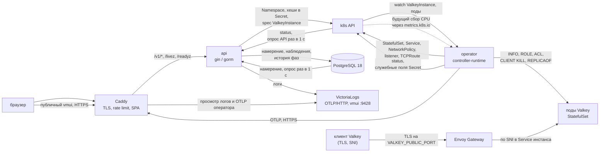
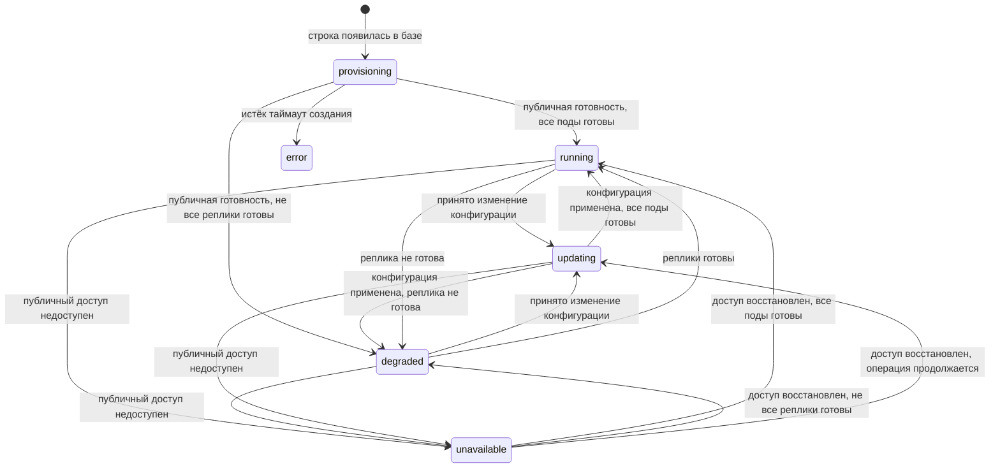

# Managed Valkey для h3llo cloud: план v1

Документ описывает целевую архитектуру и задаёт требования к v1 managed-сервиса Valkey для облака h3llo. Порядок работ, задачи и актуальное состояние реализации ведём в `openspec/changes/`.

Первая часть описывает поведение сервиса, данные и архитектуру. Вторая объясняет выбор решений и их ограничения. Схемы данных, конфигурация инфраструктуры, алгоритмы API и оператора, а также подробные сценарии проверки находятся в [SYSTEM-DETAIL.md](SYSTEM-DETAIL.md). Оба документа составляют ТЗ на v1.

## Текущий этап API Valkey

HTTP API управления инстансами, PostgreSQL-модели, квоты, внутренний сервис аудита, биллинговые периоды и веб-интерфейс управления уже работают. Фоновые процессы API доставляют настройки в Kubernetes и возвращают в PostgreSQL состояние инстанса, состав нод и историю фаз. Они начинают первый проход сразу после запуска, затем повторяют сверку раз в секунду. Тесты API проверяют этот обмен через отдельный однонодовый `k3s` без оператора.

Таблица `valkey_node_metrics`, HTTP API чтения, экран мониторинга, импорт снимков из CR и очистка истории уже работают. CRD принимает `status.metrics`, но оператор пока не собирает и не записывает эти снимки. HTTP API аудита и расчёт месячного расхода также остаются за границами этого этапа. Текущий оператор применяет первоначальную конфигурацию и удаление; выполнение принятого API изменения размера или смены пароля оператором относится к следующему этапу. Приведённые далее описания этих компонентов задают целевую архитектуру.

Недостаток настроенного общего бюджета кластера API обнаруживает в исходном запросе создания: возвращает `422 NOT_ENOUGH_RESOURCES` до записи инстанса. В v1 мы не расширяем кластер автоматически и не принимаем создание в ожидании новых ресурсов. Основные проверки текущей задачи проходят через настоящий TCP HTTP, PostgreSQL и выделенный `k3s`.

## Как устроен сервис

Мы создаём сервис в облаке h3llo, в котором пользователь сможет получить готовый Valkey для своего приложения. Valkey хранит данные в оперативной памяти и используется как кэш. Пользователь выбирает объём ресурсов в веб-интерфейсе и получает адрес подключения и пароль. Запуск и настройку берёт на себя сервис. В первой версии данные не сохраняются на диск: при перезапуске всех узлов выделенного Valkey содержимое кэша теряется.

За создание и изменение настроек отвечают две наши подсистемы. `api` принимает запросы из веб-интерфейса и сохраняет выбранные пользователем настройки в PostgreSQL. Фоновые циклы внутри `api` доставляют их через Kubernetes API в ресурс `ValkeyInstance` и переносят его состояние обратно в базу. Импорт метрик добавляется отдельно.

Этот ресурс Kubernetes называется Custom Resource, сокращённо CR. Его поле `spec` содержит требуемые настройки, а `status` отражает фактическое состояние. Оператор читает `spec`, управляет Valkey и записывает результат в `status`. Доступа к PostgreSQL и API нашего сервиса у оператора нет.

Приложение пользователя подключается к Valkey по выданному адресу. Соединение проходит через шлюз Envoy Gateway: он направляет его к нужному экземпляру Valkey. Уже работающий Valkey может обслуживать запросы при недоступности `api`, PostgreSQL или оператора. Для принятия и доставки новых настроек нужны `api` и PostgreSQL. Уже доставленные настройки применяет оператор через Kubernetes; он же отвечает за восстановление после сбоя. Поэтому доступность работающего кэша и возможность управлять им рассматриваем отдельно.

Созданный пользователем изолированный экземпляр Valkey далее называем инстансом. У каждого инстанса свои учётные данные и ограничения сетевого доступа. Пользователь может работать с данными, а служебное управление сервером остаётся у сервиса. Для приёма соединений и выпуска сертификатов, необходимых для защищённого подключения, используем готовые компоненты. Сами разрабатываем веб-интерфейс, `api` и оператор.

## Оглавление

Часть 1. Спецификация v1

1. [Что получает пользователь](#1-что-получает-пользователь)
2. [Компоненты](#2-компоненты)
3. [Кто с кем разговаривает и где авторизация](#3-кто-с-кем-разговаривает-и-где-авторизация)
4. [Данные](#4-данные-postgresql-18-миграции-goose)
5. [API](#5-api)
6. [Оператор](#6-оператор)
7. [Сеть, домен, TLS, whitelist](#7-сеть-домен-tls-whitelist)
8. [Размеры, цены и квоты](#8-размеры-цены-и-квоты)
9. [Отказоустойчивость и цель по доступности](#9-отказоустойчивость-и-цель-по-доступности)
10. [Аутентификация](#10-аутентификация)
11. [Логи](#11-логи)
12. [Frontend](#12-frontend)
13. [Окружения](#13-окружения)
14. [Тесты, Justfile, CI](#14-тесты-justfile-ci)
15. [Проверить в первый день](#15-проверить-в-первый-день)
16. [Структура репозитория](#16-структура-репозитория)

Часть 2. [Компромиссы и термины](#часть-2-компромиссы-и-термины)

---

# Часть 1. Спецификация v1

## 1. Что получает пользователь


| Возможность           | Как устроено                                                                                                                                                                                                                                                |
| --------------------- | ----------------------------------------------------------------------------------------------------------------------------------------------------------------------------------------------------------------------------------------------------------- |
| Создание инстанса     | Название, DNS-префикс, размер (vCPU и RAM), режим `single` (одна нода) или `ha` (primary и две реплики).                                                                                                                                                    |
| Публичный адрес с TLS | `<slug>.<VALKEY_BASE_DOMAIN>:<VALKEY_PUBLIC_PORT>` для записи и чтения. В `ha` также `<slug>-ro.<VALKEY_BASE_DOMAIN>` для чтения с реплик; в `single` `host_ro=null`. Клиент обязан передавать SNI (раздел 7).                                              |
| Учётная запись        | Пользователь Valkey `app`. Полный пароль показывается один раз после принятия создания или смены пароля; затем только маска вида `jz3f*****`. Права: чтение, запись, очистка собственного кэша, pub/sub, Lua и Functions в пределах ACL (раздел 6).         |
| Смена пароля Valkey   | Доступна в `running` и `degraded`. UI генерирует новый пароль. После применения старый пароль перестаёт работать, прежние соединения `app` закрыты; приложения должны подключиться с новым паролем. Недоступный прежний процесс может задержать завершение. |
| Whitelist             | По IP и подсетям. Включается и выключается отдельным флагом.                                                                                                                                                                                                |
| Изменение размера                | Изменение vCPU и RAM в обе стороны, по одной операции за раз. В `single` любое изменение размера очищает кэш; в `ha` уменьшение RAM очищает кэш, остальные изменения идут по одному поду. UI предупреждает о простое и возможной потере записей.                       |
| Окно maintenance      | Хранится и показывается. В v1 ни на что не влияет.                                                                                                                                                                                                          |
| Метрики               | По каждой ноде. Окна 5 минут, 1 час, 24 часа, 7 дней. Срок хранения задаёт `VALKEY_METRICS_RETENTION`, по умолчанию `168h`; HTTP API читает не глубже семи дней.                                                                                              |
| Аудит                 | Журнал действий по инстансу: когда, кто и что сделал.                                                                                                                                                                                                       |
| Цена                  | В час и в месяц, плюс расход за текущий месяц.                                                                                                                                                                                                              |
| Удаление              | С подтверждением по slug.                                                                                                                                                                                                                                   |
| Аккаунт               | Регистрация по почте и паролю, вход, JWT.                                                                                                                                                                                                                   |
| Квоты                 | На пользователя (по умолчанию 4 vCPU и 16 GB) и на весь кластер (через env).                                                                                                                                                                                |


В v1 нет:

- persistence и бэкапов данных: при перезапуске всех нод инстанса данные теряются;
- сохранности данных при переключении primary и при изменении размера: часть записей может пропасть; уменьшение RAM в `ha` и любое изменение размера `single` очищают кэш;
- приёма денег: цены считаем и показываем, платёжного шлюза и счетов нет;
- восстановления и смены пароля аккаунта, повторного показа пароля Valkey;
- организаций и команд;
- cluster mode, то есть шардирования;
- выбора версии Valkey;
- обновления образа Valkey у существующих инстансов: переносим в v2, включая запуск обновления через общую очередь конфигурации и maintenance;
- настройки параметров Valkey кроме размера;
- отмены и автоматического отката изменения размера: при задержке команда эксплуатации устраняет причину, после чего оператор продолжает ту же операцию; пользователь может дождаться восстановления или удалить инстанс;
- внешней проверки доступности инстансов и отчёта по SLA;
- автоматического восстановления при частичном отказе Envoy и управления его выводом из балансировщика. В v1 сверяем конфигурации двух доступных реплик; неудачная проверка повторяется и при задержке требует вмешательства команды эксплуатации. Обработка сложных случаев относится к v2 (раздел 6);
- бэкапов PostgreSQL и облачной базы;
- резервной реплики оператора и автоматического выключения недоступных worker-нод через API провайдера: без подтверждённого отключения старого primary failover может ждать человека;
- подтверждения почты, приглашений и защиты квот от регистрации нескольких аккаунтов. Регистрация открыта, квота 4 vCPU / 16 GB выдаётся сразу. При отсутствии оплаты несколько аккаунтов могут занять весь кластер.

## 2. Компоненты

Мы пишем три компонента в одном репозитории: `web/`, `api/` и `operator/`.
API и оператор написаны на Go и используют один модуль с `go.mod` в корне.
Каждый собирается в отдельный бинарник и образ. Остальное берём готовым.


| Компонент  | За что отвечает                                                                                                                      | Стек                   | Где работает                                 |
| ---------- | ------------------------------------------------------------------------------------------------------------------------------------ | ---------------------- | -------------------------------------------- |
| `api` | Пользователи, квоты, биллинг, передача выбранных пользователем настроек в CR, сохранение статусов и истории метрик в PostgreSQL, диагностика | Go, gin, gorm, client-go | Виртуалка, compose |
| `operator` | Приводит состояние k8s к заданному в CR, выполняет failover и перекатку, записывает состояние в `status`; сбор метрик ещё не реализован | Go, controller-runtime | Внутри k8s; на dev как процесс хоста |
| `web`      | Интерфейс пользователя                                                                                                               | React, SPA             | Собирается в CI и входит в образ Caddy |


Готовые компоненты, которые ставим, а не пишем: Caddy (TLS, rate limit), Envoy Gateway (вход для клиентов Valkey), cert-manager (wildcard-сертификат), PostgreSQL 18, VictoriaLogs.



`api` принимает запрос на создание инстанса и возвращает HTTP `202` со статусом `provisioning`: запрос сохранён, запуск ещё не завершён. Два независимых фоновых цикла API сразу выполняют первую сверку. Один передаёт выбранные настройки в CR `ValkeyInstance`, второй переносит проверенное оператором состояние и снимки `status.metrics` в PostgreSQL. Следующие проходы каждого цикла планируются раз в секунду и не перекрываются. Отдельный проход сразу и затем раз в 24 часа удаляет просроченные метрики. Оператор по CR создаёт и настраивает объекты Kubernetes. Направления сверки описаны в разделе 6.

Caddy отдаёт собранные файлы SPA и передаёт API только `/v1/*`, `/livez` и `/readyz`. Интерфейс `web` получает статусы и историю метрик через API из PostgreSQL.

## 3. Кто с кем разговаривает и где авторизация

`api` и оператор обмениваются состоянием через Kubernetes API. API записывает `spec` CR и читает его `status`; PostgreSQL доступна только API. Оператор обращается к Kubernetes и Valkey. Экспорт логов в VictoriaLogs выполняется обоими процессами отдельно от обмена состоянием.


| Кто                  | Куда                      | Как                                    | Чем авторизуется                                           |
| -------------------- | ------------------------- | -------------------------------------- | ---------------------------------------------------------- |
| браузер              | Caddy, дальше `api`       | HTTPS 443, интернет                    | JWT в заголовке `Authorization`                            |
| браузер эксплуатации | Caddy, дальше VictoriaLogs vmui | HTTPS 443, `logs.h3llo-demo.com` | временно без авторизации |
| администратор | PostgreSQL | 45432, интернет | пользователь БД и пароль, scram, без TLS |
| `api` | PostgreSQL | 45432, сеть compose | свой пользователь БД, scram, без TLS |
| `api` | VictoriaLogs | OTLP/HTTP 9428, внутренняя сеть compose | без авторизации внутри доверенной сети compose |
| `api` | k8s API | HTTPS, публичный endpoint Managed Kubernetes; на dev `127.0.0.1:6443` | отдельная учётная запись через kubeconfig, проверка CA и права RBAC |
| оператор | Caddy, дальше VictoriaLogs на VM | OTLP/HTTPS 443, `logs.h3llo-demo.com` | временно без авторизации; Caddy пропускает только маршрут OTLP |
| оператор             | k8s API                   | 6443, изнутри кластера; на dev через `127.0.0.1` | in-cluster ServiceAccount; на dev отдельный kubeconfig |
| оператор             | поды Valkey               | 6379, сеть кластера                    | пользователь Valkey `operator` из Secret `<slug>-auth`     |
| реплика              | primary                   | 6379, сеть кластера                    | пользователь Valkey `replica` из того же Secret            |
| клиент Valkey        | Envoy Gateway, дальше под | `VALKEY_PUBLIC_PORT`, интернет         | TLS, пользователь `app` с паролем, whitelist               |


Публичные запросы к API и логам принимает Caddy по HTTPS 443; у шлюза открыт `VALKEY_PUBLIC_PORT`. PostgreSQL опубликован на внешнем порту 45432 и требует пароль БД; TLS для этого подключения пока не настроен. VictoriaLogs на 9428 доступен только внутри сети compose. API обращается к обоим сервисам по этой сети. На VM монтируется kubeconfig отдельной учётной записи для публичного адреса Managed Kubernetes, когда синхронизация включена. Приватной сети и VPN между VM и кластером нет. Оператор отправляет логи через Caddy по HTTPS с проверкой сертификата. Маршруты OTLP и `/select/*` временно доступны без пароля; недоступность этого пути останавливает только экспорт логов.

У `api` есть kubeconfig на dev. На проде синхронизацию можно выключить через `KUBERNETES_SYNC_ENABLED=false`, тогда API запускается без kubeconfig, но не доставляет изменения и не получает состояние или метрики из Kubernetes. HTTP-обработчики не вызывают Kubernetes: включённая фоновая синхронизация использует отдельный клиент и повторяет неудачные операции. API получает следующие права:

| Ресурс | Действия | Зачем |
| ------ | -------- | ----- |
| `namespaces` | create, get, list, watch, patch, delete | Создание и маркировка namespace инстанса, удаление после завершения finalizer CR |
| `valkeyinstances` | create, get, list, watch, update, patch, delete | Доставка `spec`, чтение `status` вместе с CR, запрос удаления; finalizer добавляется при создании CR |
| `secrets` | create, get, update, patch | Доставка версионированных хешей `app` с сохранением остальных полей Secret |

Права разделяем по ответственности: API передаёт выбранные пользователем настройки, а оператор запускает Valkey и отвечает за его работу. Поэтому API не может напрямую управлять запущенными процессами, подключаться к сервисам через прокси Kubernetes или менять записанное оператором состояние инстанса. При обновлении настроек API сохраняет служебные отметки оператора, в том числе запрет на завершение удаления до остановки Valkey. Права Kubernetes позволяют API менять эти отметки, поэтому их сохранение обеспечивает наш код.

Для каждого нового инстанса API создаёт отдельное пространство в Kubernetes (namespace). Чтобы API мог работать и с будущими инстансами без ручной выдачи прав, его учётной записи даём перечисленные выше права во всём кластере. Названия и метки пространств сами по себе не ограничивают этот доступ. Перед изменением API проверяет, что объект относится к нужному инстансу. Это проверка в нашем коде: при ошибке в ней или компрометации учётной записи могут пострадать другие инстансы.

Для обновления пароля пользователя API читает и изменяет объект Kubernetes Secret, где вместе с хешем этого пароля хранятся служебные пароли оператора. Такое устройство хранилища даёт API техническую возможность прочитать и служебные пароли. API не сохраняет их в PostgreSQL и не передаёт клиентам, но полной изоляции этих паролей от API в v1 нет.

Оператор использует in-cluster ServiceAccount на проде и отдельный kubeconfig на dev. Его права:


| Ресурс                                                                 | Действия                                        | Зачем                                                                        |
| ---------------------------------------------------------------------- | ----------------------------------------------- | ---------------------------------------------------------------------------- |
| `namespaces` | get, list, watch | Наблюдение namespace инстансов; создаёт и удаляет их API |
| `valkeyinstances` | get, list, watch, update, patch | Чтение CR, finalizers и служебные аннотации; оператор не меняет `spec` |
| `valkeyinstances/status` | get, update, patch | Наблюдения, стадии операций и последние метрики |
| `secrets`, `configmaps`, `statefulsets`, `services`, `networkpolicies` | create, get, list, watch, update, patch, delete | Объекты инстанса                                                             |
| `poddisruptionbudgets`                                                 | create, get, list, watch, update, patch, delete | Ограничение добровольных выселений подов `ha`                                |
| `pods`                                                                 | get, list, watch, patch, delete                 | Метки ролей, управляемая замена подов после подтверждения остановки          |
| `endpointslices`                                                       | get, list, watch                                | Проверка маршрутизации к текущим подам                                       |
| `certificates` в `valkey-system`                                       | get, list, watch                                | Готовность wildcard-сертификата на проде                                     |
| `nodes`                                                                | get, list, watch                                | Состояние worker-нод                                                         |
| `events`                                                               | create, patch                                   | k8s Events на CR                                                             |
| `tcproutes`, `securitypolicies`                                        | create, get, list, watch, update, patch, delete | Маршруты и whitelist                                                         |
| `gateways` в `valkey-system`                                           | get, list, watch, update, patch                 | Listener на инстанс                                                          |
| `clienttrafficpolicies` в `valkey-system`                              | get, list, watch                                | Проверка общей политики TCP-соединений                                       |
| `leases` в `valkey-system`                                             | все                                             | Leader election                                                              |
| `pods.metrics.k8s.io`                                                  | get, list                                       | CPU подов                                                                    |
| `pods/portforward` в namespace Envoy                                   | create                                          | Чтение локального admin API Envoy для подтверждения загруженной конфигурации |


Строки с указанным namespace выдаются через Role/RoleBinding в этом namespace; ClusterRole не ограничивает доступ namespace по меткам. Оператор — доверенный кластерный компонент. Его общий доступ к Secret позволяет прочитать и чужие служебные секреты, в том числе токен Cloudflare cert-manager. Namespace и ACL изолируют пользователей инстансов, но не защищают от компрометации оператора. Доступ ко всем Secret не зависит от права `pods/portforward` и сохраняется при его удалении.

Для `app` PostgreSQL хранит только SHA-256 пароля и первые четыре символа для маски. API доставляет хеши по версиям в Secret `<slug>-auth`. Оператор при первоначальном запуске создаёт в этом Secret пароли `operator`, `replica` и `health`, затем формирует `users.acl`. При дальнейших обновлениях служебные пароли сохраняются. API меняет только доставляемые хеши, оператор управляет служебными полями и очисткой предыдущего хеша по правилам раздела 6. Служебные пароли существуют только в Kubernetes Secret; общего с API ключа шифрования нет. Пароли и хеши не входят в CR, ответы API и логи. Все служебные пароли генерируются CSPRNG: 24 случайных байта, base64url без padding; пароль каждой учётной записи генерируется независимо.

На проде оператор работает в StatefulSet внутри k8s h3llo: одна реплика, `updateStrategy: OnDelete`, служебный headless Service и leader election. К конкретной worker-ноде он не привязан. После падения процесса или обычного удаления пода Kubernetes автоматически запускает оператор заново. После удаления worker-ноды через ЛК он создаёт замену на другой ноде, когда облако удалит прежний объект Node. Здесь доверяем порядку: сначала уничтожение VM, затем удаление Node. При потере связи с существующей нодой перенос может ждать её возврата или ручного подтверждения отключения. Принудительно удалять под оператора или объект Node при неподтверждённой остановке VM запрещено. Обновление оператора также проходит с остановкой единственного пода. Правила основаны на [ограничениях StatefulSet](https://kubernetes.io/docs/tasks/run-application/force-delete-stateful-set-pod/).

Lease хранит владельца права управления и срок его действия; активный оператор регулярно продлевает эту запись в Kubernetes. При потере Lease оператор прекращает изменяющие команды, закрывает свои соединения и завершает процесс. Отмена вызова не отзывает уже отправленную команду. [Leader election в client-go](https://pkg.go.dev/k8s.io/client-go/tools/leaderelection) сам по себе не гарантирует единственного действующего лидера. Порядок приёма управления новым процессом описан в [алгоритмах оператора](SYSTEM-DETAIL.md#три-цикла); один лишь истёкший Lease не разрешает запуск второй копии, пока первая может быть жива. Замена оператора может занять минуты, мгновенного восстановления в v1 нет. На dev оператор запускается одной копией на хосте с отдельным kubeconfig. При смене способа запуска сначала останавливают прежнюю копию.

## 4. Данные (PostgreSQL 18, миграции goose)

### Общие правила

- Первичные ключи — `uuid` версии 7: в Go `uuid.NewV7()`, в базе `default uuidv7()`, функция в PostgreSQL 18 встроенная. Ключ растёт со временем, поэтому новые вставки группируются в индексе по времени. Для точного порядка событий используем явные временные колонки.
- Всё время в UTC, тип колонок `timestamptz`. Часовой пояс приложения не меняем.
- Булевы колонки называются с `is_` или `has_`.
- Имена таблиц самого сервиса начинаются с `valkey_`, пути API с `/v1/managed/valkey`. Для второго managed-сервиса будут свои имена таблиц и пути; переименовывать существующие не потребуется.
- Миграции PostgreSQL только аддитивные: колонку нельзя удалить или переименовать, пока её читает работающая версия `api`. Оператор от схемы БД не зависит. Схема CRD должна быть совместима с API и оператором; новые поля добавляются до выкладки использующего их кода. Порядок выкатки: миграции PostgreSQL и CRD, оператор, `api`.

### Таблицы


| Таблица                        | Кто пишет                                                   | Зачем                                |
| ------------------------------ | ----------------------------------------------------------- | ------------------------------------ |
| `users`                        | `api`                                                       | Аккаунты                             |
| `user_quotas`                  | `api` при регистрации, затем меняется вручную               | Лимит vCPU и RAM на пользователя     |
| `valkey_instances` | `api`: обработчики записывают намерение, фоновая синхронизация записывает наблюдения | Инстансы |
| `valkey_instance_nodes` | фоновая синхронизация `api` | Роли и состояние подов |
| `valkey_node_metrics` | фоновая синхронизация `api` | Метрики подов; срок хранения задаёт `VALKEY_METRICS_RETENTION`, по умолчанию `168h`, а HTTP API читает не глубже семи дней |
| `valkey_instance_phase_events` | фоновая синхронизация `api` | История фаз для разбора инцидентов |
| `billing_periods`              | `api`                                                       | Отрезки тарификации                  |
| `idempotency_keys`             | `api`                                                       | Ответы на повторные запросы, 24 часа |
| `auth_registration_keys`       | `api`                                                       | Ключи повторной регистрации, 24 часа |
| `audit_logs`                   | `api`                                                       | Кто и что сделал                     |


### Настройки и наблюдаемое состояние

В `valkey_instances` API хранит две группы данных. HTTP-обработчики записывают выбранные пользователем настройки и запросы на изменение; далее называем их намерением. Фоновая синхронизация переносит из CR результаты проверок оператора; далее называем их наблюдениями. Каждая сторона обновляет только свои поля, чтобы устаревшее наблюдение не затёрло новый размер или пароль.

`desired_generation` хранит номер принятой конфигурации, `observed_generation` — номер полностью применённой. Такой номер называем поколением. Оно растёт при изменении размера, изменении whitelist или пароля. Пока номера отличаются, интерфейс показывает «Применяется», а API не принимает следующее изменение конфигурации. Имя и maintenance поколение не меняют. Версии `password_version` и `applied_password_version` отдельно отмечают принятие и завершение смены пароля.

Оператор подтверждает применение после проверки фактического результата. Одна запись настроек в CR ещё ничего не подтверждает. До окончания изменения размера база хранит и выбранный, и фактически применённый размер; квоту считаем по большему из них. Удаляемый инстанс занимает квоту до подтверждения освобождения ресурсов.

Фаза показывает состояние инстанса, а `observed_at` — когда оператор его проверил. Если наблюдения нет или оно старше 60 секунд, API возвращает `is_stale=true`. Повторное чтение старого CR не делает состояние свежим. Результат проверки конфигурации Envoy хранится отдельно: недоступность его admin API сама по себе не делает наблюдения Valkey устаревшими.

При чтении API сначала проверяет подтверждённое удаление (`deleted_at`), затем запрос удаления (`deletion_requested_at`), и только потом фазу оператора. Поэтому запоздалый статус `running` не отменит удаление. В ответах API есть состояние, версии и маска пароля; хеш пароля и служебные секреты наружу не выдаются.

История биллинга хранит периоды с зафиксированной ценой: новый тариф действует с принятия изменения размера, тарификация заканчивается с запроса удаления. История фаз помогает разбирать инциденты, но не измеряет доступность для клиента. Аудит отдельно фиксирует автора и принятое действие. Срок хранения метрик задаёт `VALKEY_METRICS_RETENTION`, по умолчанию `168h`. HTTP API независимо ограничивает чтение последними семью днями. Ответы для идемпотентных повторов хранятся 24 часа.

[Колонки, индексы и правила записи данных](SYSTEM-DETAIL.md#схема-postgresql).

### Фазы инстанса

Оператор проверяет состояние инстанса и записывает его в поле `status.phase` ресурса Kubernetes (CR). Фоновый цикл API копирует это значение в колонку `phase` PostgreSQL, откуда статус получает интерфейс. Статусы удаления API определяет сам: `deleting` означает, что удаление запрошено, а `deleted` — что оно завершено.

Перед тем как признать инстанс готовым, оператор убеждается, что основной сервер (primary) отвечает, а клиентская учётная запись настроена с актуальным паролем и нужными правами (ACL). Он также проверяет, что Kubernetes направляет трафик к нужному процессу, шлюз применил маршруты и правила whitelist, а TLS-сертификат действует. Далее это называем публичной готовностью; полный порядок приведён в [алгоритме проверки готовности](SYSTEM-DETAIL.md#readiness-и-публичная-готовность).

Проверки выполняются изнутри кластера. Они подтверждают готовность компонентов и настроек, но не измеряют доступность инстанса из интернета для расчёта SLA. Например, готовый инстанс с включённым пустым whitelist намеренно запрещает подключения всем клиентам.




| Фаза           | Что означает                                                                                                                                                                           |
| -------------- | -------------------------------------------------------------------------------------------------------------------------------------------------------------------------------------- |
| `provisioning` | Оператор ещё не подтвердил первоначальную публичную готовность. Одного ответа primary на `PING` для этого недостаточно.                                                                |
| `running`      | Публичная конфигурация готова, primary отвечает; в `ha` все реплики синхронизированы. Нет незавершённого изменения.                                                                    |
| `updating`     | Публичный доступ работает, идёт применение размера, пароля или whitelist. Имеет приоритет над `degraded`, пока операция не завершена.                                                  |
| `degraded`     | Только `ha`: публичный доступ к primary работает, хотя бы одна реплика не готова, активной операции нет. Адрес `-ro` может быть недоступен, если не осталось готовых реплик.           |
| `unavailable`  | Ранее созданный инстанс потерял публичный доступ, в том числе из-за primary, маршрута или сертификата. Оператор восстанавливает его или ждёт подтверждения остановки старого процесса. |
| `error`        | Только при первоначальном создании: публичная готовность не достигнута до таймаута. Объекты остаются для разбора; инстанс можно только удалить.                                        |


Когда инстанс впервые проходит проверку публичной готовности, оператор устанавливает в CR `initialized=true`. После этого инстанс уже не возвращается в `provisioning` или `error`: сбои работающего инстанса отражаются другими фазами.

Флаг `credentialsInitialized` относится к более раннему шагу: служебные пароли сохранены, можно запускать поды. Сам по себе этот флаг не означает готовности инстанса и не отменяет таймаут создания. Изменения фаз API сохраняет в `valkey_instance_phase_events` по правилам этой таблицы. Для восстановления из `unavailable` и `degraded` общего предельного времени нет.


| Условие                                                                                      | `phase_reason`         | Фаза                                                                                                                                  |
| -------------------------------------------------------------------------------------------- | ---------------------- | ------------------------------------------------------------------------------------------------------------------------------------- |
| Первоначальный primary в `Pending/Unschedulable` дольше `config.UnschedulableTimeout`        | `NOT_ENOUGH_RESOURCES` | `error`                                                                                                                               |
| Публичная конфигурация не готова за `config.ProvisionTimeout` от создания CR                 | `PROVISIONING_TIMEOUT` | `error`                                                                                                                               |
| Kubernetes не может разместить под primary уже созданного инстанса, в том числе `single` при изменении размера                   | `NOT_ENOUGH_RESOURCES` | `unavailable`                                                                                                                         |
| Kubernetes не может разместить под реплики                                                                       | `NOT_ENOUGH_RESOURCES` | `updating` при операции, иначе `degraded` после первоначальной публичной готовности                                                   |
| Worker-нода недоступна дольше `config.NodeUnreachableTimeout`                               | `NODE_LOST`            | `unavailable`, если нет primary; иначе `updating` или `degraded`                                                                      |
| Нет подтверждения изоляции старого primary                                                   | `FENCING_REQUIRED`     | `unavailable`                                                                                                                         |
| Идёт подтверждённое переключение                                                             | `FAILOVER`             | `unavailable` до готовности нового primary                                                                                            |
| Потеряна готовность маршрута, политики или TLS                                               | `NETWORK_NOT_READY`    | `unavailable`; сам по себе сбой шлюза не запускает failover                                                                           |
| Primary отвечает `BUSY` и не обслуживает обычные команды                                     | `SCRIPT_BUSY`          | `unavailable`; оператор обрабатывает зависший скрипт, не считает ответ сетевым отказом                                                |
| Процесс уже созданного инстанса не отвечает, его контейнер не готов на доступной worker-ноде | `PROCESS_UNRESPONSIVE` | `unavailable` для primary; для реплики `updating` при операции, иначе `degraded`. После порога оператор запрашивает штатную остановку |
| Primary загружает данные и отвечает `LOADING`                                                | `DATA_LOADING`         | `unavailable` у созданного инстанса; оператор ждёт загрузки. Один ответ не разрешает продвижение реплики                              |
| Служебная авторизация Valkey не проходит                                                     | `AUTH_FAILED`          | `unavailable`, если нельзя подтвердить primary; требуется диагностика Secret/ACL. Ошибка авторизации не запускает сетевой failover    |


При нескольких причинах выбирается причина, которая блокирует публичный доступ; подробности остаются в условиях состояния (`conditions`) CR и событиях Kubernetes (`Events`). Таймаут создания отсчитывается от `creationTimestamp` CR. Время между записью запроса в PostgreSQL и созданием CR в этот отсчёт не входит.

Удаление не имеет таймаута. Если запрос старше 10 минут, а `deleted_at` ещё нет, UI показывает «удаление затянулось, напишите в поддержку». Намерение удалить сохраняется. В `error` UI также предлагает поддержку и удаление; тарификация продолжается по правилам раздела 4.

## 5. API

Префикс `/v1`, формат JSON, авторизация `Authorization: Bearer <jwt>`. Всё, что относится к Valkey, лежит под `/v1/managed/valkey`, потому что у следующего сервиса будет собственный путь. Интерфейс и API доступны на одном домене `app.h3llo-demo.com`: `api` отдаёт статику SPA на любой путь вне `/v1`, поэтому CORS не нужен.


| Метод    | Путь                                                   | Вход                                                                           | Ответ                                                                                        |
| -------- | ------------------------------------------------------ | ------------------------------------------------------------------------------ | -------------------------------------------------------------------------------------------- |
| `POST`   | `/v1/auth/check-email`                                 | `{email}`                                                                      | `{exists}`                                                                                   |
| `POST`   | `/v1/auth/register`                                    | `{email, password}`                                                            | `{token}`                                                                                    |
| `POST`   | `/v1/auth/login`                                       | `{email, password}`                                                            | `{token}`                                                                                    |
| `GET`    | `/v1/me`                                               |                                                                                | `{user: {id, email}, quota, usage}`                                                                       |
| `GET`    | `/v1/billing/usage`                                    | `?month`                                                                       | расход по ресурсам и итог                                                                    |
| `GET`    | `/v1/managed/valkey/sizes`                             |                                                                                | полная допустимая сетка и цены                                                                         |
| `GET`    | `/v1/managed/valkey/instances`                         |                                                                                | список                                                                                       |
| `POST`   | `/v1/managed/valkey/instances`                         | `{name, prefix, mode, vcpu, ram_gb, password, is_whitelist_enabled?, whitelist_cidrs?}`, обязательный `Idempotency-Key` | `202` + instance без пароля                                                                  |
| `GET`    | `/v1/managed/valkey/instances/{id}`                    |                                                                                | instance                                                                                     |
| `PATCH`  | `/v1/managed/valkey/instances/{id}`                    | `{name?, maintenance?}`                                                        | instance                                                                                     |
| `POST`   | `/v1/managed/valkey/instances/{id}/resize`             | `{vcpu, ram_gb}`, обязательный `Idempotency-Key`                               | `202` + instance; `200` для текущего размера                                                 |
| `PUT`    | `/v1/managed/valkey/instances/{id}/whitelist`          | `{is_enabled, cidrs[]}`                                                        | instance                                                                                     |
| `GET`    | `/v1/managed/valkey/instances/{id}/credentials`        |                                                                                | `{host, host_ro, port, username, password_hint, password_version, applied_password_version}` |
| `POST`   | `/v1/managed/valkey/instances/{id}/credentials/rotate` | `{password, expected_password_version}`, обязательный `Idempotency-Key`        | `202` + метаданные credentials без пароля                                                    |
| `GET`    | `/v1/managed/valkey/instances/{id}/metrics`            | `?range` или `?from&to`                                                       | ряды по нодам                                                                                |
| `GET`    | `/v1/managed/valkey/instances/{id}/audit`              | `?limit&before`                                                                | `{items, next_cursor}`                                                                       |
| `DELETE` | `/v1/managed/valkey/instances/{id}`                    |                                                                                | `202`, идемпотентно                                                                          |


### Владелец инстанса

Все пути с `{id}` проходят через один middleware: он ищет инстанс по паре `(id, user_id из JWT)` и на чужой или несуществующий инстанс отвечает `404 NOT_FOUND`. Обработчики получают проверенный инстанс из middleware и не повторяют проверку владельца. Это относится в том числе к `credentials` и `metrics`.

`credentials` отдаёт `username: "app"` и маску. Полного пароля и хеша нет ни в одном ответе API, включая создание и повтор по `Idempotency-Key`.

### Расход за месяц

`GET /v1/billing/usage?month=YYYY-MM` принимает календарный месяц UTC; по умолчанию текущий. Неверный формат даёт `VALIDATION_FAILED`. Для каждой строки берётся пересечение `[started_at, ended_at)` с `[начало месяца, начало следующего месяца)` и временем до `now()`. У открытого периода вместо `ended_at` берётся `now()`. Пустое пересечение даёт ноль, поэтому будущий месяц пустой, а граница месяцев не оплачивается дважды.

Длительность считается с точностью PostgreSQL до микросекунды, без округления до минут или часов. Для ресурса складываются точные значения `длительность_мкс * price_coins_per_hour / 3_600_000_000`, затем сумма округляется до копейки по half-up. Итог равен сумме округлённых расходов ресурсов. Расчёт использует целые числа и decimal/рациональную арифметику, не `float64`.

### Метрики

`range` принимает `5m`, `1h`, `24h`, `7d`, по умолчанию `1h`. Для произвольного окна есть `from` и `to`; окно не шире 7 дней, и HTTP API не возвращает данные старше семи дней. Интервал агрегации (корзина) выбирается из таблицы по ближайшей ширине окна. API агрегирует данные при чтении, чтобы сократить число точек на графике:


| range | корзина            | точек |
| ----- | ------------------ | ----- |
| 5m    | 10 с, сырые строки | 30    |
| 1h    | 1 мин              | 60    |
| 24h   | 5 мин              | 288   |
| 7d    | 30 мин             | 336   |

Успешный ответ имеет одну форму:

```json
{
  "from": "2026-09-09T09:00:00Z",
  "to": "2026-09-09T09:05:00Z",
  "step_seconds": 10,
  "nodes": [
    {
      "ordinal": 0,
      "name": "cache-a1b2c3-0",
      "role": "primary",
      "points": [
        {
          "collected_at": "2026-09-09T09:00:00Z",
          "used_memory_bytes": 805306368,
          "cpu_millicores": 125.5,
          "connected_clients": 12,
          "ops_per_sec": 740.5,
          "keyspace_hits": 680,
          "keyspace_misses": 9,
          "evicted_keys": 0
        }
      ]
    }
  ]
}
```

`role` принимает `primary`, `replica` или `unknown`. Пустой результат содержит `"nodes": []`. Поля `run_id` и `maxmemory_bytes` остаются внутренними и в JSON не попадают.

Для `used_memory_bytes`, `connected_clients`, `ops_per_sec` и `cpu_millicores` в корзине берётся среднее. Для счётчиков (`keyspace_hits`, `keyspace_misses`, `evicted_keys`) отдаётся прирост за корзину, чтобы график показывал изменение за интервал. Прирост считается внутри одного `run_id`: при перезапуске Valkey счётчики обнуляются, и разность между соседними строками с разными `run_id` не считается, а заменяется значением новой строки. Пропуски в данных остаются пропусками, интерполяции и заполнения нулями нет. Среднее считает только доступные значения; корзина без строк или без значений конкретной метрики возвращает `null` для неё, и график показывает разрыв. Ряд отдаётся по каждой ноде отдельно, с её ролью на конец окна. Запрос `GET /v1/managed/valkey/instances/{id}/metrics` читает PostgreSQL после проверки владельца инстанса; чужой ID даёт `404 NOT_FOUND`.

### Аудит

`GET /v1/managed/valkey/instances/{id}/audit` отдаёт строки `audit_logs` этого инстанса, новые сверху: `id`, `action`, `user_email`, `created_at`. Порядок: `created_at DESC, id DESC`. `limit` от 1 до 200, по умолчанию 50. Ответ содержит `items` и `next_cursor`; когда следующей страницы нет, `next_cursor=null`. Клиент передаёт полученный курсор в `before` без разбора. Курсор кодирует JSON `{created_at, id}` в base64url без padding, сохраняя микросекунды времени. Следующая страница выбирает строки с `(created_at, id) < (время, id из курсора)`. Для определения продолжения сервер читает `limit + 1` строк; курсор строит по последней возвращённой строке. Неверный курсор даёт `400 VALIDATION_FAILED`. Одинаковое время событий не приводит к пропускам или повторам. Владельца проверяет тот же middleware, что и на остальных путях с `{id}`, поэтому чужой журнал даёт `404 NOT_FOUND`.

Действия с аккаунтом (`user.register`, `user.login`) в таблицу пишутся, но экрана для них в v1 нет: их читают запросом к базе.

### Идемпотентность

Здесь идемпотентность означает, что повтор того же запроса с тем же `Idempotency-Key` не выполняет изменение второй раз. Это относится к регистрации, созданию инстанса, изменению размера и смене пароля. Это нужно, когда API уже сохранил изменение, но клиент не получил ответ из-за обрыва соединения.

Для регистрации `auth_registration_keys` хранит только ключ, пользователя и время создания. При повторе API сверяет нормализованную почту и пароль с данными пользователя и выпускает новый JWT, ничего не создавая. Тот же ключ с другими учётными данными получает `422 IDEMPOTENCY_MISMATCH`. Тело запроса, его отпечаток и JWT в этой таблице не хранятся.

Для создания инстанса, изменения размера и смены пароля `idempotency_keys` хранит ключ, отпечаток запроса (метод, путь, тело) и ответ 24 часа. Повтор с тем же ключом и отпечатком возвращает сохранённый ответ. Тот же ключ с другим отпечатком получает `422 IDEMPOTENCY_MISMATCH`. Ключ проверяется и записывается в одной транзакции с изменением. Авторизация и проверка владельца идут до поиска ответа; найденный успешный повтор возвращается до проверки текущей фазы и занятой операции. Иначе принятое изменение размера само заблокировало бы свой повтор.

Правила на клиенте: ключ генерируется, когда пользователь нажимает «создать» или «изменить», и переиспользуется только для автоматических повторов той же отправки. Если пользователь исправил форму и отправил снова, нужен новый ключ. Соединение может оборваться после того, как сервер выполнил запрос: клиент получит таймаут и повторит отправку. Это возможно и при доступе через VPN, который пользователи в РФ используют для обхода блокировок (часть 2).

Остальные методы идемпотентны сами по себе: `PUT` и `PATCH` заменяют значения, а `DELETE` на инстансе с `deletion_requested_at` отвечает `202` без действий.

### Ошибки

Один формат для всех ответов с кодом 4xx и 5xx:

```json
{"error": {"code": "QUOTA_EXCEEDED", "message": "...", "details": {"max_vcpu": 4, "requested": 6}}}
```


| Код                     | HTTP | Когда                                                                                                    |
| ----------------------- | ---- | -------------------------------------------------------------------------------------------------------- |
| `VALIDATION_FAILED`     | 400  | Тело или параметры не прошли проверку                                                                    |
| `UNAUTHORIZED`          | 401  | Нет или недействителен JWT, либо аккаунт заблокирован                                                    |
| `NOT_FOUND`             | 404  | Ресурс не найден или принадлежит другому пользователю                                                    |
| `CONFLICT`              | 409  | Конфликт состояния                                                                                       |
| `INSTANCE_NOT_READY`    | 409  | Фаза не разрешает операцию, наблюдение устарело или начато удаление                                      |
| `OPERATION_IN_PROGRESS` | 409  | Предыдущее изменение размера, whitelist или пароля ещё не подтверждено оператором                        |
| `IDEMPOTENCY_MISMATCH`  | 422  | Тот же ключ с другим запросом                                                                            |
| `QUOTA_EXCEEDED`        | 422  | Превышена квота пользователя                                                                             |
| `NOT_ENOUGH_RESOURCES`  | 422  | Превышена квота кластера; тот же код стоит в причине фазы                                                |
| `RATE_LIMITED`          | 429  | Лимит auth-запросов в `api`; `details.retry_after` и заголовок `Retry-After` содержат секунды до повтора |
| `INTERNAL`              | 500  | Внутренняя ошибка                                                                                        |


Реализация: пакет `api/internal/apierr`, тип `Error{Code, HTTPStatus, Message, Details}`, коды константами. Доменный код возвращает `apierr.Error`, один middleware превращает его в ответ. Внутри кода проверка идёт через `errors.Is` и `errors.As`. На фронте те же коды объявлены в TypeScript-перечислении, рядом словарь текстов по коду.

Текст `NOT_ENOUGH_RESOURCES` зависит от источника: ошибка API означает «Недостаточно свободной квоты кластера», а `phase_reason` с этим кодом означает «Под ожидает размещения: проверьте ресурсы и ограничения нод». UI не смешивает отказ принять запрос с задержкой уже принятой операции.

`api` возвращает `429 RATE_LIMITED` в общем формате. Caddy может отклонить запрос раньше и вернуть `429` без этого тела. Клиент понимает оба варианта: использует `retry_after`/`Retry-After`, а если их нет, предлагает повторить через минуту.

### Общая блокировка на изменения ресурсов

Создание, изменение имени и maintenance, изменение размера, смена пароля, изменение whitelist и удаление используют одну блокировку PostgreSQL: `SELECT pg_advisory_xact_lock(1)`. Ключ `1` обозначает общую блокировку операций сервиса, а не ID пользователя или инстанса. API удерживает её только на время транзакции в базе. Запуск Valkey и применение настроек происходят позже, без этой блокировки.

Общая блокировка нужна прежде всего для квот. Два пользователя могут одновременно запросить последние свободные ресурсы кластера. Если каждый проверит квоту до записи другого, оба запроса пройдут проверку и вместе превысят лимит. Блокировка заставляет API последовательно проверять квоту и сохранять принятые изменения. Заодно она исключает одновременное принятие двух изменений конфигурации одного инстанса.

`SELECT ... FOR UPDATE` блокирует выбранные строки. Блокировки строки конкретного инстанса здесь недостаточно: квота считается по всему кластеру, а при создании строки нового инстанса ещё нет. Можно было бы завести отдельную общую строку и блокировать её, но в v1 для этой цели используем advisory lock. Все перечисленные обработчики должны брать один и тот же ключ: PostgreSQL сам не связывает эту блокировку с таблицами. Блокировка автоматически освобождается при коммите или откате транзакции. [Блокировки PostgreSQL](https://www.postgresql.org/docs/18/explicit-locking.html).

После получения блокировки API заново читает строку существующего инстанса. Данные, которые middleware прочитал при проверке владельца, могли измениться за время ожидания.

Для временных отметок принятого изменения API один раз получает `clock_timestamp()` PostgreSQL уже после получения блокировки. Одно значение используется для `updated_at`, границы биллинговых периодов и времени соответствующей операции. Так закрытие старого периода и открытие нового имеют одну временную границу.

Часы PostgreSQL выбраны как общий источник времени для этих записей. `time.Now().UTC()` читает часы машины API; перевод в UTC меняет часовой пояс, но не синхронизирует их с часами базы. `now()` PostgreSQL тоже не подходит для этого места: он возвращает время начала транзакции, которая могла долго ждать блокировку. Тогда более позднее изменение могло бы получить отметку раньше предыдущего. `clock_timestamp()` возвращает время самого вызова. [Временные функции PostgreSQL](https://www.postgresql.org/docs/18/functions-datetime.html#FUNCTIONS-DATETIME-CURRENT).

Успешный идемпотентный повтор возвращает сохранённый ответ. Запрос уже выбранного размера или того же whitelist возвращает текущие данные без новой операции, даже если эти настройки ещё применяются. После начала удаления такие изменения отклоняются.

Новое изменение размера, whitelist или пароля допускается только после завершения предыдущего, в подходящей фазе и при свежем наблюдении. Имя и окно maintenance можно править независимо от активной операции до начала удаления. Удаление разрешено при любой фазе и незавершённой операции.

Поколение конфигурации и версия пароля описаны в [разделе о данных](#настройки-и-наблюдаемое-состояние). При смене пароля растут оба счётчика; при изменении размера и изменении whitelist растёт только поколение. По `configuration_requested_at` интерфейс и диагностика определяют, сколько длится применение настроек.

[Точный порядок проверок, записи времени и обновления версий](SYSTEM-DETAIL.md#общая-блокировка-на-изменения-ресурсов).

### Создание инстанса по шагам

UI генерирует пароль и отправляет запрос с `Idempotency-Key` и начальным whitelist. API проверяет параметры и квоты, затем одной транзакцией сохраняет инстанс, записывает аудит через общий сервис, открывает биллинговый период и запоминает ответ для повторов. Если общий бюджет кластера исчерпан, исходный запрос сразу получает `422 NOT_ENOUGH_RESOURCES` без этих записей. Полный пароль на сервере не сохраняется.

Ответ `202` означает, что создание принято. UI один раз показывает пароль с подписью «Инстанс создаётся». Фоновая синхронизация доставляет настройки в Kubernetes, оператор запускает Valkey и подтверждает готовность. При сбое доставки запрос остаётся в PostgreSQL и будет повторён после восстановления. Таймаут создания отсчитывается от появления CR.

[Валидация, начальные значения и порядок записи при создании](SYSTEM-DETAIL.md#создание-инстанса-по-шагам).

### Изменение размера

Новое изменение размера разрешено только в `running` или `degraded`, со свежим наблюдением и без незавершённого изменения конфигурации. Повторное изменение размера до подтверждения предыдущего запрещено, включая состояние после уменьшения, когда запрошенный размер уже меньше, а старые поды ещё занимают ресурсы.

Под общей блокировкой `api` проверяет квоты с учётом `max(новый размер, applied_*)` для изменяемого инстанса и `max(desired, applied)` для остальных, закрывает текущий биллинговый период и открывает новый, меняет размер и увеличивает `desired_generation`. Оператор фиксирует целевое поколение и размер в `status.rollout` до изменения StatefulSet. `applied_*` меняется только после полной перекатки. Следующее изменение размера станет доступно после записи подтверждения в PostgreSQL.

В `single` любое изменение размера означает простой и пустой кэш. В `ha` уменьшение RAM также очищает весь кэш; остальные изменения перекатываются по одному поду. При переключении primary возможна потеря последних записей. UI показывает соответствующее предупреждение перед подтверждением.

UI также предупреждает: у принятого изменения размера нет отмены или автоматического отката; новый тариф действует с принятия запроса, даже если перекатка задержалась. После 10 минут ожидания карточка показывает причину и предлагает обратиться в поддержку. Команда эксплуатации устраняет причину, оператор продолжает то же изменение размера (раздел 6). Пользователь может ждать или удалить инстанс; второе изменение размера для выхода из зависшей операции недоступно в v1.

### Whitelist

`PUT /v1/managed/valkey/instances/{id}/whitelist` разрешён в `running` и `degraded`, со свежим наблюдением и без незавершённого изменения конфигурации. `api` нормализует CIDR и удаляет дубликаты, сохраняет список и флаг одной транзакцией, увеличивает `desired_generation`. Оператор подтверждает поколение после применения или удаления политик на обоих маршрутах `ha` либо единственном маршруте `single`. UI показывает «Применяется», пока поколения отличаются.

### Одноразовый показ и смена пароля Valkey

UI генерирует 24 случайных байта через Web Crypto `crypto.getRandomValues` и кодирует base64url без padding: 32 символа `[A-Za-z0-9_-]`. API принимает только этот формат; сторонний API-клиент обязан использовать CSPRNG с той же энтропией. Задание собственного пароля в v1 не поддерживаем.

На проде пароль передаётся в JSON только по HTTPS; HTTP допустим только на localhost локального dev-стенда. `api` использует его в памяти для хеша и маски; исходный пароль не сохраняется ни открыто, ни обратимо зашифрованным. Обычные ответы API возвращают маску вроде `jz3f*****`. Хеш SHA-256 нужен Valkey ACL; bcrypt остаётся только для пароля аккаунта.

Создание и смена пароля показывают полный пароль только после `202` (включая успешный повтор). Окно содержит кнопку копирования и предупреждение о невозможности повторного просмотра. Закрытие окна, уход со страницы или перезагрузка убирают пароль из состояния UI. Пароль не попадает в localStorage, sessionStorage, IndexedDB, URL, историю роутера и аналитику. Сгенерированное значение до ответа также хранится только в памяти. UI очищает его также на `pagehide` и не восстанавливает при возвращении из bfcache. Поздний повтор ответа не открывает уже закрытое окно заново. Копирование в буфер обмена выполняется только по действию пользователя.

При сетевой ошибке UI повторяет тот же запрос с тем же паролем и ключом, пока они есть в памяти. Потерянный после перезагрузки пароль получить нельзя: UI предлагает дождаться завершения операции и сменить пароль. Сервер не имеет отдельного endpoint для повторной выдачи.

Кнопка «Сменить пароль» доступна в `running` и `degraded`, при свежем наблюдении, равных поколениях и отсутствии удаления. До отправки UI предупреждает: «Все подключения Valkey будут закрыты. Обновите пароль в приложениях». Он генерирует новое значение и вызывает `POST /v1/managed/valkey/instances/{id}/credentials/rotate` с `{password, expected_password_version}` и новым `Idempotency-Key`.

Под общей блокировкой `api` проверяет условия и ожидаемую версию. Если `expected_password_version != password_version`, отвечает `409 CONFLICT`. Повтор текущего пароля (совпадающий хеш) даёт `400 VALIDATION_FAILED`: UI генерирует другое значение. Проверка запрещает API-клиенту намеренно использовать прежний пароль повторно. При совпадении ожидаемой версии `api` сохраняет новый хеш и префикс, увеличивает обе колонки `password_version` и `desired_generation`, возвращает `202` с метаданными. Квоты и биллинг не меняются. UI однократно показывает пароль с подписью «Применяется»; завершение определяет по `applied_password_version == password_version`. Доставка в Secret и применение ко всем подам описаны в [алгоритмах смены пароля](SYSTEM-DETAIL.md#применение-нового-пароля).

В `degraded` ещё ни разу не запущенная реплика не задерживает завершение. Если прежний процесс реплики недоступен и его остановка не доказана, операция ждёт: на нём мог остаться старый пароль. UI объясняет это до подтверждения. Недоступность проверки Envoy сама по себе не запрещает смену пароля при ранее подтверждённой неизменной сетевой конфигурации. Активное изменение whitelist этого же инстанса по-прежнему занимает общую очередь конфигурации и блокирует следующий запрос.

### Удаление

Инстансы используют soft delete. HTTP DELETE записывает запрос удаления, но не удаляет строку физически и не заполняет `deleted_at`. После подтверждения удаления из Kubernetes фоновая синхронизация устанавливает `deleted_at`; строка инстанса, аудит и биллинговая история остаются. Обычные список и карточка скрывают подтверждённо удалённые записи. Повтор DELETE владельца возвращает `202` и после soft delete; чтение удалённой записи для этой проверки не раскрывает чужие ресурсы.

HTTP-обработчик `api` ставит `deletion_requested_at` и закрывает биллинговый период в одной транзакции под той же блокировкой. Фоновый цикл API запрашивает удаление CR. Служебная отметка finalizer удерживает CR в Kubernetes, пока оператор не выполнит необходимые действия по [порядку удаления](SYSTEM-DETAIL.md#три-цикла). После исчезновения CR API удаляет namespace, дожидается `NotFound` и ставит `deleted_at`. До этого момента инстанс занимает квоту и виден в списке со статусом `deleting`. Импорт наблюдений не меняет `deletion_requested_at`, поэтому запоздалое обновление `phase` намерение удалить не отменяет.

## 6. Оператор

Оператор написан на Go с controller-runtime; его код находится в `operator/internal/`.
CRD `valkeyinstances.valkey.h3llo-demo.com` имеет версию `v1alpha1`, Go-типы
лежат в `operator/api/v1alpha1/`. Фоновая синхронизация API импортирует этот
пакет, чтобы записывать `spec` и читать `status`.

### Namespace на инстанс

Служебный namespace `valkey-system` (env `VALKEY_SYSTEM_NAMESPACE`) содержит оператор, общий `Gateway valkey` и Secret с wildcard-сертификатом `valkey-wildcard-tls`. На каждый инстанс фоновая синхронизация API создаёт namespace `valkey-<slug>` с метками `valkey.h3llo-demo.com/instance=<slug>` и `valkey.h3llo-demo.com/user-id=<uuid>`. Внутри лежат CR `ValkeyInstance`, Secret, ConfigMap, StatefulSet, Service, TCPRoute, SecurityPolicy, PDB для `ha` и NetworkPolicy. Созданные оператором дочерние объекты получают ownerReference на CR; оператор также назначает ownerReference доставленному API Secret после появления UID CR. Pod принадлежит StatefulSet.

Инстансы изолированы следующими средствами:

- listener в общем `Gateway` принимает маршруты только из namespace с меткой своего инстанса (`allowedRoutes.namespaces.from: Selector`), так TCPRoute чужого namespace к нему не прикрепится;
- селекторы Service и `podAntiAffinity` включают `app.kubernetes.io/instance=<slug>`; Service дополнительно выбирает роль, а anti-affinity охватывает все роли инстанса;
- NetworkPolicy пускает на 6379 только поды Envoy Gateway, оператор и поды самого инстанса, а наружу разрешает только поды инстанса и DNS;
- пользователи Valkey у каждого инстанса свои, клиент получает `app` без административных команд.

При удалении оператор закрывает входные маршруты и останавливает поды через finalizer CR. После исчезновения CR API удаляет namespace. Порядок работы finalizer CR описан в [алгоритме удаления](SYSTEM-DETAIL.md#три-цикла).

### Три цикла

В API работают два независимых фоновых цикла с `config.SyncInterval=1s`. Один передаёт выбранные настройки из базы в Kubernetes, второй сохраняет в базе результаты проверок оператора и снимки `status.metrics`. Отдельный проход очищает историю метрик при запуске и через каждые 24 часа после завершения предыдущей очистки. В v1 API запускается одной репликой; проходы одного цикла не перекрываются. Ошибка одного инстанса не останавливает обработку остальных. После перезапуска циклы продолжают работу по данным PostgreSQL и Kubernetes, отдельной очереди в памяти не требуется.

Только активный оператор, владеющий Lease, запускает цикл приведения фактического состояния к заданному (reconcile). Будущий сбор метрик будет подчиняться тому же Lease. Для одного инстанса проходы reconcile выполняются последовательно; разные инстансы могут обрабатываться параллельно.

| Цикл | Где | Читает | Пишет | Период |
| ---- | --- | ------ | ----- | ------ |
| База → CR | `api` | `valkey_instances`, текущие CR и Secret | Namespace, хеши в Secret, `spec` CR; после удаления `deleted_at` и событие `deleted` в базе | `config.SyncInterval`, 1 с |
| CR → объекты k8s | оператор | `spec`, Secret, поды, ноды, шлюз и `INFO` для проверки состояния | Объекты инстанса, служебные поля Secret, `status` CR и Events | События и `RequeueAfter`; здоровье каждые 5 с, heartbeat каждые 10 с |
| CR → база | `api` | `status` CR, включая `nodes` и `metrics` | Наблюдаемые колонки, ноды, события обнаруженных фаз, история метрик | `config.SyncInterval`, 1 с |
| Очистка метрик | `api` | `valkey_node_metrics` | Удаляет строки старше `VALKEY_METRICS_RETENTION` | Сразу при запуске, затем через `config.MetricsCleanupInterval`, 24 ч |

Цикл доставки API переносит намерение из PostgreSQL в CR и Secret. При недоступной базе или Kubernetes новые изменения ждут восстановления связи. Доставка не откатывает поколение и версию пароля, не меняет `status` и не восстанавливает CR, который уже удаляется. Хеш текущей версии остаётся доступен для failover, даже если доставка новой версии прервалась между обновлением Secret и CR. Потеря служебного Secret или CR с историей работающего инстанса требует ручного восстановления.

Reconcile работает по CR без обращения к PostgreSQL или API нашего сервиса. В CR сохраняются стадии операций и сведения о процессах, необходимые для продолжения после рестарта. Оператор сначала обрабатывает удаление. Если оно не запрошено, восстанавливает primary; к текущему изменению конфигурации переходит после восстановления. Неизвестный результат команды требует проверки фактического состояния перед следующим действием.

Передача управления новому оператору требует остановки прежнего процесса и очистки оставшихся административных соединений. Одного Lease недостаточно для защиты от запоздалых команд. При потере Lease оператор прекращает изменения, закрывает соединения и завершает процесс. Работа фоновых циклов API от Lease оператора не зависит.

Цикл импорта API переносит фактическое состояние и время свежего наблюдения. Метрики разбираются отдельно: новый `collectedAt` импортируется и при неизменившемся, отсутствующем или устаревшем `observedAt`. Повторное чтение одного снимка не создаёт вторую строку. После восстановления связи API сохраняет доступные в CR последние наблюдения и снимки; промежуточные фазы и измерения задним числом не восстанавливаются.

Удаление начинается только по явному запросу в базе: API запрашивает удаление CR. Оператор через finalizer закрывает маршруты и клиентский доступ, подтверждает остановку всех известных процессов и завершает удаление CR с дочерними объектами. Затем API удаляет namespace. Secret сохраняется до остановки процессов. API освобождает квоту после подтверждённого исчезновения namespace; недоступная worker-нода может задержать завершение.

[Передача управления, доставка конфигурации, удаление и запись наблюдений](SYSTEM-DETAIL.md#три-цикла).

### CR `ValkeyInstance`

CR связывает API и оператор. В `spec` API записывает настройки, версию пароля и поколение конфигурации. В `status` оператор сохраняет фактическое состояние, применённые версии и результаты проверки сети. Контракт также допускает последние снимки метрик; их производитель в операторе ещё не реализован. Паролей и хешей в CR нет.

CR также хранит ход незавершённых операций и идентификаторы процессов. После рестарта оператор продолжает работу с сохранённой стадии и проверяет, что подтверждение относится к тому же процессу. Это необходимо для переключения primary, смены пароля и удаления: совпадения имени пода недостаточно.

В v1 образ Valkey закреплён и не меняется при активных инстансах. Расхождение настройки `VALKEY_IMAGE` с образом существующего StatefulSet требует вмешательства эксплуатации; оператор сохраняет прежний образ. Обновление Valkey относится к v2.

[Полная схема CR и смысл служебных полей](SYSTEM-DETAIL.md#cr-valkeyinstance).

### Что создаёт reconcile на один инстанс

Оператор создаёт StatefulSet с одним подом для `single` или тремя для `ha`, конфигурацию Valkey, внутренние Service и сетевые политики. Для публичного доступа добавляет маршруты инстанса в общий шлюз; при включённом whitelist создаёт политики фильтрации по IP.

В `ha` поды обязательно размещаются на разных worker-нодах. При нехватке хостов часть подов остаётся в ожидании. PodDisruptionBudget требует сохранить минимум два готовых пода при добровольном выселении, например обслуживании ноды. От аварии или прямого удаления Pod он не защищает, поэтому оператор сам проверяет безопасность замены.

Конфигурация привязана к размеру и образу конкретного пода. При изменении размера старая конфигурация сохраняется до замены использующих её подов, чтобы их случайный рестарт не загрузил настройки другого размера.

[Объекты Kubernetes, их параметры и правила удаления](SYSTEM-DETAIL.md#что-создаёт-reconcile-на-один-инстанс).

### Конфигурация Valkey

Valkey работает без AOF и периодических RDB, с политикой вытеснения `allkeys-lru`. Под данные отводится 75% лимита RAM; остальное оставляем на память процесса, буферы и репликацию. Этот резерв не гарантирует отсутствие OOM: полная синхронизация при параллельной записи входит в нагрузочную проверку перед запуском.

Пользователь подключается под учётной записью `app`. Она позволяет работать с данными, pub/sub и скриптами в пределах ACL, включая очистку собственного кэша. Административные команды запрещены. Оператор, репликация и проверки готовности используют отдельные служебные учётные записи.

При каждом запуске `app` выключен. Оператор сначала проверяет роль процесса и актуальность пароля, затем открывает клиентский доступ. В `ha` свежий процесс стартует репликой; назначить его primary может только оператор. Секретные значения не попадают в ConfigMap, аргументы процесса и логи.

[Конфигурация Valkey, точный ACL и порядок допуска клиентов](SYSTEM-DETAIL.md#конфигурация-valkey).

### Readiness и публичная готовность

Readiness — проверка готовности пода. От её результата зависит, включит ли Kubernetes под в список адресов, на которые Service направляет трафик (endpoints). Под готов, если он работает как primary либо как реплика с работающей связью с primary. Допуск клиентских команд контролирует оператор: перед включением `app` он проверяет роль процесса, его идентичность и актуальный хеш пароля. При каждом старте `app` выключен. Отдельной liveness-пробы в v1 нет; зависшие процессы останавливает оператор.

Публичная готовность требует исправного primary с актуальным ACL, маршрутизации к нему, применённого whitelist и действующего TLS. Общая политика TCP idle timeout тоже должна быть применена. Сетевую конфигурацию нужно подтвердить на обеих штатных репликах Envoy; одних conditions объектов Kubernetes недостаточно. Включённый пустой whitelist считается готовой конфигурацией, запрещающей всех клиентов.

При создании клиентский доступ закрыт до подтверждения шлюза. В `ha` маршрут `-ro` должен быть настроен, но отсутствие готовой реплики допускает первое подтверждение поколения и переход в `degraded`. Начальные `applied_*` отражают размер primary и шаблона; квота учитывает все 3 ноды. При последующем изменении размера требуется полная перекатка.

Создание и изменение сетевых полей ждут подтверждения целевой конфигурации. Для смены только пароля или размера можно использовать прежнее подтверждение неизменных сетевых полей; роль primary и актуальные EndpointSlice проверяются отдельно. Изменение соседнего инстанса не отменяет это подтверждение. Замена Envoy требует проверки нового состава процессов.

Ожидание новой конфигурации при работающем прежнем маршруте оставляет инстанс в `updating`. Неудачная сверка Envoy сама по себе не делает его `unavailable` и не запускает failover; она отражается отдельно в состоянии проверки сети. Подтверждённая потеря рабочего маршрута, primary или TLS означает недоступность. После удаления worker-ноды через ЛК прежние процессы Envoy считаются остановленными по общему правилу, а новый состав проверяется заново. Если по другой причине нельзя установить, какие процессы Envoy продолжают обслуживать трафик, проверка ждёт ручного восстановления. Доступность внешних DNS и балансировщика эта проверка не гарантирует.

[Readiness, сверка Envoy и условия подтверждения конфигурации](SYSTEM-DETAIL.md#readiness-и-публичная-готовность).

### Первый запуск

В `ha` все процессы стартуют репликами. Оператор назначает под 0 первоначальным primary, остальные подключает к нему для синхронизации. Первоначальный primary может быть пустым: истории данных ещё нет. В `single` процесс сразу стартует в роли primary.

В обоих режимах клиентский доступ открывается после проверки процесса, ACL и конфигурации шлюза. После публичной готовности инстанс переходит в `running`; отсутствие готовой реплики в `ha` допускает `degraded`.

[Последовательность первоначального запуска](SYSTEM-DETAIL.md#первый-запуск).

### Failover (`ha`)

При отказе primary оператор выбирает пригодную реплику и назначает её основной. До переключения прежний primary должен быть изолирован от клиентских запросов или подтверждённо остановлен. Это требование называется fencing. Снятие метки Service, истёкший таймаут и потеря связи сами по себе его не выполняют: старые соединения могут продолжать работать.

Аварийное и плановое переключение при изменении размера используют один алгоритм: `ACL SETUSER app off` и `CLIENT KILL USER app` на доступном старом primary, затем продвижение проверенной реплики через `REPLICAOF NO ONE`. На кандидате оператор также закрывает `app` и его соединения до продвижения; клиентский доступ открывает после проверки роли и актуального хеша. Команды `FAILOVER` и `FAILOVER ABORT` в v1 не используются.

При потерянном ответе оператор очищает прежние административные соединения и проверяет фактическое состояние. Кандидат уже мог стать основным сервером, поэтому до выяснения результата нельзя выбрать другую реплику или включить прежний primary. Если кандидат недоступен, перед выбором другой реплики требуется его fencing или подтверждение остановки.

Кандидатом может стать реплика с подтверждённой историей синхронизации; из пригодных реплик выбирается наиболее актуальная по позиции в потоке репликации (offset). Новый пустой процесс не считается копией данных. После переключения остальные процессы подключаются к новому primary; прежний получает клиентский доступ только после проверки роли реплики, синхронизации и актуального пароля.

Ответы `BUSY`, `LOADING` и ошибки авторизации обрабатываются отдельно от транспортных сбоев. Оператор сверяет состояние Valkey с Kubernetes. Недоступность k8s API запрещает команды, меняющие роли и поды; потеря связи только у оператора не разрешает удалять здоровые поды.

Если пригодных реплик нет, инстанс остаётся в `unavailable`. Запуск пустого primary допустим только после подтверждённой остановки всех процессов с прежними данными либо после установленного ожидания и проверки, что оставшиеся процессы пусты. Во всех случаях fencing обязателен, в том числе для неизвестных потенциально работающих процессов. Потеря кэша фиксируется.

При переключении возможна потеря последних записей. Время восстановления включает обнаружение сбоя, fencing, назначение primary, обновление маршрутов и переподключение клиентов; после удаления ноды через ЛК восстановление автоматическое, при сетевом разделении ожидание может потребовать дежурного. Клиент переподключается к прежнему hostname после разрыва или `READONLY`.

В `single` замена остановленного процесса очищает кэш. Новый процесс допускается к клиентам после подтверждения остановки старого и проверки актуального пароля.

[Обнаружение сбоя, выбор реплики и переключение](SYSTEM-DETAIL.md#failover-ha).

### Зависший процесс на доступной ноде

Оператор восстанавливает зависшие процессы primary, реплик и `single`, включая случаи во время изменения размера или смены пароля. Процесс без ответов можно штатно остановить после заданного порога, если нода доступна, контейнер не готов и повторные проверки подтверждают сбой. Готовый контейнер нельзя удалить только из-за таймаутов оператора.

Занятые скрипты обрабатываются отдельно. Оператор сначала пытается завершить скрипт; если скрипт уже менял данные, может потребоваться остановка процесса с потерей кэша. Ответы `LOADING` и ошибки авторизации не разрешают остановку по алгоритму отсутствия ответов.

Новый primary или заменяющий процесс допускается только после доказанной остановки прежнего. Перезапуск оператора не отменяет незавершённую остановку.

[Обработка занятого скрипта](SYSTEM-DETAIL.md#failover-ha) и [остановка процесса без ответов](SYSTEM-DETAIL.md#зависший-процесс-на-доступной-ноде).

### Поды на недоступной ноде

После завершённого удаления worker-ноды через ЛК сервис восстанавливается автоматически. В v1 доверяем тому, что облако сначала уничтожает VM, затем удаляет её запись из Kubernetes. Наш сервис не обращается к API h3llo: оператор замечает исчезновение прежней ноды и разрешает замену её подов без ручного подтверждения. Если оператор находился на ней же, Kubernetes сначала запускает его на другой доступной ноде.

Для `single` новый Valkey запускается с пустым кэшем. В `ha` оператор назначает пригодную реплику основным сервером, если удалён прежний primary, и восстанавливает потерянную копию. Возможна потеря последних записей. Для запуска замены нужны свободные ресурсы. После удаления одной из трёх нод `ha` может обслуживать запросы на двух оставшихся со статусом `degraded`; третья копия ждёт новой или заранее выделенной запасной ноды, поскольку копии размещаются на разных хостах.

Потеря связи с существующей нодой требует другого порядка: неизвестно, остановилась ли VM или продолжает работать. `NotReady`, истечение таймаута и исчезновение только Pod не подтверждают остановку. Оператор ждёт завершения конкретного контейнера от kubelet, возврата связи либо ручного подтверждения выключения ноды. Принудительное удаление только объекта Node при живой VM запрещено: оно нарушит принятое допущение и может оставить две работающие копии.

При обычном завершении Valkey оператор сохраняет подтверждение остановки до замены пода. Если история процесса утрачена, он проверяет удаление его прежней ноды; без сохранённой идентичности ноды или иного подтверждения выставляет `RECOVERY_REQUIRED` с причиной `TERMINATION_PROOF_LOST` и ждёт ручного восстановления. Возврат выключенной ноды не должен запускать её прежние процессы заново.

Порядок удаления VM и Node нужно подтвердить на стенде h3llo, включая отсутствие зависания на наших блокировках удаления подов. Если облако оставляет Node в Kubernetes, автоматическое восстановление по этому сценарию не считается подтверждённым; один таймаут его не заменяет.

[Проверка остановки](SYSTEM-DETAIL.md#поды-на-недоступной-ноде) и [восстановление после удаления ноды через ЛК](SYSTEM-DETAIL.md#удаление-worker-ноды-через-лк).

### Перекатка при изменении размера

Оператор сохраняет в CR целевое поколение, размер и образ до изменения StatefulSet. Изменение размера сохраняет прежний образ Valkey; обновление образа существующих инстансов относится к v2. Стадии операции сохраняются для продолжения после рестарта.

- В `single` любое изменение размера останавливает инстанс и очищает кэш.
- В `ha` при уменьшении RAM останавливаются все прежние процессы, затем запускается пустой инстанс.
- В `ha` без уменьшения RAM реплики заменяются по одной с ожиданием синхронизации и актуального ACL. Плановое переключение проходит через общий алгоритм fencing и `REPLICAOF NO ONE`: старый primary теряет клиентский доступ до продвижения реплики целевого размера. После переключения все остальные процессы должны подключиться к новому primary напрямую; только затем заменяется бывший primary. Пока новый primary не готов, фаза `unavailable/FAILOVER`. При переключении возможна потеря последних записей.

Каждый прежний процесс должен быть подтверждённо остановлен до допуска замены. При аварии failover имеет приоритет; затем оператор продолжает перекатку с проверкой фактических ролей и состояния процессов.

Изменение размера завершено, когда все поды имеют целевой размер и образ, правильные роли и ACL, реплики синхронизированы, а публичная конфигурация готова. Тогда обновляются `applied_*`; поколение подтверждается после применения всех полей конфигурации. До подтверждения следующее изменение размера запрещено.

При задержке команда эксплуатации устраняет причину, после чего продолжается та же операция. Отмены и автоматического отката нет. Вручную выравнивать поколения или менять цель для разблокировки операции нельзя: это исказит учёт ресурсов. Новый тариф действует с принятия запроса по разделу 5.

[Перекатка, плановое переключение и восстановление прерванной операции](SYSTEM-DETAIL.md#перекатка-при-изменении-размера).

### Применение нового пароля

Оператор применяет новый хеш пароля на репликах, затем на primary, сохраняя права и состояние включения пользователя. На каждом процессе нужно заменить пароль и закрыть прежние клиентские соединения. Изолированный при fencing процесс остаётся с выключенным `app`.

Завершение требует новой версии в Secret, подтверждения всех работающих процессов и доказанной остановки недоступных прежних. Незапущенная реплика и подтверждённо остановленный процесс не задерживают операцию, поэтому она может завершиться в `degraded`. Каждый будущий процесс проходит проверку актуального пароля перед допуском клиентов.

Failover имеет приоритет; новый primary получает актуальный хеш пароля до открытия доступа. Подтверждения применения сохраняются в CR для продолжения после рестарта. Пока операция не завершена, соединения с новым паролем тоже могут закрываться повторно. UI показывает готовность после подтверждения версии. При смене пароля поды не перезапускаются.

[Команды ACL, закрытие соединений и подтверждение версии](SYSTEM-DETAIL.md#применение-нового-пароля).

### Метрики

CRD уже содержит транспортный контракт `status.metrics`, а API умеет сохранять его в PostgreSQL. Производитель снимков в операторе ещё не реализован. Он должен будет раз в `config.MetricsInterval`, равный 10 секундам, собирать `INFO` через `valkey-go` под пользователем `operator` и CPU из `metrics.k8s.io`. API к Pod IP не подключается и `INFO` не вызывает.

`status.metrics` хранит не больше трёх элементов с уникальным ordinal. Каждый снимок содержит Pod UID, container ID, `runId`, `collectedAt` в UTC с точностью до микросекунд, роль процесса и поля метрик из [схемы CR](SYSTEM-DETAIL.md#cr-valkeyinstance). CPU может быть `null`. Будущий производитель должен оставлять по одному последнему успешному снимку текущего процесса каждой ноды и проверять идентичность процесса до и после сбора.

Требования к будущему производителю остаются прежними: ошибка `INFO` не создаёт снимок, отсутствие свежего CPU даёт `cpuMillicores=null`, а сбор не задерживает heartbeat, failover или применение настроек. Эти правила относятся к следующему этапу оператора.

API переносит снимки из `status.metrics` в `valkey_node_metrics`: `spec.instanceId` задаёт `instance_id`, а `collectedAt` задаёт `ts`. Для каждого элемента API сверяет с `status.nodes` ordinal, Pod UID, container ID и `runId`. Неизвестный ordinal, чужой процесс и снимок старше `VALKEY_METRICS_RETENTION` пропускаются независимо от соседних элементов. Уникальность `(instance_id, ordinal, ts)` и `ON CONFLICT DO NOTHING` защищают от повторной вставки, включая перезапуск API после записи транзакции.

PostgreSQL хранит историю в пределах `VALKEY_METRICS_RETENTION`, по умолчанию `168h`. API очищает старые строки сразу при запуске и затем раз в 24 часа; публичный маршрут по-прежнему не читает глубже семи дней. Если API не успел прочитать снимок до следующего обновления CR, измерение теряется. Страница мониторинга получает доступную историю через существующий API метрик, отдельно по нодам выбранного инстанса.

### Таймеры

Reconcile ставит `RequeueAfter`, чтобы проверять таймауты из раздела 4 без отдельного планировщика. Доступ к часам идёт через интерфейс `Clock`, в тестах он подменяется.

## 7. Сеть, домен, TLS, whitelist

### Домен

Домен `h3llo-demo.com` куплен в Cloudflare, там же размещена DNS-зона. Записи создаются вручную один раз:


| Запись                    | Тип | Куда                         |
| ------------------------- | --- | ---------------------------- |
| `app.h3llo-demo.com`      | A   | внешний IP виртуалки с Caddy |
| `logs.h3llo-demo.com`     | A   | внешний IP виртуалки с Caddy |
| `*.valkey.h3llo-demo.com` | A   | внешний IP шлюза Envoy       |


Все записи в режиме DNS only (серое облако в Cloudflare). TLS завершается на нашей стороне; обычное проксирование Cloudflare не поддерживает TCP на нестандартном порту (часть 2). Сертификаты для `app` и `logs` получает Caddy, wildcard-сертификат для инстансов — cert-manager.

При создании инстанса DNS не меняется: все `<slug>` резолвятся в один IP, инстансы различает шлюз по SNI.

Env: `VALKEY_BASE_DOMAIN` (`valkey.h3llo-demo.com` на проде, `valkey.localhost` на dev) и `VALKEY_PUBLIC_PORT`.

### Нестандартный порт

Внешний порт инстансов задаёт `VALKEY_PUBLIC_PORT`, по умолчанию `41379`. Он уменьшает число обращений от массовых сканов порта 6379, но не защищает инстансы. Пароль, TLS и whitelist работают независимо от порта (часть 2). Интерфейс показывает `rediss://app:<PASSWORD>@<host>:41379` с заполненными host и port, но с заглушкой вместо пароля. Внутри кластера порт 6379.

Клиент обязан передать имя нужного инстанса при установлении TLS-соединения через расширение SNI (Server Name Indication). Шлюз по этому имени выбирает маршрут; передавать нужно полный hostname выбранного адреса подключения. Подключение без SNI или с неизвестным hostname шлюз отклоняет. Один IP вместо имени не задаёт нужный endpoint; SNI всё равно должен содержать hostname. TLS сам по себе не означает, что библиотека отправляет SNI: для `valkey-cli` нужен явный `--sni`, для hiredis настройка server name. Пример во вкладке «Подключение» запрашивает пароль интерактивно:

```sh
valkey-cli --tls --sni shop-a1b2c3.valkey.h3llo-demo.com -h shop-a1b2c3.valkey.h3llo-demo.com -p 41379 --user app --askpass
```

На dev добавляется доверенный корень mkcert через `--cacert`. UI объясняет, что `-ro` есть только в `ha`, чтение реплик может отставать, а после failover возможны разрыв соединения и `READONLY`. Клиент должен переподключиться к тому же hostname с повторной TLS-проверкой и AUTH. Автоматический повтор записи после потерянного ответа может выполнить её дважды; библиотеку настраивают с учётом семантики команд приложения. [Valkey CLI](https://valkey.io/topics/cli/).

`-ro` выбирает реплику при установлении TCP-соединения, но не выдаёт отдельную read-only учётную запись. Роль сервера в уже открытом соединении может измениться: после promote оно может оказаться на primary. Клиент сам использует этот адрес только для чтения; постоянная роль replica на всё время соединения не гарантируется. [Read-only реплики](https://valkey.io/topics/replication/).

### Долгие соединения

В v1 TCP idle timeout шлюза равен одному часу: соединение закрывается, если в течение 3600 секунд через него не передавались данные ни в одну сторону. Активное соединение не ограничено одним часом жизни. Клиент переподключается после разрыва с теми же hostname, TLS/SNI и AUTH.

В примерах клиентов pub/sub отправляет `PING` каждые 30 секунд именно по соединению подписки и восстанавливает подписки после переподключения. Сообщения за время разрыва pub/sub не воспроизводит. Для `BLPOP`, `BRPOP` и `XREAD BLOCK` примеры задают конечное ожидание 30 секунд и повторяют чтение после пустого ответа. Уже выполненная запись при этом не повторяется. Обычный пул соединений должен уметь заменить закрытое простаивающее соединение. TCP keepalive не заменяет `PING`: таймаут Envoy учитывает данные соединения. [Таймаут TCP в Envoy Gateway](https://gateway.envoyproxy.io/v1.8/api/extension_types/#tcpclienttimeout).

### Шлюз

Маршруты описываем объектами Gateway API, а применяет их Envoy Gateway. В namespace `valkey-system` находится один объект `Gateway valkey` с `GatewayClass envoy`. Все инстансы используют один внешний IP и один порт. Для каждого имени подключения в Gateway создаётся listener: правило приёма соединений с этим `hostname`. У `single` один listener, у `ha` два; каждый разрешает маршруты только из namespace своего инстанса через `allowedRoutes`. TLS завершается на шлюзе, до подов трафик идёт внутри кластера без шифрования.

Прокси Envoy настраивается объектом `EnvoyProxy`: две реплики (`spec.provider.kubernetes.envoyDeployment.replicas: 2`) с `podAntiAffinity` по `kubernetes.io/hostname` через patch, чтобы отказ одной worker-ноды не останавливал трафик всех инстансов. Service шлюза типа `LoadBalancer` с `externalTrafficPolicy: Local`: это первый способ сохранить IP клиента для whitelist, proxy protocol через `ClientTrafficPolicy` остаётся запасным.

Инфраструктурные манифесты dev и prod создают одну общую `ClientTrafficPolicy valkey-connections` в `valkey-system`:

```yaml
apiVersion: gateway.envoyproxy.io/v1alpha1
kind: ClientTrafficPolicy
metadata:
  name: valkey-connections
  namespace: valkey-system
spec:
  targetRefs:
    - group: gateway.networking.k8s.io
      kind: Gateway
      name: valkey
  timeout:
    tcp:
      idleTimeout: 3600s
```

Политика действует на все TLS-listener общего Gateway, включая `-ro`. Если балансировщику нужен proxy protocol, его настройки добавляются в этот же объект. Оператор читает политику и проверяет её применение; ожидаемый idle timeout он берёт из `spec.timeout.tcp.idleTimeout`, чтобы e2e мог использовать короткий таймаут. Создание и удаление инстансов эту политику не меняют.

Инфраструктурные манифесты также создают PDB Envoy с `minAvailable: 1` и селектором его двух прокси-подов. Он ограничивает добровольный drain, но не заменяет настройки обновления Deployment Envoy или обработку аварий.

Лимит `Gateway` составляет 64 listener. При двух listener на инстанс один Gateway обслуживает не больше 32 инстансов. Рост потребует второго Gateway. TLS Terminate с отдельным listener и TCPRoute описан в [документации Envoy Gateway](https://gateway.envoyproxy.io/v1.8/tasks/security/tls-termination/).

### Caddy перед api

На виртуалке перед `api` стоит Caddy. Он получает и продлевает сертификат Let's Encrypt для `app.h3llo-demo.com`, ограничивает частоту запросов и отдаёт SPA из `/srv`. Пути `/v1/*`, `/livez` и `/readyz` он передаёт в `api`; для остальных неизвестных путей возвращает `/index.html`.

Регистрация и вход ограничены десятью попытками в минуту с одного IP, остальной API — 120 запросами. Пользователи с общим внешним IP делят лимит. Ограничение auth-запросов также работает внутри API, в том числе на dev без Caddy.

Для логов Caddy обслуживает отдельный HTTPS-домен `logs.h3llo-demo.com`. Точный маршрут `POST /insert/opentelemetry/v1/logs` и пути `/select/*` временно доступны без имени и пароля. Остальные пути VictoriaLogs снаружи закрыты.

[Caddyfile, сборка SPA и плагина ограничения запросов](SYSTEM-DETAIL.md#caddy-перед-api).

### Сертификат для инстансов

Для адресов Valkey сертификат получает и продлевает cert-manager внутри Kubernetes. Его выдаёт Let's Encrypt; Caddy отдельно обслуживает сертификат админки `app.h3llo-demo.com`.

При настройке продакшена устанавливаем cert-manager, сохраняем токен API Cloudflare в Secret и создаём `ClusterIssuer` Let's Encrypt с проверкой DNS-01. Токену нужен доступ к DNS-зоне `h3llo-demo.com`. В namespace `valkey-system` создаём `Certificate` на `*.<VALKEY_BASE_DOMAIN>` (на проде `*.valkey.h3llo-demo.com`).

Для подтверждения владения доменом cert-manager через API Cloudflare создаёт временную TXT-запись `_acme-challenge.valkey.h3llo-demo.com`. Let's Encrypt проверяет её и выдаёт сертификат. Для этой проверки не нужно открывать HTTP-порт на шлюзе.

cert-manager сохраняет сертификат и закрытый ключ в Secret `valkey-wildcard-tls` в `valkey-system`. TLS-listener общего `Gateway valkey` ссылаются на этот Secret. Один wildcard покрывает и `<slug>.valkey.h3llo-demo.com`, и `<slug>-ro.valkey.h3llo-demo.com`: при создании инстанса отдельный сертификат не нужен. cert-manager автоматически продлевает сертификат и обновляет Secret, Envoy Gateway передаёт обновление прокси Envoy. TLS завершается на шлюзе; подам Valkey сертификаты не нужны.

На dev wildcard-сертификат выпускает локальный CA `mkcert`. Secret с тем же именем создаёт скрипт bootstrap. Клиенты на dev проверяют сертификат с корнем mkcert через `--cacert`; отключение проверки сертификата не считается успешной проверкой TLS.

### Whitelist

При включении whitelist оператор создаёт для каждого `TCPRoute` политику `SecurityPolicy` со списком разрешённых сетей `clientCIDRs`. Выбранная ветка [Envoy Gateway 1.8](https://gateway.envoyproxy.io/v1.8/concepts/gateway_api_extensions/security-policy/) поддерживает привязку такой политики к TCP-маршруту и проверку IP клиента. Правила доступа: при `is_enabled=false` открыто всем, при `is_enabled=true` с пустым списком закрыто всем. Для фильтрации по IP клиента шлюз должен видеть его настоящий адрес. На dev адрес, доступный политике Envoy, измеряется для выбранного пути подключения: Docker и NodePort могут подменить исходный IP. На проде сохранение адреса проверяется с `externalTrafficPolicy: Local` и, при необходимости, proxy protocol от балансировщика h3llo (раздел 15).

Whitelist ограничивает доступ из интернета. Доступ к подам изнутри кластера ограничивает NetworkPolicy инстанса (раздел 6); нужны обе проверки. Правило whitelist относится к новым TCP-соединениям. Смена CIDR не гарантирует немедленного разрыва уже открытых соединений. UI предупреждает об этом. Если нужно отозвать и существующие соединения, после применения политики пользователь меняет пароль Valkey.

### Сеть на dev

Локальный клиент подключается к `<slug>.valkey.localhost:41379` через NodePort шлюза в k3s. Bootstrap устанавливает wildcard-сертификат mkcert; клиент проверяет его по локальному корневому сертификату. Для `ha` доступен также адрес `<slug>-ro.valkey.localhost`.

На стенде проверяем DNS, TLS/SNI, разделение инстансов и whitelist. Для whitelist нужны два клиента, чьи адреса Envoy действительно различает: Docker и NodePort могут подменять исходный IP. Успех локальной проверки не подтверждает сохранение внешнего IP балансировщиком h3llo; это проверяется отдельно в облаке.

[Настройка локальной сети, команды подключения и сценарии whitelist](SYSTEM-DETAIL.md#сеть-на-dev).

## 8. Размеры, цены и квоты

### Сетка размеров

Размер выбирается только из приведённого списка. Значения относятся к одной ноде Valkey, поэтому в `ha` указанный объём выделяется каждой из трёх копий. В `ram_gb` одна единица означает 1 GiB (2³⁰ байт, в Kubernetes `1Gi`); в UI и тарифе используем подпись GB:


| vCPU | RAM, GB |
| ---- | ------- |
| 1    | 1, 2, 4 |
| 2    | 8       |
| 4    | 16      |


Интерфейс показывает все размеры из сетки. `VALKEY_INSTANCE_MAX_VCPU` и `VALKEY_INSTANCE_MAX_RAM_GB` ограничивают размер одного инстанса; `GET /v1/managed/valkey/sizes` отдаёт сетку в этих пределах вместе с ценами.

### Цены

Считаются от двух ставок, без коэффициентов на режим и без скидок:


| Ресурс   | В месяц | В час  |
| -------- | ------- | ------ |
| 1 vCPU   | 900 ₽   | 1,25 ₽ |
| 2 GB RAM | 720 ₽   | 1 ₽    |


Месяц для расчёта — 720 часов (30 суток). Цена процесса Valkey в час в копейках: `125 * vcpu + 50 * ram_gb`. Цена инстанса умножается на число процессов: 1 для `single`, 3 для `ha`. Ставки лежат в env `VALKEY_INSTANCE_VCPU_PRICE_COINS_PER_HOUR` и `VALKEY_INSTANCE_RAM_GB_PRICE_COINS_PER_HOUR`, в коде расчёт выполняет чистая функция, покрытая тестами.

Примеры расчёта в рублях за 720 часов:


| Размер ноды    | `single` | `ha`  |
| -------------- | -------- | ----- |
| 1 vCPU / 1 GB  | 1260     | 3780  |
| 1 vCPU / 2 GB  | 1620     | 4860  |
| 1 vCPU / 4 GB  | 2340     | 7020  |
| 2 vCPU / 8 GB  | 4680     | 14040 |
| 4 vCPU / 16 GB | 9360     | 28080 |


Квота по умолчанию (4 vCPU, 16 GB) ограничивает расход суммой 9360 ₽ за 720 часов на пользователя. Фактический расход за календарный месяц считается по длительности: в месяце из 31 дня тот же инстанс стоит 9672 ₽.

Цену показываем при выборе размера, в карточке инстанса и в сумме за текущий месяц на странице списка. Деньги не принимаем: биллинг в v1 — это история в `billing_periods` и расчёт по ней. Платёжного шлюза, счетов и НДС нет. Новая ставка при изменении размера начинает действовать с момента принятия запроса (раздел 4).

### Квоты


| Квота        | Где хранится                                                          | По умолчанию                    |
| ------------ | --------------------------------------------------------------------- | ------------------------------- |
| Пользователя | `user_quotas`                                                         | 4 vCPU и 16 GB                  |
| Managed Kubernetes | env `MANAGED_K8S_NODE_VCPU`, `MANAGED_K8S_NODE_RAM_GB` | 12 vCPU и 48 GB RAM суммарно на кластер |


Максимальный размер инстанса и общий бюджет Managed Kubernetes отвечают за разные ограничения. Первый ограничивает размер одного процесса Valkey. Переменные `MANAGED_K8S_NODE_VCPU` и `MANAGED_K8S_NODE_RAM_GB`, несмотря на NODE в имени, задают общую сумму ресурсов, доступных Valkey во всём кластере. На число Kubernetes-нод эти значения не умножаются. Эксплуатация задаёт бюджет с учётом ресурсов остальных компонентов. Ограничение в 32 инстанса следует из числа listener одного `Gateway` и не требует отдельной переменной окружения.

Использование считается как сумма `nodes * greatest(vcpu, applied_vcpu)` и `nodes * greatest(ram_gb, applied_ram_gb)` по всем строкам с `deleted_at is null`. CPU и RAM сравниваются независимо, `nodes` равно 1 для single и 3 для ha. Фаза не исключает инстанс из расчёта: provisioning, error, unavailable и deleting занимают ресурсы. Создание резервирует квоту при принятии запроса, даже если в Kubernetes ещё нет объектов. Только подтверждённый soft delete освобождает резерв.

Ресурсные квоты и предел 32 инстанса проверяются при создании и изменении размера внутри одной транзакции под общей блокировкой `pg_advisory_xact_lock(1)` (раздел 5). При недостатке общего бюджета исходный POST возвращает `422 NOT_ENOUGH_RESOURCES`, не создавая инстанс, аудит, биллинговый период или запись ключа. Мы не ждём таймаута provisioning, UnschedulableTimeout или появления новых ресурсов. При изменении размера из общей суммы вычитается прежний резерв базы и добавляется резерв кандидата; число инстансов не растёт. Если лимит вручную снизили ниже использования, изменение допустимо по каждой размерности, когда результат помещается в лимит либо не увеличивает прежний резерв.

Проверка настроенного бюджета не предсказывает фрагментацию размещения и внезапный отказ worker-ноды. Ошибки запуска после принятия запроса диагностирует будущий оператор. Они не заменяют немедленный отказ API при известной нехватке бюджета.

Резерв памяти, backlog и риск OOM при полной синхронизации описаны в разделе 6.

При полностью свободной квоте пользователя 4 vCPU / 16 GB для `ha` подходят только 1 vCPU и 1, 2 или 4 GB на ноду: всего 3 vCPU и 3, 6 или 12 GB. Даже 2 vCPU на ноду требуют 6 vCPU и недоступны без повышения квоты. Мастер показывает ресурсы на ноду и суммарно на три ноды. Неподходящие размеры остаются видны, но отправить их нельзя; интерфейс объясняет ограничение квоты; при уже занятых ресурсах список сужается по оставшейся квоте.

## 9. Отказоустойчивость и цель по доступности

### SLO

Внутренняя цель доступности `ha` — 99.95% в месяц, около 22 минут простоя. В v1 нет внешнего измерения и подтверждения её выполнения; в договорные обязательства она не входит. На `single` цель не распространяется. История фаз показывает состояние из кластера и не заменяет проверку TLS, подключения и записи через публичный балансировщик.

Для разработки также заданы цели по созданию инстансов и применению изменений. Эти показатели не гарантируются пользователям.


| Показатель           | Цель                                                  | Что считаем                                                                                                                   |
| -------------------- | ----------------------------------------------------- | ----------------------------------------------------------------------------------------------------------------------------- |
| Создание инстанса    | p95 не больше 3 минут для `single` и 6 минут для `ha` | Время от ответа `202` на создание до `phase=running`                                                                          |
| Успешность создания  | не меньше 99% за месяц                                | Доля созданных инстансов, дошедших до `running` без `error`                                                                   |
| Применение изменения | p95 не больше 10 минут                                | Время от роста `desired_generation` до момента, когда `observed_generation` его догнал, при изменении размера, whitelist и смене пароля |
| Доступность `ha`     | 99.95% за месяц                                       | Подключение и запись через публичный адрес снаружи кластера                                                                   |


Ни один из четырёх SLO в v1 автоматически не считается: отчётов и оповещений по расходованию бюджета доступности нет. `created_at` и история фаз пригодятся для расчёта создания, но для исторического p95 применения потребуются события начала и завершения каждого поколения. Текущие поколения и `configuration_requested_at` описывают только последнюю операцию и такой истории не заменяют. Доступность требует внешней пробы через DNS, балансировщик, шлюз и TLS. Отчёты и внешняя проба идут после v1; в v1 команда эксплуатации вручную просматривает записи уровня `ERROR` в VictoriaLogs.

### Ошибки для эксплуатации

В v1 команда эксплуатации отслеживает проблемы по записям уровня `ERROR` в VictoriaLogs. Автоматические уведомления и отправка почты остаются за рамками v1. Фоновая задача в `api` раз в 60 секунд читает активные строки PostgreSQL и записывает обнаруженные ниже условия в лог с уровнем `ERROR`. Эта задача не обращается к Kubernetes. Признак `is_recovery_required` в базе отражает условие `RECOVERY_REQUIRED`, которое записал оператор в CR и перенёс фоновый цикл API. Если потерян сам CR, этот признак ставит цикл доставки по обнаруженному отсутствию истории. Признак снимается только после подтверждения, что причина сбоя устранена.


| Условие                                                                                                 | Когда записать `ERROR`                                       |
| ------------------------------------------------------------------------------------------------------- | ----------------------------------------------------- |
| `phase_reason=FENCING_REQUIRED` или `is_recovery_required=true`                                         | На ближайшем проходе, без дополнительной задержки     |
| `phase=unavailable` у инстанса без запроса удаления                                                     | Состояние непрерывно наблюдается API более 2 минут    |
| `observed_at` не обновлялся больше 2 минут; если его ещё нет, `created_at` старше 2 минут               | На ближайшем проходе                                  |
| `deletion_requested_at` старше 10 минут, `deleted_at is null`                                           | На ближайшем проходе                                  |
| `desired_generation != observed_generation`, `configuration_requested_at` старше 10 минут, удаления нет | На ближайшем проходе                                  |
| `network_verification_status=unknown` без удаления                                                      | API наблюдает это состояние непрерывно более 10 минут |


Ключ для подавления повторов: ID инстанса и тип условия. Время первого наблюдения для `unavailable`/`unknown` и время последней записи хранятся в памяти API. При сохранении условия запись `ERROR` повторяется не чаще раза в 30 минут; после снятия условия API один раз пишет о восстановлении с уровнем `INFO`. Перезапуск API сбрасывает эти данные: повторная запись и новый отсчёт для двух условий допустимы. Сохранённые в базе времена операций, удаления и heartbeat при этом не обнуляются. Устаревшая запись или ошибка чтения базы не считаются восстановлением; ошибку чтения API пишет с уровнем `ERROR`.

Запись содержит `instance_slug`, тип условия, причину и длительность ожидания; паролей, хешей и дампов конфигурации в ней нет. Логи поступают в VictoriaLogs по правилам раздела 11. Без работающего API или доступа к PostgreSQL проверка условий не выполняется. Независимый мониторинг самой системы управления остаётся за рамками v1.

### Что переживает отказ компонента


| Что упало                     | Что продолжает работать                                     | Что останавливается или требует восстановления                                                  |
| ----------------------------- | ----------------------------------------------------------- | ----------------------------------------------------------------------------------------------- |
| `api` | Запущенные Valkey, failover и применение уже доставленных CR | Управление, вход, просмотр метрик и статусов, доставка новых намерений, импорт наблюдений и метрик, диагностика зависших состояний |
| PostgreSQL | Запущенные Valkey; failover, принятые операции и снимки в CR | Новые изменения; доставка намерений, запись статусов и истории метрик, затем `is_stale`; диагностика зависших состояний |
| Оператор                      | Запущенные процессы при живом primary                       | Failover, допуск перезапущенных подов с `app off`, операции и свежие наблюдения                 |
| Control plane k8s             | Уже запущенные процессы и настроенный Envoy                 | Планирование, смена маршрутов, безопасное продолжение операций оператора                        |
| Одна реплика Envoy            | Новые подключения через вторую при исправном балансировщике | Соединения на упавшей реплике обрываются, клиент переподключается                               |
| Worker-нода с репликой Valkey | Primary продолжает обслуживать запросы                      | Инстанс `degraded`; после удаления ноды через ЛК замена автоматическая при наличии свободного хоста, при потере связи требуется подтверждение остановки                 |
| Worker-нода с primary Valkey  | Доступные реплики сохраняют свою копию данных               | После удаления ноды через ЛК оператор автоматически назначает пригодную реплику primary; при сетевом разделении может потребоваться человек        |


Обязательное размещение копий на разных хостах (жёсткий anti-affinity) означает, что при отказе одной worker-ноды теряется не больше одного пода каждого `ha` и одной реплики Envoy. Такое размещение не доказывает, что потерянная нода выключена. Простой включает и время восстановления после обнаружения сбоя. Оператор в v1 имеет одну реплику; её перенос и получение Lease могут занять минуты. После удаления ноды через ЛК перенос автоматический по принятому порядку уничтожения VM и удаления Node; при существующей недоступной ноде он ждёт подтверждения остановки прежнего процесса. StatefulSet не удаляется принудительно ради ускорения переноса. Резервная реплика оператора и автоматическое выключение нод через API h3llo остаются за рамками v1.

Асинхронная репликация допускает потерю последних записей при переключении. Перезапуск всех процессов очищает кэш. Эти ограничения сообщаются при создании и изменении размера. Внешний DNS, балансировщик и сеть h3llo требуют отдельной проверки; неисправность на этом пути влияет на клиента даже при `running` внутри кластера.

PostgreSQL работает в compose без бэкапов до переезда на облачную базу. Служебные пароли хранятся только в Kubernetes Secret; дамп PostgreSQL их не восстанавливает. Потеря Secret работающего инстанса требует ручного восстановления по правилам раздела 6. Хеш `app` в PostgreSQL позволяет восстановить его ACL, но не показать пароль пользователю.

## 10. Аутентификация

На `/auth` два шага: email, затем пароль для существующего аккаунта или пароль с повтором для нового. `POST /v1/auth/check-email` принимает `{email}` и отвечает `{exists}`. UI сохраняет email при возвращении на первый шаг. Все auth-методы одинаково нормализуют email: пробелы по краям убираются, регистр приводится к нижнему перед поиском и unique-проверкой.

`POST /v1/auth/register` принимает email и пароль аккаунта не короче 8 символов и не длиннее 72 байт UTF-8 для bcrypt, хеширует с cost 12. В одной транзакции создаёт пользователя с `is_blocked=false` и квоту 4 vCPU / 16 GB. Занятый email даёт `409 CONFLICT`; гонка с `check-email` обрабатывается этой же ошибкой. Регистрация сразу выдаёт JWT. Почту не подтверждаем; риск нескольких аккаунтов записан в границах v1 (раздел 1).

`POST /v1/auth/login` проверяет пароль и выдаёт JWT HS256 на 10 лет, `JWT_SECRET` из env. Поле `sub` содержит `users.id` в формате UUIDv7, `exp` задаёт срок действия. Почту и остальные данные аккаунта UI получает через `GET /v1/me`. Неверные данные дают `401 UNAUTHORIZED`. Middleware проверяет подпись, срок и `users.is_blocked` на каждом защищённом запросе. Заблокированному аккаунту недоступны также вход и регистрация с тем же email; `check-email` по-прежнему отвечает `exists=true`. Флаг меняет команда эксплуатации вручную. Он блокирует консоль/API, но не отзывает отдельный пароль Valkey и уже установленные соединения.

Выход удаляет JWT из localStorage. Отзыва JWT и таблицы сессий нет; смена и восстановление пароля аккаунта вне v1. Смена пароля Valkey относится к инстансу и описана отдельно в разделе 5.

В `api` один общий лимит на `check-email`, `register`, `login`: 10 запросов за скользящее окно 60 секунд на IP, с учётом успешных запросов. Превышение даёт `429 RATE_LIMITED`, `details.retry_after` и `Retry-After` с целым числом секунд вверх до освобождения окна. При одной реплике `api` счётчики хранятся в памяти; перезапуск сбрасывает их. API использует адрес прямого соединения и не доверяет forwarded-заголовкам. Порт `api` на проде доступен только из сети compose. Caddy дополнительно ограничивает поток до API по адресу клиента (раздел 7). Метод `check-email` раскрывает наличие аккаунта; лимит снижает скорость перебора, но не скрывает эту информацию.

## 11. Логи

`slog` в `api` и `operator`, handler из `otelslog`, экспорт OTLP/HTTP в VictoriaLogs по `VL_OTLP_URL` (`/insert/opentelemetry/v1/logs`).

API использует `http://victorialogs:9428/insert/opentelemetry/v1/logs` внутри compose. Оператор в рабочем окружении отправляет логи в `https://logs.h3llo-demo.com/insert/opentelemetry/v1/logs` через Caddy с проверкой сертификата. Экспорт не проходит через API сервиса. Caddy без авторизации разрешает только `POST` на указанный путь и `/select/*`, включая vmui и API запросов. VictoriaLogs на 9428 доступен только внутри compose. [Приём OTLP](https://docs.victoriametrics.com/victorialogs/data-ingestion/opentelemetry/) и [защита VictoriaLogs](https://docs.victoriametrics.com/victorialogs/security-and-lb/).

Проверка имени и пароля для VictoriaLogs временно отключена. Оператору не нужны `VL_OTLP_USERNAME`, `VL_OTLP_PASSWORD_FILE` и объект `Secret` с именем `valkey-logs-export`; Caddy не получает хеши паролей. Заголовки и тела OTLP не логируются, а Caddy удаляет входной заголовок `Authorization` перед передачей запроса. TLS защищает трафик, но публичные запись и просмотр логов остаются ограничением текущего MVP.

На dev API и оператор запускаются на хосте и пишут в stdout; `VL_OTLP_URL` не задаётся. Недоступность экспортёра на production не блокирует HTTP, reconcile или метрики.


| Атрибут               | Где                                                   |
| --------------------- | ----------------------------------------------------- |
| `service.name`, `env` | везде                                                 |
| `request_id`          | `api`; ставит middleware, отдаётся в заголовке ответа |
| `user_id`             | `api`                                                 |
| `instance_slug`       | оператор                                              |


Пароли, SHA-256 из ACL, тела auth/create/rotate, заголовки Authorization и содержимое Secret не логируются. HTTP middleware пишет метаданные запроса, но не его тело; ошибки клиента Valkey фильтруют аргументы AUTH и ACL SETUSER. В Events смены пароля остаются только ID инстанса, версия и стадия. То же правило действует на трассировки, отчёты об ошибках и аналитику UI.

Журнал действий пользователя хранится в таблице `audit_logs` (раздел 4): его читают из интерфейса, и он не должен зависеть от срока хранения в VictoriaLogs. Общий `request_id` связывает строку журнала с логами того же запроса.

Локально работает текстовый handler в stdout, уровень задаёт `LOG_LEVEL`.

## 12. Frontend

Vite, React 19, TypeScript, Mantine 9, Tailwind 4 без импорта слоя `preflight` (стили сброса конфликтуют с Mantine), react-router, Feature-Sliced Design с проверкой через `steiger`. Графики через Mantine Charts. Пакеты ставит pnpm, линт `oxlint`, форматирование `oxfmt`, всё вместе `pnpm check`.

Это SPA. `pnpm build` из `web/` собирает статику в `web/dist`. `caddy/Dockerfile`
копирует этот каталог в `/srv` конечного образа. Caddy отдаёт существующие
файлы, а на неизвестный путь клиентского приложения возвращает `index.html`.
Бинарник и образ API не содержат файлы `web/dist`. Домен один, поэтому CORS не настраивается.
На dev статику отдаёт Vite, а запросы на `/v1` он проксирует в `api` своим
`server.proxy` (уже есть в `web/vite.config.ts`).

Запросы идут через обёртку над `fetch` в `web/src`. Она берёт базовый URL из env и JWT из `localStorage`, а ответ `{error: {code}}` превращает в исключение с кодом ошибки. Краткие сетевые сбои клиент повторяет; для изменяющих операций повтор разрешён только при защите от повторного выполнения. Состояние экрана хранится через `useState`; `useEffect` запускает опрос по `setInterval` и при очистке отменяет запросы через `AbortController`. Номер запроса позволяет отбросить ответы, которые пришли после отмены или смены экрана. TanStack Query не берём (часть 2).


| Страница                                 | Что на ней                                                                                                                                                                                                                                                                      |
| ---------------------------------------- | ------------------------------------------------------------------------------------------------------------------------------------------------------------------------------------------------------------------------------------------------------------------------------- |
| `/auth`                                  | Email → пароль или пароль с повтором; `check-email`, обработка `RATE_LIMITED`, возврат к email                                                                                                                                                                                  |
| Список инстансов                         | Использование квоты, сумма за месяц                                                                                                                                                                                                                                             |
| Мастер создания                          | Имя, префикс, режим, полный выбор vCPU и RAM с ценой, предупреждение про отсутствие persistence                                                                                                                                                                                      |
| Карточка инстанса, вкладка «Подключение» | Адреса, порт, `app`, маска пароля и кнопка «Сменить пароль». Полный пароль только в одноразовом окне после создания/смены. Пример подключения с SNI и заглушкой вместо пароля, переподключение после failover и простоя, idle timeout 1 час и PING для pub/sub каждые 30 секунд |
| Карточка инстанса, вкладка «Whitelist»   | Флаг, CIDR, признак применения конфигурации                                                                                                                                                                                                                                     |
| Карточка инстанса, вкладка «Метрики» | Графики по нодам выбранного инстанса из PostgreSQL через API; окна 5 минут, 1 час, 24 часа, 7 дней. Отсутствующие измерения и null CPU отображаются разрывами без подстановки нулей |
| Карточка инстанса, вкладка «Аудит»       | Журнал действий по этому инстансу: время, действие, почта пользователя. Новые сверху, кнопка «показать ещё»                                                                                                                                                                     |
| Карточка инстанса, вкладка «Настройки»   | Изменение размера с новой ценой и предупреждением по режиму и типу изменения, окно maintenance, имя                                                                                                                                                                             |
| Удаление                                 | Подтверждение по slug                                                                                                                                                                                                                                                           |


Страница инстанса опрашивает `api` раз в 5 секунд, пока статус не `running` или `is_updating=true`, дальше раз в 30 секунд, пока страница открыта. Кнопки конфигурации учитывают фазу, свежесть и поколения по правилам раздела 5; сервер повторяет проверки независимо от UI. Признак `is_stale` показывается плашкой «данные о состоянии устарели». Тексты ошибок берутся по коду из `apierr`.

`network_verification_status=unknown` показывает отдельное предупреждение «Не удалось проверить конфигурацию шлюза» со временем `network_verified_at`, если оно есть. Оно не заменяет фазу и не выключает все кнопки. `pending` при изменении whitelist означает «Ожидается подтверждение шлюза». Смена пароля разрешена в `running`/`degraded` по разделу 5. Для затянувшегося изменения размера UI использует `configuration_requested_at`, показывает причину, действующий тариф и отсутствие отмены. В аудите кнопка «показать ещё» передаёт `next_cursor` без разбора его содержимого.

## 13. Окружения

В среде разработки и рабочем окружении используем одну закреплённую комбинацию версий инфраструктуры. Среда разработки запускается вручную, а рабочая VM получает готовые образы через GitHub Actions. Манифесты Kubernetes находятся в `deploy/dev` и `deploy/prod`.

### docker-compose.dev.yml

Один параметризованный Compose используется для пяти независимых окружений:

| Окружение | Ноды k3s | Назначение |
| --- | ---: | --- |
| dev | 3 | постоянная база, оператор, API и Vite для разработки |
| api | 1 | CRD и RBAC без оператора, Envoy и Valkey |
| operator | 3 | envtest и полный жизненный цикл Valkey с Envoy |
| integration | 3 | будущие сквозные тесты API и оператора |
| e2e | 3 | будущие тесты полного стека через Playwright |

Dev сохраняет Compose-проект `managed-valkey-dev`, стабильные порты и тома. Каждый тестовый запуск получает отдельные Compose-проект, сеть, том, kubeconfig и localhost-порты. API, integration и e2e используют разные базы на общем локальном PostgreSQL; тестовая очистка не удаляет сервер или dev-базу. Сквозные integration и e2e-сценарии ещё не реализованы.

[Состав dev-окружения, сеть, сборка и запуск](SYSTEM-DETAIL.md#docker-composedevyml).

### docker-compose.prod.yml

На VM работают Caddy, API, PostgreSQL и VictoriaLogs. PostgreSQL опубликован на порту 45432 и требует пароль; VictoriaLogs доступен извне только через Caddy. Рабочий `.env` содержит только `POSTGRES_PASSWORD` и `JWT_SECRET`; остальные значения заданы в `docker-compose.prod.yml` и `release.env`. Оператор работает внутри managed Kubernetes h3llo вместе с Envoy Gateway и cert-manager. До подготовки kubeconfig API запускается с `KUBERNETES_SYNC_ENABLED=false`.

Такое размещение позволяет войти в интерфейс, прочитать последнее состояние и запросить удаление при недоступном Kubernetes. Сама VM остаётся точкой отказа управления. Потеря связи VM с Kubernetes останавливает доставку настроек и наблюдений; работа Valkey и восстановление по уже доставленным CR от этой связи не зависят. После восстановления связи синхронизация продолжится, но пропущенная история метрик не восстановится.

[Production compose, доступ к Kubernetes и защита базы и логов](SYSTEM-DETAIL.md#docker-composeprodyml).

### Версии инфраструктуры

Образы и инструменты закрепляем конкретными версиями или digest, `latest` не используем. Изменение комбинации проходит интеграционную проверку перед развёртыванием. Для остановки и замены Valkey обязателен `ContainerRestartRules`; его наличие проверяем и на dev, и в h3llo.

[Поддерживаемые версии и требования к Kubernetes](SYSTEM-DETAIL.md#версии-инфраструктуры).

### Env

Настройки подключения, тарифов, квот и таймаутов задаются через окружение соответствующего компонента. У оператора нет подключения к PostgreSQL. В рабочем окружении он получает права Kubernetes через ServiceAccount и отправляет логи без отдельного секрета.

[Полный список переменных, потребителей и значений по умолчанию](SYSTEM-DETAIL.md#env).

## 14. Тесты, Justfile, CI

Расчёты и переходы состояний проверяем юнит-тестами, работу с данными — на настоящей PostgreSQL. Контракт CRD и конфликты обновления проверяем через envtest с настоящим kube-apiserver. Полные сценарии с Valkey и Envoy выполняем на k3s.

Проверки охватывают конкурентные изменения и квоты, повторы запросов, биллинг, изоляцию и клиентские подключения. Для оператора обязательны сбои и рестарты на промежуточных стадиях: нельзя считать сценарий проверенным только по успешному завершению без отказов.

[Полная матрица обязательных тестов](SYSTEM-DETAIL.md#матрица-обязательных-тестов).

### E2E восстановления после удаления ноды

Сценарий потери worker-ноды, в том числе с оператором и primary одновременно, запускается отдельно от первого процесса CI/CD. Он проверяет восстановление без ручной правки подов и CR, работу `single`, реплик и Envoy. При наличии запасной ноды должен восстановиться весь состав; без неё для `ha` допустим `degraded`.

Локальный тест имитирует остановку VM до удаления Node. Порядок удаления через ЛК h3llo проверяется отдельно: локальный стенд не подтверждает поведение облака.

[Стенд и критерии e2e удаления ноды](SYSTEM-DETAIL.md#e2e-удаления-ноды-на-k3s).

### Justfile

Корневой `just run` готовит dev-базу и k3s, выполняет bootstrap и миграции, затем запускает оператор, API и Vite. `just down` останавливает dev-инфраструктуру без удаления данных. Корневой `just test` параллельно запускает `api/just test`, `operator/just test` и `web/just test`, ждёт каждый набор и сохраняет отдельные журналы. В API и операторе одна публичная команда `test`; быстрые и медленные этапы остаются внутренними частями одного запуска.

[Команды сборки, миграций и тестов](SYSTEM-DETAIL.md#justfile).

### CI

Каждый запрос на слияние и `push` проходит последовательные этапы `lint`, `test` и `build`. Внутри первых двух этапов API, оператор и клиентское приложение проверяются параллельно теми же командами `just test`, что используются локально. API получает однонодовый k3s и отдельную базу, оператор получает трёхнодовый k3s. Затем параллельно собираются образы API с миграциями и Caddy со SPA для `linux/amd64`. Успешный `push` в `main` запускает задание `deploy` через окружение GitHub `production`; запрос на слияние сервер не меняет.

CodeQL, Trivy, общие integration и Playwright e2e-тесты пока не входят в этот процесс. Их добавляем вместе с реальными сценариями.

[Состав CI, правила сканирования и сборки образов](SYSTEM-DETAIL.md#ci).

## 15. Проверить в первый день

До основной реализации проверяем предположения, от которых зависит архитектура:

- Envoy Gateway поддерживает выбранную схему TLS/SNI, маршруты и whitelist. Изменение соседнего инстанса не обрывает действующие подключения.
- Балансировщик h3llo сохраняет адрес клиента для whitelist и пропускает долгие соединения с клиентским PING.
- API с VM и оператор со своего места запуска получают необходимый доступ без избыточных прав.
- Kubernetes поддерживает `ContainerRestartRules`, а удаление worker-ноды через ЛК сначала уничтожает VM и только потом объект Node. Потеря связи сама по себе не разрешает переключение primary.
- Закреплённая версия Valkey поддерживает нужные ACL и команды; полная синхронизация при заполненной памяти выдерживает параллельную запись.
- Смена пароля, восстановление и изменение размера продолжаются после рестартов и потерянных ответов без нарушения изоляции и подтверждений.

Проверки также охватывают локальную сеть, клиентские библиотеки, логи и мониторинг. Условия, блокирующие запуск, указаны в полном перечне.

[Полный перечень проверок и критериев приёмки](SYSTEM-DETAIL.md#проверить-в-первый-день). Результаты испытаний и рабочие примеры фиксируем в соответствующем OpenSpec change отдельно от требований.

## 16. Структура репозитория

`api/` и `operator/` содержат два отдельно запускаемых Go-приложения с общим корневым `go.mod`. HTTP, авторизация, PostgreSQL и синхронизация принадлежат API; управление Kubernetes и Valkey — оператору. Внутренние пакеты приложений не импортируются друг в друга. Общий контракт CRD находится в `operator/api/v1alpha1`, общий код — в корневом `internal/`.

Клиентское приложение находится в `web/`, миграции PostgreSQL находятся в `migrations/`, манифесты Kubernetes находятся в `deploy/`. Статика клиентского приложения входит в образ Caddy.

[Полное дерево каталогов и правила размещения кода](SYSTEM-DETAIL.md#структура-репозитория).

---

# Часть 2. Компромиссы и термины

### Каталоги приложений и общий Go-модуль

`api/` и `operator/` соответствуют двум отдельно запускаемым приложениям.
Один `go.mod` в корне позволяет им использовать общие версии зависимостей
и контракт CRD без третьего модуля. Изменение общего пакета требует проверки
обоих приложений. Код, который нужен только одному процессу, остаётся в его
`internal/`.

### Свой оператор

Controller-runtime даёт reconcile: прочитать желаемое и наблюдаемое состояние, устранить разницу, повторить после сбоя. Свой оператор реализует наш режим без persistence и подтверждает применение конфигурации через CR. API использует эти подтверждения при расчёте квот; биллинг остаётся в API. Вариант с готовым оператором и Sentinel потребовал бы интеграции чужой модели primary с нашим API и алгоритмом изоляции. В собственном операторе мы сами отвечаем за проверку failover, перекатки и восстановления после прерванной команды.

### Кэш без persistence

Без дисков, AOF и периодических RDB не нужно управлять томами и бэкапами данных инстанса. При перезапуске всех процессов кэш теряется. Асинхронная репликация оставляет риск потери последних записей при переключении даже при трёх живых нодах. Ограничение `min-replicas-to-write` не используем: оно остановило бы запись при отставании реплик. Сервис предназначен для кэша и pub/sub. Хранить в нём единственную копию данных нельзя.

### Primary, fencing и роль Service

Service сохраняет адрес, выбирая под по метке роли; сам он не выбирает primary и не закрывает прежние TCP-соединения. Leader election выбирает оператора, но не отбирает права у Valkey. Поэтому переключение требует подтверждённого запрета доступа к старому primary или остановки процесса.

При недоступной ноде один таймаут не позволяет отличить выключенный сервер от сетевого разделения. Пока прежний Node существует, оператор ждёт подтверждения остановки, даже если простой затянется. Завершённое удаление ноды через ЛК допускает автоматическое восстановление: доверяем порядку уничтожения VM до удаления Node, описанному в разделе 6. Автоматическое выключение через API провайдера и резервный оператор требуют отдельной реализации после v1.

Поды `ha` стартуют репликами, а `app` выключен при каждом старте любого пода. Эти правила не дают пустому перезапущенному primary затереть реплики или принять запросы со старым паролем до проверки оператором.

Одна реплика оператора в StatefulSet упрощает передачу управления, но увеличивает время восстановления при потере его ноды. Истёкший Lease сам по себе не разрешает второму процессу вмешиваться. После удаления ноды через ЛК Kubernetes запускает замену без ручного вмешательства по принятому порядку удаления VM. При штатной смене оператор закрывает старые административные соединения и читает реальные роли; этот порядок описан в [алгоритмах оператора](SYSTEM-DETAIL.md#три-цикла). Автоматический активный резерв в v1 не реализуем.

### Изоляция инстансов и ACL

Namespace ограничивает область селекторов Service, NetworkPolicy ограничивает доступ из кластера, `allowedRoutes` привязывает listener к namespace инстанса. Whitelist ограничивает доступ по IP клиента на входе в шлюз. Для этого балансировщик должен сохранять исходный IP или передавать его через доверенный proxy protocol.

`requirepass` задавал бы пароль пользователю `default` с полными правами. ACL разделяет клиента `app`, администратора `operator`, репликацию и readiness. Служебные учётные записи не выдаются пользователю. Скрипты доступны, но не позволяют обойти ACL. Для такой схемы нужны отдельные секреты и проверка разрешённых команд при обновлении Valkey.

Очистка собственного кэша разрешена явно после `-@dangerous`. Длительный пользовательский скрипт может остановить обслуживание своего инстанса: оператор пытается завершить его, а после записи данных может потребоваться остановка процесса с потерей кэша. Ответ `BUSY` при этом не считается доказательством сетевого отказа.

### PostgreSQL и CR

PostgreSQL хранит намерение, историю тарификации и метрик. API записывает пользовательские изменения одной транзакцией; HTTP-обработчик не ждёт Kubernetes. Фоновый цикл внутри API постоянно сверяет строку с CR и повторяет неудачные записи. Поэтому перезапуск между коммитом PostgreSQL и доставкой CR не теряет запрос.

CR хранит сведения для продолжения восстановления: идентификаторы процессов, стадии failover и применения конфигурации. Поэтому уже доставленная операция продолжается без API и PostgreSQL. Оператор не зависит от схемы базы; совместимость PostgreSQL проверяется только с API. Контракт CRD общий для API и оператора: расширения схемы устанавливаются до выкладки использующего их кода.

В Kubernetes намерение записывает API, наблюдаемое состояние записывает оператор. В PostgreSQL обе группы колонок записывает API: обработчики сохраняют намерение, фоновая синхронизация импортирует наблюдения. Статус `deleting` вычисляется из `deletion_requested_at`, поэтому запоздалый `running` не отменит удаление. Поколения отмечают принятие и применение конфигурации, heartbeat отмечает свежесть наблюдения. Операция может выполняться долго, пока оператор продолжает регулярно проверять её состояние.

Время последней проверки Valkey и результат проверки конфигурации Envoy учитываются отдельно. Недоступный admin API не делает наблюдения ролей и подов устаревшими. Сетевое изменение ждёт своей проверки, а пароль с неизменной подтверждённой сетью может примениться независимо от неё. Явные списки колонок при записи нужны, чтобы обработчики и фоновая синхронизация API не перезаписывали колонки друг друга через общую gorm-модель.

`error` означает неудачное первоначальное создание и требует удаления. Для уже созданного инстанса в `unavailable` или `degraded` оператор продолжает восстановление без общего таймаута. Даже в `error` квота и тарификация сохраняются до удаления по контракту v1.

Второй кластер потребует `cluster_id`, выбора kubeconfig и маршрутизации намерений в API. В v1 API синхронизирует все инстансы с одним кластером, оператор видит только CR своего кластера. Несколько независимых кластеров за рамками v1.

### Пароль: один показ, хеш и маска

Valkey принимает SHA-256 в ACL, поэтому оператору не нужен исходный пароль `app`. Генерация в браузере позволяет показать пароль после принятия запроса, сохранив на сервере только хеш и префикс. Повторно показать пароль нельзя: если ответ или состояние страницы потеряны, пользователь меняет пароль после завершения операции.

Исходный пароль `app` не попадает в PostgreSQL, резервные копии базы, CR,
Secret или логи. При утечке этих хранимых данных злоумышленник получит хеш
и первые четыре символа, но не сможет использовать их вместо пароля для
AUTH. Пароль содержит 24 случайных байта, поэтому при соблюдении правил
генерации из раздела 5 восстановить его перебором практически невозможно.
Одна утечка PostgreSQL сама по себе не требует массово менять пароли во
всех клиентских приложениях.

Эта граница не покрывает взлом работающего API во время создания или смены
пароля, браузера пользователя, Kubernetes и служебных учётных данных.
Необходимость смены паролей в таком инциденте зависит от полученного
злоумышленником доступа.

Для смены пароля недостаточно заменить Secret: нужно обновить каждый процесс и закрыть прежние соединения. После подтверждённого завершения старый пароль не должен работать. Пароль служебного пользователя `operator` хранится в Kubernetes Secret вместе с паролями `replica` и `health`: для подключения нужен исходный пароль, одного хеша для проверки авторизации недостаточно. API доставляет только хеши `app` и не переносит служебные пароли в PostgreSQL.

Смена пароля в `degraded` не требует ожидания незапущенной реплики. Нужно обновить живые процессы и доказать остановку недоступных прежних: иначе нельзя подтвердить отзыв старого пароля. Поэтому такая операция разрешена, но может потребовать участия команды эксплуатации.

### Публичные адреса и TLS

Шлюз принимает TCP-соединения и не может выбирать инстанс по пути URL, как HTTP-прокси. Поэтому он использует hostname, переданный клиентом через SNI. Wildcard DNS направляет все имена на один IP; listener шлюза выбирает нужный TCPRoute. TLS и явная передача SNI обязательны. Для `ha` два адреса разделяют запись/чтение и чтение с реплик. В `single` реплик нет, поэтому дополнительный адрес не создаётся.

Суффикс `-ro` означает, что при подключении выбирается реплика. Отдельного ACL для этого адреса нет, роль процесса может измениться. Сохранившееся соединение к реплике после её продвижения может оказаться на primary.

Прокси, разбирающий команды Valkey, мог бы сам распределять чтение и запись, но ему пришлось бы учитывать состояние соединения, транзакции, скрипты и pub/sub. Обычный TCP-прокси оставляет этот выбор клиенту.

Gateway API задаёт маршруты декларативно, Envoy Gateway реализует их и IP-авторизацию через SecurityPolicy для TCPRoute. Для выбранной схемы каждому backend нужен listener. У одного Gateway может быть не больше 64 listener; при резервировании двух на инстанс квота составляет 32 инстанса.

Сверка конфигураций в v1 сравнивает поля маршрута на двух доступных Envoy фиксированной версии. Удаление worker-ноды через ЛК обрабатывается автоматически с повторной проверкой нового состава Envoy. Частично обновлённый шлюз и неизвестные процессы в балансировщике, которые нельзя исключить по правилу удаления ноды, требуют ручного вмешательства. При таких сбоях проверка остаётся незавершённой, оператор повторяет её, API записывает `ERROR` по правилам раздела 9, команда эксплуатации просматривает ошибки в VictoriaLogs. Автоматическое восстановление этих случаев и поддержка разных форматов дампа относятся к v2.

Wildcard-сертификат выдаёт cert-manager через DNS-01 Cloudflare; TLS завершает Envoy, внутри кластера трафик идёт открыто. Cloudflare работает в режиме DNS only. Caddy отдельно выдаёт сертификат веб-домену. Продление выполняют готовые компоненты. Порт 41379 уменьшает обычный шум сканов 6379, но не заменяет TLS, пароль и сетевые ограничения.

### Размеры, квоты и история расхода

Сетка степеней двойки упрощает выбор и проверку размера. Границы из env позволяют открыть лишь часть сетки на первом кластере. Valkey расходует память сверх пользовательских данных, поэтому лимит `maxmemory` меньше лимита контейнера. Начальный резерв описан в разделе 6 и проверяется под нагрузкой, в том числе при fork для полной синхронизации.

Общая блокировка транзакций защищает суммарную квоту кластера. Блокировки по пользователям её не защищали бы: два аккаунта могли бы одновременно занять последние свободные ресурсы. При уменьшении берётся максимум запрошенного и применённого размера, поэтому ещё работающие большие поды занимают квоту. Открытая регистрация позволяет одному человеку завести несколько аккаунтов и получить квоту для каждого. Проверка суммарных ресурсов не защищает от такого способа занять кластер.

История `billing_periods` сохраняет цену каждого интервала. Расчёт по текущему размеру изменил бы стоимость прошлых периодов после изменения размера. Новая ставка действует с принятия изменения, удаление останавливает тарификацию сразу. Точность, границы календарного месяца и округление описаны в разделе 5; отображаемая цена «в месяц» использует условные 720 часов.

### Повторы и последовательные изменения

Ответ может потеряться после успешного коммита, в том числе при работе через VPN. `Idempotency-Key` связывает повтор с одной отправкой формы, а отпечаток метода, пути и тела исключает повторное использование ключа для другого действия. Сохранённый ответ не содержит пароля.

Незавершённое изменение размера нельзя заменить следующим. Это позволяет фиксировать цель перекатки и удерживать квоту до завершения уменьшения. Пароль и whitelist используют ту же очередь конфигурации. Удаление остаётся доступно и прекращает продолжение предыдущей операции.

Если изменение размера зависло, нужно устранить причину и продолжить ту же операцию; отмены и автоматического отката нет. Новый тариф продолжает действовать с момента принятия. UI предупреждает об этом до подтверждения запроса.

### Перезапуск при изменении размера

Изменение размера меняет ресурсы контейнера, `maxmemory` и `io-threads`. Управляемый перезапуск применяет новый размер с прежним образом Valkey. Обновление образа существующих инстансов переносим в v2 вместе с включением этой операции в общую очередь конфигурации и поддержкой maintenance. В `ha` реплики заменяются по одной; при уменьшении RAM выбираем полную очистку, потому что копия старого primary может не поместиться в новую реплику. Отдельный алгоритм предварительного вытеснения не входит в v1. Maintenance хранится для будущих обновлений, но не задерживает изменение размера.

### Доступность и наблюдаемость

Клиентские соединения не зависят от API и PostgreSQL, поэтому запущенные процессы продолжают обслуживать их при отказе этих компонентов. Восстановление процессов требует оператора. Жёсткий anti-affinity и две реплики Envoy уменьшают последствия потери хоста, но сами по себе не подтверждают выполнение SLA. Внешнюю проверку доступности через шлюз добавляем после v1.

Для записи ошибок, которые просматривает дежурный, API проверяет состояния в PostgreSQL; расчёт SLO для этого не нужен. В v1 ошибки попадают в VictoriaLogs, отправки писем нет. При отказе самого API или базы эта диагностика тоже перестаёт работать. Исторический p95 применения конфигурации потребует отдельной истории поколений, которой пока нет.

Метрики хранит PostgreSQL, потому что текущий объём не требует отдельной системы временных рядов. API уже импортирует последние снимки из `status.metrics` и отдаёт историю по инстансу после проверки владельца. Оператор с доступом к Pod IP и `INFO` должен стать их производителем на следующем этапе. При таком устройстве не нужны endpoint метрик оператора, проксирование сервисов через Kubernetes API или отдельный сборщик. CR хранит ограниченный набор снимков; промежуточные измерения могут теряться между опросами. Недоступность API или базы оставляет пропуски, что также исключает расчёт SLA по этой истории. При росте решение меняется по измеренной нагрузке.

### Аудит в базе, а не в логах

За запись отвечает общий внутренний сервис аудита. Сервисы пользователей и Valkey зависят от интерфейса записи, реализацию которого предоставляет audit-сервис. Событие передаёт ID ресурса как значение: audit-сервис не импортирует модель Valkey и не вызывает сервис базы. Полученный при INSERT ID передаётся в аудит до commit. Регистрация и вход также записывают аудит через этот сервис, без прямой вставки в репозитории пользователей.

Транзакцией управляет вызывающая операция. Audit-сервис использует ту же транзакцию и не делает независимый commit: ошибка аудита отменяет изменение, ошибка другой записи отменяет уже записанное событие. HTTP API аудита добавляется отдельной задачей.

Журнал действий нужен и для разбора инцидентов, и для экрана пользователя. В VictoriaLogs журнал был бы ограничен сроком хранения логов, а его просмотр из интерфейса зависел бы от доступности VictoriaLogs для `api`. Таблица в PostgreSQL подходит для обеих задач. Запись в журнал и само изменение выполняются одной транзакцией, поэтому в журнал попадают только принятые действия.

Журнал хранит принятое действие, но не показывает старое и новое значения. Для размера и цены их видно в `billing_periods`, для остального в v1 их нет. Колонку со старым и новым значением в jsonb можно добавить позже без изменения существующих колонок.

В v1 записи аудита сохраняются без автоматической очистки и не удаляются вместе с инстансом. Политику длительного хранения, архивирования и удаления аудита, включая применимые требования законодательства и защиту персональных данных, проработаем отдельно. Конкретные сроки и механизмы соблюдения этих требований в v1 не определяются.

### UUIDv7

Первичные идентификаторы сущностей, включая `users.id`, имеют формат UUIDv7. Ключ можно создать в Go или встроенной функцией PostgreSQL 18. В отличие от полностью случайного UUIDv4 он группирует новые вставки по времени, что уменьшает разброс по страницам индекса. Временные ряды всё равно используют явный `ts`; время из ID для них не извлекается.

### Frontend и сессия

UI использует `fetch`, состояние React и явный опрос: число экранов пока невелико. Без TanStack Query отмену запросов и защиту от запоздалых ответов реализуем сами. При усложнении общего кэша решение можно пересмотреть. Caddy и API работают на одном домене, поэтому отдельный источник запросов не появляется; правка клиентского приложения требует пересобрать только образ Caddy.

JWT хранится на клиенте, серверной таблицы сессий нет. Проверка `is_blocked` блокирует доступ аккаунта к API на следующем запросе. Паролем Valkey управляют отдельно. Двухшаговый вход позволяет выбрать форму по email, но check-email раскрывает наличие аккаунта. Лимит запросов ограничивает скорость этой проверки.

### Окружения и проверки

PostgreSQL в compose требует от нас обслуживания базы; риск её потери сохраняется. Облачная база с бэкапами запланирована после v1. Служебные пароли и история восстановления оператора хранятся в Kubernetes и не входят в будущую резервную копию PostgreSQL.

API и база на отдельной VM доступны независимо от kube-apiserver. При этом нужно обслуживать compose, VM и kubeconfig для доступа API к Managed Kubernetes. Размещение API в том же Kubernetes сократило бы число окружений, но связало бы восстановление управления с тем же control plane; в v1 сохраняем отдельную виртуалку.

k3s в compose даёт многонодовый стенд с тем же anti-affinity, что в рабочем окружении. В среде разработки оператор запускается на хосте и работает с Kubernetes API через отдельный kubeconfig. Bootstrap добавляет точные маршруты от хоста к Pod CIDR выбранного кластера. API и оператор используют отдельные тестовые k3s при каждом полном запуске, в том числе в CI.

Тесты с настоящими PostgreSQL и kube-apiserver проверяют поведение транзакций, миграций и конфликтов. Поддельный клиент нужен лишь там, где проверяется сопоставление данных с объектами; часы подменяются для проверки таймаутов. Команды Go лежат в `Justfile` каждого приложения, клиентское приложение запускается через `pnpm` из `web/`, окружение через Docker Compose из корня.
